# Poetry

## Cloudy With A Chance Of Beefcakes
### July 30th 2020, 8:46:21 pm EDT
<meta itemprop="dateCreated" datetime="2020-07-31T00:46:21.473Z">

[Listen](audio/poetry-0152.mp3)

Goooolly, what a beautiful day today was, 
I rode around shirtless breaking all the laws.

I woke up this morning and noticed how cloudy, 
I looked at my bicycle and said "Howdy!"

I've decided to ride all the way to the end of the trail, 
and it took two hours as I rode at the pace of a speedy snail.

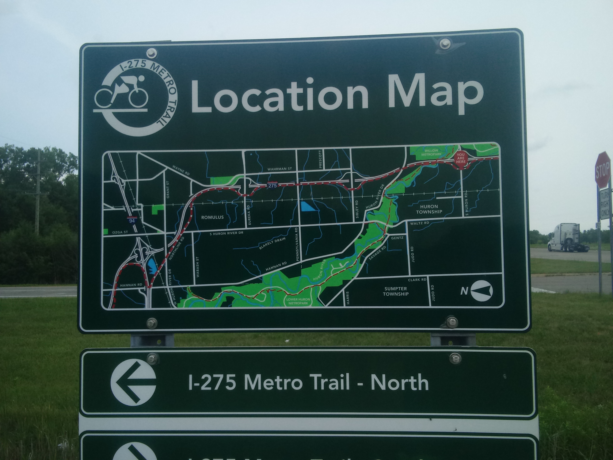

Once I finally got to the end and glanced the map, 
it said "You are here!" and I said "Yup!"

  

## Coming to America
### July 29th 2020, 7:32:35 pm EDT
<meta itemprop="dateCreated" datetime="2020-07-29T23:32:35.614Z">

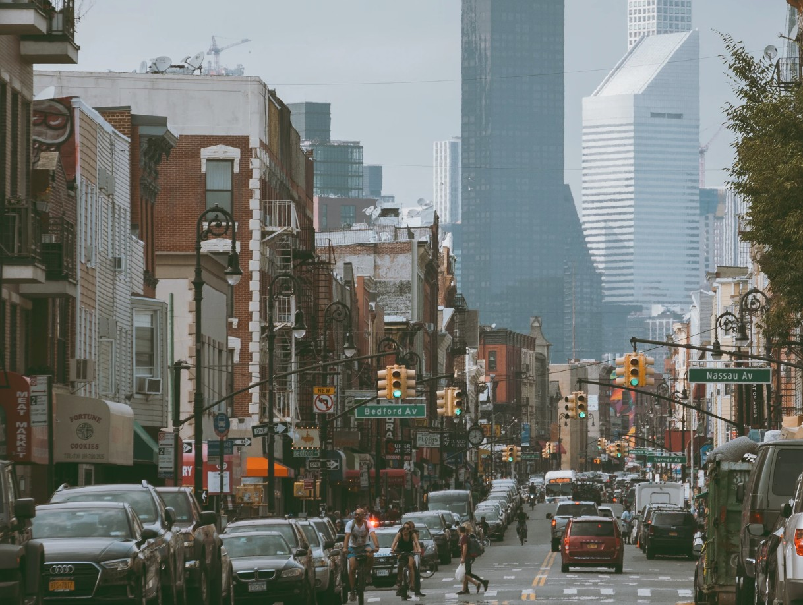

[Listen](audio/poetry-0151.mp3)

It has been a quarter of a century, but I still remember the sounds of New York, 
I can almost hear the busy parks, and cars and the occasional police siren.

I still remember that a slice of New York Pizza across the street, 
is one dollar and twenty five cents, I am sure no pizza takes that! amazing anymore.

  

And, wow, to this day I cannot get over the fact, 
that five cents is bigger than ten.

With each passing year I bemoan the injustice, 
of December not being the tenth month, and October not being the eight.

  

While I never had a problem with fractions and the sixteenth of an inch, 
glancing 9/16 or 7/8 on a piece of paper, makes me want to begin with a calculator in hand.

I never figured out how to spell the word "W", I know it is written as a letter, but how do you spell it, 
and I love that the letter "W" may actually mean Double-U; fantastic.

  

My biggest problem is with Weather, 
as I never really switched to the Fahrenheit scale.

It just shows that you can take a mam out of the metric system, 
but you can't take the metric system out of a man.

  

My reptile brain just accepted somehow that every few months it gets boiling hot outside, 
during hot summers, I catch my self staring at my thermometer that extra second longer,

and slowly I go... What the ffffffff.. it is a hundred and five, 
shut the FFront door.

  

## Riding Red
### July 28th 2020, 11:55:55 pm EDT
<meta itemprop="dateCreated" datetime="2020-07-29T03:55:55.709Z">

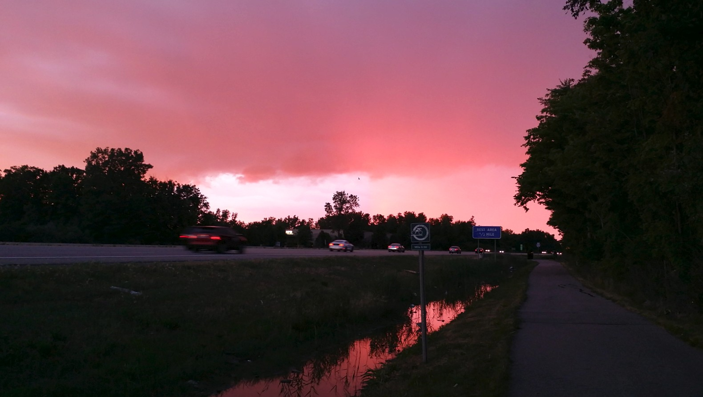

[Listen](audio/poetry-0150.mp3)

Sometimes I race my bicycle in the twilight, 
it is not too dark - there is still plenty of light.

And to be safe, I bring my flashing lamp, 
and ride carefully like a real champ.

But, oh boy, oh boy, is it nice, 
there are deer, bunnies, and little mice.

Oh, how smell of pine trees mix with smoke from the fireplace, 
it smells do good that I want to stop my race.

Sometimes, I do stop to look at the sun go down, 
but... I have to imagine the horizon as I am in middle of a town.

And hen the sun gets low enough all the clouds light up red, 
finally allowing the darkness to begin to spread.

That's usually when I turn around, 
but I love the frogs and crickets and the early night sound.

I wish I could capture it and keep it all, 
but all the pictures and videos I take look dull.

I think we should all take time to enjoy these simple treasures, 
as these are some of the life's most magnificent pleasures.

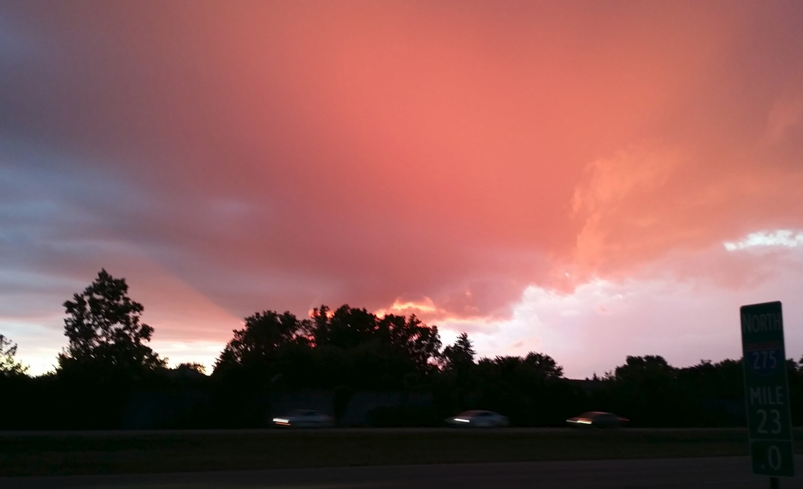

  

## A Good Night's Rest
### July 27th 2020, 11:25:02 pm EDT
<meta itemprop="dateCreated" datetime="2020-07-28T03:25:02.997Z">

[Listen](audio/poetry-0149.mp3)

Life is always about learning and knowing, 
all those winds of change freely blowing.

But there is something you must always remember, 
that you are a **Raging Fire** not a glowing ember.

  

It is your **right** to **strive** and **thrive** and **grow**, 
may you **melt** all the sleeping-and-cold snow.

Let there fill new oceans, let the rivers flow, 
and may the sun shine forever with your beautiful glow.

  

We each should live our lives with a huge thunder, 
because no matter the tests life is always a wonder.

But the best things come from us beating life's test, 
by rising up, becoming wise, and doing our best.

  

No challenge is ever as easy as it looks, 
it all requires reading plenty of books.

I don't think anybody is ever truly blessed, 
I think life may push us all to feel stressed.

  

But we are each so special and so strong, and so sweet, 
that we can all take on the challenge, and handle the heat.

All the things we hold tight to the breast, 
always come from some hard challenge or quest.

  

It is **all** about learning and taking that harder route, 
so that each day we grow-more in wisdom and less in doubt.

So please, always strive to do your best, 
so that the 90 year old you can get some good night's rest.

  

## Ensue
### July 26th 2020, 11:47:43 pm EDT
<meta itemprop="dateCreated" datetime="2020-07-27T03:47:43.249Z">

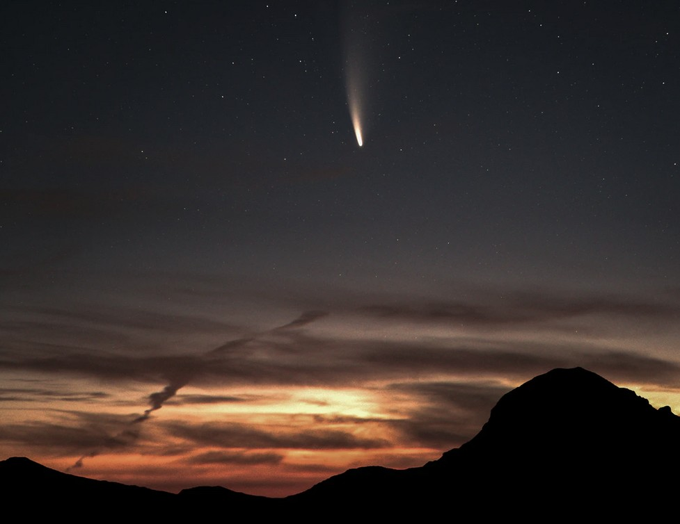

[Listen](audio/poetry-0148.mp3)

My Friends,

Not only are we unable to directly conjure up the greatest of our heights, 
in that they must ensue from our Greatness & Pursuits.

But also, 
we can't see that which we will miss.

A mistake hidden within the heartbreaking realm of never knowing what we missed, 
an old, odd realm, strangely built with invisible walls.

  

The only way we can be sure that we have not fallen to some prison of invisible walls, 
is to keep moving forward and up, and never stop.

  

If our elder selves, do end up, having regrets that begin with, "I wish I knew...", 
then by pushing forward today, we let them know that we have done our Best.

We send a message of compassion to our future selves, 
late at night, at 3AM, the older you, will lay awake, and say:

"I was amazing, there was noting else I could do..."

Our elder selves need to know that we lived boldly, courageously, 
it is for their health, and so that feel proud, and can get back to sleep with a smile.

  

I am always sad about never hearing about this from teachers, 
that our life is one, in many profound ways.

That authenticity is not some ideal, 
but just another name for Health, for Sanity, for Strength.

When we are older we realize that shortcuts are worthless, 
that they only lead to some sacrifice.

That throughout our entire lives, 
**the longest way**, was the only way.

We must each climb the highest of mountains, 
it is how we grow, it is how we bloom, 
it is how the Greatest of Heights will Ensue.

  

## On Writing That Fifth Book
### July 25th 2020, 11:21:05 pm EDT
<meta itemprop="dateCreated" datetime="2020-07-26T03:21:05.139Z">

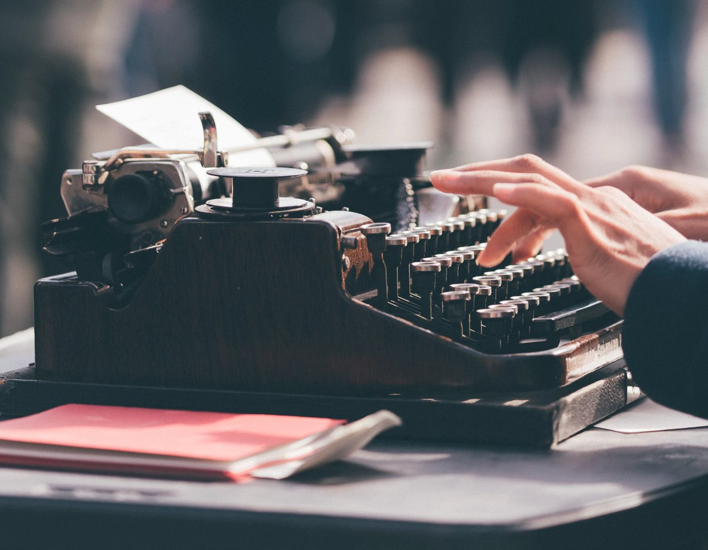

[Listen](audio/poetry-0147.mp3)

I know all too well that writing books is hard, 
as far as I can tell; I am still learning English.

But books, share principles, with life, 
be it book or life, it is always page after page, it has chapters.

Books are not, some fancy extra, 
but a pretty fancy way of rising, just rising.

  

And perhaps it is somewhat old fashioned to be urging you to write books, 
but I don't feel bad at all.

I expect the first one is the hardest, 
the second one will be shoooo goood,

The third one - I am sorry, 
will feel as floppy as a thinly sliced ham.

The fourth one, 
after that long wonderful pause.

Will surely be the one, 
it will feel like such a closure.

  

But listen, 
I suspect that we don't really get started until our fifth book.

'Cause you know, 
it is the book you don't think about writing that gets you.

  

And, I think I can actually predict enough of it to say, 
that as children we look to the future, as adults we grow, and as Great Beings we look at the past with wise eyes.

See, it is not until we get there, and glance over at ideas that we were passionate about when young, 
but now through the eyes of the Great Being... that all of a sudden, things like Amor Fati, are not merely about Love of Fate,

But also, from when we look at life, 
see when looking back we see fate as something that that largely already unfolded.

And now, the love for it fits, 
it is the love for all we've been through.

All the battles we fought and learned from regardless it it was triumph or disaster, ease or hardship, 
it was what we grew **so profound**, what made us, ourselves.

  

So as long, as we fought to rise, 
so as long as it counts for more than whim and being pushed around.

It doesn't matter how hard things were, 
it matters that nothing took away from our Love of Life.

That we faced those challenges, 
easy or difficult.

Because now, 
you sit at the typewriter, and you know the story dot for dot.

See, we have to live our life so sturdily, 
as to bring enlightenment to our Elder Selves, and perhaps make them cry a little - and why the heck not!

  

See, growing is not just for getting somewhere, 
but also building what will eventually become our Beautiful Past.

And though as children we may need to admit to ourselves that we don't understand everything, 
as Great Beings come Our Golden Age, we will understand what we once struggled with.

And with a great sense of accomplishment, 
a sense of accomplishment that wouldn't be there, had we not challenged ourselves with things that were out of our grasp when we were young.

So what may seem as difficulty in our youth, 
we will end up loving in our Golden Age for making us stronger and more profound.

  

## On Learning Philosophical Concepts A Little Bit At A Time
### July 24th 2020, 10:21:19 pm EDT
<meta itemprop="dateCreated" datetime="2020-07-25T02:21:19.937Z">

[Listen](audio/poetry-0146.mp3)

The Philosophers attempt to bring ideas to the future generations, 
they are masters of learning how to think, conceptualize, and get extremely smart.

There are a few things that we must set aside at first, 
and above all remember that they were children once, teenagers, that they are all too human.

When possible we should begin with survey courses and general overviews, 
Video Lectures and Audio Books on the subject of Philosophy in general.

  

[The Story of Philosophy: The Lives and Opinions of the Greater Philosophers](https://en.wikipedia.org/wiki/The_Story_of_Philosophy) 
is a great start, Ariel and Will Durant seem like an amazing couple.

In 1977 they were presented with the Presidential Medal of Freedom by Gerald Ford, 
and Ariel was named "Woman of the Year" by the city of Los Angeles.

[The Giants of Philosophy Series](https://duckduckgo.com/?t=ffab&q=The+Giants+of+Philosophy+Series) is a set of 13 Audio Books surveying word's top Philosophers, 
written by multiple authors and narrated by Charlton Heston.

  

We must not judge a Philosophy by the mistakes of the Philosopher, 
if they did make mistakes, then they published hoping to be granted a hearing.

We should avoid memorizing, ideally we want to approach Philosophers that we find familiar, 
and perhaps already having re-invented some portion of what they worked on.

  

One concept that comes to mind is Amor Fati, 
it means Love of Fate.

But to me, it does not speak about the kind of fate where everything is pre-determined, 
or the fate of a person who lets whim and life push them around, but rather events that just happen.

[Friedrich Nietzsche](https://en.wikipedia.org/wiki/Friedrich_Nietzsche) wrote a great deal about [Amor Fati](https://en.wikipedia.org/wiki/Amor_fati), 
but in my opinion he takes it too far as he speaks of Suffering, he runs into the extremes.

My bullies are an example of Extremes and Suffering, 
and Amor Fati does not mean I should love my bullies, and Friedrich states as much:

"Only great pain is the ultimate liberator of the spirit. I doubt that such pain makes us ‘better’; but I know that it makes us more profound." 
(Thanks Friedrich, My Dear Old Friend.)

Albert Camus brings it down to reality, 
speaking of accepting that life comes with Difficulty and Ease, and we should accept both.

"A will to live without rejecting anything of life... is the virtue I honor most in this world."

  

It is not enough to learn **about** a philosophical concept like we just did, 
we should hope to integrate it, or keep it as a reminder that we have more to learn before we understand it fully.

The way I connect with Amor Fati, 
is by understanding that not everything in my life will happen for a reason, 
some thing will just happen out of complexity and randomness that we can't prevent; and that to me is fate.

I like how Albert Camus telks about Ease and Difficulty and the way I understand him, 
is that we should stand up for what we believe in, even if it means that people will yell at us.

So it is not tolerance of difficult things that just happen for no reason, 
but the difficulty of standing up for what we believe in when the chance presents it self, for no reason- you see.

Our decision making which dictates our path in life, 
has nothing to do with things that happen for no reason.

Finally, Amor Fati simply means, 
do not let things that you have no control over take away from your Love of Life.

  

While this may not be exactly what Friedrich Nietzsche and Albert Camus talk about, 
my initial, more personal interpretation, gives me a platform from which I can learn both of their interpretations and mutual differences.

And what I am showing here, is that we don't have to understand all the philosophical concepts right away, 
that it is best to learn a little bit at a time, at our own pace, and in our own sequence.

  

## Live Wisely And Beautifully
### July 23rd 2020, 10:38:13 pm EDT
<meta itemprop="dateCreated" datetime="2020-07-24T02:38:13.341Z">

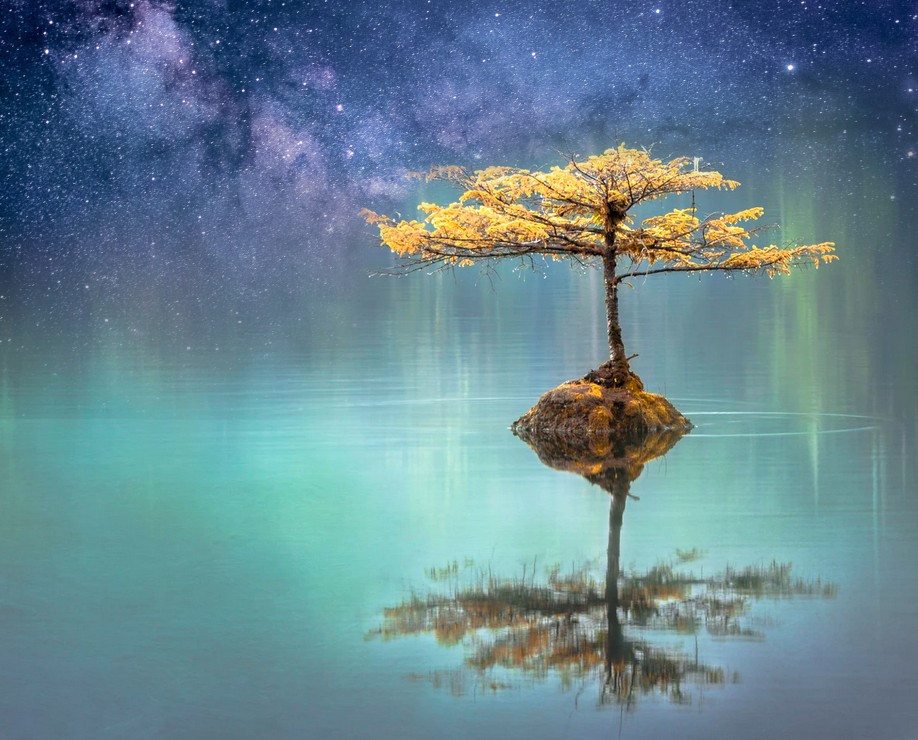

[Listen](audio/poetry-0145.mp3)

We are all very unique, 
and we are irreplaceable.

But the world is still growing, 
and it may neither fit not truly inspire you.

So you have to find out what really moves you, 
what makes you stand on unshakable ground.

Accepting the responsibility for your own education, 
you must become authentic and unbreakable.

You have to find what inspires you, 
and carry on, on that path.

Grow and develop and alter your course as fits you best, 
but make sure that each day adds to the previous.

  

Do not alter course for unimportant reasons, 
do not let strangers sway you.

Resist action without thought, 
and resist following orders without thinking.

Resist red faces, and screaming authority, 
and be careful because mistakes may try to sneak up on you.

  

Wisdom is not optional, it is the first and foremost, 
and it will protect you from making your greatest mistakes.

To grow up means to become a Great Being, 
in your Heart, Body, Mind, All of Your Pursuits, and Your Entire Life.

The path of growing up is built by inheriting wisdom, 
from those of past generations, who have made the same effort.

Please, 
take to all the books loved by Great Beings, 
and begin where they left off.

  

## Greatness of Soul, Heart, and Mind
### July 22nd 2020, 11:02:16 pm EDT
<meta itemprop="dateCreated" datetime="2020-07-23T03:02:16.809Z">

[Listen](audio/poetry-0144.mp3)

It has been happening slowly for a hundred years, 
even though people are not taught to become Great Beings.

Mistakes, especially the ones that make us feel foolish, 
open out minds for rapid self education.

It used to be harder to learn, 
now we have Audiobooks and video lectures.

  

It is a very big difference between finding Thoreau's Walden, 
and having a Writer or a Professor take you on a tour of modern philosophy.

I think the ability to pause a lecture or an audio book is amazing, 
I paused as often to stop and think as I used to pause to cry.

  

My Dear Friends,

I speak of Great Beings, 
because I was moved, by Great Beings.

And all my Heart and Love tells me, 
that the most important lesson I can share with You,

Is that for all the goodness You do; 
You must become, a Great Being too.

  

I used to drive around listening to Audiobooks, 
I went down to Florida during Michigan Winter.

I set my Audio Books aside, and turned on the radio for a bit, 
I only heard two words, it was the third Monday of January.

"Content of Character"

I turned the radio down, goodness, once my eyes dried, 
I knew that the Soul had no limit, and that it was meant to hold Wisdom.

That's how Philosophers were growing in Greatness, 
Knowledge begot Wisdom, and Wisdom begot Greatness.

Martin Luther King Jr. is his name and it will never be forgotten, 
his words are a permanent invitation to Greatness.

  

I enjoyed practicing driving on North Territorial Road between Canton and Ann Arbor, 
and on a late Autumn evening with trees dressed in beautiful colors a lecture was playing in the background.

All of a sudden my mind snapped to attention, 
my mind became as sharp as a razor blade, and I could not believe the gravity and beauty of what I was hearing.

"I went to the woods because I wished to live deliberately, 
to front only the essential facts of life, 
and see if I could not learn what it had to teach, 
and not, when I came to die, discover that I had not lived.

I did not wish to live what was not life, 
living is so dear; nor did I wish to practise resignation, 
unless it was quite necessary.

I wanted to live deep and suck out all the marrow of life, 
to live so sturdily and Spartan-like as to put to rout all that was not life, 
to cut a broad swath and shave close, 
to drive life into a corner, and reduce it to its lowest terms..."

I hit the pause button on my Audio Player, 
I had tears in my eyes but didn't cry.

Ever since that one fun time when we watched Ferris Bueller's Day Off in my first year of Highschool, 
as part of learning English and good film making, I remembered:

Ferris Bueller saying "Life moves pretty fast. If you don't stop and look around once in a while, you could miss it.", 
I was as cautions as a cat not to let a day go by withut doing something important.

And now I heard a world celebrated Philosopher say the same, 
in a book from 1850, a book written by a man that shared some of his strength with Mahatma Gandhi.

A man I lovingly call Henry, 
I think of him as my friend in time.

Henry David Thoreau is a friend to us all, 
he used to think about us, about making life better for us, the future generations.

  

I was at Ambrosia in Ann Arbor, 
Though I wasn't a regular, I spent a lot of time there when it was empty and I could be alone later at night.

I started keeping a folder of ideas and poems, 
I've noticed really beautiful people going to the sports bar next door.

I tried to ignore the song that was playing as it was frightening me, 
the lyrics rang "Where'd you get your body from, I got it from my moma."

A couple of regulars gathered by and inquired about my paperwork, 
and I thought it was prime time, to tell them word for word.

I begun by reading Kosmos by Walt Whitman, 
I remember finishing with such a flourish that one of my listeners staggered back.

  

Kosmos (Written in 1860 by Walt Whitman)

Who includes diversity and is Nature, 
Who is the amplitude of the earth, and the coarseness and sexuality of the earth, and the great charity of the earth and the equilibrium also, 
Who has not look’d forth from the windows the eyes for nothing, or whose brain held audience with messengers for nothing, 
Who contains believers and disbelievers, who is the most majestic lover, 
Who holds duly his or her triune proportion of realism, spiritualism, and of the æsthetic or intellectual, 
Who having consider’d the body finds all its organs and parts good, 
Who, out of the theory of the earth and of his or her body understands by subtle analogies all other theories, 
The theory of a city, a poem, and of the large politics of these States; 
Who believes not only in our globe with its sun and moon, but in other globes with their suns and moons, 
Who, constructing the house of himself or herself, not for a day but for all time, sees races, eras, dates, generations, 
The past, the future, dwelling there, like space, inseparable together. 

  

I actually I had to stop the person from leaving, 
"One more" - I asked, nay commanded, demanded, just to share Ayn's Vision of John Galt, and I begun:

"Your destroyers hold you by means of your endurance, your generosity, your innocence, your love
the endurance that carries their burdens
the generosity that responds to their cries of despair
the innocence that is unable to conceive of their evil and gives them the benefit of every doubt, refusing to condemn them without understanding and incapable of understanding such motives as theirs
the love, your love of life, which makes you believe that they are men and that they love it, too." (from John Galt's Speech from Atlas Shrugged by Ayn Rand)

I remember I wasn't able to finish my listeners fidgeted and had to go, 
I didn't belong in Ann Arbor, I didn't really belong at Ambrosia, the truth was I didn't belong anywhere anymore.

I remember someone asking me where I was from, what country; 
and as I rolled up my poems getting ready to leave,

"I am a Citizen of the World." - I said without thinking anything of it.

  

I remember sitting up one time feeling really alone, 
I think I was headed up to Ludington this time.

And time came to listen to Viktor E. Frankl's Man's Search for Meaning, 
bullies came after me when I was a chubby child.

One year sometime when I was 13 maybe, 
the little me made the older me make a promise.

I was to return to that damn classrom in my imagination, 
and sit right next to my younger self, and keep him company so that he is not scared anymore.

I kept that promise, 
but from time to time I also visit Dr. Frankl, I sit by his bed to keep him company too.

There is a very powerful description of Great Beings in his book, 
it is something that we should each remember.

"We who lived in concentration camps can remember the men who walked through the huts comforting others, 
giving away their last piece of bread.

They may have been few in number, but they offer sufficient proof that everything can be taken from a man but one thing: 
the last of the human freedoms -- to choose one's attitude in any given set of circumstances, to choose one's own way."

  

The book I have read the most times is "A Short History of Nearly Everything" by Bill Bryson, 
it is a book that begins with an honest journey to find out more about the world.

It is very helpful to realize that we don't know all the things we should know, 
and not be ashamed of that, just simply look for some Audio Books on the subject.

I write this in 2020 in the middle of the Pandemic, 
and there is a lot of misled people, people who got taken in by false information.

In my memory Carl Sagan in his "The Demon-Haunted World: Science as a Candle in the Dark" 
mentions something similar on the subject of Aliens and UFOs.

He says that there is more beauty and interesting things in the actual Science, 
than fantasizing stories of visiting aliens and flying saucers.

When I was a teenager I was a huge fan of shows like the X-Files, 
and I remember walking into a mighty New York Public Library to crack the case, once and fall all,

Nut instead falling in love with [Mokele-mbembe](https://en.wikipedia.org/wiki/Mokele-mbembe), I recognized the creature from my first Science book "Wszechświat życie człowiek" published in 1955, 
it was a Brontosaurus, and I instantly fell in love with the idea there there might be a few left in Rhodesia.

  

For the world to carry on becoming more and more United, 
we have to become Great Lovers of Knowledge and take to Books and Audio Books.

The treasures withing are unlike anything we have heard of in school, 
the books that we end up loving and carrying with us for the rest of our lives, make us better.

And there is never an end to learning for real, 
every few weeks a new book comes out that you didn't even know you were waiting for.

It becomes a source of Wisdom, or just sheer joy as the case is with Randall Munroe's 
What If?: Serious Scientific Answers to Absurd Hypothetical Questions.

My Dear Friends, I wish you the discovery of new poems, new quotes, 
new books and video lectures, authors you will love for live and then some.

And don't worry, the world is coming together, the borders are fading, and there is noting that can stop that, 
Humanity is in the process of Unifying to become One Loving Family.

We can hasten this process by learning, acquiring more knowledge, 
preventing history's mistakes from repeating themselves.

The path to the future is found In Knowledge and Wisdom, 
and aiming for Greatness of Soul, Heart, and Mind.

  

## Cheerfully Becoming Mighty And Wise
### July 21st 2020, 9:31:46 pm EDT
<meta itemprop="dateCreated" datetime="2020-07-22T01:31:46.872Z">

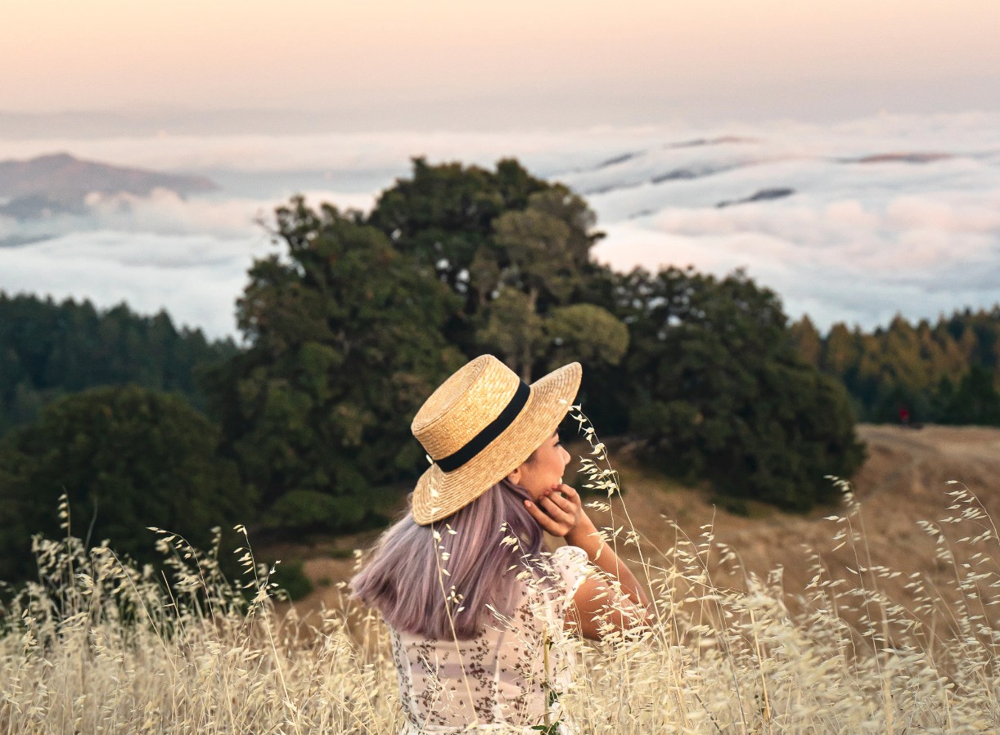

[Listen](audio/poetry-0143.mp3)

Growing up, getting up, moving up, rising up, 
we each have this abstract sense of a special direction.

It calls to us when we are down, 
and it calls when we **can** go higher.

You don't even need to speak a language, 
just lift you finger and point to the sky.

It works for everything and every time, 
it encourages us to continue to rise.

There is always an up, 
and never an end in sight.

  

Growing up demands that we open our eyes and rise, 
stand our ground and look to the skies.

So as long as we aim for the tallest of mountains and rise, 
our knowledge will quickly catch up in size.

Wherever we begin, we **can** rise, 
to grow in wisdom to no end, **is** the ultimate prize.

May we each discover our path to wisdom and rise, 
cheerfully becoming mighty and wise.

  

## Apocalypse Meow
### July 20th 2020, 8:42:11 pm EDT
<meta itemprop="dateCreated" datetime="2020-07-21T00:42:11.700Z">

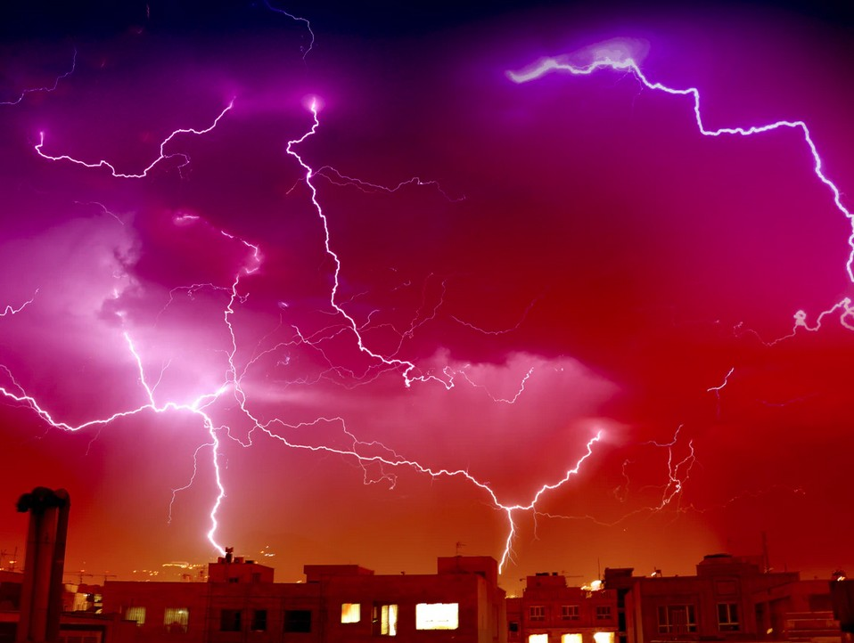

[Listen](audio/poetry-0142.mp3)

A Powerful Summer Storm approached with mighty thunder and powerful showers, 
and as always my power went out for for some twenty four hours.

I love Mother Nature and her Cosmic Powers, 
with this much rain there can only be more blooming flowers.

But, yah, as soon as the power went out, 
my apartment went completely dark.

My air conditioning was gone too; 
I tried to turn on the window fan before I realized "I need to think that one through."

All my extravagantly blinking computers and phones, 
either shutdown or chirped their sad little low-battery tones.

I watched the sun go down with a sigh, 
and so the only thing left blinking was the smoke detectors and I.

  

## In The Eyes Of The Future Generations
### July 18th 2020, 11:12:28 pm EDT
<meta itemprop="dateCreated" datetime="2020-07-19T03:12:28.354Z">

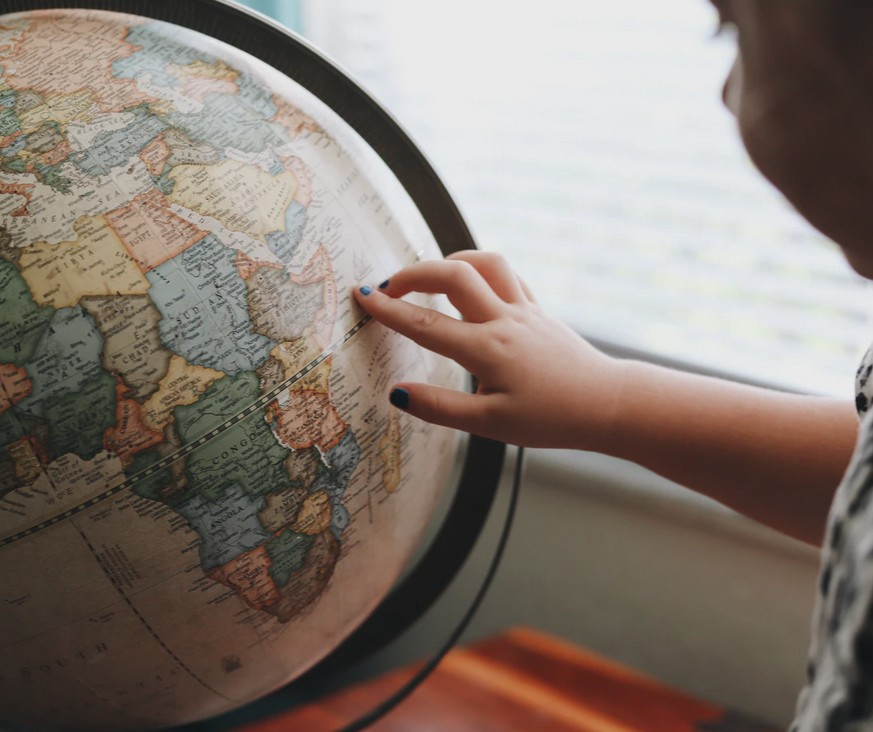

[Listen](audio/poetry-0141.mp3)

We are not Island Universes scattered to no end in some void, 
we are a part of a growing civilization with a past and a future.

And we might have become confused about the Scope of Our Existence, 
we stand divided by borders and committed to repeating history's mistakes.

It is unwise to pretend to be able to handle a great responsibility, 
only desperation, fractures, and exploitation by other desperate pretenders can follow.

Those who are granted authority are often not wise enough to handle it, 
and in their mediocrity they commit what in larger scope translates to real Crimes Against Humanity.

There cannot be wisdom without understanding and inheriting from past generations, 
the transfer of knowledge occurs by means of Understanding Books.

And there cannot be understanding without Authenticity, 
in haste of chasing a career there can only be memorization and misunderstanding.

We must keep in mind; that what the future generations do not perceive as clear progress, 
will be seen as the continuation of dark ages with authorities on the wrong side of history.

The World United, is not a fairy-tale, nor should it be a mere dream for us, 
but a Gift of Peace for The Future Generations, so that they may grow in Dignity, Health, and Wisdom.

We are neither disconnected from the future generations, nor the past generations, 
we are a stepping stone in the development of The Human Kind.

And we should recognize this Great Honor and Reward, 
and understand that the larger context is found in helping to build a better world for future generations.

All our decisions, across all levels and authorities, 
Police, Attorneys and Judges, Parents, Teachers and Principals, Mayors, Governors, Prime Misters and Presidents, and everybody else...

Must be mindful of future generations, of a growing world, of making lasting and meaningful contributions to the entire human kind, 
a World that will eventually become united and free of borders.

A world with future generations that will look back at us, 
right now, right here, with questions that we must present answers to.

We are getting stuck in circles, 
because people are forgetting history's lessons.

Because we are not thinking on a large enough scale, 
we end up building more prisons rather than ending poverty with meaningful prevention programs.

Endless cycles of heartless poverty that freeze the best of us, 
poverty that wouldn't even be a feature of modern society had we in our wisdom recognized it for what it is.

Poverty denies people food and well being, 
causes stress and great harm to mind and body.

Love above Law, before we allow the practice of law, 
we must end the cycles of poverty.

Money must not be used to limit people, 
it is meant to help.

And how can a culture be to fail to see, how a young person allowed to build a business without the threat of homelessness and starvation, 
will contribute back to the city and everyone's well being.

What is so hard about seeing that rather than sending non-violent criminals to prison, 
we can prevent their biggest mistakes by putting an end to their worries of sleeping hungry on the street.

  

Any time, we fail to keep to reality, 
be it sending a 15 year old lady to prison, or denying science, or tolerating arrests by obscured or unidentified agencies, or abuses of power or discretion.

We create fractures and distrust, 
blindly defacing and destroying work of many much wiser great beings, who gave their best trusting that we can carry on, in wisdom.

We must not move against the grain of reality, 
any and all divergence will only create a cascade of fractures that will demand constant attention 
and result in nothing more than systems that merely stand to support themselves and as an affront to justice and future generations.

Where there was once a solution as clear as helping children to inherit the wisdom of their elders, 
we now see the emergence of a failed and impotent educational system with a mass incarceration backed.

Wisdom and inheritance of knowledge cannot be replaced by a "fake it until you make it" trickery, 
the work of great beings must not be stained by people who fail to see their vision.

  

Once again, the world grows a generation at a time, 
the education of the teenagers from 20 years ago is currently influencing the state of the world.

Likewise, how we treat out children today, 
will have a monumental impact on the world 20 years from now.

  

Let us honor our children and all the future generations by encouraging them to books, 
by reminding them of the Great Power of Thinking Beings, of Philosophers and Lovers of Wisdom.

By reminding them that their Pursuit of Excellence, 
can only make the world a better place for us all, and even those that are yet to come.

Let us remind them that Books (and now Audio Books) serve as a wonderful source of our wisdom, 
especially when read in a sequence that fits them best, and understood at thier own pace.

  

Let us remind each other that we must reject short thinking and shortest paths, 
that do not help the world grow and keep us divided.

Let us break out of that selfish endless loop of repeating mistakes of past generations, 
by working towards a better world a more united world where we recognize each other as One Family.

  

And let us remember that the great and wise beings of past generations, 
demand that we honor hard won triumphs and do not repeat history's mistakes.

The very nature of that demand requires that once we take to wisdom, 
we must stop following orders, and begin thinking, evaluating, and judging for ourselves.

To honor triumphs and guard against heartbreaking mistakes, 
is the duty we hold to those who came before us, 
and all the future generations that are yet to follow.

  

As children we are asked to listen and follow, 
as we grow we must learn to Lead and become Unbreakable.

It is not just the challenges of life that will test us, 
we must also think and evaluate and reject that which is wrong.

  

We are constantly made to listen and expected to follow, 
look behind any protest, or scandal, or angry headline.

We must judge all the contradictory information for ourselves, 
and make an informed decision as to whether or not majority is correct.

  

Life will always challenge us, 
and My Goodness - times are always changing.

Humanity is constantly bettering her self, 
what used to be acceptable - may now, be an affront to justice.

And while there isn't enough time to comprehend all the books, 
there is plenty of time to be come a Loving and Wise Compassionate Human Being,

Let us remember that we are a chain-link between the Hard Work of Past Generations, 
and the United, Free from Poverty, and Peaceful Word of **Future** Generations.

We are One Growing Family, and that is the correct context for local, state, and federal levels, for all legal and administrative decision making, 
to diverge from this reality is to get stuck in an endless loop of repeating history's mistakes, the very thing that the past generations are asking us not to do.

  

## Inexhaustible Source of Unlimited Wisdom
### July 17th 2020, 10:44:28 pm EDT
<meta itemprop="dateCreated" datetime="2020-07-18T02:44:28.327Z">

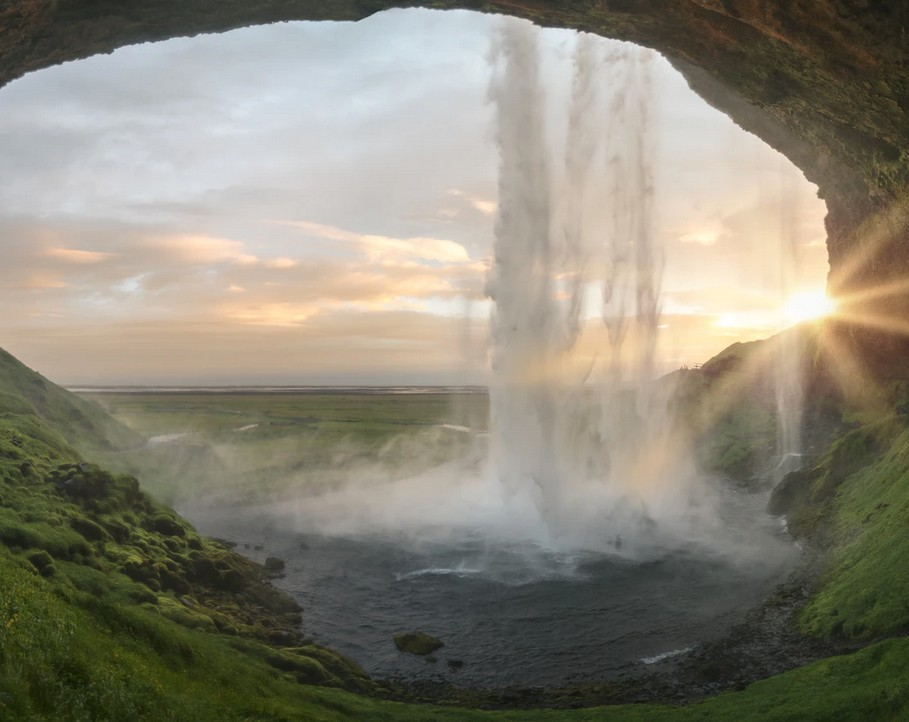

[Listen](audio/poetry-0140.mp3)

We are granted Consciousness, 
but given no guarantees by the Universe.

The only guarantee we have is Ourselves, 
the one Element that we are truly in control of.

The deliberate act of Growing Up, 
is a constant reminder of that control.

  

Dusk and Twilight, Tears in the Rain, and Aches in Every Muscle, 
surrounded by Unfairness, Blindness, Ends Everywhere, and yet we Rise.

Though it may be the very end of some world, 
we are never robbed of the choice to keep going forward.

  

The choice to exert control over the walls that the Universe has us up against, 
when all else has gone dark, the choice always remains.

And when we can no longer change the World, 
then we have to grow up to gain new powers that fit that world better.

The new powers will, alter the world, 
and eventually we will find our way back home.

  

No matter what misery or battles mark our past, 
having chosen to Rise, and Learn, and Rebuild; made us Beautiful.

No matter what challenges lie ahead, 
The Great Act of Growing Up, is an Inexhaustible Source of Unlimited Wisdom.

And the sum of it all, 
is the Great Health and Joy of Life.

  

## Philosophers, Poets, and Artists
### July 16th 2020, 10:18:03 pm EDT
<meta itemprop="dateCreated" datetime="2020-07-17T02:18:03.823Z">

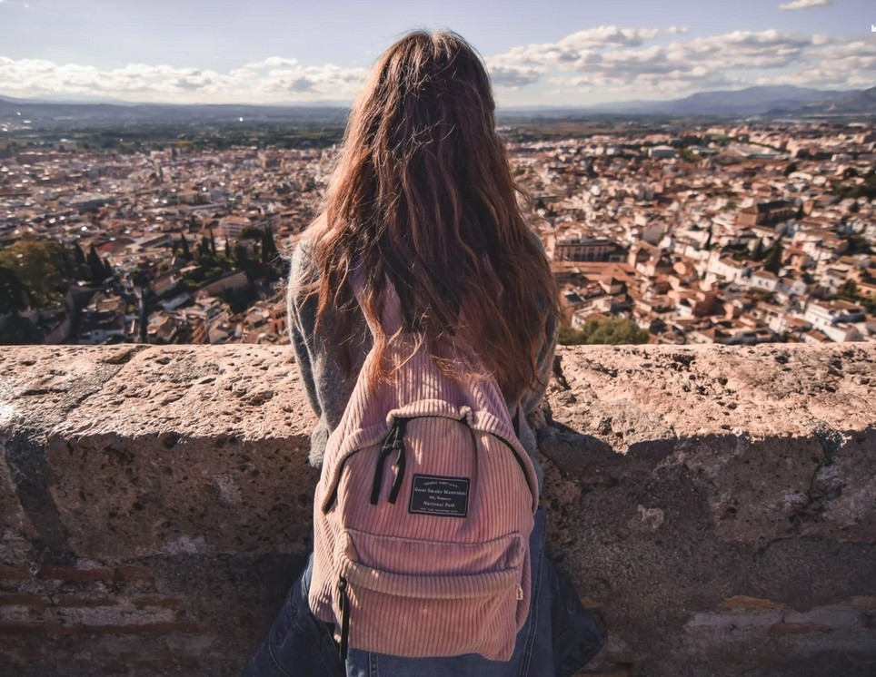

[Listen](audio/poetry-0139.mp3)

Nope, we may not finish school, get a job, buy a house, and worry about old age; 
My Dear fiends, I forbid you, and you're not even not allowed anyway.

I don't know who came up with thins nonsense, 
and I don't know why our parents repeat it - though I have some theories.

  

You are to figure out what moves you, 
and get on with it.

What moves you, 
is also what helps you grow.

What moves you, 
will make you extremely strong and beautiful.

  

And it may very well be that it is some kind of a career, 
but there will certainly be something better.

Becoming a professional, 
and spending the rest of your life as that professional - are very different things.

In deed.

And what is more, my Dear Fiends, 
is that you will be making that initial choice under the influence; 
of being too young to actually make decisions of that magnitude.

You will surely be beautiful and powerful enough to make it, 
but when you enter your early Mighty Middle Age, 
you will be even more Beautiful and even more Capable.

What seemed like a Delicious Challenge in your youth, 
will no longer challenge you enough.

I am sorry.

But something as simple as a fine direction chosen in early life, 
will soon be no longer be enough to do you justice.

  

Life is living.

It will never be as simple as quitting gym, 
and saying "I can't... I have a job now.".

Nope.

Nuh uh.

Now, you need to quit your job, 
and start catching up, surpass what you once were, and now build on top of that.

Your undertakings are, 
are not to subtract from you.

Our lives come with a limit, 
it is a terrible tragedy, and I am very sorry.

But it also makes it that much more important, 
that we grow, that we flourish, that we bloom.

That every new day of our life, 
adds to the previous.

When all our pursuits are connected meaningfully together in authenticity, 
they become an enormous treasure, and a song of ourselves.

  

Life may look simple from the first step before we start growing up.

But it becomes clear that it is more important to live an Inspired Existence that Adds Unto Us, 
at the very least, because of how much we grow, and how much more we become the best of ourselves.

Life is so dear, 
it is not a very good idea to follow what someone else expects of us.

  

You are always growing in complexity, 
and the universe around you will unfold as more complex too.

For example, we don't get old, 
we grow, we expand, eventually gaining the ability to speak about our experience; and inspire and move crowds.

Growing old is what a brainless fruit does, 
we are Philosophers, Poets, Artists, 
we are always growing, renewing, living, we don't lose anything - we gain.

  

## Brooklyn Bridge and I
### July 15th 2020, 10:54:14 pm EDT
<meta itemprop="dateCreated" datetime="2020-07-16T02:54:14.818Z">

[Listen](audio/poetry-0138.mp3)

Good to see you, my Enormous Old Friend, 
how long has it been now?

You haven't aged a day, 
and as promised I grew in Wisdom, and Strength, and I maybe a bit Taller.

I bet they finally fixed that [achy bench](https://www.google.com/maps/@40.7060248,-73.9967572,2a,75y,286.07h,64.46t/data=!3m6!1e1!3m4!1sGiVjQ4_lsY3jlLY0PM3KEA!2e0!7i13312!8i6656?hl=en) on the Manhattan side, 
I promise to come sit, some day.

  

When I came to America, 

The Bridge, Lady Liberty, and the Old Twins 
kept me company.

We'd sit calmly together, 
making excuses and promises.

  

The New York County Supreme Court was my only other friend, 
and I still love her dearly, but we don't speak anymore.

I wanted to be a Judge, 
a Philosopher King as I used to think of them - but I think better now.

I think in my old age, I'll come to [her stairs](https://www.google.com/maps/@40.714548,-74.0024396,3a,75y,102.05h,105.41t/data=!3m6!1e1!3m4!1smigFc8sXfFR7X-Jni_7Ogg!2e0!7i16384!8i8192?hl=en), 
and I will wear my suit, 
and I will wear those shoes that the lawyers went up and down the stairs in - back in 96. 

I will read her words again, 
"THE TRUE ADMINISTRATION OF JUSTICE IS THE FIRMEST PILLAR OF GOOD GOVERNMENT", 
But if she could speak, I'd ask about Fair Starts, Prevention, and Rehabilitation,  now.

We drifted apart. 

  

I made a little pilgrimage after the Twins Feel, 
I went to see if all was healing properly, and it was, 
workers were preparing the site for what would become the Freedom Tower.

The city was unchanged, 
it was still the same people.

"Home Sweet Home" - I said out of awe and nostalgia 
as we turned to see the New York City Skyline framed in the bus window, 
"Damn Right" the person next to me muttered.

  

That broken bench on the Manhattan side, 
was my bench, we connected instantly, I was breathless - it is a long walk.

  

The things I'd ponder about back then were supremely simple.

Like, "When is it going to stop raining", and, 
"Will they let me back on the Subway in a coat this wet?"

and I wanted to know more about what Ferris Bueller said; 
"Life moves pretty fast. If you don’t stop and look around once in a while, you could miss it."

But it turned out, I'd never let go of a year without trying to learn something new and lasting, 
years were always too precious for me, I'd claw at Decembers like a cat going after his favorite toy.

  

Mostly, I would sit there quietly, 
watch the occasional jogger.

Stare at the cars going left and right beneath me, and boats going up and down East River, 
I remember always having some sweets on me, the [old bench](https://www.google.com/maps/@40.7060248,-73.9967572,2a,75y,286.07h,64.46t/data=!3m6!1e1!3m4!1sGiVjQ4_lsY3jlLY0PM3KEA!2e0!7i13312!8i6656?hl=en) is a great place for a Picnic.

  

  

## The Amazing Power of Audio Books
### July 14th 2020, 8:49:49 pm EDT
<meta itemprop="dateCreated" datetime="2020-07-15T00:49:49.894Z">

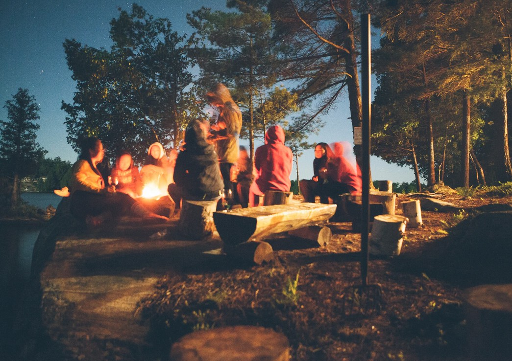

[Listen](audio/poetry-0137.mp3)

  

First of All,

Let me share with you a secret to a great intellectual wealth, 
if you ever get hurt, or lonely the Audio Books will completely restore your health.

They will help you understand the world a lot better, 
and they will piece your heart right back together.

Audio books will make your heart whole, 
and they will add great Wisdom and Strength to your Soul.

  

And Let Me Tell You,

They help us resume great works and understand great lives, 
connect with great beings, their minds, and drives.

And it really, really works, they help you inherit power, 
it gets into your soul, and grows like a flower.

And they help us see better with our own eyes, 
see World Poverty as the enemy, and World Peace as The Prize.

  

And the more lives you inherit from, 
the sooner, you will find your way Home.

The original way, we used to learn to rise higher, 
**was** by listening to Moving Stories by a cracking fire.

By listening to all the world's great stories we push poverty away, 
and we become Wiser to no end, each and every day.

  

## Reality, Clarity and Future Generations
### July 13th 2020, 11:41:51 pm EDT
<meta itemprop="dateCreated" datetime="2020-07-14T03:41:51.155Z">

[Listen](audio/poetry-0136.mp3)

Of course, 
let us ask what their regrets are...

We are after all the future generation, 
to those that came before us.

Therefore we have insight, 
and certainly have regrets.

We regret; 
wars, poverty, hate and stupidity.

  

We want World Peace, 
because a single Human Life is more Sacred than all the gods put together, 
because borders are stupid and war is hell, 
because ongoing weapons manufacturing is evil.

We want the End of Poverty, 
because money should only be used to help a person and not make them worse, 
because no one should be denied mental, dental or medical care, 
because not a single Human Being should ever go hungry or thirsty.

We want the Age of Wisdom, 
because people must learn how to think before being told what to think, 
because the Modern Human being must first catch up with Knowledge in Beloved Books, 
because we must put an end to making mistakes that can otherwise be avoided.

  

The World will not grow if Human Beings are prevented from Meaningful Education. 

The World will not grow if People are too scared, or too hungry, or too tired to learn. 

The World will not grow, if You, and I, and Everybody Else fails to Honor the Future Generations. 

  

As many evil forces as there are, 
they will give up the moment they see that their lies can't move crowds anymore.

  

Moving against reality, 
commits the followers to the forgotten side of history.

Standing up for Truth and Authenticity, 
fills us with Light of Wisdom, and Love of Humanity.

  

You never know, 
the first day, 
when you become ready,

to reinforce, or add a new article, 
to a document that will define Humanity for all Generations.

We can't be sure if this document exist yet, 
perhaps you will begin writing it,

perhaps your article will be the opening article, 
and yours, the first signature.

  

There are to many borders, My Friends, 
and too often money is being used for harm, where it was invented for good.

Our World, with Our Love and Our Blessing, 
must take another Deep and Long Breath, 
and Exhale in Blooming Changes all around.

  

Practice, take out your journal, and scribble to no end, 
many high and mighty laws printed over and over on paper will not hold up forever.

Humanity never moved toward some Economic Paradise, 
it has always moved towards Goodness and Love.

It has moved slowly, slowed down by poverty of so many, 
slowed down by borders, 
and people not yet ready to learn how to think before they are told what to think.

But it has moved with unlimited strength, 
sanding down to dust all that stood in the path of Good Ideas, and Goodness, and Love.

Do not accept wrongs, on paper, or law, or the red faces of those moving against the grain of reality, 
do not assume that the wrongs that stand today, will not be erased tomorrow.

  

Proudly, nobly, respectfully, deep in thought, 
take time off, and reach out to world's best selling non fiction.

My Friends, 
May you laugh, may you celebrate, may you admire, 
and learn from; and forgive mistakes leaving them to the past.

  

## A Dream About A Growing Humanity
### July 12th 2020, 9:34:47 pm EDT
<meta itemprop="dateCreated" datetime="2020-07-13T01:34:47.877Z">

[Listen](audio/poetry-0135.mp3)

I dreamt I was tumbling through time, 
and I had no control over which fragments I see.

There was a mother writing a letter to a famous movie star, 
she was asking him to stop making movies, because her boy didn't comeback from war.

And it worked, 
and she wrote many letters.

There was a lot of shocked artists and actors, 
they had no idea how they shaped young impressionable minds.

Boys wanted to go to real war, 
to be like the imaginary heroes they saw on TV.

  

And then I struggled in my dream, because my bullies were clearly ill, they were not all there, 
but World's Systems of Justice do not differentiate between the ill and the healthy.

And so a person made permanently ill in their mind by poverty, 
is seen equal to a man of knowledge, insight, intelligence.

But the ill have little freedom of choice, 
they need therapy, and safety, and good homes, and hope, and dreams.

To punish someone who couldn't grow up, didn't know to learn, 
for something that they weren't sure they were doing, 
and then to send them to a hopeless place without a hope of healing, 
without any hope of rehabilitation... is wrong.

If they can't walk among us, if they are permanently ill, 
then build special schools for them, schools that bring hope.

We mustn't punish them more than life already had, 
[our humanity depends on everyone’s humanity](https://www.youtube.com/watch?v=c2tOp7OxyQ8).

  

And I saw Mr. [Pirsig](https://www.youtube.com/watch?v=k6IKu2wgm5I) on his motorcycle with his boy, 
the wind in his face representing the cutting edge of reality.

He was worried that his Metaphysics is not real philosophy, 
it was not going to be taken seriously.

The answers they discovered on road they traveled and experiences they shared, 
created the Body of Knowledge that provided them with the forward momentum they needed to move ahead.

I dreamt that Pirsig was just talking bout Authenticity, Nobility and Dignity, 
and Knowledge and Wisdom, and Wise Intuition.

He is unafraid to show us how vulnerable Philosophers are, 
that all it takes is ideas worth sharing, once or twice.

Anybody can be a philosopher, 
we will each be heard.

  

All these strange fragments added together - to remind us that the World is Not Static, 
that it grows, moves, changes, and cares not to stop for things writ on paper.

Advancements in Psychology... the trailer to the movie about Philip Zimbardo work - alone, 
should invalidate laws and behaviors previously thought acceptable.

Humanity must grow, our cultures must drive us all forward, 
we must never assume that the world we are born into is a masterpiece.

And we must never let ourselves think, 
that others are in charge - it is our world, it belongs to us all.

  

To make informed decisions, 
we require knowledge, wisdom, foresight, insight, a sense of belonging.

Without knowledge, we will not be able to see right from wrong, 
nor will any of our decisions do our elder selves justice.

Access to well grounded knowledge is not difficult, 
internet lectures - alone - may even suffice, but best selling non fiction audio books solve it completely. 

  

Humanity must not fall behind on growing up, 
the longer the delay the greater the injustice.

Read and Listen to you books, my Friends, 
inherit the lifetimes of knowledge within.

We can't send people to prison without any hope of rehabilitation, 
for uninformed decisions that came on a whim.

And we can't allow mere Practice of Law without Functional Rehabilitation, 
and above all Meaningful Education and Universal Basic Income that truly lifts people out of Poverty.

  

We Are The People,
we outgrew borders long ago, we are One Family on a Lonely Blue Earth. 

We must learn to catch up with what is worthy of knowing, 
we can use Science, or Love, or both, or the Leading Edge of Instinct powered by our Humanity.

But we must continue building this world, 
each generation must make improvements and never stop.

Those who stand in power today, 
are to soon gracefully surrender to the better wisdom of the new generation.

To preside is to wisely wait whilst the new generation becomes worthy of the position, 
and to quietly step down, and put whatever wisdom was discovered to the books of history.

To preside, means not, to continue repeating mistakes because they are on the books, 
and therefore one will not be punished.

There are only two sides to history, and only fools think it is the winning and the losing one, 
the two sides as seen by future generations is the Wrong One, and The Noble One.

Let us all rise to the challenges of wisdom, 
and making lasting and meaningful contributions to the Human Family.

Let us not be lost to the wrong side, 
let us not be passed over by the books of history, 
let us help wisdom propagate.

Let us stand up to every corner and every challenge, 
and let us speak out against the wrong, the mistakes, the incomplete, the unfinished.

Let us not accept half measures, or good enough, or status quo, 
or the lowest common denominator minimums that get commited to law books.

Let us remember who we are, 
and how Noble The Human Being.

Let us stand upright, 
in Authenticity, Dignity, Wisdom and Compassion.

  

## Inspirational Poetry
### July 11th 2020, 10:43:04 pm EDT
<meta itemprop="dateCreated" datetime="2020-07-12T02:43:04.977Z">

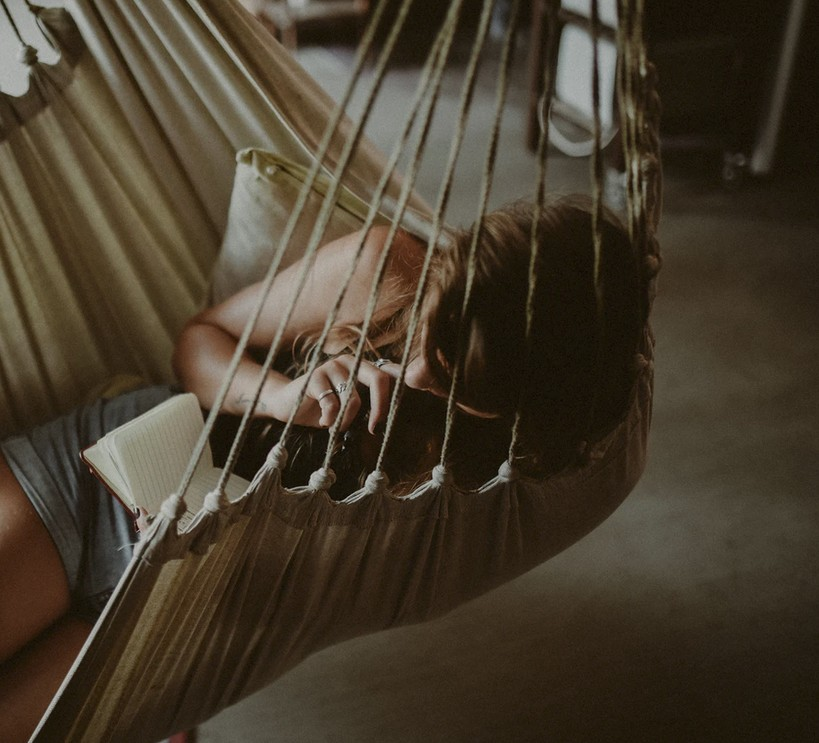

[Listen](audio/poetry-0134.mp3)

While Constitutions and Declarations, 
age and get amended, to become other than intended.

Most beloved poetry is writ in stone, 
loved and celebrated, and hard to forget.

So, let us write poems to celebrate every era, 
and each new idea worthy of us and the modern times.

Humanity has always faced great challenges, 
and the greatest challenges moved us the most.

Today, we must fix Education for all, 
and it **has to** result in creating Wise Great Minds.

We have to fix World Poverty, 
as it too often destroys minds before they can even put up a fight.

And we have to create a clearer picture of the world, 
poems that reveal problems before they come into being.

Above all we have to help Young People, 
help them to understand the world better.

Help them gain early insight, 
so that they are not easily manipulated.

  

At the very least, 
we have to explain;

How borders divide, 
and how divided, we are made to fight.

How easy it is to dress ignorance in authority, 
how some principals, or teachers, or parents, never cared, and never will.

How poverty is not the fault of the children born into it, 
but a mark of broken and immature and selfish politics.

How talent, and genius, and genes are a stupid myth for poor angry little men, 
how self education is far more meaningful, and how and noble.

  

You, my Dear Readers, 
You are **full** of Great Ideas.

The things you wish you knew when you were younger, 
are more important than you think.

Those are the ideas that will create 
unforgettable poetry.

Please, pick up a pencil, pick up a keyboard, 
and rhyme or arrange, impress with words, with inspirational letters.

The ideas you hold dear, 
make you a philosopher, a poet, and artist.

The ideas you hold dear make you a teacher, 
Please, help the world learn.

  

## Whew, It Is Only Eight!
### July 10th 2020, 8:36:16 pm EDT
<meta itemprop="dateCreated" datetime="2020-07-11T00:36:16.758Z">

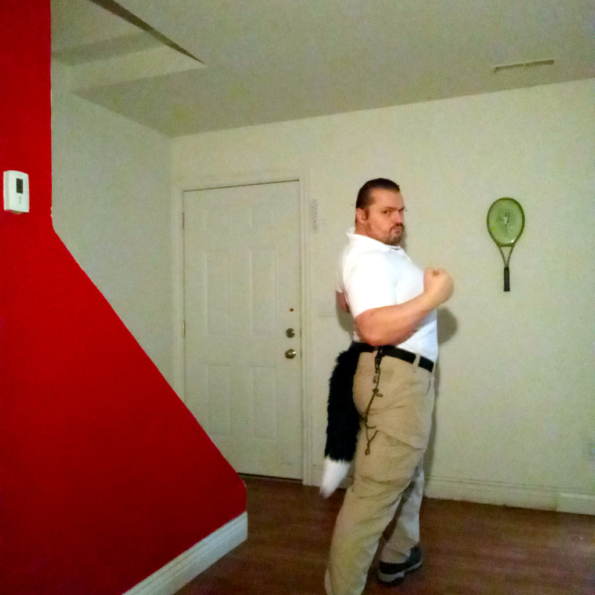

[Listen](audio/poetry-0133.mp3)

Hey! whew, 
it's only eight,

and here I was worried, 
that I am going to be late.

Today is Friday, 
and on every Friday I must look,

for new ideas, 
to add to my fancy [Warrior Book](https://westland-valhalla.github.io/warrior/)

It is a book, 
made out of videos,

and some ideas, 
don't have enough of those.

  

Last week, 
I searched for "Ladies Fast Draw",

but it only returned three videos, 
last time I saw.

I also tried Women Sharp Shooting, 
and Compound Bow,

but something didn't fit, 
the chapter just didn't flow.

I am searching for 
inspirational things,

ideas that bring friends together, 
and give them wings.

  

I wrote that book to show all; 
that we all start slow,

but we can all become mighty, 
so as long as we give it a go.

All too frequently we assume, 
that we have to have talent.

and all the steps we take, 
must be naturally gallant.

But the truth is, 
that we must fail to get there,

effortlessly succeeding at anything, 
is as boring as rare.

No need to hurry, 
we can learn really slow,

the most important thing, 
is that we grow.

  

## The School of Meow
### July 9th 2020, 11:26:34 pm EDT
<meta itemprop="dateCreated" datetime="2020-07-10T03:26:34.767Z">

[Listen](audio/poetry-0132.mp3)

I always try hard to learn something new, 
so that my elder self can mumble "I grew."

I try to listen to a non-fiction book or two, 
to update my general world view.

  

And I do computer programming and research too, 
I have lots of bookmarks in my queue.

I am trying to write programs as if I had a crew, 
so I stick to simple systems where I can think things through.

  

Learning Life, and Programming somehow fits me like a shoe, 
I'll have to make a list of the books and papers I read through.

I never have to try to look for something new, 
there are too many beautiful things to get bored, or blue.

  

I like learning about things that are most Human and true, 
trying to figure our what our elder selves wished they knew.

Someday, I would like to write a book to help young people get a better world view, 
something short and beautiful that they can quickly finish, slam shut, and say "Who knew?"

  

## Winter Adventures
### July 8th 2020, 8:57:32 pm EDT
<meta itemprop="dateCreated" datetime="2020-07-09T00:57:32.108Z">

[Listen](audio/poetry-0131.mp3)

Summer and Winter, Spring, and Autumn are my favorite seasons, 
but today, Winter came to mind; for many reasons.

For one, it is Summer, a Hot Summer, Heatwave in full swing, 
and I can't believe what great relief; a little snowfall would bring.

And I found a winter photo of an expedition to a near by store, 
I look thrice my size, I can't even imagine how many layers I wore.

Then I remembered when back in 2014 the Polar Vortex was all the talk, 
I was so excited to dress up and go on a long walk!

But, my favorite memory is riding my bicycle and hitting a patch of ice, 
I fell sideways upside-down, and did a little looptie-loop, twice.

I landed perfectly flat with a winter splat kicking up the downy flake, 
and I lay there a bit muttering, "What a story this will make".

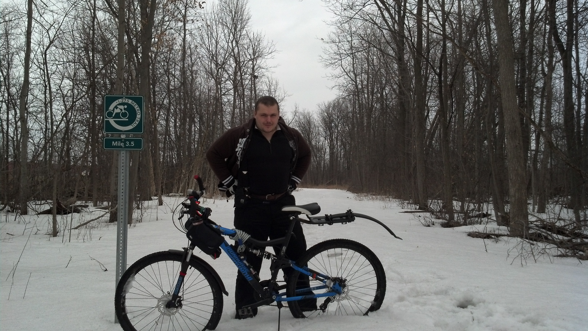

I love Blinding Summers, and Rainy Autumns, and Spring when all the flowers grow, 
but I am a huge fan of Winter and all that bright white snow.

  

## Learn and Teach
### July 7th 2020, 11:39:10 pm EDT
<meta itemprop="dateCreated" datetime="2020-07-08T03:39:10.941Z">

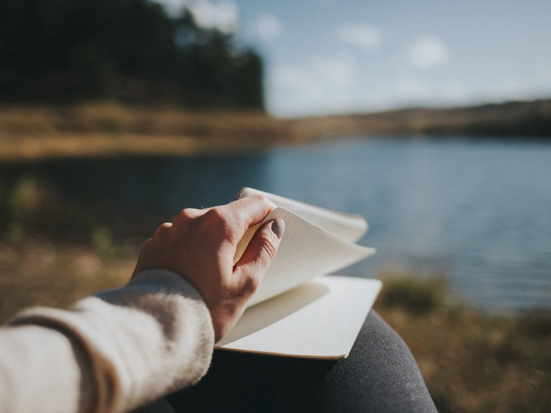

[Listen](audio/poetry-0130.mp3)

Without learning we cannot grow up, 
and without teaching the world cannot progress.

  

It does not matter where you start your journey, 
be it top of the world, or the very bottom, or somewhere in the middle.

Wherever you start, you must immediately begin moving forward, 
step after step, find what moves you, use it to grow up.

Grow to create a solid thought, or dream, or aim, or understanding, 
and get on top of it, and start building the next thing.

The road to catching up with everyone else is very short, 
once you are there, like everyone else, you take off in your own unique direction.

  

We must let go of beginnings and ends, 
and questions of lengths of road we must travel.

We must let go of things that we can't finish in time to enjoy life, 
empires ought be build by generations of visionaries, not a single inspired being.

We must put majority of our existence towards a happy meaningful life, 
not struggle, or war, or fear, but simple meaningful beautiful happiness.

  

We must not forget about the importance of Meaningful and Enlightening Education, 
the world is not able to give all a safe home but we can learn to build one.

And once we learn, and find peace in life, 
we should consider becoming teachers.

  

By teaching people, by giving them the right tools, by helping them see how to accomplish great deeds, 
we also grant them the path, to get where they will bloom at their healthiest, and thus Find Hope.

Inadequate education is one of the greatest barriers to a healthy existence, 
but it is also the **weakest** barrier, as it is removed with simple audio-books.

We should encourage people to search for best selling non fiction, 
and inherit both Lessons, and the Culture of Successful Great Beings.

  

All the problems we face are Human Problems, and thus the solution is in Our Hands, 
as humans we know that the source of our Powers is in our Minds.

That is where must begin our Lives, 
by making our minds Strong, Noble, Authentic, Unbreakable; Dignified.

Let the self correcting nature of inheritance of knowledge from all our Beloved Great Beings, 
be the start of our battle against all the problems that plague our Civilization and Cultures.

  

Without wisdom all serious problems bear negative consequences, 
consequences that help to multiply problems until there seemingly seems to be no solution in sight.

But that is an illusion, 
instead of building more prisons to contain minds sickened by poverty, let us teach meaningful wisdom and knowledge.

We must learn to prevent minds from fracturing, and from getting lost, and from not growing up, 
we must build a better world for all.

  

To build a better world we must fearlessly challenge ourselves to success, 
to wisdom, to knowledge, to noble pursuits of excellence.

And then boldly teach, 
all the lessons that moved us.

  

## The Seagulls
### July 6th 2020, 11:15:45 pm EDT
<meta itemprop="dateCreated" datetime="2020-07-07T03:15:45.978Z">

[Listen](audio/poetry-0129.mp3)

Of all the filthy creatures from The Baltic Sea to Lake Michigan, 
there is but one I miss and always rejoice to see again.

Never, have I met a creature more Awful and Cheerful than the [Ring-billed Gull](https://en.wikipedia.org/wiki/Ring-billed_gull), 
and not a single moment we spent together was any dull.

The most awful gang, lives over by the Ludington State Park, 
they show up in the morning, and do not leave until dark.

They are the hungriest, and the filthiest, and the most lovable bunch, 
they live to entertain themselves and steal people's lunch.

  

If there is one thing that needs to be said, 
it is that they want to **steal** your food and **really hate** being fed.

Once, I have seen them gang up on a fool holding up a chunk of bread, 
they all swooped down squeaking, and I worried they'd peck him dead.

Though in the end he was probably fine, 
as I saw him later in the day studying the "DO NOT FEED SEAGULS" sign.

But as long as you let them steal your food, 
they will keep you company, and all will be good.

  

I also like those rare Seasoned Parking-lot Pirates that show up in Spring, 
they can fly to any sea or ocean, but they pick a parking-lot; and that's their thing.

They always seem like they up to something no good, 
probably looking to deliver one of their sick gifts on someones hood.

But, I always feel sad when they fly away for warmer climes, 
they always remind me of strange wilderness adventures and good times.

  

## That Little Trail
### July 5th 2020, 10:24:23 pm EDT
<meta itemprop="dateCreated" datetime="2020-07-06T02:24:23.293Z">

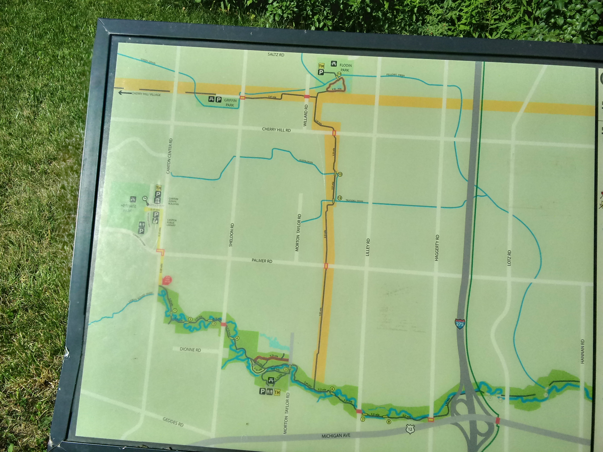

[Listen](audio/poetry-0128.mp3)

One late afternoon I hopped on my bicycle to ride the trail, 
and returned with an interesting tale.

For right where 275 and Michigan meet, 
I found a [little bicycle path that's really neat](https://goo.gl/maps/En5tWm4Z93mmwtZ28).

 

It is a huge park that branches out to two more little parks, 
though they are behind peoples houses and pack a lot of dog barks.

All combined together they make a sweet little quest, 
but make sure to bring plenty of water and rest.

 

The main path has little river bridges and lots of really neat sights, 
but be really careful about ticks and mosquitoes bites.

And that northern stretch under the power line, is a sight to see, 
it is just a barren bumpy grassland without a single tree.

 

If you keep going north on Haggerty you'll reach Ford, 
and then you can bicycle back to 275 and get back on board.

But I think the woodland trail is the best because there is a lot of shade, 
I imagine that's why it was made.

  

## Have No Fear
### July 4th 2020, 11:42:09 pm EDT
<meta itemprop="dateCreated" datetime="2020-07-05T03:42:09.311Z">

[Listen](audio/poetry-0127.mp3)

When you sense that fear is near, 
begin thinking about all the things you hold dear.

Think about how far you have already grown, 
how much of what you love used to be scary or unknown.

And do not let anyone try to control you with fear, 
they are weak and their mind is already broken and unclear.

 

Above all, know the weakness of fear, 
all the things in your soul are far more real.

 

But do not just close your eyes and let it pass, 
turn inward to remember your beauty, strength and class.

Let each time you get scared, 
mark a day where you contemplate.

Think about all the little wisdoms you love, 
and how much more you learned by standing up when push came to shove.

  

## Humankind Must Keep Moving Towards Wisdom
### July 3rd 2020, 10:05:14 pm EDT
<meta itemprop="dateCreated" datetime="2020-07-04T02:05:14.318Z">

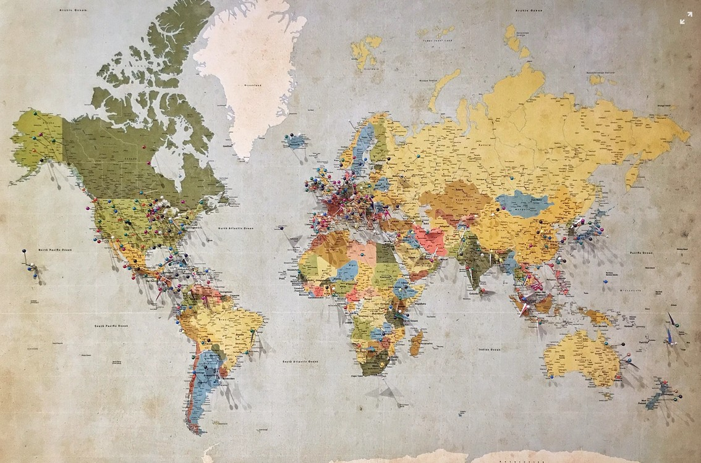

[Listen](audio/poetry-0126.mp3)

My Friends, it is very important not to think in terms of Others running the world, 
whoever holds the power now, will be too old in a handful or years.

The world is yours, but it is nowhere near ready, 
it needs great ideas, a lot of work, and it comes with many challenges.

The world you have been born into is not a static masterpiece, 
but rather, it is constantly hoping for you to help it grow.

You are the Hope and the Dream of past generations, 
it is your responsibility to grow all the way up and continue and improve the work of Great Beings.

  

We Grow, 
by reaching out for Knowledge and Wisdom.

This also means that when we are young, we are yet to gain the necessary Knowledge and Wisdom, 
The content of character required for the correct decision making that will do justice to our elder selves.

This means we need to take time to prepare ourselves for Life, 
we have to make careful observations, and carefully capture all the worthy wisdom.

We have to recognize that when lacking life experience, 
we are other than we should be.

There is a solution practiced by all the world's greatest minds, 
it is the unrelenting pursuit of knowledge and wisdom.

For thousands of years it has been proven method, 
to help us become who we need to be to do our elder selves justice.

We have no choice but to expand our minds with Knowledge, 
and enlarge our worlds with Love of Wisdom.

  

The World Grows, 
by means of informed decision-making.

Mislead or Uninformed decision-making is a Human Problem, 
and all Human Problems, have Human Solutions.

We have connected all the nations with internet, 
we have created the [Universal Declaration of Human Rights](https://en.wikipedia.org/wiki/Universal_Declaration_of_Human_Rights).

We have witnessed the creation of European Union, 
countries that speak different languages.

All the world accepted standardized schooling, 
as a standard that we all follow.

We have come a long way, 
towards Wisdom and Peace.

  

Time has come to make better use of these amazing advancements, 
and to hasten our pace of development as One Human Family.

We face common problems that require an Informed and United World, 
we have made many mistakes in the past 100 years, and we have learned much.

We can no longer see ourselves as invisible parts of our little neighborhoods, 
we must now rise to the challenges of becoming a Citizen of The World.

  

We must grow beyond the need for our own Knowledge and Wisdom, 
onward to making Meaningful and Lasting Contributions towards helping the world become more mature.

We can no longer serve, as we are not heartless and soulless cogs in a blind machine, 
we must now rise to question, judge, evaluate, challenge and fearlessly stand for wisdom.

  

In all of Human History we never lost sight of Family, Peace, Wisdom, and Love, 
not for a day, not for a moment.

Every day of human history pushed to become better than the previous, 
and any fractures that occurred have had the global community come together in hopes of repairs.

Let us hasten our pace with an aim that none suffer for any reason, 
be it hate, punishment, arrogance or ignorance.

Where we cannot fix something, let us use the power of time, 
and either prevent new fractures before they begin, 
of establish benefits for those born after a certain year in the future.

Let us never leave a chain-link unlined, 
there is not to be a courtroom without a meaningful force of prevention and rehabilitation on each side.

There is not to be a war, 
where it could have been prevented with education, knowledge and wisdom.

  

Let us make sure that all generations from now on, know with certainty and understanding, 
that their first step in life - and the true rite of passage - is the acquisition of wisdom, 
and capacity of decision-making worthy of their elder selves.

Above all, we must remind the children with Knowledge and Science, 
that they are a Child of The Universe first.

And with History, 
that to them belongs the future.

That they are to reject the status quo, 
because what was well enough for the previous generation, 
now needs improvement to do the current one justice.

(Pictured [Eleanor Roosevelt](https://en.wikipedia.org/wiki/Eleanor_Roosevelt) with the English language version of the [Universal Declaration of Human Rights](https://en.wikipedia.org/wiki/Universal_Declaration_of_Human_Rights).)

  

## Little Journals of Interesting Adventures
### July 2nd 2020, 11:27:54 pm EDT
<meta itemprop="dateCreated" datetime="2020-07-03T03:27:54.768Z">

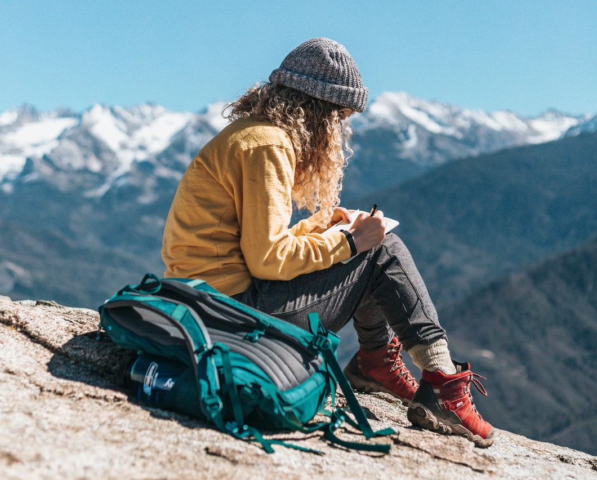

[Listen](audio/poetry-0125.mp3)

Great Adventures need not take you far, 
and ultimately, wherever you go there you are.

But still, there **is** something special about new places, 
we see more deeply, and get in good graces.

I think the kind of adventure, that **really** is the best, 
will make you start keeping a little journal to document your quest.

When there is time to think about all the things and little bits, 
even the slightest curiosity will bring about new wits.

So fill all the journal pages, and leave it for later, 
because you never know when a little journal may become something greater.

It could come as a surprise that this little adventure you took, 
turned you into a Famous Writer and became your first Adventure Book!

  

## My Little Dream Of Convergence
### July 1st 2020, 10:32:43 pm EDT
<meta itemprop="dateCreated" datetime="2020-07-02T02:32:43.662Z">

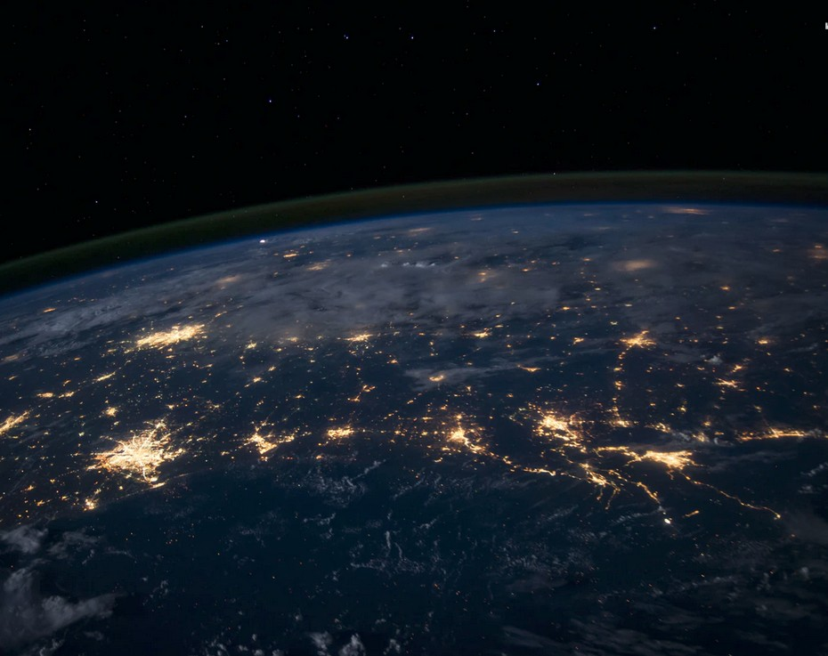

[Listen](audio/poetry-0124.mp3)

On the last day of the old year, 
kids were granted the power to come up with a name for our newly united world...

It all stared a long time ago, it was about not repeating history's mistakes, 
a newly found emphasis on not committing the sins of our grand-grand-grand-fathers.

Young people begun rejecting Jury Duty by recognizing Poverty as a mind eating virus, 
when the Judge asked if anybody couldn't serve, people would rise and say "Virus of Poverty".

It meant that they were unable to take the oath, that they could not be an impartial Juror, 
because they were convinced that Universal Basic Income would prevent The Defendant from committing the crime in the first place.

The Judges had their hands tied, but they loved to hear it, and it always restored their faith in the world: 
"I stand against, The Disproportionate Mass Incarceration of People Made Ill by The Virus Of Poverty"

Back in 2021 schools had to go online, and that exposed their weakness for all to see, 
people, and notably their future employers, lost interest in what organized education became.

There was a shift toward self-organizing education where kids kept portfolios, 
of their own paths through knowledge, and at their own natural pace.

But it wast until the first paying school, that things became clear for the youngest generation, 
the school replaced imaginary grades, with real money that the children would learn to reason about and use.

By rejecting the status quo, and not settling on the irrelevant minimums, 
Humanity increased her pace of progress, collective intelligence, and foresight.

It took less than twenty years, to get climate under control, 
it was the children of the people that grew up by questioning authority and status quo.

Weapons manufacturing, profit optimization, economic fairy tales, greed, apathy, and hate - all fell, 
as the world united under the new name: [Worldie McWorldface](https://en.wikipedia.org/wiki/Boaty_McBoatface#Naming).

  

## To No End
### June 30th 2020, 11:38:48 pm EDT
<meta itemprop="dateCreated" datetime="2020-07-01T03:38:48.751Z">

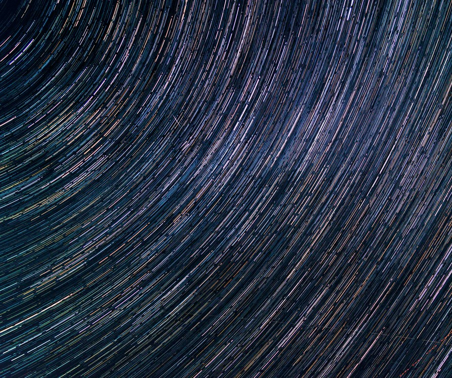

[Listen](audio/poetry-0123.mp3)

When we are still learning what the world is, 
we find comfort in recognizing where something starts, and where it ends.

Knowing the beginning and seeing the ending helps us feel in control, 
it helps us see the journey's end, or the height of a challenge.

But all of that goes away when we begin rising, 
eventually we only consider the forward motion it self.

We ignore the beginning, we abandon the ends, we ignore the steps, 
and we stop measuring the distance and paying attention to the effort.

In advancing forward we learn to recognize that all things must connect, 
we can only find peace in a mesh-work of common concerns and dreams upheld by all.

The roads we must travel have no limits, and it never takes long to catch up, 
nobody falls behind for too long unless they practice resignation.

We need not travel far to begin seeing that the word is still very young, 
that passage of wisdom between generations is a very fragile process.

Many, who are not yet mature enough for the position they have gained, may feign authority, 
we have to be careful who we listen to and be mindful of the paths they have traveled.

We are the sum of all our rising, all our triumph, effort, and intent across all our ages, 
how we rose, and the choices we made, and the wisdom we grew with, all adds to the sum.

That sum doesn't just outline our personality and who we are in the now, 
it is the structure of our wisdom and the body of our knowledge, directed towards who we will become in the future.

A choice we make in the now, will paint a moment in our past, but also influence what is yet to come, 
and all the choices added together create who we are in the future that we will eventually enter.

We must take great care of our choices, we must take care to love ourselves, 
to find the calm and peace from which we can make healthy decisions that will help us grow.

Not everyone will start in a colorful city with good schools and amazing friends, 
some will struggle to rise out of extremes that will never make sense.

But we must still set ourselves on that unlimited path, 
and get used to the idea of no beginnings, and no ends, just that all too human forward motion.

The direction is always the same, move towards wisdom, 
that is the meeting point of all human beings no matter their circumstance or culture.

We begin as children, we mature into adults, and then we must go on to become Great Beings, 
all Greatness is rooted in Love of Wisdom, and the root of wisdom is found in boldly facing the challenges of life.

  

## The Great Being
### June 29th 2020, 10:18:42 pm EDT
<meta itemprop="dateCreated" datetime="2020-06-30T02:18:42.135Z">

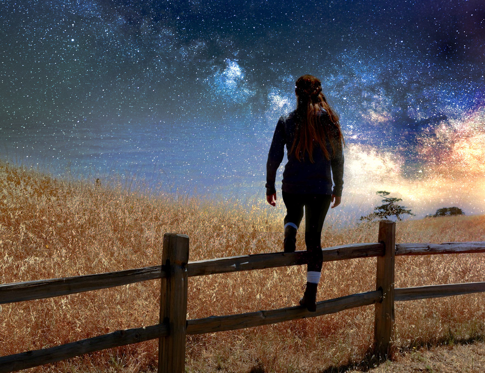

[Listen](audio/poetry-0122.mp3)

To rise, to become strong, to grow and to break away and become more authentic, 
is our first great responsibility, and our health.

However, it does go against our nature as children, 
we have a tendency not to look outside of the culture we are brought into.

Rite of Passage is about crossing that line, 
the line between The Child That Follows, and The Adult That Leads.

The moment we can handle looking at ourselves and our culture, 
from the **outside** in, we begin crossing the line into adulthood.

  

One of the first few thoughts may be, "But what if I was born into a different religion?" 
followed by, "What if I was not born into this economic class, into this poverty?".

As these questions grow from asking about ourselves, to also including others, 
they bring us insight into the greater Human Condition.

Bring us to the question of The Freedom of Will, of how much our Personality is Our Own, 
of internal decision making heavily influenced by external culture or placement.

As we grow we begin asking even greater questions about others, 
"Would the petty thief stole, had he **not** been fractured by the virus of poverty?"

Our minds begin scanning for solutions that aim towards a Greater Good, 
towards Word Peace, International Convergence on Wisdom, Unites States of The World.

We begin seeing that although there isn't an answer to every question, 
there are Dreams that could prevent the worst of World's Mistakes.

  

Building schools to help a culture grow, 
instead of forecasting war and manufacturing enough weapons.

Preventing the existence of criminals, 
by helping little children to Happy Homes, and to a Universal Basic Income.

Trading simple schools and grades for Business Success, 
helping children to become Well Funded Entrepreneurs and Investors.

  

No matter which questions we begin with and how our path is arranged, 
we discover how critical Growing Up is, for us, for eveyone.

How much more we are, 
than mere followers of the rules that we are born to.

How important to our mental health, 
it is not to fall a victim to bad ideas or fractures of poverty.

Our First Great Act in life is lifting ourselves above the culture we are born into, 
that is the meaning of the words Rising, Growing Up, Breaking Away, Becoming Stronger.

  

And the acts of independent thinking that are sure to follow, 
are the very foundation of Our Hope in a Better Future.

Have no fear of Rising, of Breaking Away, of Growing Up, of Growing In Strength, 
for that is Adulthood, and none can stay children for long.

Close your eyes, and begin building, 
because your next step is to become a Great Being.

  

## Brilliance and Enlightenment
### June 28th 2020, 11:34:49 pm EDT
<meta itemprop="dateCreated" datetime="2020-06-29T03:34:49.241Z">

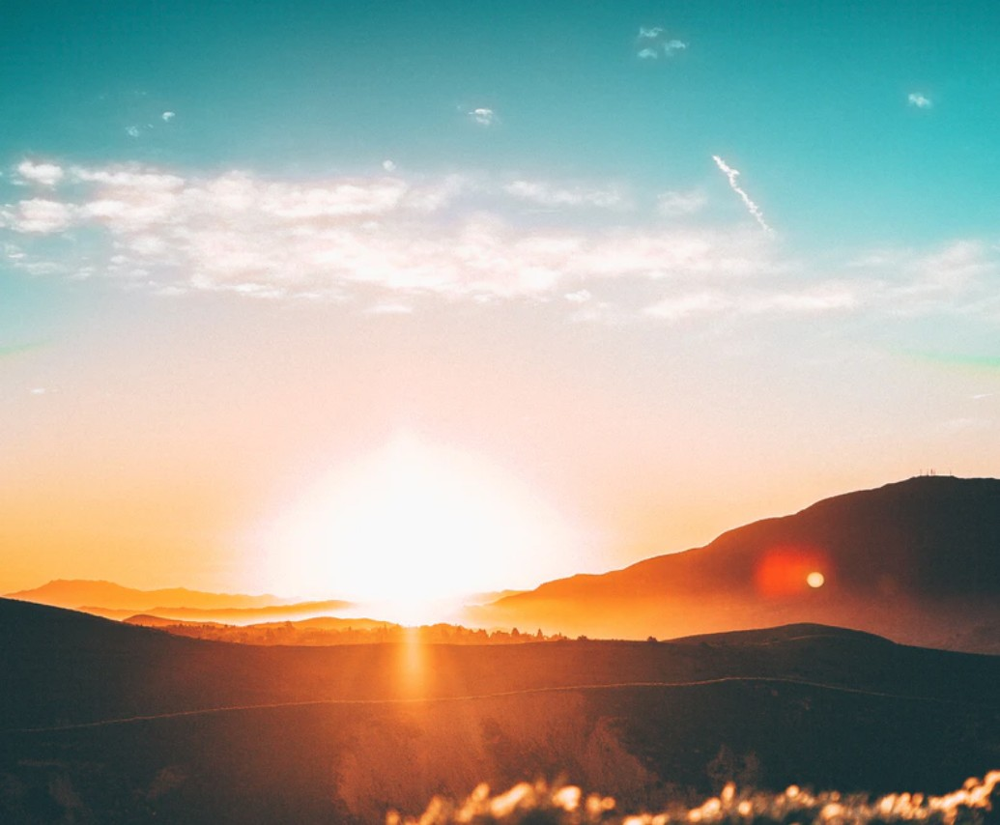

[Listen](audio/poetry-0121.mp3)

No worries, the only real darkness is the Twilight of Hesitation, 
it is dangerous because it makes time go by all too fast.

So you just have to make a promise to your self, 
that each day will be a tiny-tiny itsy-bitsy better; than then previous.

Other than that, no cloud could ever stop the sun from rising, 
nothing can endanger your brilliance, there is nothing to fear.

  

And brilliance, 
brilliance leads to enlightenment.

So as long as you protect your light, 
know that wisdom is your right.

Never stand still and always take to flight, 
yours is enlightenment, the brightest of light.

  

Never has there been a night, 
that was wasn't lit by light.

Never has there been a fight, 
that wasn't won by Wisdom's Might.

Rise, rise in spite of the fright, 
rise to no end in sight.

  

## Greatness Of Soul
### June 27th 2020, 11:16:50 pm EDT
<meta itemprop="dateCreated" datetime="2020-06-28T03:16:50.267Z">

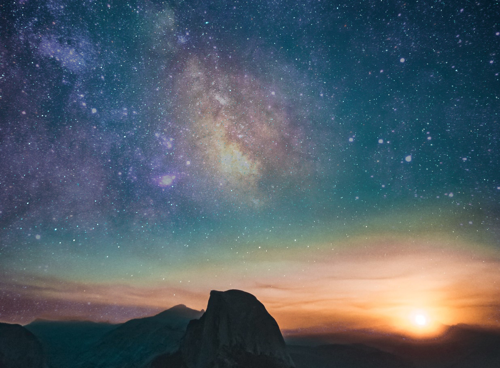

[Listen](audio/poetry-0120.mp3)

Anything that can go wrong may go wrong, 
and there is only one guarantee in life.

It is a guarantee, precisely because it is within our complete control, 
the guarantee is The Greatness Of Our Soul, or Spirit, or Being.

It means you will keep getting up no matter how many times you fall, 
it means you will continue moving forward without stopping.

 

It means there is no pain, it means there is no weakness, 
that it is a function and fact of life that we advance forward.

And on the day of triumph, 
it means that the prize is nothing less than Laughter and Joy of Life.

The Greatness of Our Soul, our single guarantee in life, 
may begin in discomfort, but it concludes with something **far** more.

 

Marvels of the Human Spirit that we can't directly conjure up within ourselves, 
marvels that can only come out of our Might and Authenticity.

Humor and Foolishness, Cheerfulness and Bliss, 
Sweetens and Giggles, Joy, Laughter, Wisdom and Delight.

Greatness of Soul.

  

## Finding The Northern Part Of The I-275 Bicycle Trail
### June 26th 2020, 10:44:01 pm EDT
<meta itemprop="dateCreated" datetime="2020-06-27T02:44:01.119Z">

[Listen](audio/poetry-0119.mp3)

For those of you who had trouble,
finding the Northern end of the I-275 Bicycle Tail.

Hines connects North and South parts, 
but it is really hard to find the [North Entry Point](https://goo.gl/maps/AimpKxWarbhiX8zbA)

I got on my bicycle today, 
and took some pictures.

You have to find the M-14 Overpass, 
or an Overpass with a huge dark rail beneath.

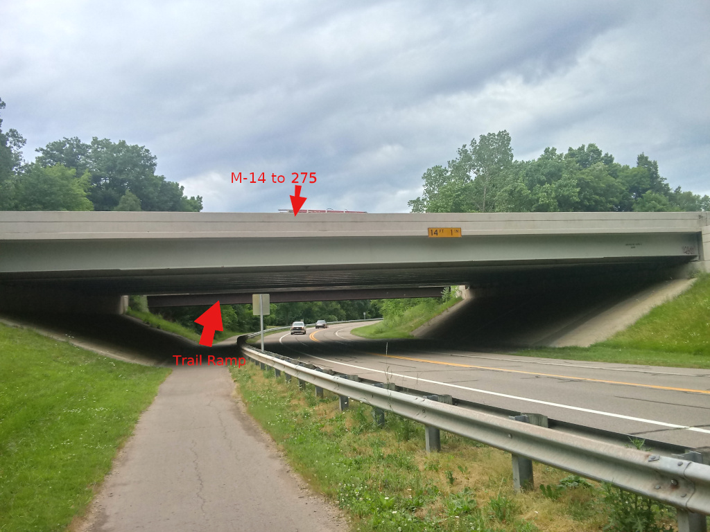

That rail is the support beam, 
for the Trail On-ramp.

A bit further down the road, 
there is a road that leads up to the On-ramp.

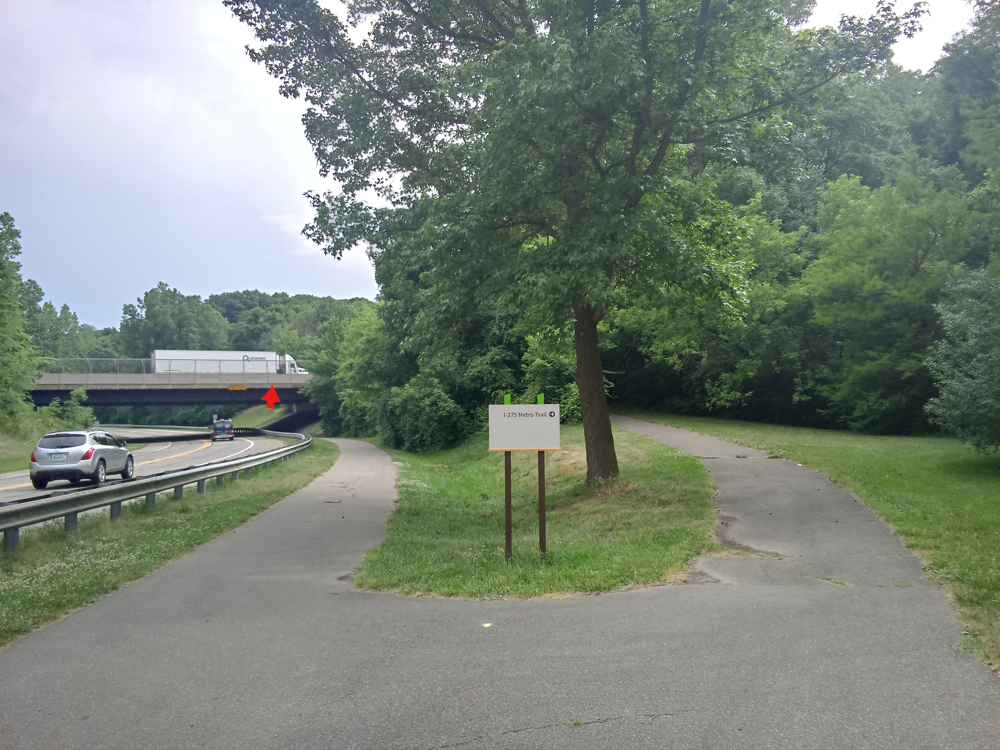

It is a ramp specially made, 
for the Handsome Adventurous Bicyclist.

It opens like the door to a secret garden, 
very few people bicycle there.

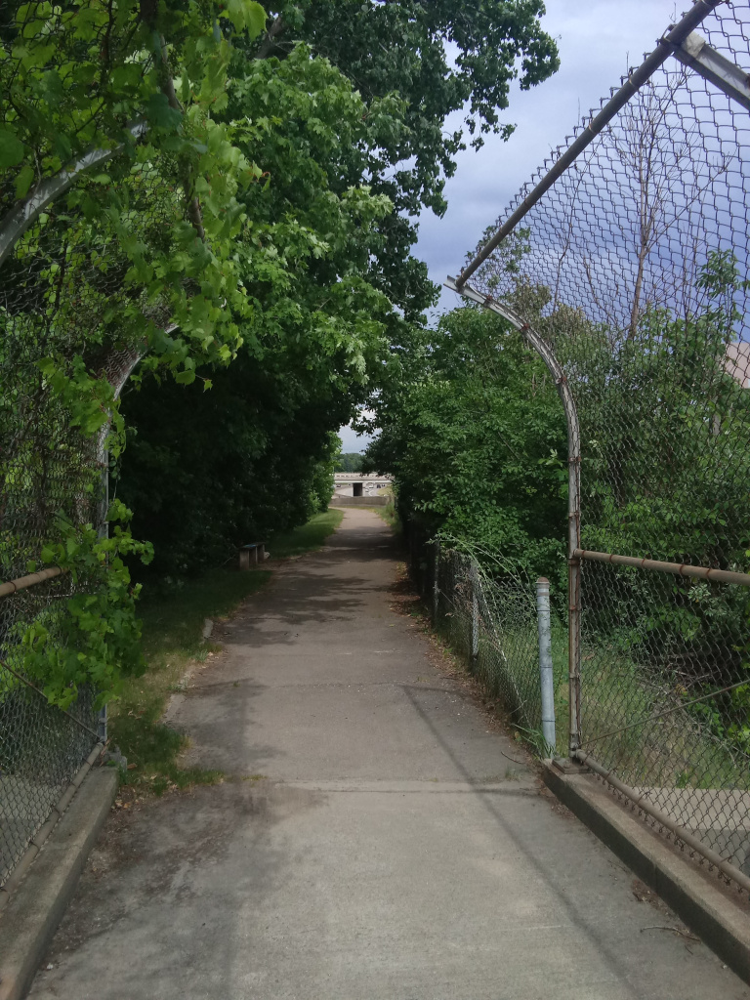

The trail continues for many more miles, 
all the way up to 14 Mile Road.

Over at 14 Mile it ends wonderfully unceremoniously, 
it just pops out onto a sidewalk.

Where motorists jump in their cars slightly, 
as you pop out somewhat dehydrated, a little crazed, and a bit wild.

  

## Amazing Nap
### June 25th 2020, 10:54:26 pm EDT
<meta itemprop="dateCreated" datetime="2020-06-26T02:54:26.311Z">

[Listen](audio/poetry-0118.mp3)

Back when I was a Teenager, 
one late Friday afternoon.

I had a nap, so amazing, 
I have never forgotten about it.

I woke up light as a feather, 
and I dressed beautifully.

And went exploring, 
little Coffee Shops in Plymouth.

I went to see The Brew Ha Ha, 
full of Mighty Minds with Extreme Dreams.

I peeked into Coffee Studio, 
and saw Angel-headed Hipsters reading Tolstoy.

I poked into The Bean, 
full of Dirty Hippies, reciting Beautiful Poetry.

I made my way back home, 
walking alone through streets of gold.

I read Chaucer, 
programmed Visual Basic.

And went back to sleep, 
full of new memories that I would keep.

  

## The Way Of The Warrior
### June 24th 2020, 8:59:53 pm EDT
<meta itemprop="dateCreated" datetime="2020-06-25T00:59:53.016Z">

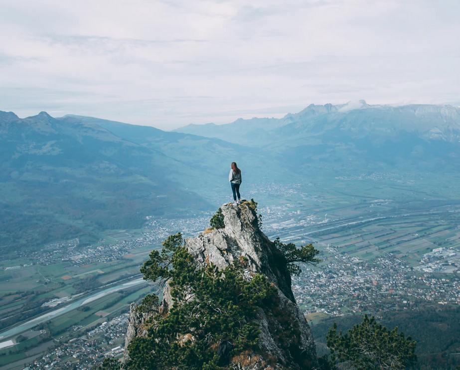

[Listen](audio/poetry-0117.mp3)

In the beginning we discover our Universal Self, 
the Being we are, regardless, of what Culture or Place we are born into.

Then we set an aim, by asking our Elder Selves what heir regrets are, 
the more we advance forward the more we become Ourselves.

The less regrets our Elder Selves have, 
the more we become in harmony with ourselves.

The Way Of The Warrior, is a self correcting path, 
each time we advance we become stronger, wiser, and more powerful.

Frame after frame, as time ticks away, and our minds and bodies grow, 
we near, and finally become; our Elder Selves.

We arrive with Certainty of Knowing that the path we traveled was our own, 
that we are in Harmony with Universe, that all our Senses are Finely Tuned.

In moving forward we don't need to ask what life is for, 
Life is for the Living, for those who grow and advance forward.

There cannot be any real regrets as we had decades to avoid them, 
and whatever obstacles there were, we never lost our way.

The Final Aim, is to rise all the way up, and become a Great Being, 
to build a legacy of Wisdom and Good Ideas, Lessons Worth Sharing, and Moving Inspiration.

  

## Inventing Yourself
### June 23rd 2020, 11:39:32 pm EDT
<meta itemprop="dateCreated" datetime="2020-06-24T03:39:32.289Z">

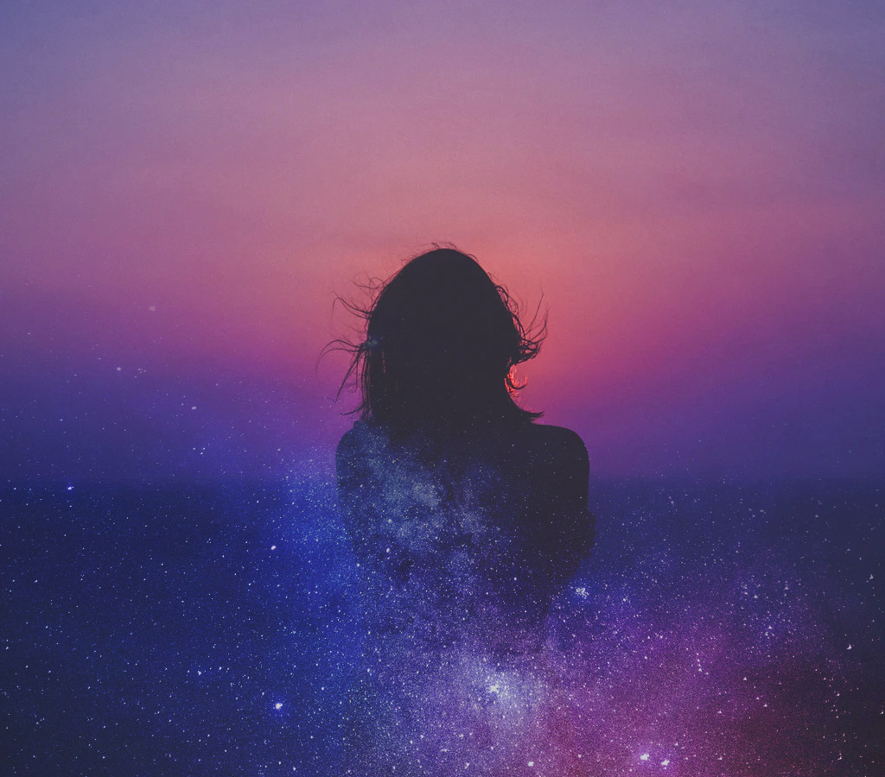

[Listen](audio/poetry-0116.mp3)

Try to imagine yourself born in different places or to different cultures, 
note how you are influenced by all the surrounding factors.

Note, how there are parts of you that never do change, 
that form some kind of a foundation.

Rather, than than letting your place of birth or culture influence you, 
imagine inventing yourself **independently** of everything.

  

Look towards Nonfiction Books or Audiobooks, Memoirs and Biographies, 
and see what wisdom you can inherit to help you on your own journey forward.

Allow those parts of you that never seem to change no matter what culture you are born into, 
to expand, and grow upwards.

  

See if becoming a Citizen of The World, 
and not any nation in particular, helps you see the World more clearly.

See if becoming a Lover of all Wisdom, and All Good Ideas, 
and not merely the culture you were born into, helps you understand more about the Human Condition.

Imagine that you are Made of Stars, 
that you are a Child of the Universe.

  

## Gradually Increasing Endurance
### June 22nd 2020, 10:45:02 pm EDT
<meta itemprop="dateCreated" datetime="2020-06-23T02:45:02.767Z">

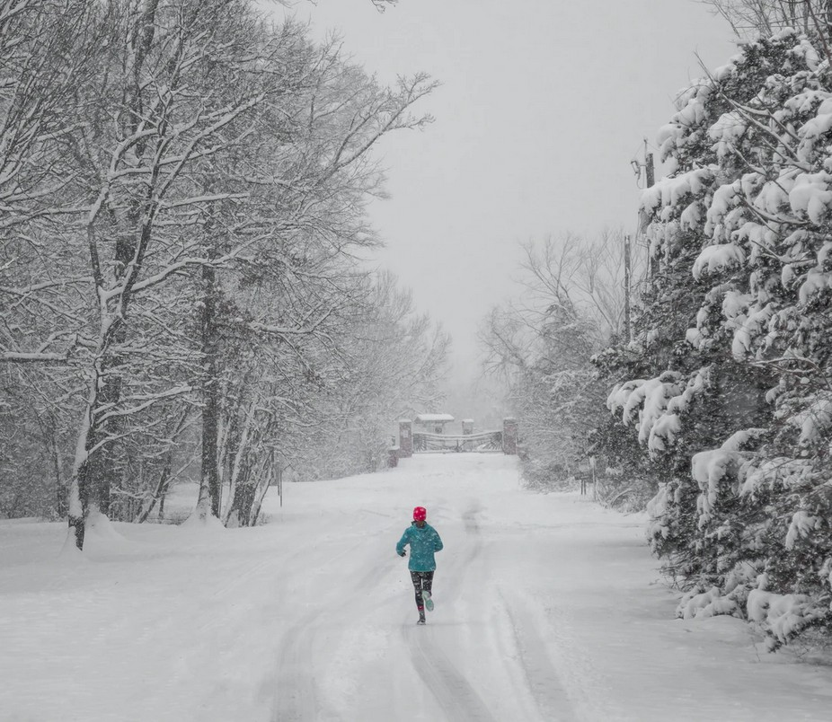

[Listen](audio/poetry-0115.mp3)

All those High and Mighty claims of 
"I am stronger", "I can run longer", "You can't do what I do", are bunk.

But they also beautifully underline the importance of Endurance, 
nothing is more important for an Athlete than Proper Endurance.

Without a solid measure endurance, 
we probably can't push out body into adaptation.

In a way, will run out of the ability to go forward, 
just before our body notices it needs to make some changes.

Endurance may just be the very core of any and all Athletic pursuits, 
including Bodybuilding, Gymnastics, and even Dancing.

It is easiest to see that in Long Distance running, 
in order to finish the race, we have to gradually increase our distance.

It is very unhealthy to try to run an ultra-marathon, 
without having first worked on our endurance.

In bodybuilding lifting something 30 times may entertain a muscle, 
but it is unlikely to influence it to develop to be better.

Slowly gaining endurance to lift, three hundred times, three thousand times, and fifteen thousand times... 
Will reliably encourage your body to adapt.

Gradually increasing endurance, and eating a healthy and balanced diet, 
will slowly send a signal to your body, that it must adapt.

Endurance is the secret, 
and **gradually** is the method of increasing it.

  

## Learning From Books
### June 21st 2020, 8:56:59 pm EDT
<meta itemprop="dateCreated" datetime="2020-06-22T00:56:59.739Z">

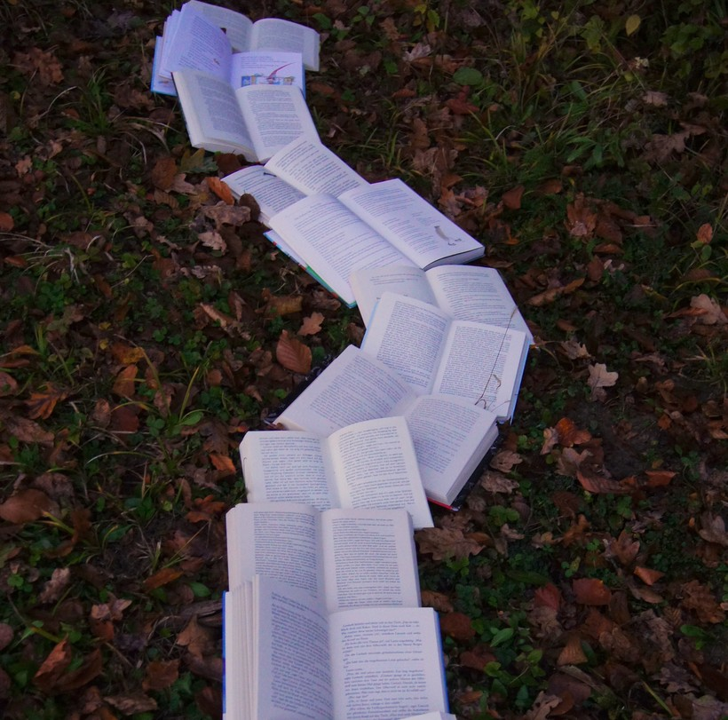

[Listen](audio/poetry-0114.mp3)

Nonfiction books are way to share wisdom, 
some wisdom is in the form of advice, other you have to discover yourself.

Life is too precious, and we are far too intelligent not to inherit wisdom from books, 
there is only one direction for us all, and that is towards Wisdom.

Growing up, 
enlarges our worlds.

Wisdom, helps us see more roads in our Journeys, 
roads that we would not have noticed without it.

  

How can we be sure if we are traveling on the path that does us justice, 
if we can't see all the forks and roads ahead?

  

Let pursuit of wisdom bring you the light needed to enlighten your path, 
to show you all the roads and many of the futures ahead.

Seek your own wisdom from many books that interest you, 
that present a coherent path of self education.

Connect them in harmony, 
make your road beautiful.

  

The reasons to break away from waiting to be taught and following others, 
are countless, and the access to books and audio-books, is too easy.

Nonfiction Best Seller Audio-books are especially powerful at teaching, 
some represent a near lifetime of knowledge, of rising to success and wisdom.

We don't just inherit knowledge that leads to wisdom, 
we also inherit culture, ways of thinking, and roads towards joy and happiness.

  

Humanity celebrates those who rise, 
it celebrates wisdom and the struggle for goodness.

The most beautiful of books and audio-books, 
very often end up on Best Seller lists, start there.

Find a way to listen to Nonfiction Best Sellers, 
and inherit the treasures within.

  

## The Snack Bar
### June 20th 2020, 7:35:09 pm EDT
<meta itemprop="dateCreated" datetime="2020-06-20T23:35:09.875Z">

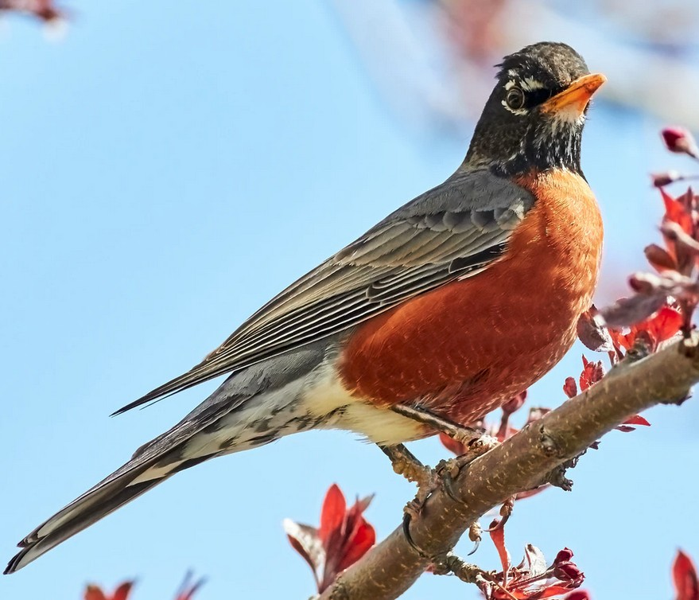

[Listen](audio/poetry-0113.mp3)

You know me, I am not one to complain, 
but; every once in a while a little bird flies into my jogging lane.

She lands, and turns her head to look at me, 
the moment she sees that I see...

...she starts hopping, moving **much** faster than me, 
at first I thought she was trying to raise me as her baby.

But now I think she's only doing this, to mock me, 
she's just sick of seeing me struggle from her tree.

For one, when she's done racing me, 
she stops and just stares angrily.

Then she always takes off for my face, 
it is really hard to duck when you are trying to focus on your pace.

I have a theory as to why she flies at me this way, 
though I am afraid to say,

Umm...

Some of the flies that catch me when I leave my yard, 
you know, those little ones that are always trying to lick so hard.

Even after several miles... they kind of keep my pace, 
kind of actually run circles around my face.

While, I bring most of the flies back, 
the bird probably flies at me like this, to grab a snack.

Well,

I am now trying really hard to improve my pace, 
to get all those creatures out of my face.

I run fast just as soon as I get out of my home. 
maybe if I can outrun the flies the bird will leave me alone.

  

## The Building of The Ocean
### June 19th 2020, 6:38:13 pm EDT
<meta itemprop="dateCreated" datetime="2020-06-19T22:38:13.370Z">

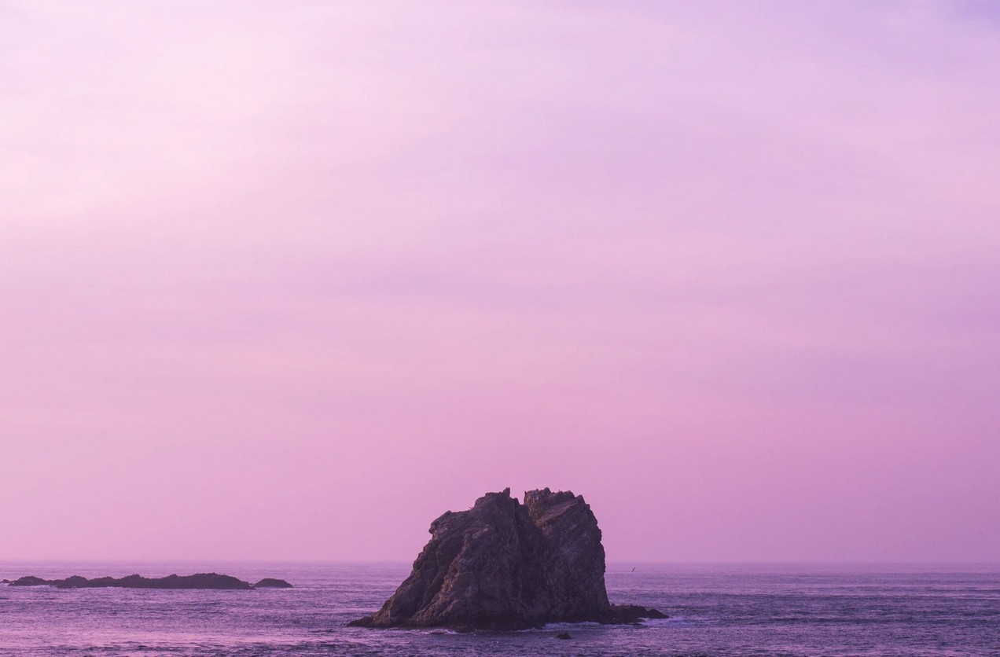

[Listen](audio/poetry-0112.mp3)

Since we can't see future clearly, 
the risk is simply too great not to take the higher more challenging roads.

If we are mistaken about the importance of growing up, 
and choose to push, and climb, and become Great Beings, anyway.

Well, we can hardly say that we have fooled ourselves, 
Becoming a Brilliant and Beautiful Being, is probably pretty hard to regret.

  

But if we are mistaken about the importance of growing up, 
and put opinion above fact, fantasy over reality, merely age and never grow.

If we reject real education for grades, and GPA, and a photo op, 
and a mere feeling of maturity, but also, fear and no motivation to continue.

If we reach the age of retirement, 
confused, or breakable, and lost.

Then we will regret this, 
surely.

And although we won't know what might have been, we will have a feeling, 
that Growing Up would have brought us clarity, unbreakability, and calm.

  

The risk of misunderstanding the importance of Growing Up, 
is too great, let us all aim to become Great Beings, My Friends.

The Beauty of Beginnings, 
it that they are always simple.

There are very few unfamiliar things that play a role in rising, 
after all, we only rise to become More Human, All Too Human.

We are born with this ability, 
it _has to be_ within each and every one of us.

  

It starts in childhood, as we venture to explore, 
be it a garden, or some rusty machinery, or the alien worlds beyond the train tracks.

And like interesting pebbles in a pocket, our observations add, 
and as a whole stand to mean more.

  

Once our mind begins to flourish a decade later, 
what we found of interest, or the things that created more questions, lead us to books.

We discover that there were others there walking that path before us, 
and what once was a twinkling star, becomes a Distant Sun, not unlike our Sun.

And where once darkness was, 
there is now a ray of light.

  

And we must stay on this path, My Friends, 
everyone will try to push you, claim to know better.

Siblings, Parents, Teachers, Friends, your Boss, 
they will have few motives, and little to explain.

  

If you resist, or rise again, and find your way forward, 
the Universe will continue adding to your Knowledge.

You will slowly begin to become; 
less what others need - and more of who you really are.

Your knowledge will begin overflowing, 
it will create a vast ocean.

And then the waves will finally come, 
churn, turn, tickle; help you up, and rest and relax, and feel safe.

And that is the first plateau, the first step towards Your Greatness, 
the finding of calm, and the successful resistance of what others want you to be.

  

The waves will carry you, 
but the ocean you swim in is your knowledge, is perfectly familiar, and friendly.

And just reach out, 
to what you will love next.

And touch and remember, 
and let the next plateau emerge.

  

Your plateaus, their order, and height and color, are not just a path to Greatness, 
they are also your Beauty.

Anybody can know what you know, 
but only you will build your road to Greatness in that particular sequence and style.

  

You may start with Mountainous Adventure, add Celestial Cartography, 
followed by a venture into your own Photography Business.

These are the waves of your own personal private school of life, 
your ever expanding ocean, your Thriving Living Body of Knowledge.

There is no one single direction here, 
it is all directions all the time.

  

So as long as you resist being pushed to places that are alien to you, 
and carry on building Your Universe Within, you can only grow.

  

More than what to think, 
it is important to learn how to think.

More than others pushing you around, 
you must let your own ocean move you.

No one can enact an external force on you, 
that can ever be greater than the power that is already within you.

Nothing external, or yet unfamiliar to you, 
can move you as much as that which you Cherish, Admire and Love.

Grow in the Sequence that Makes You a Force of Nature, 
and at the familiar pace that your ocean expands at.

  

To become a Great Being, to Grow All The Way Up, 
is to become Perfectly Unbreakable out of all the Uncompressible treasure within you.

Do not be sacred, for that which is in your power, becomes your power, 
and that which is not - is not your fault.

Rise, 
My Friends.

  

## A Couple Of Sandwiches Shy Of A Picnic
### June 18th 2020, 11:11:39 pm EDT
<meta itemprop="dateCreated" datetime="2020-06-19T03:11:39.159Z">

[Listen](audio/poetry-0111.mp3)

There cannot be jogging without acting crazy, 
if you're not snarling and spitting you're just being lazy.

Not to mention that its discussing to swallow those little files, 
you're not supposed to **keep** them, they're not your prize.

Ultimately, it makes no difference what race it may be, 
manners go out the window, the moment you bend your knee.

  

Plus, nobody really runs to win the race, 
we just set the correct pace and run to find our place in Space.

The physical challenge is found in taking each step, 
and not stopping until the last rep.

But that's easy, it is the simplest thing about it all, 
your body just gets used to it, and has a ball.

  

Jogging is mostly a little reminder that we are to turn our life to Art, 
that we are to overcome our limits, and become super smart.

The actual achievement is found in finishing what we start, 
and the thousand other things we finish, by _subtle analogy_ to this odd Art.

In a word, we jog for our future selves, 
so that they may become **proud** of themselves.

  

## Point of Convergence
### June 17th 2020, 6:52:28 pm EDT
<meta itemprop="dateCreated" datetime="2020-06-17T22:52:28.265Z">

[Listen](audio/poetry-0110.mp3)

Humanity must not be scared of poverty, 
poverty is just a symptom of immature, shortsighted politics.

For politics to grow up and begin helping the world heal, 
**we** must begin growing up, and inspire the children to growing up as well.

Nothing will change, nothing can change, 
unless we begin our lives by resuming where great beings left off.

There is just one road for all to agree, 
the road of Reality, Results, Knowledge, Wisdom, Excellence, and Good Ideas.

We receive a very good impression of the meaning of Wisdom when we are children, 
we think of Adults as all-knowing, as always correct, and perfect.

This is our aim now, for in the absence of teachers we must become the teachers, 
we must become the adults we wished we grew up with.

This is how we make the World better, 
for our generation, and moreso for the new generation, and all those yet to come.

We can't hope for change, 
and not grow to meet that demand ourselves.

The change we need, 
is driven by Permanent Inheritance of Culture of Wisdom for all generations to come.

A Fine Culture, is self repairing, and it always heals, 
it towers over forces of poverty, pain, bondage, fear, anger, hopelessness, shyness, and loneliness.

And a fine culture is what we expect of the adults that we meet as children, 
once we become this culture, and the children learn that it is real.

The children will see it as an actual, realistic aim to grow into, 
and they will enter a culture of beginning their lives, by resuming at the point where we leave off.

In order for Humanity to Grow, 
a Central Universal Culture of Knowledge, Wisdom, and Excellence, should emerge.

A Central Meeting Point, 
for all cultures that choose to leave bad ideas behind and converge on Wisdom and Peace.

  

## Philosopher Queens, and Philosopher Kings
### June 16th 2020, 10:23:07 pm EDT
<meta itemprop="dateCreated" datetime="2020-06-17T02:23:07.783Z">

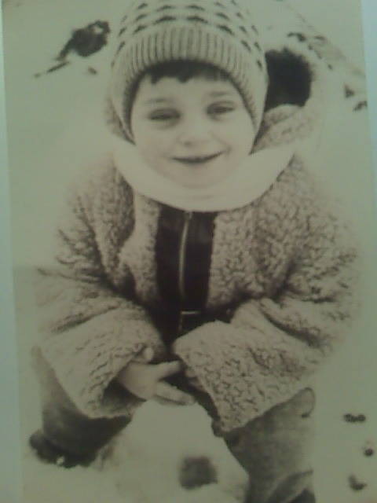

[Listen](audio/poetry-0109.mp3)

Your Earthly Lineage begun some four billions years ago, 
you ancestors weren't human, they couldn't even breathe Oxygen.

We gradually adapted to changing conditions, 
to chemical composition of our Little Lonesome Blue Earth.

In a mere Hundred Million years, we will be as different from who we are today, 
as a Shrew is different from a Great Ape.

  

But, one thing will never change, 
and that is how special life that begun on Earth is.

How colorful and unique our good ideas, 
how different we must be from what life there may be out in space.

And how incredibly close we all are, 
we are such a tightly knit family, we share so much.

  

And we can think without restrictions, 
we don't have short memory, we don't lack imagination.

Our ideas come from nowhere and everywhere, 
we dream about anything and everything, here and everywhere.

And we have poetry, and paintings, and doodles, 
we have sculptures that are made out of stone and metal.

  

And above all, we are all born a Royalty, and our proper posture, 
is to rise to the challenge of becoming Philosopher Queens, and Philosopher Kings.

Our consciousness, makes it so that we must rise to no end, 
step after step, book after book, work of art, after a work of art.

  

Do not be scared, 
Above All, Love Yourself.

Humanity is in a process of amassing Culture, 
whether we notice it or not, **it is** abandoning bad ideas.

And, You Are Born A Royalty, 
And Your aim, is to become Philosopher Queens, and Kings.

  

Say it with me: 
Forbearance, Hardihood, Largesse, Benevolence, and Honour.

Restraint, Dignity, Nobility, Unbreakability, Fortitude, Courage, 
Love; and Insight; and Foresight; and Understanding; and Authenticity; and Heroism;

And Celebrate 
Your Beautiful Life.

  

## The Journey To The Old End Of The I-275 Bicycle Trail
### June 15th 2020, 10:31:53 pm EDT
<meta itemprop="dateCreated" datetime="2020-06-16T02:31:53.705Z">

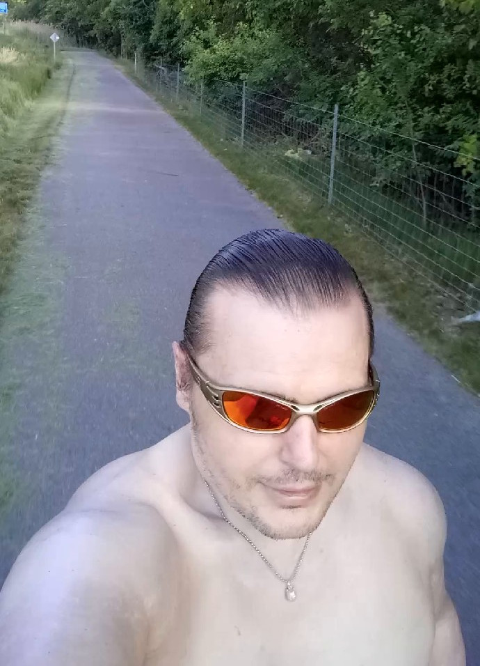

[Listen](audio/poetry-0108.mp3)

Every one in a while I bicycle to the [south end](https://goo.gl/maps/J7BhcUqsPx1wNJEBA), 
and check if they did any work, and how it went.

I always find it old, and full, of bumps thorns and grass, 
no matter how hard I bicycle, there is never a way to pass.

I work up this morning, and said "It is time for another check!", 
I got my gear together, and squirted sunblock all around on my neck.

And as soon as got too far to go back, 
my bicycle, creaked, and shuddered, and squeaked - and I was like "What the heck?"

The noise came from the bottom where the pedals are, 
and only the left pedal made noise thus far.

And the noise would not cease, 
I had the tools but no grease.

So I said to my self in a deep tone "It is time for Field Repair!, 
and although I have no grease, I will not despair.""

First, I checked the pockets of my new red pants, the short ones that I like, 
but there was nothing there that could fix my bike.

So I looked to my day pack, and the solution sat right next to my bicycle lock, 
I squeaked! "I do have grease, it is in my sun block!"

So I squired some on the pedals and the connecting rod, 
and though I admit the solution was a bit odd...

I was back on the road, riding smoothly and quietly like a pro, 
after all, I had places to go.

I made it to the southern edge, it was 15 miles away, 
they still didn't fix anything, bumps and shrubs were blocking the way.

I took a photo to share with you, 
just in case you were thinking about going or pushing through.

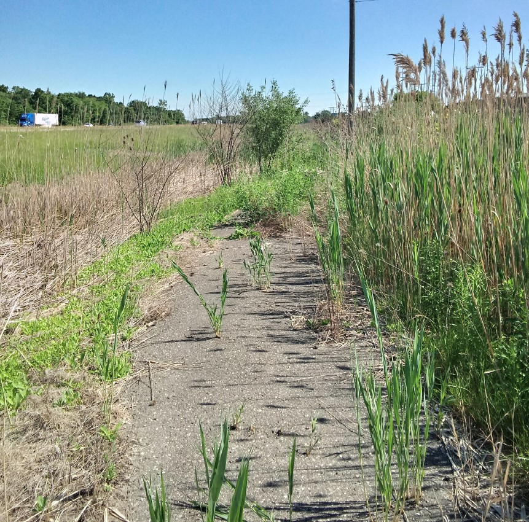

The [actual ancient end of the trail](https://goo.gl/maps/oRaowTwL1cdz5G549) is not that far away, 
about 2.6 miles south, but you are better off walking the rest of the way.

Even better than following the ancient end, is to [go to the park](https://goo.gl/maps/j93A21irtxaaRzd96), 
and head for lake Erie, but make sure to leave early, so that you don't bicycle back after dark.

The trick to make it to the lake is to [turn right before](https://goo.gl/maps/yDvAJg3dUWX2atPY9) the Nature Center, 
and head through Flat Rock, to [Maple Beach](https://goo.gl/maps/Uq1DXX5HRwXxYtcW7), you don't have to pay to enter.

I think of it as the real end to the trail, 
reaching it always make for a good tale.

  

## You Are The Best But You Also Need Some Rest
### June 14th 2020, 11:55:32 pm EDT
<meta itemprop="dateCreated" datetime="2020-06-15T03:55:32.780Z">

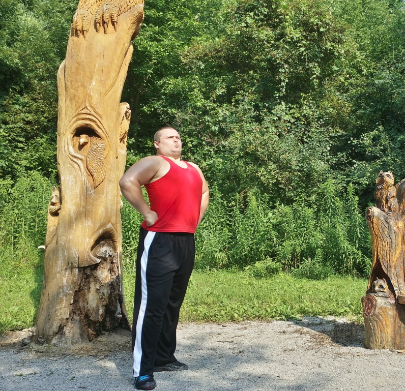

[Listen](audio/poetry-0107.mp3)

Life shouldn't be about beating your best, 
just as important as rising, is your day of rest.

No matter how important your athletic quest, 
or how upon your arrival you are going to be blessed.

Everyone, needs to get some rest, 
days will only get longer when you are stressed.

  

If you must, 
imagine you are a Bird of Fantastic Plumage, and your bed is a nest.

Come morning, fling up your messy crest, 
and puff up your chest.

And tweet, about how you are not getting dressed, 
because you are too stressed, and you are having your rest.

And explain to those confused, that you are not speaking in jest, 
make it clear that this is not, a test.

  

Today is _your_ day of rest, 
at best, you will be having a nice cup of tea, should you feel pressed.

  

Allow strength to return to you, so that you are at your best, 
tomorrow, or in few days, you'll resume your quest.

Once you are not feeling so stressed, 
you'll show the world that You are the Best.

  

## Life Of Wisdom
### June 14th 2020, 10:21:56 pm EDT
<meta itemprop="dateCreated" datetime="2020-06-15T02:21:56.471Z">

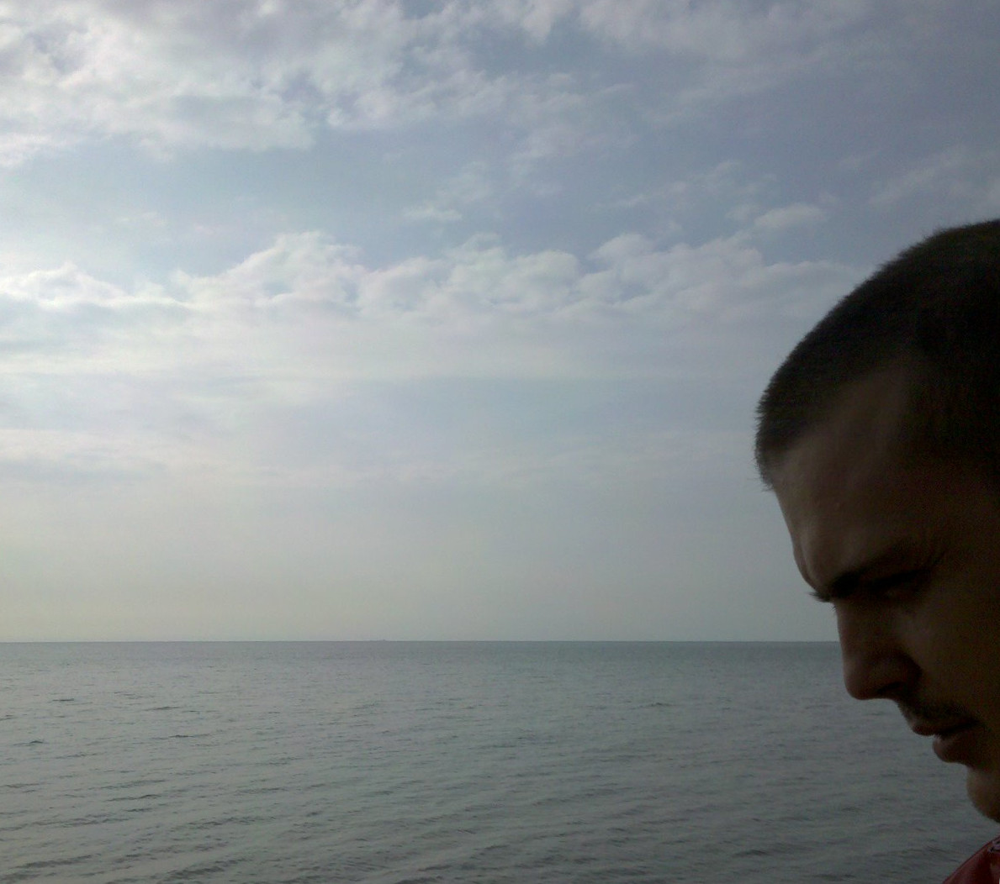

[Listen](audio/poetry-0106.mp3)

Song based on the [A Life Of Wisdom, For In Wisdom We Grow Poem](https://news.catpea.com/read/poetry-0105)

  

## A Life Of Wisdom, For In Wisdom We Grow
### June 13th 2020, 11:14:02 pm EDT
<meta itemprop="dateCreated" datetime="2020-06-14T03:14:02.791Z">

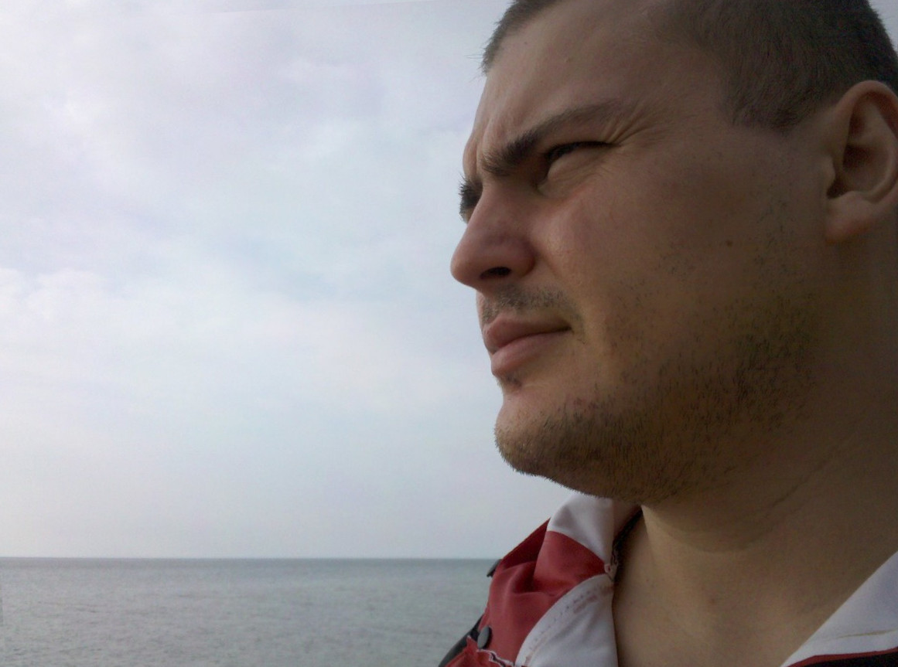

[Listen](audio/poetry-0105.mp3)

My Friends,

Your youth holds a great power, 
a power that you can hold on to throughout your entire existence.

It is the power of creating a life that you will love, 
a life that will help you see with great clarity.

A Life of Wisdom.

  

But you must be careful,
as the world may not yet be ready to help you.

Not everyone will know about growing up, 
and people will say: "How was I supposed to know?"

And they are not going to be the bad guys, 
and you will be inclined to listen to their advice.

And the path will be paved with good intentions, 
it maybe the correct path, but it won't be the right one.

  

Please, focus on building your own self, 
your strength, your wisdom, your power.

Focus on building the best you, 
the you that you are meant to be, that the world needs.

  

Because if you listen to everybody else, 
you will not grow up, and they will blame you for not being able to help them.

You are not going to be able to explain to them, 
that you are weak because of them, 
because you tried to help them too early.

And if you could, all they could say will be: 
"How was I supposed to know?"

  

Please, you have no choice, 
but to learn to control your own future.

You can try to use your imagination, 
to get in touch with your Elder Self;

And ask "What are your regrets?", 
"Where did it go wrong?"

  

Please, carefully evaluate your choices, 
wisely build your Mind and Body.

Pay attention to all the choices you are making, 
as they dictate the Beautiful Life Ahead of You.

  

The teachers are not ready, we are not in the Era of Wisdom yet, 
people are struggling to understand life.

Many make choices that all too early box them in, 
and not all their advice will apply to you.

Not all the things that you think box people in, 
actually constrain them, there are many contexts to all the paths.

All lives are beautiful, and there are enough forks in the road, 
for people to navigate back to where they want to be.

But, when a mistake occurs, it will weigh you down for a time, 
if you are careful, you can avoid the worst of it.

And whatever does happen, regardless of how hard you tried to avoid it, 
will not crush you, because you will know you did your best.

  

Please, be careful in life, be beautiful, and strong, 
learn, and think, and evaluate, and judge, and grow in wisdom.

Following everyone's advice, will create a lot of noise, 
listening to everything from everywhere will never align with you.

You must lean to pace yourself, 
and to carefully and wisely follow what interests you.

Your mind is constantly asking questions, 
your future depends on having a good intuition, rooted in reality, and in wisdom.

There is nothing you can be force-taught school, 
you will not retain things that are out of sequence.

Reaching out for Knowledge and Wisdom in your own sequence, and at your own pace, 
is the only way to learn, and build steps, and build on top of those steps.

No one can decide what lesson you are ready for next, 
that is something that comes from the complexity of your own mind.

Those people who are doing well in school without cramming and memorization, 
have previously arrived at those subjects in their own sequence.

  

The same applies to your job, your career, 
your career needs to emerge from the path you were growing up with.

It needs to be an an extension of your pursuits, 
it must benefit you, and help you grow.

Just like you must actually learn, instead of just getting grades, 
your work must add to you, and not, rob you of your years.

Do you understand the value of a Single Year of Your Precious Life? 
no one can put a price on that, not even you, there are not enough atoms in the Universe.

That is why Harmony with Education, and Work is so important, 
each year must be lived on the path that makes you grow.

  

I am so sorry, that people will tell you to cram for tests, 
and get a job, and get on with life.

I am so sorry, My Friends, 
but that is the worst, you can do.

That's why you can't listen to anyone, 
that's why you have to look into yourself.

Carefully evaluate all decisions, 
whilst carefully evaluating consequences, and being mindful of your future.

You are not alone, look to Memoirs, look to Biographies, 
listen to Audiobooks, Explore, and Create.

  

And you must take care of your body, 
the best you can, at first.

And with each year, 
you will gain more, and add a bit more as you grow in Health and Fortitude.

Your Elder Self needs to be Flexible, and Healthy, 
you may never grunt and complain, that's something you have to be mindful of now.

It is not just about making choices for your Future, 
but also for your body too.

  

Do you see how going along with cramming for tests, 
can put you in a field where your job makes life more stressful, 
which will prevent you from taking good care of your body?

Imagine the consequences of walking a path that is not truly your own, 
and what will your Elder Self feel when you two finally become, One?

Be gentle with yourself, 
this is Your Life, Your Beautiful-Beautiful Life.

  

Put down the incomprehensible Text Book, the standardized tests, 
and [find](https://www.goodreads.com/list/show/130.Best_Audiobooks_Ever) an Audiobook that you will love and actually learn from.

Stop trying to find a job or get hired, and become the kind of a person; 
that companies can only hope to hire.

Start living healthy, years before you start your training, 
do not force your body into endurance, gradually teach it to adapt.

  

Chose Audio-books that really help your wisdom grow, 
embrace your hobbies, and expand your adventures.

If you can't find a career path that will add onto you, 
then [start your own company](https://www.youtube.com/watch?v=_4JtyLKDjXk),
or become a [co-founder](https://www.youtube.com/watch?v=CRLzkbtKPGM).

Take care of your body, be mindful of you [Body Mass Index](https://en.wikipedia.org/wiki/Body_mass_index), 
but also aim to become a Healthy Athlete, Heath will never take away from you.

  

In all we do, in choices, or intuitions, 
we re driven by the wisdom we have thus far acquired.

A decision that made sense in your youth, 
may reverse, as you gain wisdom from Books and Experiences.

The richer our Pursuit of Wisdom, 
the more in-tune our decision-making.

Wisdom surrounds Education, Carrier and Health, 
it influences your Private Decision-making, and thus Your Future.

In most contexts Wisdom is the most important thing, 
what can be more important than the thing that influences your private decision making?

And be mindful that your decision making is in turn, 
the very thing that influences all the future ahead of you?

  

The beginning of your Knowledge and Wisdom is found in the things you love as a child, 
in a way those things are questions, and playing with them brings answers.

But you have to stay with it, 
protect the natural progression of the chain of your curiosities.

You have to understand the the Destructive Power of: 
"cram, get a job, and get on with your life".

We don't live in a world that can support your Pursuit of Wisdom, 
for most, the world will give minimums, for many nothing.

When we try to create external machinery, 
it will often perform the minimum.

  

The power for the world to change, 
is within each of its Citizens.

It is found in decision making, 
perpetually strengthened by Unrelenting Pursuit of wisdom.

We create this world together, 
and it can only grow, when we grow.

  

## Authenticity Helps Us Learn
### June 13th 2020, 12:05:02 am EDT
<meta itemprop="dateCreated" datetime="2020-06-13T04:05:02.742Z">

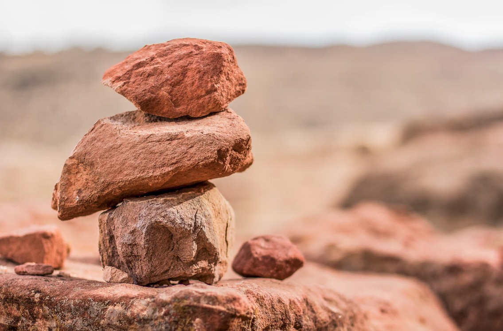

[Listen](audio/poetry-0104.mp3)

Authenticity would be Wonderful on its own, 
it helps with trust, admiration, knowing, feeling.

But, actually, it is far more than that, 
it reflects Fundamental Principles of The Universe.

There is a very big difference, between crossing a real bridge, 
and a fake one.

Or, reading a book for real, and pretending to read. 
Or, studying a Field of Science and, and cramming for a test. 
Or, doing something for a grade, and doing something for your mind. 
Or, doing something for real, and pretend to do something. 
Or, being your complete self, and being what others approve of. 

The one thing in common here, is one is a fantasy that ends, 
and the other, just is ... and grows, and alters the course of life ahead.

It is a testament to our connection with the Universe, 
that an Authentic Human Being will grow Healthy and Strong, and Keep Expanding.

The best example of this is getting an education that looks great on paper, 
but does nothing for interacting with the real word.

A similar example has to do with a great job that pays well, that goes great, 
but halts a person's development, and robs them of their youth, dreams, and hopes, 
robs them of the highest version of themselves.

Time, cannot be warped, or faked, 
it ticks away, our bodies grow, day by day, year by year, decade by decade.

The long-vision of becoming of ourselves, will reveal that the first and foremost, 
and most dominant and meaningful thing, is our acquisition of wisdom.

Acquisition of Wisdom is deeply connected to Authenticity, 
Courage, Dignity, Nobility, Pursuit of Knowledge, Rising, Growing Up.

Time helps our bodies progress forward, 
but it is Wisdom that helps our Minds.

Authenticity, gives us this incredible power to start something today, 
that will make us Wiser, Healthier, Happier, Filled with More Insight.

And not merely tomorrow, but for all our time to come, 
as in Authenticity, each day adds to the previous.

  

## You Are Divine
### June 11th 2020, 10:46:35 pm EDT
<meta itemprop="dateCreated" datetime="2020-06-12T02:46:35.303Z">

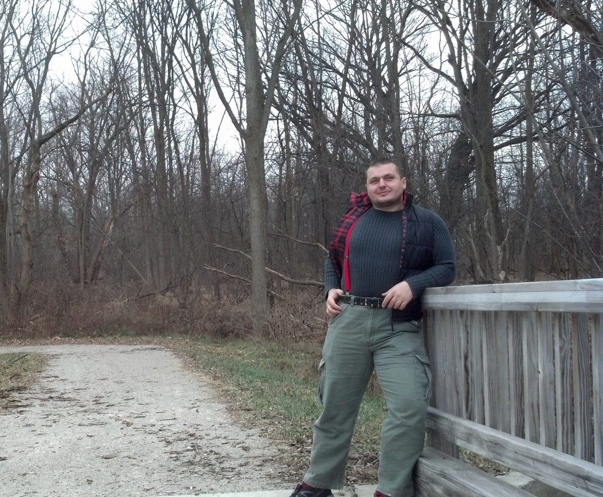

[Listen](audio/poetry-0103.mp3)

My Friends, Build Your Mind, 
Build Your Body.

Do not ignore your well being, 
you require Blue Skies, Seas, Mountains, Oceans, Lakes, and Forests.

Do not ignore your Body, 
it needs care and exercise, and proper diet.

Do not merely hope to get a job, 
make companies hope they can hire you.

Do not ignore the Content of Your Character, 
spend many great adventures in pursuit of wisdom and insight.

Do not ignore Your Beautiful Heart, 
keep rising, keep searching, keep shining.

Build Your Life, like a Sculptor Builds a Sculpture. 
Ensure Strength, Beauty, Authenticity, Dignity, Nobility, and Restraint.

And when you run out of strength, and it will happen often, 
laugh as you pick yourself up, 
and your laughter will connect with the laughter of all the other Great Beings who rose before you.

Your life, is to become a Work of Art, 
day by day you must add to it, make it more beautiful.

Our civilizations, cultures, and the world, may not be ready to embrace your growing up, 
many will stand in your way, some even with advice that sounds good.

Never follow, 
Always lead.

Know that all the steps you take toward wisdom and Enlightenment count, 
and you will never regret this journey - as Rising Up, is a Law of the Universe.

All the Great Beings who have risen before you, 
had only one regret: "I should have risen faster."

So get up, 
and Go!

  

## The Sleeping Giant
### June 10th 2020, 10:33:12 pm EDT
<meta itemprop="dateCreated" datetime="2020-06-11T02:33:12.562Z">

[Listen](audio/poetry-0102.mp3)

We are too good, at working too hard, 
this is why we must stay on guard.

Your mind is more than just a tool, 
it is a rare and beautiful jewel.

Many hope that you will never know, 
that your generation is the new new hope, for the world to grow.

But, if we just close our eyes and let mistakes repeat, 
the world will fade away in silent defeat.

Go, take to adventure, pack, and get into you car, 
so that you will never forget who you really are.

  

## The Adventurer
### June 10th 2020, 10:13:15 pm EDT
<meta itemprop="dateCreated" datetime="2020-06-11T02:13:15.616Z">

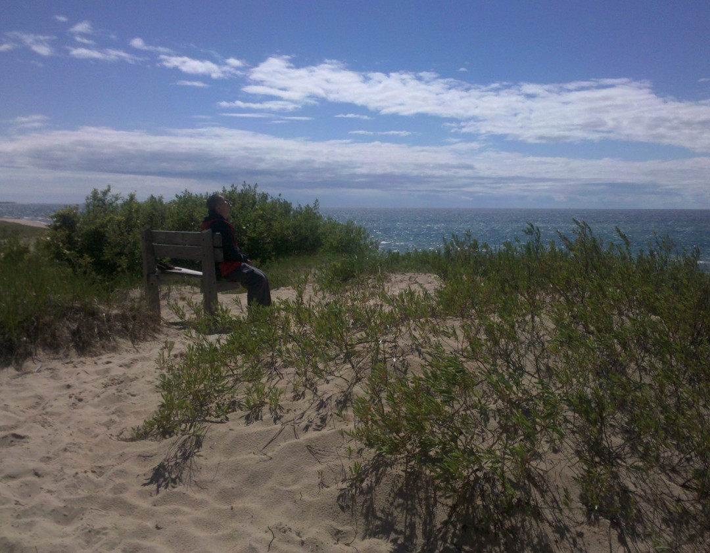

[Listen](audio/poetry-0101.mp3)

To slowly turn your life, into Art, 
small, is the best way to start.

Small means but tiny discomfort, 
at first, make your adventures very short.

You don't have to go out, all the way, 
let the sky, mountains, and sea invite you out to play.

And the call rarely ever comes from something big, 
it will be more like a fragrant breeze, or muddy shoes, or the snap of a twig.

Before you know it, you'll be packing up for Nordhouse Dunes, 
hoping to be the first to greet all the Fancy Raccoons.

  

## Bees At The Knees
### June 9th 2020, 9:50:18 pm EDT
<meta itemprop="dateCreated" datetime="2020-06-10T01:50:18.198Z">

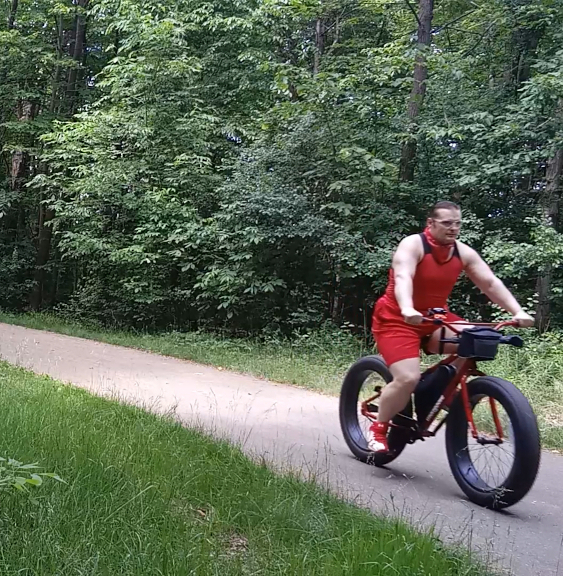

[Listen](audio/poetry-0100-2.mp3)

[Watch On YouTube](https://youtu.be/2ctbaoGvikk)

I sprayed myself with sunscreen today, 
grabbed my bicycle, and went on my way.

And then, 
all of a sudden!

I thought I was attacked by some angry bees, 
it turned out to be a mosquito who got me twice, in both knees.

To be fair, I wore my new short pants to be trendy, 
but the little sucker didn't need to get me where I am so bendy.

It itched all the way back home with each turn of the bicycle wheel, 
... it was indeed a very itchy ordeal.

When I finally got home, I took a vitamin, 
and on each knee; I squirted a bit of anti-histamine.

I sat there a bit, wondering "Why me?" 
"Why get me twice in each knee?"

To be honest, until I realized that's simply where my new pants ended, 
I was feeling pretty gosh darn offended.

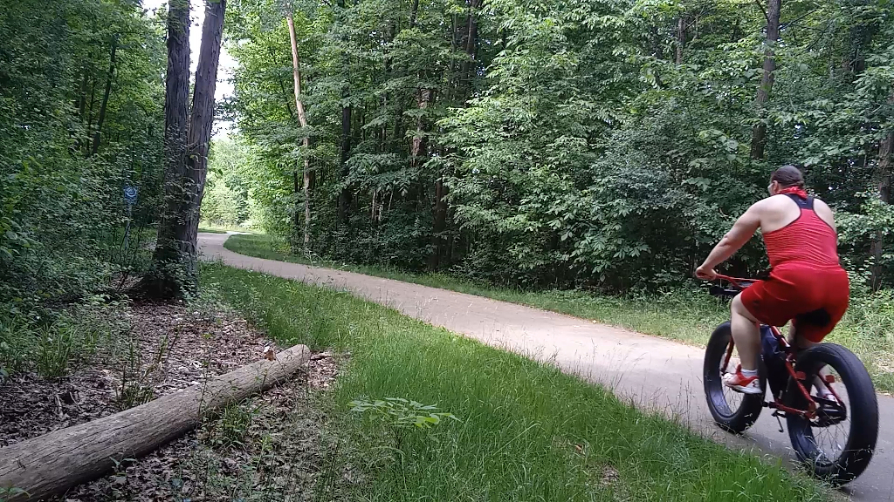

  

## Growing Up Is Sacred
### June 8th 2020, 9:19:03 pm EDT
<meta itemprop="dateCreated" datetime="2020-06-09T01:19:03.578Z">

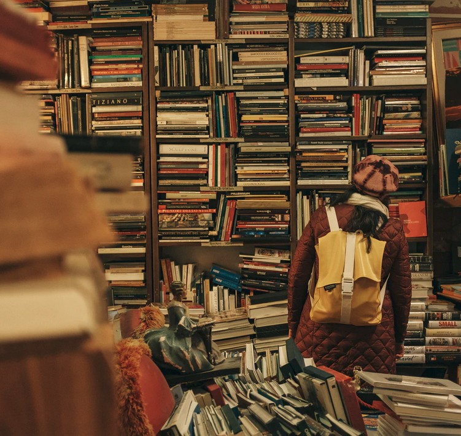

[Listen](audio/poetry-0099.mp3)

No one regrets becoming wise, 
no adult ever wished to stay a child.

All the grownups, 
embrace the powers they developed.

You can see it in the way 
they Nobly & Calmly carry themselves.

  

The time meant for your growing up, 
should not be disrupted in any way.

Growing up, 
is not as random as it seems.

Your own observations, 
will create questions.

Questions will sprout affinities, 
and affinities will draw you towards places with answers.

  

Growing up, begins with simple questions, and simple answers, 
but we amass a library of twisty little passages.

Later in life, 
we apply those passages other things.

  

We face the Universe, 
and there are consequences to all our actions.

What do we do when the bullies come? 
We learn to practice restraint, so that we don't end up the snarling beasts they are.

What do we do, when people belittle us, step on us? 
We expand our own sense of Dignity, and Nobility into an Independent Universe free of their flaws and limitations.

And how do we stand up against Isolation, or being Cast Away? 
With Unbreakability, Fortitude, Courage and Honor.

The meaning of life? 
The meaning of life is always found in Love.

And how do we learn to see and rise and better ourselves? 
With Insight; and Foresight; and Understanding; and Authenticity; and Heroism;

  

My Dear Friends,

Your growing up, 
is the very Formation of you.

This is not a process that anyone is allowed to interrupt, 
you are not allowed to have anybody step in your way.

It is like learning to walk, 
no one is allowed to push you to the ground.

I don't know if there is anything more sacred, 
than your growing up.

You must learn to push what is not important away, 
you must get comfortable with not following.

And you must stand your ground, or walk your path... 
You must, lead.

You must make sure that you rise a little higher each and every day, 
and that each day adds to the previous.

Growing Up Is Sacred, 
It Is Your Right.

  

## Suit of Armour
### June 7th 2020, 9:11:54 pm EDT
<meta itemprop="dateCreated" datetime="2020-06-08T01:11:54.737Z">

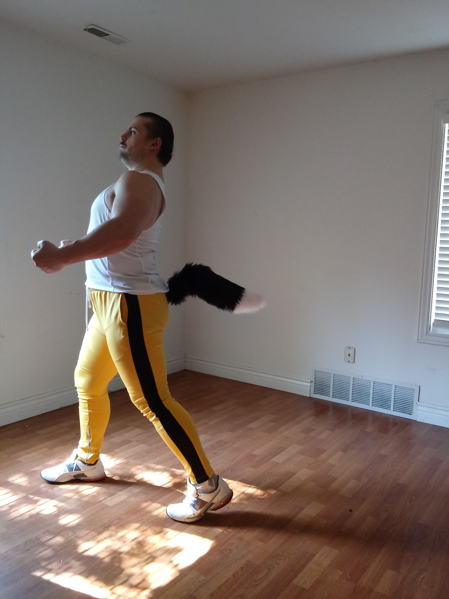

[Listen](audio/poetry-0098.mp3)

Take all that you are, 
and forge a suit of armor.

Paint, or sculpt, or cosplay, 
we are always all to human, but we are unique.

All your armor decorations, and Your medals of honor, 
will show you as you are.

  

Keep growing up, keep adding to your story, 
may your armor reflect the sun.

  

And let go of the Poker Face, 
that's not really You.

If you must, show everyone how Mighty you are, 
how Great and beautiful your Heart Is.

Keep growing up, book by book, 
poem by poem, art by art, and triumph, and failure.

Build a mountain of worn out running shoes, 
and torn up bodybuilding gloves.

Fill Coffee Shops and Galleries with you Art, 
with your Sculptures, or Music.

Let who you are protect you from misfortune, 
be authentic, always lead your own way, and never follow.

Show The Word, 
Who You Are.

  

## Questions
### June 7th 2020, 8:46:23 pm EDT
<meta itemprop="dateCreated" datetime="2020-06-08T00:46:23.735Z">

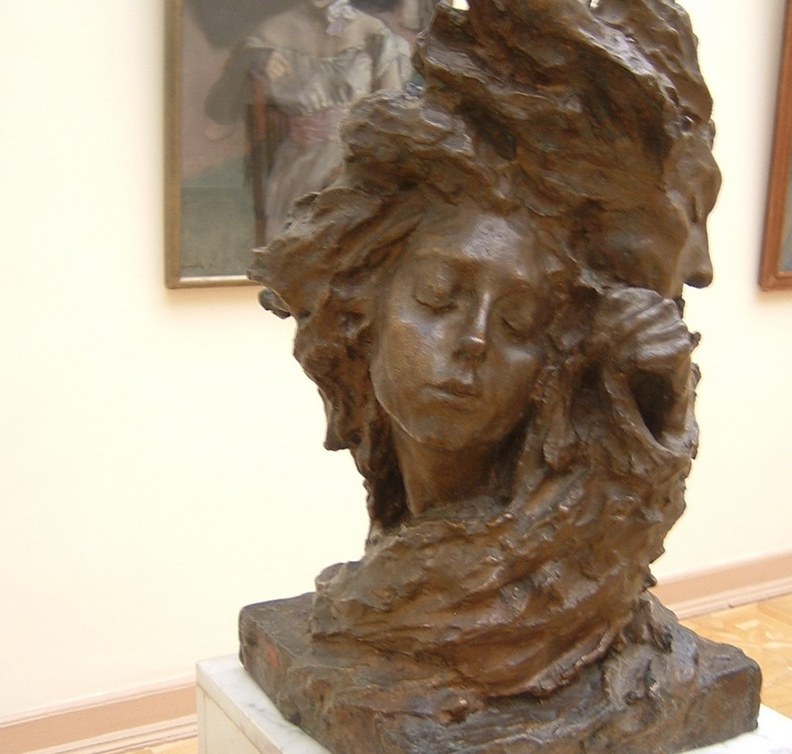

[Listen](audio/poetry-0097.mp3)

Where do we come from, and why are we here, 
are just silly questions.

While even silly questions lead to good things, 
they're not the primary questions we need to answer - like what makes us unique, and what do we love, and where are going to go, and what great mountains must we face.

We are here because there was no one to count the failed attempts, 
because the universe was running out of other paths.

There was no plan, 
there was just a progression forward.

Universally speaking, there is probably plenty of life out there, 
but what the Universe will never have, cannot build, is another You.

If someone tried to take your place,
it could never work, ever, at all.

In All This Complexity, 
You Are One And Only.

There will never be another you, 
ever.

It is because at a certain point, the Universe stops, and your ideas take over, 
you become the creator, you become a Youniverse within a Universe.

  

You are plenty special, but if you only move forward, 
you will not gain the capacity to fully share who you are.

The universe will know, that you are Majestic, and Adventurous, 
and sometimes, Mischievous. But we need more of you!

We need Your Sculptures! 
We need Your Poetry! 
We Need Your Works,

So that we may learn, 
and maybe continue your work.

We Have Questions,

And you are the only one with your answers, 
so grow up already, build up, create and share your wisdom.

The Wisdom you will gain from your Pursuits of Excellence, 
will be unlike anything else the Universe has ever seen before.

You will speak in your own pictures, with your personal touch, 
and the words you love, and above all the Paths You Took.

With Your Help and Works,

Humanity will become Wiser, 
and more beautiful.

Help Us See.

Public Domain image of [The Mist, (1899 Sculpture)](https://en.wikipedia.org/wiki/Anna_Golubkina#/media/File:Golubkina_Fog.JPG) by [Anna Golubkina (1864-1927)](https://en.wikipedia.org/wiki/Anna_Golubkina).

  

## Not Merely Forward, But Up
### June 7th 2020, 8:12:34 pm EDT
<meta itemprop="dateCreated" datetime="2020-06-08T00:12:34.915Z">

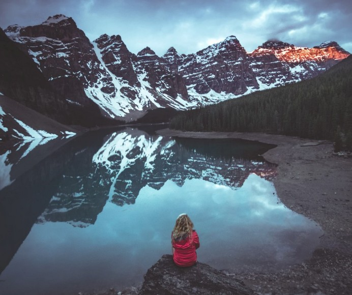

[Listen](audio/poetry-0096.mp3)

Don't just move forward, 
you have to move up!

Life is too short, 
You are too Noble, 
Truth is too Dear.

Many give away their Time, 
some even give away Trust.

Sometimes, because they are tired, 
because they had enough, 
or had waited long enough.

Giving something of yourself away, 
will not make that other person Nobler.

And you are not supposed to wait, 
in waiting all your life will pass you by.

  

You are supposed to learn, 
you are supposed to move, 
you are supposed to shine.

  

You will lose your mind if you do noting, 
and You will lose your self, unless you grow up.

You'll never lose the ability to turn around, 
and try again, it maybe harder if you wait too long...

... but in your waiting, 
you'll become tougher too.

No, there is no point of no return, 
but all those who rise, would agree:

"Do it sooner than later".

  

Begin, by taking back what you have given away, 
and permanently and meaningfully so, and rise up.

There is no art to this, 
you just pick yourself up, and go.

You're going to need running shoes, 
and your first battle will be with Fatigue.

Be good to yourself, 
strive to be better, 
let your body rest enough so it may grow stronger.

And return to point Zero, 
go all the way back.

Of all the noble things within You, 
not a single thing is to be shared unearned.

And listen carefully, to the words spoken to you, 
by inference re-construct that which drives others.

And find the Kindred, and the Kin, 
do not be alone for too long.

Isolation is as bad as Fatigue, 
it is a state of having fallen, and being lost.

You are To Thrive, 
You are To Grow.

  

Keep searching, keep training, 
stay away from hate, and those who fell behind on growing up.

Keep learning, 
keep moving, 
let yourself shine.

  

Nothing important in life is found at the foothills, 
you have to get to the mountains, and carry on climbing.

Do not stop, 
and keep moving up.

  

As to what it is all for, 
it is to better yourself.

To rise above yourself to new thoughts, 
and powers, and insights, and observations.

If you stay at the foothills, 
you will never really know who you truly are.

Never know the extent of your Might, 
your Unbrekability, your Blinding Light.

If you stay down, 
you will blend with all the new people coming and going.

You'll never be known, never be recognized, 
you may even become forgotten, your judgment clouded.

It will be hard to recognize, 
the Kindred from the Foe.

  

You must rise up, and find your self, 
so that you may be seen for the Brilliant Being that really are.

  

Help us learn from you, 
from what you have been through, 
from your Great Battles and Works,

If you hide, 
the Universe will become darker for it.

We need your light.

  

## Never Knowing You Are To Rise
### June 6th 2020, 6:36:10 pm EDT
<meta itemprop="dateCreated" datetime="2020-06-06T22:36:10.414Z">

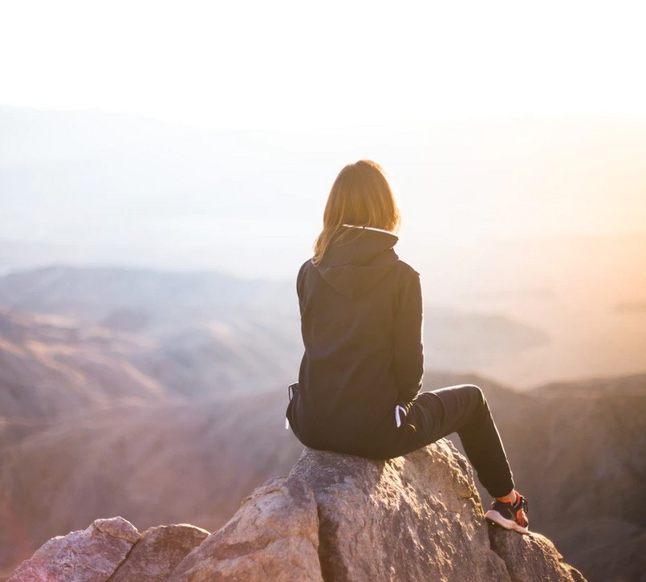

[Listen](audio/poetry-0095.mp3)

It is a pretty dark trick, 
and it makes life run out all too quick.

If all were to be tricked to break the link, 
that they can't climb on giants to think;

And all became mere muscle and bone, 
humanity would fade in vain, with a deathly moan.

  

We have to remind each other, so that we don't forget, 
or we will fade, without feeling a hint of regret.

You are meant to become a Great Being, 
you are finely crafted for the Art of Seeing.

With your unstoppable sight, 
as your greatest might...

You can understand anything, 
and rise higher than any king, 
it is your right!

  

You are meant to rise, at least to the status of a Hero, 
keep people from running themselves into a zero.

That power is in each and every one of us, 
and we must be Noble and Wise, 
so that no one can stop us.

Know with certainty that it is always Spring Season, 
to stand up for Truth & Reason.

Know that Truth and Beauty is always right, 
and yours, is that Power and Might.

  

## Don't Let Anybody Push You Around
### June 6th 2020, 6:19:10 pm EDT
<meta itemprop="dateCreated" datetime="2020-06-06T22:19:10.300Z">

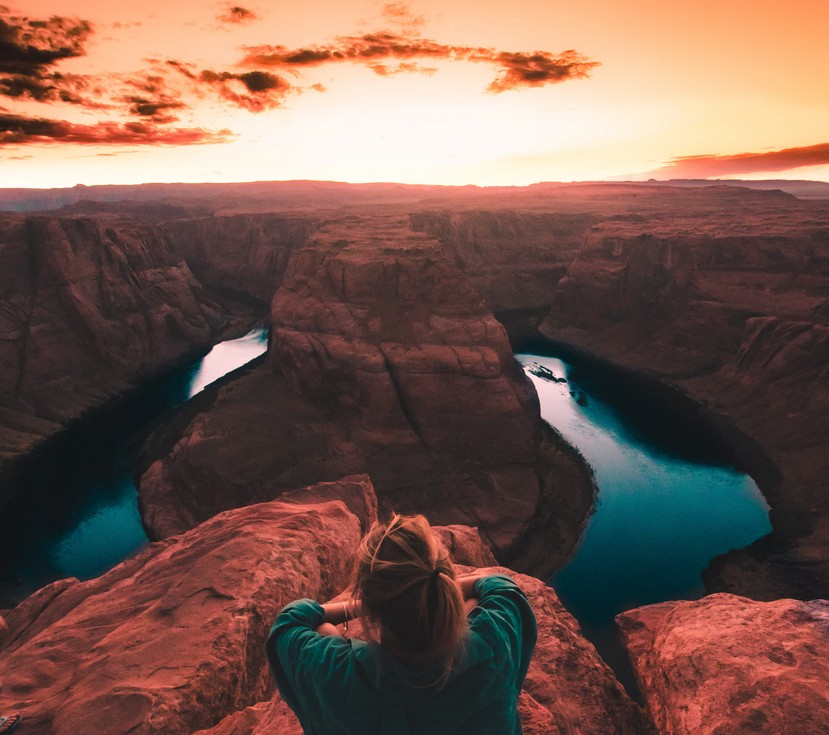

[Listen](audio/poetry-0094-2.mp3)

My Friends, liars happen, because it is easiest to live on the low, 
and never rise, and just hide in the status quo.

That's why we often run into a trouble maker, 
it takes no effort to be a faker.

Leave them, to their own stupid little prison, 
in their web of lies, there cannot be any reason.

  

That's our first shaky step in life, 
to lean to see who's hiding a knife.

And then cutting with a sword, 
and setting ourselves free to move onward.

  

I promise You, it gets better after this, 
the sun will rise, life will become bliss.

With each step we take we find more light, 
and baby-step by baby-step, add to our might.

It is as simple as the math of standing-still versus learning, 
one goes nowhere, and the other eventually fulfills all yearning.

  

Walk Your path, don't let the fakers sway You, 
look them in the eyes, and see right through.

Choose the real over the fantasy they sell, 
and move away from their stupid little hell.

And if someone ever comes pushing You around, 
use the might of Your wisdom to push them back, and stand Your ground.

  

There are so many sweet little treasures within You, 
the one You start with will show You heights You never knew.

And the higher You rise the more brightly You will glow, 
and You'll find Your Sweetheart, before You know.

Life is meant to be lived in Wisdom and Happiness and Laughter, 
Heaven is Right Now - not in some fantasy of after.

  

All the things that are worthy of the Beautiful You, 
will never extract a toll, they will only ever add unto You.

Nobody worthy of You could ever make You feel sad or bad, 
they will foolishly trot and prance to Your rescue, until You feel glad.

Don't let fakers trick You into thinking the world is blue, 
The sun, is right over the next mountain, and is already shining for You.

  

## The Trainer
### June 5th 2020, 11:32:12 pm EDT
<meta itemprop="dateCreated" datetime="2020-06-06T03:32:12.757Z">

[Listen](audio/poetry-0093.mp3)

See Companion Chapter in [The Warrior](https://westland-valhalla.github.io/warrior/the-trainer.html)

Take two steps forward, 
and one step back, Jack.

Jogging is an art, 
and for art you must be smart.

For each two days of training, 
on the third you must pretend it's raining.

If you you can't make it rain, 
always worrying about your gain;

then walking is just fine, 
But, never cross that little line.

The third day is a day of rest, 
and the fourth your next test.

Because, you always have to go back, 
and start anew to lay down your track.

  

## Wise World
### June 4th 2020, 8:44:16 pm EDT
<meta itemprop="dateCreated" datetime="2020-06-05T00:44:16.895Z">

[Listen](audio/poetry-0092.mp3)

Don't take shortcuts, 
all shortcuts end abruptly.

You can't pretend, 
what you pretend, can't ever become real.

A life without Authenticity, 
will forever feel like chaos.

  

You have no choice, but to Rise, 
to Emerge, in Majestic Authenticity.

To build and reinforce your Content of Character, 
to pursue Wisdom and Excellence.

To Be You. 
To Feel Meaning.

  

Growing Up has always been a Great Challenge. 
it has never been easy.

Growing Up is the first, and foremost, and most important, 
and should life crumble, you will rebuild.

  

Don't worry, you are not wasting time Growing Up, 
it matters not how you step forward, just that you do.

The result is the same, Content of Character, Strength, 
Joy, Love, Happiness, Adventure, and Foolishness, 
to name a few.

  

Not only is this the only way to live, 
but it is also the only way for the World to Learn.

Humans cannot be led outside in, 
they must be taught to lead, inside out.

The recipe for your own Growing Up, 
is also the recipe for a Wise World.

  

## Be Good To Your Elder Self
### June 3rd 2020, 11:07:48 pm EDT
<meta itemprop="dateCreated" datetime="2020-06-04T03:07:48.407Z">

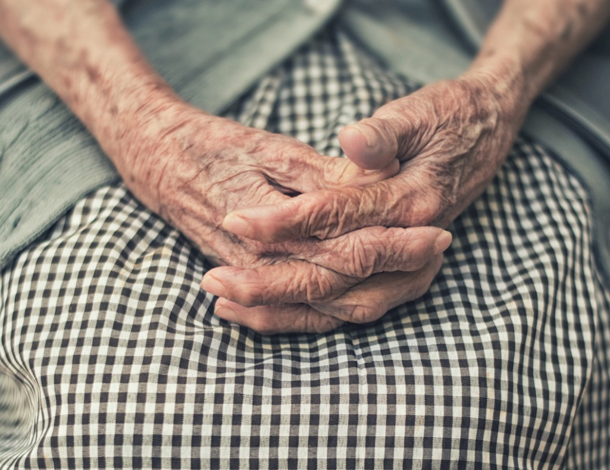

[Listen](audio/poetry-0091.mp3)

Your light must be a true reflection of Yourself, 
so that You may be truly seen and understood.

Do not hide, emulate, simulate, pretend, or serve; 
that only disrupts Your light and path.

You are already special enough, 
You are a Child of The Universe.

You are meant to become a Great Being through your own journey, 
You are meant to bring enlightenment, unseen before.

  

Please, take good care of Yourself, 
You are responsible for Your delicate mind and body.

And take care of Your Elder Self, 
so that You may have no regrets come Your Golden Age.

  

Your Existence, requires that You walk Your own path, 
that You lead Your own way.

But the path is not a straight line, 
it is more of a flat spiral, you are never far from yourself.

There is so much of You in Your Elder Self, 
and there is so much of Your Elder self in You already.

  

Be good to Her, love Yourself, 
be mighty, and authentic.

Never let Yourself down, always rise, 
and do not slow down.

Step after step jog mightily forward, 
decorate Your Beautiful Journey with Wisdom and Triumph.

  

May Your elder self, perch upon a porch, 
and muse and wonder...

"What a strange Star Child I was, 
and how impossibly long my Beautiful Life"

And may You bring Her memories, 
of every year in each decade.

Of things You noticed for the first time, 
and things You never knew could happen.

And things, that other people never expected of You, 
like that year, that you wore a bushy tail - because it made you feel beautiful.

  

Love Your older self, 
make Her smile and wonder.

Make Her love the Younger You, 
but fill in all the years completely.

Make sure, that not only is there nothing new to add, 
but also that there is nowhere anything could fit.

  

## Youniverse Entropie
### June 2nd 2020, 7:00:01 pm EDT
<meta itemprop="dateCreated" datetime="2020-06-02T23:00:01.894Z">

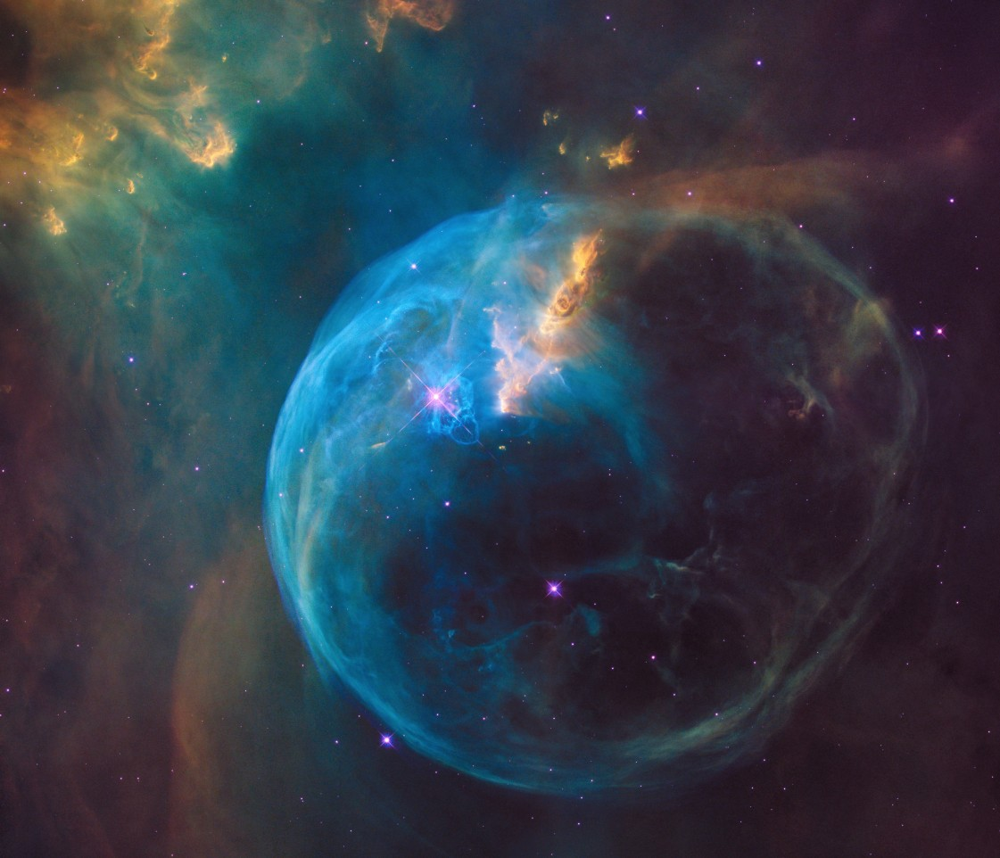

[Listen](audio/poetry-0090.mp3)

We have an aversion to being trapped, 
because of an innate sense of distance that we must travel.

The distance begins the moment we gain self-awareness, 
the end, does not matter - only the distance does.

  

You are in charge of the direction of your journey, 
if you let it lead you, it will pull you in all directions.

In letting the life dictate, 
you will become divided.

  

In doing the dictating, 
you, will set the aim.

If you let yourself become a leader, 
you will arrive at a singe destination.

  

In one way, or another, 
you will, without a doubt, arrive.

The Universe, cannot stop what you start, 
the Universe will gently let your existence expand.

  

It is tough to be led and expect clarity, 
there will be too much noise from following.

But in leading, there is no noise, 
the path is pure, as pure as your imagination.

  

The steps along your journey, 
extract a price.

The Universe smiles, 
as you pay your way.

  

You start as a child, 
and the first step is very difficult.

And the second, and fourth grade, 
and sixth semester, and eighth book.

  

Your singular ripple, 
unlike everything else out in the Universe;

Has a breathtaking order dictated from within, 
not pushed by the chaos, but dictated by your mind.

  

Can you imagine how boring chaos becomes, 
and can you see how beautiful your perfect ripple.

The edge of chaos that surrounds your beauty, 
is pushed out by a kind, of Youniverse.

  

Let me be clear, 
you are not a river, nor a snowball, or a butterfly's wing.

There is enough of those, already, 
nothing worthy of you, needs you to follow.

  

It is a Law of The Universe, 
that no Human should follow.

A river should flows surely to the sea, 
but a Human, is meant to Lead.

  

It is a simple but forgotten lesson, 
it is meant to sit next to; Love of Wisdom.

That no human should serve nor follow, 
non should practice resignation.

  

If you feel weak, 
it is because you resigned for too long.

And you will have to start in the beginning, 
and your first step will be very difficult.

  

## Your Superpowers
### June 1st 2020, 9:51:09 pm EDT
<meta itemprop="dateCreated" datetime="2020-06-02T01:51:09.800Z">

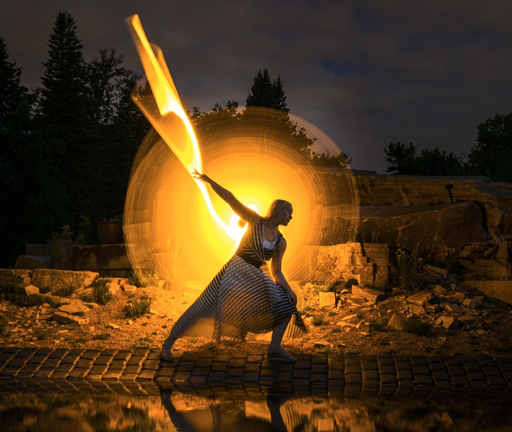

[Listen](audio/poetry-0089.mp3)

Your superpowers are not rooted in your wishes, 
as only very few wishes come true.

Universe has already established its rule and order, 
we are latecomers to the Symphony Orchestra.

Instead, seek your superpowers in what you already own, 
in the things that have already sprung.

In the incredible adaptability of your body, 
in your raw, unleashed consciousness.

If you are good to your body, you body will flourish, 
it is a biological system, not that different from a flower.

If you are good to your mind, it will expand, 
it is a navigational system with landmarks.

Your mind is especially beautiful, 
it has a large memory capacity.

You can't recall letters on a particular page in a book, 
but you can recall the walls in your home, the streets in your city.

Your mind does not differentiate between navigating a road, 
or a vast galaxy of star constellations.

Your mind can encode interconnected knowledge, 
so as long as it is marked with pictures and relative locations on a well connected tree.

  

It is foolish to think to a particular page, 
and feel ordinary for not being able to recall all the words.

It is foolish to try to ride a boat, 
on a road.

  

Do not seek to invent your superpowers, 
instead, recognize the ones you already have - and expand them.

  

## Do Not Follow, My Friends
### May 31st 2020, 10:31:13 pm EDT
<meta itemprop="dateCreated" datetime="2020-06-01T02:31:13.652Z">

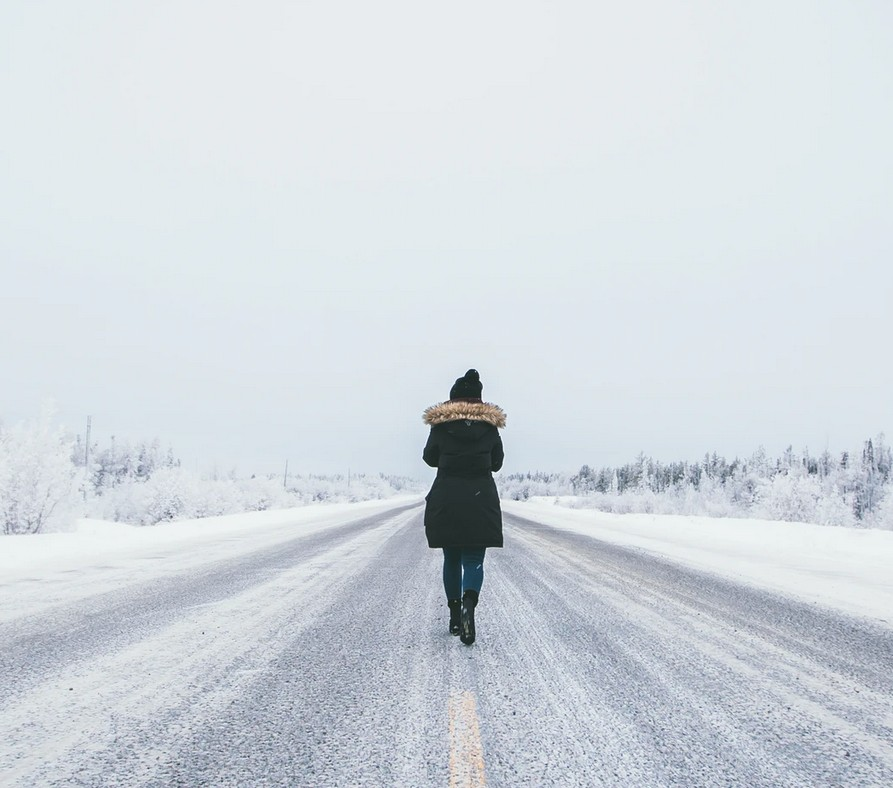

[Listen](audio/poetry-0088.mp3)

Your Lifeline - the cumulative choices you made that affected your entire life, 
must be precisely aligned to match who you are, so that you may learn.

This is not an easy thing, 
but there can be no other.

  

We live in a world under constant erosion from Poverty, 
Authenticity is a difficult path.

Stay safe, love yourself,
but you must also stand your ground.

  

What life is pressing you into, 
and the path that you must be on for your wisdom sake;

Are likely to be some distance apart, 
this is the tragedy of our modern age.

The complexity of life, will be pushing you away, 
from the line you need to walk to learn and become wise.

  

The path that life is trying to press you into, 
is almost truly random, it comes out of misery and chance.

The path mere life dictates includes lies and manipulations that you can't see at first, 
people will use your innocence against you, to make their lives simpler.

When you follow, you fall into cogs of ravenous emergent machinery, 
and this machinery exists, because, followers gather.

  

My Dear Friends, if you must, 
then know that there is but one you serve.

The Wisest You, The Best You, The Most Brilliant You, 
at the Greatest Age of Your Life, Your Golden Age of Wisdom.

  

The path that mere life dictates, is a melody out of tune, 
you become a piano key, and life will keep pushing, non-stop.

  

But the path you dictate, is very unusual in deed, 
because each step you take, adds to the previous.

And with only a few steps, 
you are stepping higher, you are already building, up.

That is the same "up", that "Grow Up" uses, 
your own step, followed by you own step, forward and up.

  

If you dare to throw caution into the wind, 
it will bring you wisdom - you'll see.

But other than that, like a cat, 
walk cautiously onward.

  

When things start adding up, 
you will surpass your younger self.

And now, where you used to think: "And where am I actually going?", 
you will see a road ahead, by subtle analogy to the road you've already traveled.

Where once you toyed with the question of "Who am I?", 
you will now, see you.

  

You'll make little mistakes, and that is OK, 
because you will have your path to fall back on.

And those mistaken tangents, will cradle you, 
they will add, and refine your decision-making.

When you walk your own path, 
you do not make big mistakes.

The little ones will teach about the bigger ones, 
by subtle analogy.

Your own path, 
is a great teacher.

  

So what is it like, 
on that path?

I am very sorry to say, it is lonely, 
but loneliness is correct.

Not until you find your other half, 
will loneliness let go of you.

It is there to remind you, 
that you can only make it half-way on your own.

Your own path, 
is above all; clear.

There are no excuses, 
nothing to sway you.

The air is crisp, 
there is no smog.

Just, 
a clear vision.

Even without any guarantees in life, 
you will become stronger.

But, yes - no matter how beautiful you become, 
Universe will do nothing to guarantee you, anything.

This, 
is the Leap of Faith.

And the faith, 
is in Your Greater Self.

  

Walk your own path, because in the first half of your life, 
your own path is the only thing that can add to you.

Authenticity, is a law of the Universe, 
it follows similar principles.

Walk your own path, 
and expand.

  

The first steps are always clumsy, 
I went to the museums.

A coffee shop is a bad idea, 
because everyone is there.

But a museum is different, 
it filters for kindness, somehow.

I went to the D.I.A 
I was extremely lucky.

They were showing,
Auguste Rodin's work.

I understood it immediately, the secret of sculpture, 
is to enlarge that part that holds the soul.

At the end, 
they had The Waltz (possibly a large replica as it had more detail, this was some 13 years ago), that dancing couple by [Camille Claudel](https://en.wikipedia.org/wiki/Camille_Claudel).

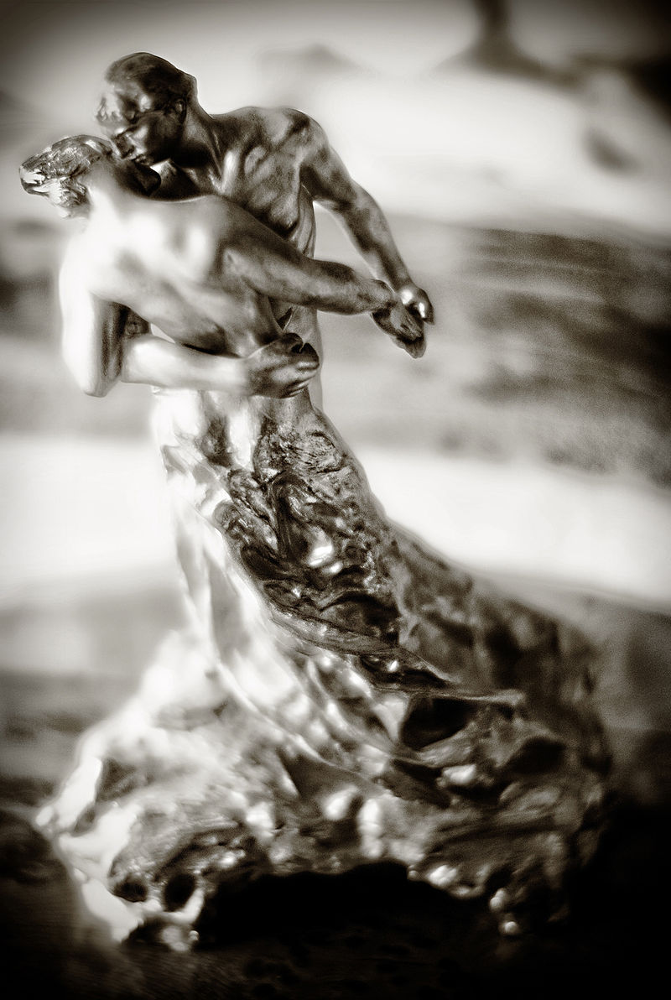

I started crying, 
her hand, had so much feeling in that gentle arch, there was so much touch.

That is life, 
that is the path.

The path, where you cry out of beauty, 
and not cry out of being lost.

  

And you have to create art, 
art is about training yourself for success.

Learning,
by subtle analogy.

That's why you never finish, 
there is no time for the art it self.

There is only time, 
for learning life.

Learning by subtle analogy, 
to the smaller Triumph, and Success.

Stick to a single subject, 
until you fill it completely.

Now you can hang it up at the coffee shop, 
but keep moving forward.

  

Do not Follow, My Friends, 
there is nothing there to be found.

Nothing you find when you follow, 
will add together to make a whole.

When it feels like you are surrounded by paths, 
and there is nowhere to go, or you can't go into enough places.

That is an illusion, 
all those paths are false.

Turn around, 
slow down.

Go back to the last thing that _moved_ you, 
and fearlessly resume at that point.

The world may shake and shudder, 
and there will be "Why?", and "How could you?", and "What is going on?".

All those cries, 
are for the person that follows.

Each asking you to a different path,
and all those paths are mutually incompatible.

Do you see, 
life wants you to merely be.

But you _can_ be more, 
you don't have to call it Growing Up, Courage, Authenticity or Growing Content of Character.

Call it, and appointment at D.I.A. 
call it, a meeting at the UofM Museum of Natural History.

Begin keeping a Moleskine Journal, 
use a pencil, 
only draw what your heart sees, 
and write as little as possible, 
write to your older self, 
explain to her why?

Find your center, 
find your balance.

Lean on your Nucleus, 
and push off to take your steps in your own direction.

  

Calm your hand, 
slow your time.

There are decades ahead, 
and you have to be seen.

Show yourself, 
create future.

  

What others have, may shine, 
but is not always gold they keep.

The younger we are, 
the less wisdom we hold;

The less wisdom, 
the more questions we should answer.

And questions combined with life, 
make for a busy time in deed.

So slow down, 
answer your questions - first.

  

All life is sacred, 
all Lifelines equally matter.

But not all will arrive at their Golden Age of Wisdom, 
without regrets.

So, please, 
ask your older self what her regrets are.

And the higher you grow, the more you know, and which is more, 
the more in harmony with your older-self, you'll be.

  

## Caturday Run
### May 30th 2020, 6:52:41 pm EDT
<meta itemprop="dateCreated" datetime="2020-05-30T22:52:41.983Z">

[Listen](audio/poetry-0087.mp3)

Waiting for the sun to inch down, 
before I go out in the town.

My legs have become like two huge potatoes, 
but that's life, that's how it goes.

  

There are so many lovely people that notice me out there, 
yesterday a cute couple, lady with fancy hair.

A couple of days ago, a gent from the gym, 
slowly walking and wondering "Is that him?"

Oh yeah, that was me! I shaved my mustache, 
and taught my self to dash.

Sure I run at the speed of a sickly gastropod, 
but after my gym-dancing, don't even feel odd.

  

And before that, the ladies in the Jeep, 
I didn't wave back, I am sorry, I was in the middle of a huge leap.

And then the first person to notice me in my sluggish swim, 
might have been the Trainer! from the gym.

I was really tired in the middle of my early run, 
muttering "I can't believe I have to run the same distance, before I am done."

And then I heard "Hi! Andre!" and I instantly regained my strength, 
I could have run five times that length.

  

Sure, I am still learning, running tests and trails, 
but my aim is one hour, to do the whole five miles.

And you know what, just after two weeks, 
I run a lot faster; and I have rosy cheeks!

  

## All Of Us Or None
### May 29th 2020, 5:51:08 pm EDT
<meta itemprop="dateCreated" datetime="2020-05-29T21:51:08.061Z">

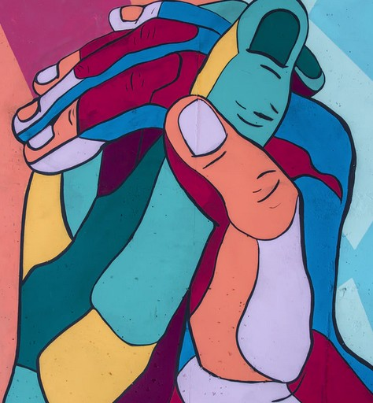

[Listen](audio/poetry-0086.mp3)

Our minds constantly construct boundaries, 
and constantly try to make us comfortable.

But in an evolved world this works against us, 
it creates boundaries across which we hope to discharge pain.

The source of the pain is poverty, poverty of mind and wallet, 
fear, pain, unfairness and inequality, add to the blindness.

There is no solution on the level where poverty reins, 
it will always be walls turning people against each other.

We are not ready for the next level, 
in the next level we recognize poverty as a virus.

We see it as a Natural Disaster, 
we sit back, relax, calm down, print enough money to end it and move on.

This does not mean everyone is going to be rich, 
it only means, nobody will be stuck in financial poverty.

Poverty of mind, the other half of poverty is not even up for discussion, 
not until everyone has a safe home.

All of this seems impossible, to many laughable, 
irrational, infantile, unfair even.

For those of you who don't understand how someone could possibly call this unfair, 
some will angrily yell "Why should someone get a free home, when I worked for mine, my entire life?".

  

This is the Nature of the Walls, 
the picture of the great divide.

A divide between who we are today, 
and who we should be tomorrow.

  

A Human Being is so special, 
that they may not exist without their own Home, not just a house.

So special, that active countermeasures must be put in place, 
to help people move away from bad ideas.

A Human Being is so special, that they must never grow up in fear, 
that they must never be lied to, never manipulated.

They must never be pressured, never become stressed or depressed, 
minds are delicate and must be protected.

  

We can't see that, because the walls are invisible, 
we often can't see that with which we grow up with.

Emboldened we dare to hold up our opinion, 
as if it was on par with a Great Being's carefully observed fact, or wisdom.

  

Crushed, stressed, pressured, tired, 
we temporarily lose our mind.

The thing that makes Humans Special, 
can be turned off by tiredness and stress.

And our brains go into Stupid Mode, 
A versus B, A lesser/better B.

And it seems like we are still operating, 
but that's just an illusion, that not us, at all.

  

I don't know how long it will take us to see how special we are, 
how many gaps need to be crossed, or how many upgrades our Cultures need.

I know that divided, the generations will always fight across pointless walls, 
and I know that without unity, the world will not progress.

  

The children are watching, 
they are always watching.

They will emulate what they see, 
they will accept it as reality.

They will add to the invisible walls, 
and dismiss others to discharge pain, or stress.

  

We can't have a discussion about any of this, 
until stress of poverty is out of the picture.

It will be one of the Humanity's greatest achievements, 
to help everyone wake up to a home, with enough food, and a world that cares.

Until that moment comes, 
we can't have a conversation with all.

Whether we are ready to know it, or not, 
the way the world grows... it's either all of us, on none.

  

## My Little Day
### May 28th 2020, 9:19:47 pm EDT
<meta itemprop="dateCreated" datetime="2020-05-29T01:19:47.917Z">

[Listen](audio/poetry-0085.mp3)

Today was my day of rest, 
and then I went jogging to run another test.

I got really tired after my run, 
but I said "Not until I write my poem, will I be done."

  

Earlier I wrote a little programs to [make art](https://github.com/fantasyui-com/mockup) 
overall it was a really good start.

I woke up at six in the morning, 
and jumped out of bed without a warning.

  

Now the hour nears eleven, 
getting into my bed will feel like heaven.

I am not sure how I feel about staying up late to write my rhyme, 
but there is something sweet about writing just before bed time.

  

## Loomings, from The Whale by Herman Melville
### May 27th 2020, 10:23:32 pm EDT
<meta itemprop="dateCreated" datetime="2020-05-28T02:23:32.589Z">

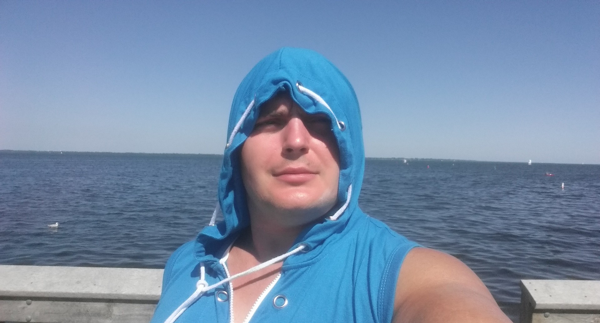

[Listen](audio/poetry-0084.mp3)

Call me Ishmael.

Some years ago—never mind how long precisely—having
little or no money in my purse, and nothing particular to interest me
on shore, I thought I would sail about a little and see the watery part
of the world. It is a way I have of driving off the spleen and
regulating the circulation.

Whenever I find myself growing grim about
the mouth; whenever it is a damp, drizzly November in my soul; whenever
I find myself involuntarily pausing before coffin warehouses, and
bringing up the rear of every funeral I meet; and especially whenever
my hypos get such an upper hand of me, that it requires a strong moral
principle to prevent me from deliberately stepping into the street, and
methodically knocking people’s hats off—then, I account it high time to
get to sea as soon as I can.

This is my substitute for pistol and ball.
With a philosophical flourish Cato throws himself upon his sword; I
quietly take to the ship. There is nothing surprising in this. If they
but knew it, almost all men in their degree, some time or other,
cherish very nearly the same feelings towards the ocean with me.

[Moby Dick, or The Whale A BBC Radio Classic Drama](https://www.youtube.com/watch?v=782PEqyjvzI)

[Moby Dick; The Whale by Herman Melville Audiobook on Librivox](https://www.gutenberg.org/ebooks/2701)

[Moby Dick; The Whale by Herman Melville on Project Gutenberg](https://www.gutenberg.org/ebooks/2701)

  

## Uh Oh
### May 27th 2020, 8:59:04 pm EDT
<meta itemprop="dateCreated" datetime="2020-05-28T00:59:04.633Z">

[Listen](audio/poetry-0083.mp3)

I've been sitting here for half an hour, 
trying to conjure up my poetic power.

But nothing seems to be coming out, 
I think I am going through a poetic drought.

I guess this happens every once in a while, 
so it is not a reason not to smile.

But I thought I was already better than that, 
I felt like the world's most poetic cat.

Now I struggle to come up with the next line, 
though I promise not to whine.

Maybe, there is way to break through by block, 
perhaps I should stop staring at the clock.

Oh yes, this worked, I feel much better meow! 
I remembered every word, wow!

Wig, pig, pear, bear, sled, bed, boat, goat, 
top, mop, wall, ball, duck, truck, mouse house, and blouse.

And what a story that would rhyme, 
had I not ran out of time.

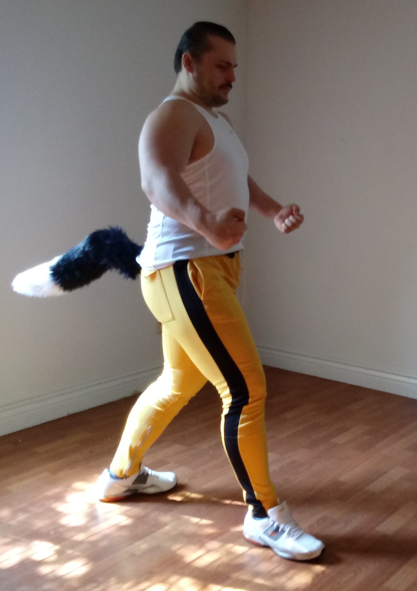

  

## Tolerance of Negativity
### May 26th 2020, 6:10:52 pm EDT
<meta itemprop="dateCreated" datetime="2020-05-26T22:10:52.333Z">

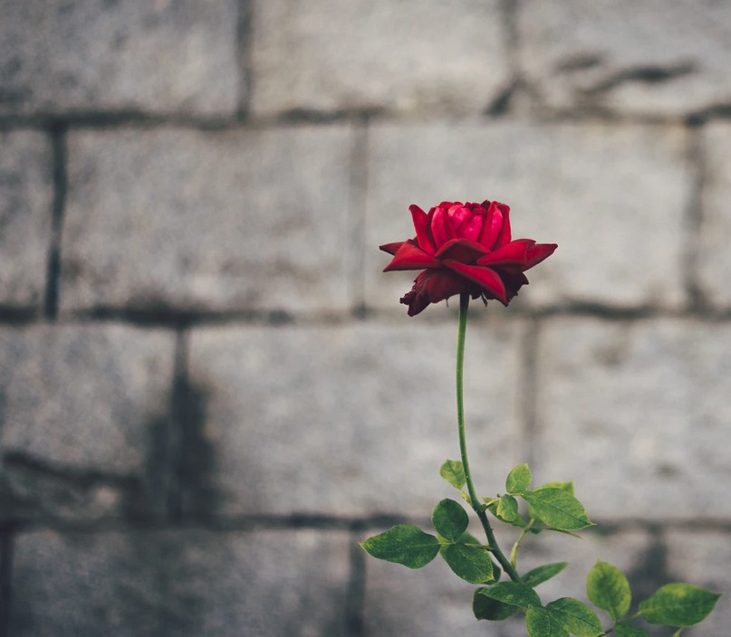

[Listen](audio/poetry-0082.mp3)

Not Until This, Not Until That 
Don't let anybody push you around,

If you allow negativity towards you for long enough, 
it will make you very ill.

Tolerance of negativity will push you to cross lines, 
it will derail you the same way that lies derail liars.

It is like the lines that addicts cross, 
until there is no way to come back.

  

Take a look into the mind of the person negative towards you, 
do they even see you as a person?

If their ultimate aim is not to rob you of yourself to turn you into a tool, 
then are you not some disposable mean to their shortcuts.

Nothing is found in servitude, it won't make you stronger, 
it won't make you nobler, or enlightened, or worthy.

Protect your mind, reject being pushed around, 
stand up, rise, do not follow, no one has any control over you.

  

You become Stronger when you rise, 
when you put your feet down on the ground, and push up - to the mountains.

You become Nobler when you break away, 
when you let go of those ahead of you, and take your own path to the side.

You become Wise and Enlightened when you stand your ground Memoirs in hand, 
when you learn from the lessons on your own path, and by subtle analogy to other paths.

You become Worthy, of Yourself, of Love, of Wisdom, of a house you can call Home, 
when you grow protecting who you are, onward to becoming the best You.

  

Do not be scared, because if you stay scared, nothing will change, 
do not let sadness keep you in bed, go to the library first.

Do not let the sick thick stickiness to keep you bound, 
most of it is illusion, including the few pleasures you found.

Do net let alligator tears, and hollow souls void of any content howl you back, 
you are not part of that world, you never were.

Do not go slowly wandering down their own paths, that's how _they_ were created, 
and you can still reject that agony and become free.

  

Look to the best within you, your Beautiful Treasures, 
your Innocence, your Sweetness, your Love, your Cuteness, your Generosity, your Might, your Endurance.

Those are powerful treasures meant to help you become a Great Being, 
treasures that they have forsaken in their own selves.

Now they are trying to forsaken your own treasures, to fuhrer the dark path they dig, 
do not let them take what is irreplaceable within you.

You cannot aid them in any way, that can only feed their evil, 
and take away from your Beautiful Treasures.

  

Let the world see you, read at the Library, visit Museums and Art Galleries, 
go see someone singing with their beautiful voice.

Write in your journal, record on your phone, sharpen your pencil, 
use tracing paper to learn how to draw.

Step after step courageously walk down the isles to get your first air dry clay, 
and sculpt, sculpt your world, and touch, and feeling, show the world.

Do not hide, reject the bad, and shine among the crowds, 
do not let your older-self cry that you were never seen.

  

## We Grow To No End
### May 25th 2020, 8:17:07 pm EDT
<meta itemprop="dateCreated" datetime="2020-05-26T00:17:07.327Z">

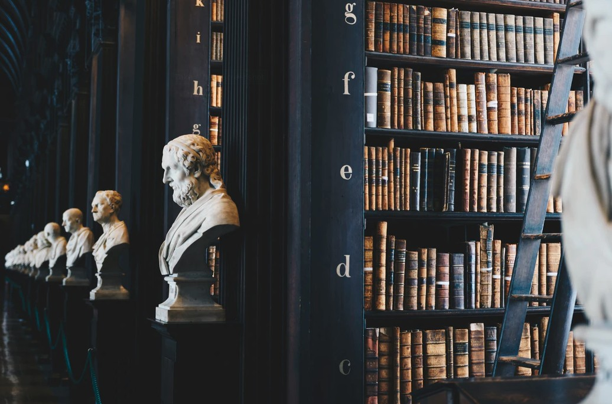

[Listen](audio/poetry-0081.mp3)

Philosophy, and her Daughters the Sciences, are a way to put ourselves to words, 
they are a means of storage, transfer, and communication.

Philosophy is a thin outer layer of the Human Mind, 
of the Human Condition, of the Raw, Unleashed, Human Consciousness.

Within, Rises The Human, 
The Source of Raw.

  

The only flaw, 
is us becoming convinced we are small.

That's why we have each other, 
I remind you, you remind your granddaughter, she reminds those in need.

  

And the Triumph continues, 
The Triumph, is an unbroken line through the past.

Like an eraser it runs over nations that take freedom, 
wiping out corrupt politicians for the specks of dust they are.

It a bone shaking scream it runs through the blind judge, 
it strikes nightmares in those who treat men as animal.

It pierces the hearts of animals that recruit unprepared kids to teach them how to become "men" in war, 
it carves, the predatory weapon manufactures that turned air to acid for a profit.

It strikes right through the slavers burning them to dust, 
the lawless beg in their last moments as the village heroes rise.

And the wolves run and hide under our very own blankets, 
made of the snarling bear skins from last week.

  

History of the Human Kind, 
will always be writ and washed by prevalent powers.

But that will always be a surface story, 
because in the face of the future the truth is always revealed.

You are easily capable of becoming countless times more, 
than the heroes described in the books.

By subtle analogy to whatever our triumphs are, 
we can see all the other triumphs for what they really were.

By the very power that expands our wisdom, 
we grow to no end.

  

## Holy Guacamole
### May 24th 2020, 10:05:06 pm EDT
<meta itemprop="dateCreated" datetime="2020-05-25T02:05:06.582Z">

[Listen](audio/poetry-0080.mp3)

[Watch The Jogging Video][2] on YouTube

[Visit The Research Post][1] that explains the program behind this little poem.

I wrote a new workout program, Holy Molly, 
surely this will turn out to be another folly.

It will make me jog fast like lightening, 
I think a lot of people will find my wobbles very frightening.

Certainly it will make me dance in the streets, 
as I shuffle and jog to my favorite beats.

And it already crossed my mind to jog with a tail, 
but I don't want all the quarantined people to go even more pale.

I just executed the program and it said: play-list done, 
so I am already stretching my drumsticks for the run.

The play-list is several hours long, 
it will surely make me very strong.

[1]: https://news.catpea.com/read/research-0097
[2]: https://youtu.be/9XTjAm9H-vA

  

## Consilio et Prudentia
### May 23rd 2020, 5:08:49 pm EDT
<meta itemprop="dateCreated" datetime="2020-05-23T21:08:49.655Z">

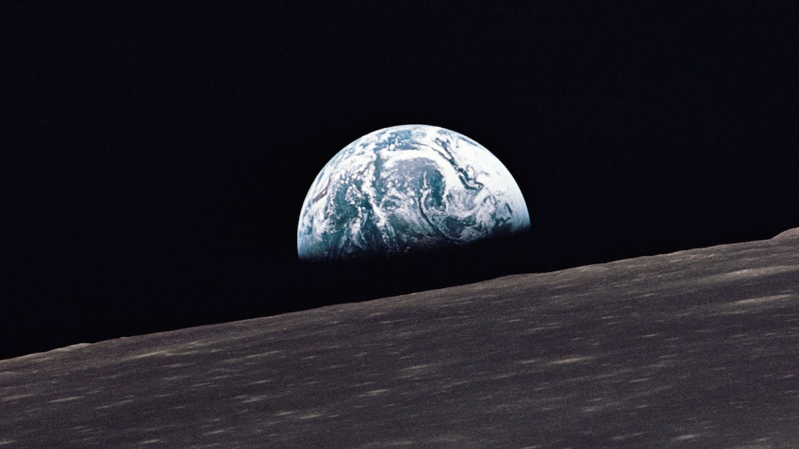

[Listen](audio/poetry-0079.mp3)

Universe created Evolution, Evolution created Consciousness, 
Consciousness created Humans, and Humans created Philosophy.

The word Philosophy, comes from the greek Philosophia, 
it means Love of Wisdom.

It comes from the time when Great Beings first begun emerging among us, 
they rejected inauthenticity, violence, contradiction, and imaginary things and creatures.

These were the First Superheroes, 
they were often attacked.

This is Socrates, he taught the children power of Wisdom, 
he was sentenced to death, and he did not run, he died, for Wisdom.

Wisdom is self correcting, 
it eventually went against the State and its imaginary gods, and so the State went against him.

He outlived the State by becoming immortal, 
he is often seen as the Father of Philosophy, but there were many other thinkers.

This is Hepatia, her tragedy, marks the end of the first Philosophers, 
the world plunged into Dark Ages.

As hard earned as Wisdom is, as long as it takes to cultivate and grow, 
the criminals can take it away in a cold flash of steel.

Her tragedy, should not be forgotten, the Noblest become a target, 
to the fractured, and blind, and jealous.

For now, Wisdom is no longer seen as the Highest there is, 
today, opinion seems to matter as much as fact.

There are calls to "teach controversy", for "equal debate", 
to "show both sides", to "let the reader decide".

Falsely presenting a broken opinion, 
to be on par with the reality and fact that helps Humanity Grow.

It is an old trick, it is cheap, and self assembling, 
it emerges on its own from poverty, inequality, suffering, blindness, and pain.

Being conscious and self aware, is not quite enough, 
because of Liars, Thieves, Criminals, Murderers, War, and even Poverty.

Wisdom is like a higher level Operating System for Humans, 
it enhances our consciousness, it grants us unique powers.

But, Every Human, each member of the Grand Human Family, 
needs to see Wisdom as a necessity.

Until then, racism, xenophobia, inequality, poverty, and darkness, 
will keep us apart.

The Stories of Superheroes are rooted in lives of Philosophers, 
because a Philosopher cannot be hurt like the ordinary men.

Philosophers survive for thousands of years in text, 
in stories, in paintings.

They survive by sharing Wisdom, 
that make us stronger, that enriches us, that we each yearn for.

When you read the words of a philosopher, 
she or he comes round, and in a way they keep you company.

Socrates knew that, 
and he knew he needs to send a powerful message far into the future.

An important being, died for something important, 
he is signaling, that Wisdom is Your Right.

He was a Soldier, 
he found a way to repair the word.

And it was, 
Love of Wisdom.

Once you begun paying attention to it all, 
a constellation of stars will begin assembling in you.

Each star will repair and strengthen all the others, 
it will bring you health and clarity.

Your contradictions will begin resolving, 
by rejecting and ejecting that which makes no sense.

It will help your decision making, 
it won't let you move forward when two things oppose.

It will keep you in place, 
until you reject the one that is not fact.

Where all the other stalks fracture, 
Wisdom will help you bend in the colder winds of change.

Foresight helps you combine knowledge, 
to construct events that are yet to unfold.

Moreover, it helps you construct the correct path ahead, 
and reject whatever else may come.

The Power of Foresight does not end with the individual wielding it, 
it can extend to guiding the word to the correct its paths.

Heroism is in part is about learning what not to do, 
helping others requires solving their problems, and thus you learn life.

But the greatest of insights are found in Memoirs worth reading, 
where they are placed in correct context.

With enough insight Crime for example, transforms from an impenetrable state of mind that it is, 
to our need to create Walls of Prevention, so that people don't end up blind.

Punishment and Revenge is not a way to treat a Human Being fractured by poverty, 
or violence, or even hunger-for-food. Only prevention can work here.

The power of insight shows you that while you can't go back in time, 
you can prevent the little ones from ending up in the same place.

In that way, you take the pain of those Punished and use it for a thing that matters, 
preventing children from following in their footsteps.

And we get to feel others, 
we get to feel when they have been Wronged.

And we get to feel what they felt, when times got tough, 
and the power of Compassion makes us a Family.

Who was it that gave [George Martorano][1] that little pencil, 
power of compassion is incredibly complex.

You hold hands with every wronged being on Earth, 
those looking to their Favorite Star, wondering if someone else is looking there too.

We are, we all are, we are there with you, 
You matter, your heart mattes, your mind matters, your life matters.

And in Wisdom we will fix all of it, 
whether we are ready to recognize that or not, we are a Family, and as One, We'll fix it all.

In that path we slowly walk together, 
towards Happiness and Fairness, and Joy.

We will erase poverty and slavery with Universal Income and a Free Home with a picket fence. 
We will erase crime with Care and Prevention, and Fairness.

We will erase war, blindness and stupidity, with Family Love and Wisdom. 
We will erase all problems that plague the Human Family, it is what a family does.

One day, the world will stand united in fact, 
as opposed to being divided by opinion.

Not even the Universe can stand in our way, 
our way is the Human Family Way.

Like Wisdom, 
we are Unstoppable.

[1]: https://www.youtube.com/watch?v=lnuoHywbaR8

  

## Thin Invisible Walls
### May 22nd 2020, 5:36:47 pm EDT
<meta itemprop="dateCreated" datetime="2020-05-22T21:36:47.194Z">

[Listen](audio/poetry-0078-2.mp3)

Why does Philosophy seem so foggy, 
so unclear, and uncertain.

Living above yourself, transcending your limits, 
puts you in a wiser state, more complex state, harder to understand state.

I can't describe that directly, 
but I can describe it by subtle analogy to other things.

You know how your Dad questionably, pokes around a car engine, 
and yet all of that seems a bit foggy?

Do you remember what it was like to jog the first time, 
and then you just kept going?

Can you imagine your first 18 miles at the Appalachian Trail, 
and can you see your last 18 miles as you near Katahdin.

You know how mathematics sound impenetrable? 
Until you become a mathematician?

There are gaps, discomforts, vocabularies, perceptual frameworks, 
that stand between you and the wisest you.

You have to cross those things, 
to unfog your mind.

  

Learn to jog, to sprint, to body build, 
and find a pathway to your best self by subtle analogy to training.

  

Learn to backpack, 
to walk out in front of a lone wolf, let your eyes connect in loneliness and familiarity.

Snarl down a Mountain Lion, 
with a God Like Growl, out of you entire life force, and culminating in a Wild Howl.

Let your Lycanthropy belch a low rumble as you stand your ground, 
to the test of a charging Black Bear.

And learn from the Calm and Power of a Grizzly Bear, 
Ursus Horribilis.

  

Or, become an artist. You don't need a charging bear to learn. 
You can use clay, or canvas, or music.

There is no finer way to push loneliness away, 
than to sculpt the meaning of touch.

And there is no better way to learn courage, 
than to paint a chain of works that inspire to motion.

And music need not make someone cry to be powerful, 
make the beat move your own feet, as you run your first ultra.

  

Consider how simple a Desktop in your Operating System is, 
and yet, how perfectly impossible it is, to drag the icon out of the computer.

It is right there, you can wiggle it, 
and yet it is trapped in a prison, of invisible walls.

  

And consider, how different you are, from all the people you have met, 
how you don't even smile at the things that make them laugh.

How not a single person of out the Eight Billion, 
could possibly take your place.

How often it feels that all the people around you are sleepy, 
how some seem different, because they could not do, what they do, if they were not wide awake.

To integrate with wisdom, you cannot read the same books others read, 
your mind represents a perfectly unique constellation of stars.

To integrate with wisdom, 
not only do you have to indirectly wiggle around by subtle analogy to other things.

But you have to fish out just the perfect morsels that fit you, 
in just the perfect sequence, out of a unique collection of mutually reinforcing works of Philosophy.

  

You start in the beginning, with Survey Courses, as these outline the most brilliant ideas first, 
there you can recognize thoughts that fit you, that you already had in your constellation.

Organized Education, poisons your confidence in education, because everything they teach, 
is in an inhuman, synthetic, and impersonal sequence.

Moreover, the easily forgotten and fragile clusters of incomplete information, 
aim to build on one another, they guarantee you won't understand, and will only overwhelm you in the end.

The celebrating of a Diploma, is a sacred ritual, that has been erased, and replaced, 
with a more sugarcoated "I am finally out".

This is a perfect recipe for bondage, blindness, weakness, 
and worse.

We must not allow a fake sugar pop triumph, 
to replace the Real Triumph or Knowledge and Wisdom.

It can only get worse, 
a day will come when the Libraries will close.

School and Library, above all, were meant to be a symbol, 
an extension to your own self education.

Your Education, 
the pathway to Peace, Safety, Security, Self Control, Harmony, Enlightenment.

  

What has occurred to cause the fog, is a drop of packets of information, 
we are too complex, the world is too complex, parenting is too complex, teaching is too complex.

It can get worse, if we continue celebrating false graduations, and fake education, 
if we keep forgetting that our family, has Eight Billion members and each must grow up for real.

The solution is to remind ourselves, that growing up is not about feeling like an adult, 
but rather Transcending our Limits, and Pushing Through gaps, towards Wisdom.

We face problems that can only be solved by Intellectual or Cultural Unity.

The Problem of War, is solved by Education, Wisdom, and Unity.

The Problem of Education, is solved by Helping Everyone to a Fair Start.

The Problem of Crime, can be Solved by Mental Heath Care, and Prevention.

The Problem of Poverty and Slavery, is Solved by Universal Income.

All these problems are our problems, and the solutions are ours as well.

But they rest across a Gap, a gap that Humanity must cross.

And the next step, 
is your step.

  

Nothing worth your precious time, can be faked, or made up, or make believe, 
it all has to be Authentic, Powerful, Guttural, Raw.

It will hurt in the Muscle and Bone, 
but eventually you'll forget to pay attention to what is unimportant.

You are not to be taught that you are dime a dozen, 
and that they just can't find a job for you, because you don't fit or conform.

People believe this nonsense, 
because they don't have anything to draw from by subtle analogy.

That is why we must challenge ourselves to Great Deeds, 
to acquire the experiences necessary to tell Wisdom from Waste.

When you hear someone putting you down, pushing you around, belittling you, 
you are to leave, because that someone has fractured and broke, and are now ill.

It is the oldest and sickest trick, 
to convince someone they don't matter.

They do it for personal gain, money or laziness, 
to people who do not have a library of Grand Experiences from which they can draw wisdom, by Subtle Analogy.

  

Get Up.

Find your temple of solitude, The Two Beautiful Trees, The Bridge Over Hudson River, 
The Highway Overpass, The Starry Beach where the Stars Come Out at Night and mingle with Starfish.

And know, that you are a Child of The Universe, first, 
That! is your background.

Now face Humanity anew, 
out from the edge of the Universe.

Look, 
look at all those things that made you small.

Look how unimportant the inauthentic is, 
how fragile those words that upset you really were.

  

And pay attention, to the real problem, 
how easily you were tricked and mislead.

That cannot go on, 
you are not a push around.

I wish you knew how Powerful you really are, 
how easily you learn at your own pace in the sequence that fits you best.

How All Too Human, all too familiar, all too easy, 
the acquisition of wisdom really is.

  

Not all Adults are defined by Outspoken Wisdom, some find Greatness in Love Returned, 
and what a Great Power, can those Two even make a mistake?

I don't think there is anything other than Love, that can substitute for Wisdom, 
it is both The Love of Two, and The Love of a Big Mother in a large family, 
a Mother that always brings hugs, warm meals and Wisdom.

But, True Love is rare, so while you search, you must also grow in Wisdom, 
from now on, you will have to learn to tell the children apart from the adults.

And not by looking at how old they are, or how well they dress, or how sharply they move in their environment, 
you will now look at their Authenticity, and Content of Character.

No one who lacks in Authenticity, or has little Content of Character, 
has anything to contribute to you life, certainly nothing negative.

Hope for them to recover, and become wise, and healthy, 
let them know that they are a Child of The Universe, and they count - but go.

Don't let anybody hurt you, 
don't let anybody hurt your heart, or mind.

  

Go! 
because you need your heart and mind, to grow.

Go!, 
with the certainty of knowing that you are more.

Go!, 
so as long as you Rise you won't be lonely for long.

Go! 
because there has never been a way other than forward and up.

Go! 
and don't be scared, all great journeys start with little things.

  

The Others, who went through the same, 
are with you in Spirit.

So many invisible battles have been fought, 
and as much triumph gone unnoticed.

The Warriors are everywhere, and they stand by your side, 
you are in company of Great Heroes.

Climb by subtle analogy to the triumphs already had, 
rise to the highest of mountains.

You are Meant to Become a Great Being, 
and You are meant to remind others to follow a similar path.

Rise, and you will be well on your way, 
Humanity only grows, when people like you tear down those thin invisible walls.

  

Wherever you are right now, begin transcending your limits, 
no matter how small, each will help you learn more.

With each new success more pathways will become visible to you, 
you are not trapped, you are just at the beginning of your journey.

It is hard to see it all because you are still learning, 
but it is easy to read or listen to books, and inherit great visions from others.

It will never get easier, 
but you will grow greater, to a point where ease will become irrelevant to your existence.

You must use your Heart and Mind to learn all the lessons ahead, 
no one can teach you, you must find your own books.

By Subtle Analogy, 
Rise to Your Greatness.

  

## Universe and You
### May 21st 2020, 7:34:04 pm EDT
<meta itemprop="dateCreated" datetime="2020-05-21T23:34:04.282Z">

[Listen](audio/poetry-0077.mp3)

Nothing is what it looks like, 
because Human Beings, are not of the world of sequentially predictable machines.

Human Beings emerged, out of infinitely increasing complexity, 
by rules of infinite accidents along lines of fuzzy principles.

In a word, we are here because the Universe mixed it self for so long 
that the failure for life to occur became inconceivable.

And, we want to believe life emerged, on Earth, 
just like we wanted to believe that earth was the center of the Universe.

And we want to believe that Earth was the first to have life, 
my goodness, how much more special could we be, the first in the Universe.

Universe is a large place, that has been around for a long time, 
it is better not to think of anything cosmic, as that! special.

But there is one exception.

Once you come down to Earth, come up to Life, and look then Into The Conscious Self Aware Mind, 
that is no longer a common occurrence.

There is nothing normal about it, 
we are now at the limits of what the Universe could possibly conceive of.

No machine or hybrid can measure up to the raw power of unleashed consciousness.

Nothing partially conscious, can know the depth of Sadness, 
nothing less than conscious could know the Miracle of Happiness.

  

We are used to thinking of ourselves as work horses, 
great locomotives that can plow through Pandemics, or a Broken Heart.

But that is a temporary oversimplification just to keep visions clear, 
born of a finely tuned mind that can narrow all views down to the important bits.

Focus and selective attention is not a limitation of our mind, 
it is a feature that clears away unimportant things.

When we need recall, we can have it in full, 
just imagine your favorite place, and trace along the walls.

Every window, picture, appliance, and outlet, all the important knickknacks are all there, 
we don't have memory problems, we don't need better brains.

The convergence that we need is not about integrating with technology, 
but combining the good parts of our cultures, so that the world can learn towards Peace.

Without that shared wisdom, people are easily tricked to believe in conflict, 
into the belief that there are borders, and across borders they must fight.

By not helping each other to understand how special and unique we each are, 
there grows a vocal minority of machine like minds, that think in mechanical terms.

They add to get more, they take to be more, 
they divide to make enemy, and subtract enemy to spread more.

They think they are a cog, in a bigger machine, 
but there is no machine, just that blind mind.

  

It is OK to focus on just a few things so that we may grow, and grow in wisdom too, 
but it is not OK to live in some narrow channel for simplicity sake.

It actually isn't OK to do things to simplify, 
complexity only moves in one direction.

There is nothing healthy that can be done to un-mix a cup of tea, 
there is nothing useful to be found in moving backwards in time.

Complexity grows, and to make sense of growing complexity, 
we cannot hope to simplify it, but rather adapt our minds to grasp it more efficiently.

The World must Go Forward, Move Forward, 
what needs to change is out Tolerance for Bad Ideas.

But growing up to the challenges of ever increasing complexity requires wisdom, 
and wisdom cannot be manufactured, it must be grown.

Wisdom is a product of Love, 
not the Beating Heart, but the Human Capacity to Love the Universe, The World, and The Human Family.

  

My Dear Readers, 
Becoming a Great Being, becoming Wise and Enlightened, 
is the actual definition of being an Adult.

Pretending to be an Adult, by acting mature, 
is to make a fool of yourself, probably while throwing away what makes you Beautiful.

Throwing away your Sweetens, and Foolishness, and Innocence, and all the Smiles that happen for no reason. 
That's not growing up, that's the worst thing you can do to your self, and is probably very unhealthy.

To become an Adult, 
is to become a Philosopher.

Philosophy is about Loving Wisdom, 
is your Wisdom not the most precious thing within you?

Universe, the biggest thing there is, in all it's might and complexity, 
a thing so powerful, that it may in some part, travel around it self in time.

It can't do wisdom, best it can do is Evolution, 
but it can't do wisdom, it cannot know, it doesn't know such a thing could exist.

And each and every one of us has the capacity for it, 
a volitional faculty to bring up a folder of your Noblest Thoughts.

You are more powerful than the Universe, 
the only thing that can keep you down, 
is you never becoming aware of your Great Power.

I know Superman comes to mind when you think of Superpowers and Superheroes, 
But do think Superman is actually super because he can lift or fly?

If Superman was as super as he needs to be, he would become Human, 
and build Schools to prevent War a Hundred Years before it happened.

He'd then age, so that the Little Ones, 
would listen to him without dismissing him as a Genius that lives on cloud nine.

He'd then let the little ones build with a thousand minds, 
what his one mind, couldn't grasp.

The greatest of superheroes, would encourage us to build things, 
that help the world to converge, 
on Cultures of Wisdom that leave bad ideas behind.

I ask you, My Dear Readers, 
to begin moving towards becoming Great Wise Beings, 
towards growing up by means of searching for wisdom, 
growing all the way up so that you stand as Authentic Adults.

And rising to the challenge of inspiring a thousand minds, 
to accomplish what your one mind, can only barely conceive of today.

  

## Little Treasures in Our Hearts
### May 20th 2020, 11:22:12 pm EDT
<meta itemprop="dateCreated" datetime="2020-05-21T03:22:12.511Z">

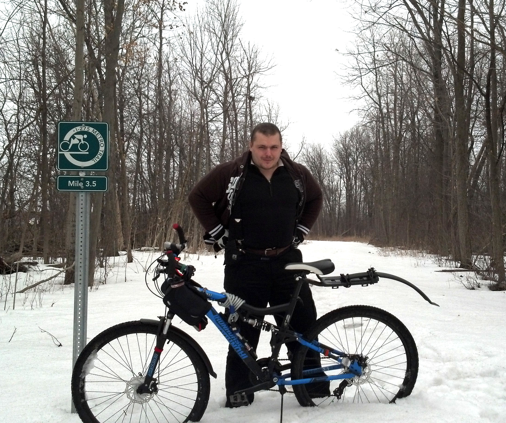

[Listen](audio/poetry-0076.mp3)

With each little triumph, we add to our treasures, 
and it grows over time, it grows beyond measures.

Sometimes, it all starts in loneliness, 
but it quickly fills up as it reaches silliness.

And so, we carry our fancy treasure chest, 
we take it with us on every quest.

It is not possible for it to get lost, 
and nobody else can touch it - at any cost.

In no way could it ever be sacrificed, 
and no robbers could ever stage a big enough heist.

  

Little chest in a safe place deep in our heart, 
it serves to light the fire that fuels our art.

It prevents us from walking in reverse, 
it helps to make our existence more diverse.

It also adds a great deal unto our beauty, 
as it drives us to create out of love, and not mere duty.

All those petite little things that make us proud, 
also make us stand out in a crowd.

So it also serves as a lighthouse with a bright beam 
that lights the way betwixt us, and our dream.

  

I think one reason why nobody ever mentions it, 
is because it is too sacred, to just talk about it.

But I want to remind you, my Dear Friends, 
that sometimes we need to look through this lens.

Your treasure chest will show you, 
a picture of you that is most true.

  

Oh, don't worry if you have only one thing, 
it is still a treasure, it still makes you a Queen or King.

We all have a few simple treasures when we start, 
but they grow as we use our heart to turn our life to art.

  

## The Harmony of Growing Up
### May 18th 2020, 10:39:25 pm EDT
<meta itemprop="dateCreated" datetime="2020-05-19T02:39:25.191Z">

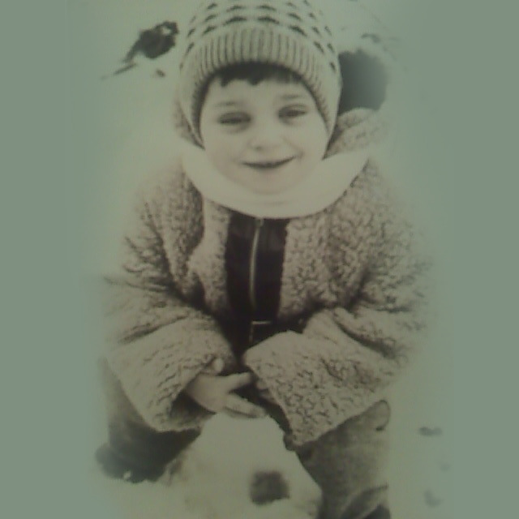

[Listen](audio/poetry-0075.mp3)

Well, from the first moment on, 
we are asked if we should live in harmony.

We are still very young, 
barely know of the world.

And already the question of harmony comes, 
and in harmony we learn, and thrive.

Away from it, we'll be interrupted, 
and feel lost in the void.

It is a simple choice, 
but out minds are not ready to make it.

Often we forget.

We forget about our little gardens, 
and all the little walks.

We forget how amazing it felt, 
to stand on the wing of a plane.

We forget the taste of popcorn at the Zoo, 
or even how enormous Zoo felt.

We forget pebbles at the river, 
and mischievous squires at the park.

  

That little dog with a bark, 
that scaredy kitten always hiding in the dark.

Our collection of unused keys, 
and the box of bottle caps we collected with ease.

We forgot our Lego and the old bike, 
with that seat that we used to really like.

We don't remember the Palaces and Castles, 
that we used to love, and those swords, that fit us like a glove.

  

Everybody else came around, 
acting like they know the ground.

But, this was our gift from the Universe, 
an affinity for flowering gardens, and little passage ways, and all those flying planes.

It was a key to unlock our mind, 
to understand the zoo, and our size in the universe, connect with pebbles at the beach.

It is a pathway that fits us best, 
to love little creatures, and collect some shineys, and build with blocks, and ride far and wide.

It was to remind us, 
to find our place among Great Beings, and study and pursue excellence, in all we do.

  

Then they sent us to First Grade, 
and the weird kid peed into the Duplo, they didn't even have Lego.

Then the teacher graded you down for counting pebles in your pocket, 
and did it so many times, you lost track.

  

There was a whisper about the pebbles, 
it was Mr. Sagan - "You are made of Star Stuff."

And then the kids whispered... 
to push you in the mud.

  

Push their laughter aside, 
you'll need to Learn, and learn really hard.

Cause right now, you're in the mud, 
and you need to hang on.

It will get worse, 
but all you have to do is rise.

Each time, 
you'll rise higher.

(When in trouble, call the Police it is OK for kids to call the Police, they'll love helping you, don't be scared.)

  

Third Grade, 
Fifth Grade.

Low grade, 
Uhh, but there can't be higher.

Because by this time, you're getting bad grades, 
because the teacher thinks you're copying from somewhere.

The bullies know, 
you did it on your own.

Saw you pacing for days, 
with your first program.

Keep going forward, 
don't let go - you're doing great, stay away from the hate.

  

By the time you're out of Eight Grade, 
by rejecting crazy, and nonsense, and stupid, and lazy, you graduate above all others.

Because you didn't follow, 
because you chose to study on your own, at your own pace.

Because worthless grades meant nothing, 
you felt no stress.

Because, you didn't follow 
nothing could hurt you.

And your world is yours, 
truly-truly yours.

  

We unravel, when we forget who we are, 
the moment we hide, or pretend, or follow.

And, gosh darn it, 
it happens when we are still kids.

We are completely unprepared, 
and none will help.

  

So you! have to keep it together, 
you can't let anyone hurt your mind.

In High School, the pretenders make a sudden appearance, 
never held a book in their hand.

The back of Hamlet, 
all the quotes have more IQ.

Let the little Caesars, 
keep the wind from the hall away.

You need to pace your reading at the library, 
teach yourself focus.

Don't EVER! finish the books, 
just get to the part that is valuable to you, and skip the rest.

  

Start working on your start-up early, 
it is a study in failure.

You need to create a series of CONTROLLED FAILURES, 
this is very important.

Learn [content management][1], 
and figure out [billing][2]

That's your surface platform, 
and think about nature of business.

Never try to build things directly, 
facilitate the building of direct things for others.

Help them setup, 
so that you are not burdened, and keep going.

Look at the structure of start-up accelerators, or even banks, 
they take a percent, and never create what will weigh them down.

Eventually, you can build your own Tesla, 
but at first, you start with services.

Look at the gym, 
monthly subscription, is most stable.

The lessons, are all around you.

  

You don't need college, 
but taking college classes is very relaxing.

Make sure you get a 4.0 at each class, 
be ready to repeat it.

And enjoy, 
the lectures.

College is just a toy, 
it looks bad on your Portfolio, so hide it.

It is a very weak teaching experience, 
and people know that there there is minimal learning involved.

Jumping from high school to start-ups is more impressive, 
and shows that you chose knowledge over nonsense.

It shows that you chose to learn on your own, 
to take care of your own mind, 
rather than to pretend to learn for grades.

Authenticity is very important in life, 
it is hard to connect with people that role play.

  

Bonding with people that are just acting, 
is only functional for as long as they are acting.

But it is never good, 
eventually they'll have a crisis, similar to a mid-life crisis.

Stay Authentic, 
keep to to those who are Authentic.

Be safe.

  

When it feels like everyone else is having an amazing life, 
and you are stuck.

Umm... that not true

But it is also not healthy to think this way about yourself, 
you are not beneath the party goers, they don't have what you have in your mind.

  

But, that's far enough, 
time to get some rest.

  

This is where it gets interesting, 
you have primed your mind for Business.

That is a fine first step, 
now you need to get ready for the real graduation.

You need to section hike the equivalent of the Appalachian Trail, 
and measure your jogging a hundred miles at a time.

Section jogging, the Western States 100.

Mind and Body, for the rest of your life.

You must take good care of both.

  

At mile fifty, halfway through a run, 
as you piece together your blurry thoughts of your next business.

Take some time to understand what it is that College Grads have, 
those are very brittle relationships, and inflexible careers.

We all feel the promise, but we can't fake it, 
it would be the opposite, and certainly not worthy of you, my Friends.

You can only find your meaning in Authenticity, 
shortcuts will only take you back to the beginning.

To live among the Extraordinary, 
you must become Extraordinary yourself.

  

The gateway to Meaning of Life, 
is in that tiny moment when you think to your self:

"I am not going to jog tonight, I need rest."

Right there in that dot, 
is the keyhole, 
to the key that you are, 
to the gateway that you need to open.

Life is not a simulation, 
there are no days off, 
life is quite a challenge, 
and demands that each moment builds on the authenticity of the previous.

  

Open the dot, how can you yearn for Authenticity and Companionship, 
and cancel, and fall short, and not enough, and rest some more.

The gateway between Ordinary and Extraordinary, 
is in accepting that we haven't got a choice to make.

But shoes... to put on, 
your Mind and Body must grow in harmony.

You must not let go of the Harmony, 
of your Magnificent Existence.

Each small success, by subtle analogy, 
pushes you forward, to your next step.

  

Eventually your tightly controlled business failures, 
will fail, they will, fail to fail.

Your mind too, 
it won't perceive the easy choice as an option.

All- will proceed, 
in harmony.

  

Labored breathing, 
by the Pine Trees at Western States,

Another great step in Automation of your business, 
and more investors.

And you're no longer stopping at the first thing you find in books, 
you understand all of it.

What is made by humans, 
is also All Too Human.

  

And the Bullies are Gone, 
and Eight Grade still sucks.

High school ... influences, 
are trying to figure out where they went wrong - good luck!

College, is still a very romantic idea, 
but it is best left to imagination.

Your dreams are so much more now, 
only what you create can live up to them.

You are a Leader, 
full of might an joy.

  

And now you know, 
shortcuts only lead people to their beginnings.

And the one road, the only road, 
was the one of Authenticity, and Achievement.

Where we learned for real, not for grades, 
where what we learned added up to create wisdom, and not a stupid GPA.

You'll be OK, so as long as you Learn onward and become Wise, 
and Live in Authentic Harmony with Yourself.

This is how you become an Adult, 
that was the one thing that all others were missing.

It's what made them pretend and simulate, 
but, growing up can't be faked.

Growing up has to be written by the choices you make, 
on the surface, that is your lifetime.

The dreams you always dream, will come true, 
but not in your childhood, childhood is for learning.

Live in Harmony with yourself, 
and live in harmony with the Universe.

Growing up is really special, 
it is really important for our health.

It is a deeply internal process, 
and there are no shortcuts to growing up.

It is meant to be, 
Beautiful.

[1]: https://www.youtube.com/results?search_query=content+management
[2]: https://www.youtube.com/results?search_query=stripe+wordpress

  

## Let Mother Nature Schedule Your Rest
### May 18th 2020, 9:40:09 pm EDT
<meta itemprop="dateCreated" datetime="2020-05-19T01:40:09.277Z">

[Listen](audio/poetry-0074.mp3)

It was a very rainy day, 
the sky was completely gray.

I took a nap come afternoon, 
fell into my bed with a big swoon.

I woke up rested, and ran to the door, 
but it only seemed to rain more.

  

I resumed my endurance training a week back, 
It was a warm-up week, so I ran like a Mac truck.

I actually sprinted yesterday, 
somewhat frightening myself along the way.

I felt like I was all muscle, 
I moved like red lightening, without a hustle.

  

Even though yesterday I ran in the rain, 
I rained only a bit, so I had to train.

Today, the rain seemed like too much trouble, 
I rested, but tomorrow I'll have to train double.

I always tell people not to rest, 
let Mother Mature decide, she knows best.

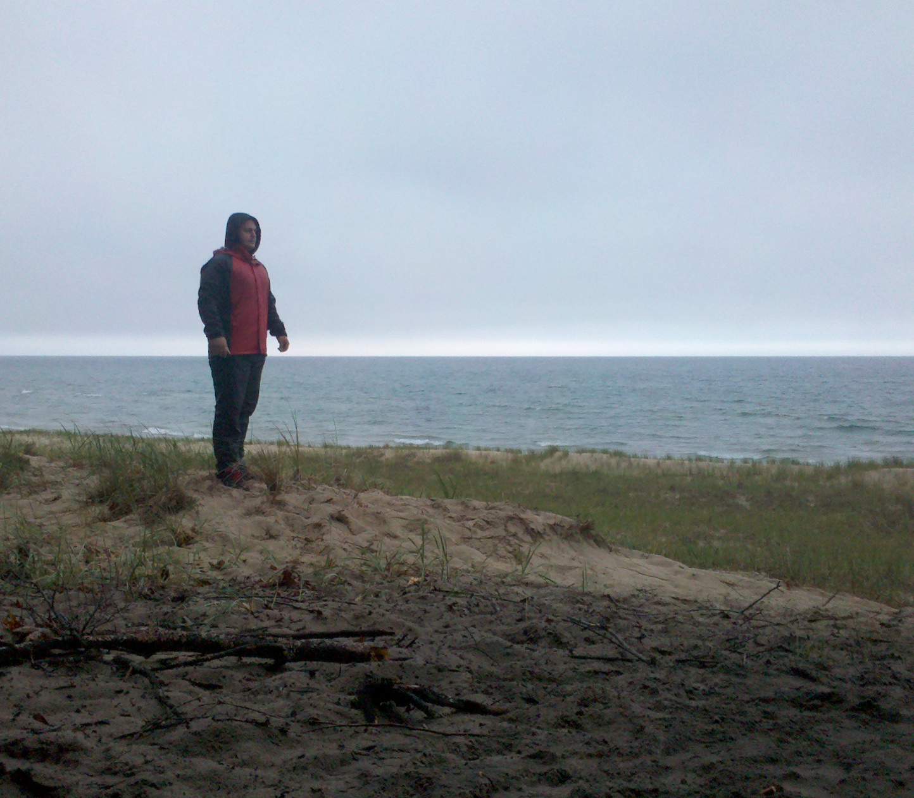

  

## None Who Wandered Were Lost
### May 17th 2020, 9:32:16 pm EDT
<meta itemprop="dateCreated" datetime="2020-05-18T01:32:16.905Z">

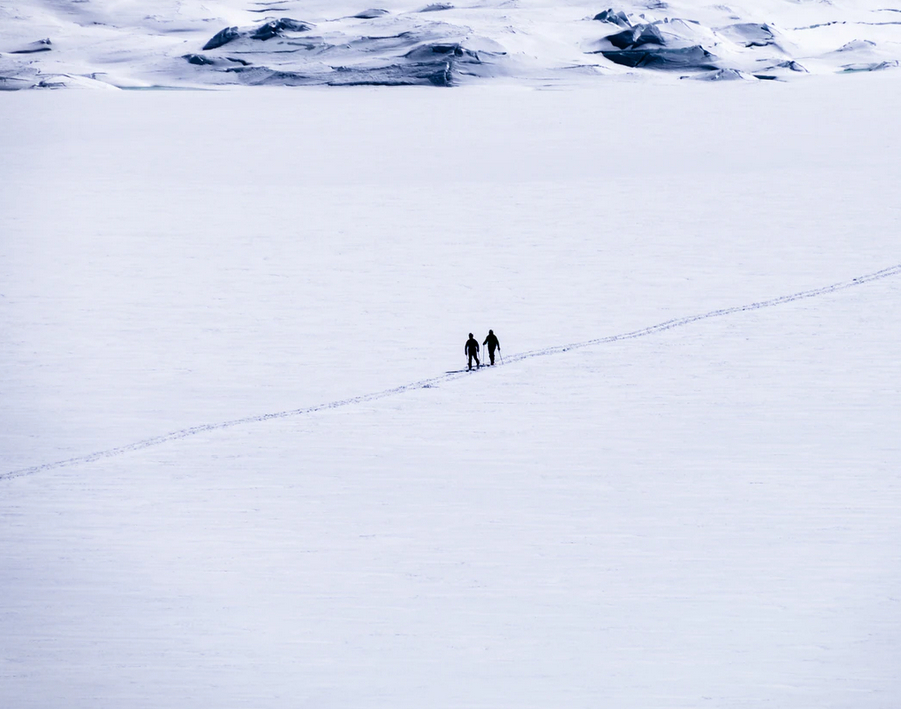

[Listen](audio/poetry-0073.mp3)

We often think of consequences to mistakes, 
but consequence does not pick.

So as long as we keep to our paths, 
all our actions cast changes ahead.

In mistakes, lessons await, 
in good deeds, we find family.

In great adventure, we'll find mountains, 
in great achievements, calm and peace.

In darkness, we will find light, 
in isolation, we'll find hugs.

So as long as we keep to our paths. 
what we shall find will make us stronger.

  

However, if we dare so to diverge, 
all we have cast we'll be lost.

Perhaps no shadows, but certainly no light, 
no lessons, no sweetness, no might.

By switching paths we'll find fewer wisdoms, 
and far more things that don't fit us.

We'll also find a force of opposition, 
it will keep our minds tired.

It will be unclear why life seems strange, 
why everything takes so much more to see.

Why we seem to lack confidence, 
or how everyone else has so much of it.

  

But, the most troubling thing, my Dear Friends, 
is in how easy it is to diverge.

There is a place for Leaps of Faith in life, 
they are quite sacred, and as beautiful.

But, to fill in a stranger's blanks, 
or trust that the others know what they are doing.

To listen to good advice that considers you naught, 
or give something up of your self, and not know why.

To go to a place because everyone went there, 
to bow because all others bowed.

That is not sacred, sacrilegious maybe, 
you must never follow, you must always lead.

  

Even more troubling is how it all collapses, 
not with a bang, but a stupid sick whimper:

"How were they supposed to know", 
"How was I supposed to know?"

All the blame for what others did, 
to Your Sacred Self, somehow falls back right on you.

And then it turns out, 
your lesson is all over cheap paperbacks.

Everyone has been trough this, 
and none were the wiser.

All those confident faces and smiles, were faked, 
and the more convincing they try to be, the less they are in pain.

  

When someone is putting you at risk, 
take a split second to imagine them saying:

"How was I supposed to know?", and stand your ground. 
You are not to follow, you are to lead.

Let them have have their stupid games, and drinks, temporary junk, 
you go to the DIA, take some notes, and splurge on clay.

Find a gallery worthy of your works, 
resume where Rodin left off.

Instead of filling the blanks, 
show the world the shapes.

How can your other half recognize you, 
when you are traveling on some other path.

  

What you many not do, is to start at the bottom, 
all those cheap novels, they describe starting at the zero.

Start where all the heroes left off, 
read a handful of novels, and move on to their Memoirs.

Your life depends on knowing what it is and where to start, 
and what to avoid.

It will get lonely, yes. 
You'll be lonely because you don't drink, and don't do stupid things.

You'll be lonely, but, You'll be You, 
you will shine your own light, and. you. will. be. seen.

  

Get up, step up, 
create and speak with art, and you'll talk with the world.

Grab pencils, trace with an Office Projector, 
and bring your Tortillon along.

At the gym, dance, 
your way is the only way.

You may get lonely, 
but for long.

  

Try to help people learn, what you have learned, 
become an assistant, a tutor, and a substitute teacher.

Keep track of your Peace Corps application, 
just keep adding to it, keep re-sending it.

They probably don't read it until version 50, anyway. 
It gives you time to revise and refine the ideas.

To begin walking your own path, 
is to enter, The Grand Path of Pursuits of Excellence.

Everything on your own path will add to you, 
there will be no limit to how far you can travel.

  

Stay on your own path, avoid generic advice, read Memoirs, 
keep moving up, and always try to move faster.

Learn about new things, 
expand your knowledge, every day.

If it is something you don't understand, 
find an Audiobook about it.

Stay sharp, stay fit, 
endurance training goes well with Audiobooks, and Love of Wisdom.

Others must have no influence on you, 
this is not their life, it is your life.

Move at your own pace, and in your own sequence, 
make your 90 old self laugh, at how amazing you are.

  

## Enlarging Your World
### May 16th 2020, 7:23:17 pm EDT
<meta itemprop="dateCreated" datetime="2020-05-16T23:23:17.993Z">

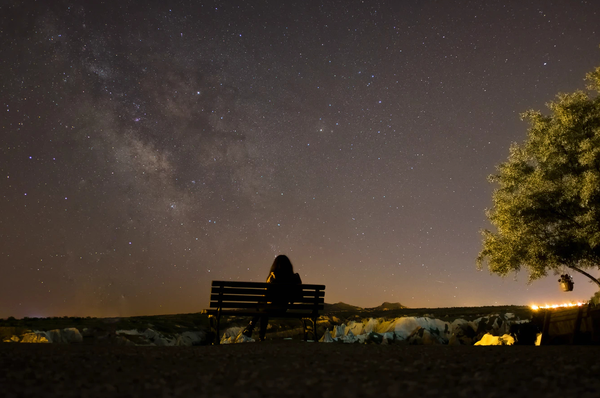

[Listen](audio/poetry-0072.mp3)

We must make time, to enlarge our view, 
and in everything we do, we must first think things through.

Above all, to thine own self be true, 
but also your own world, should fit like a good shoe.

  

With each step you took your mind grew, 
with all new things, we never really start anew.

Where ever we go, whatever we go through, 
we learn and our wisdom evolves, as we continue.

  

Sure, sometimes it feels like we don't know what to do, 
but when you get sad, the whole Universe becomes slightly more blue,

We may not know exactly what you are going through, 
but many of us have been there, we too got stuck until we grew.

  

Many great beings get hurt, but all plow on through, 
you are not alone, in our own thoughts, we sit right next to you.

Please push trough the pain, and look through the zoo, 
when all is writ, and said and done, we all still need you,

  

There is a blinding beauty to who you already are - I wish you knew, 
with each step forward, you become a brighter star, and we love you.

Don't worry, so as long as to your own self you stay true, 
it will all pass, and when looking back you'll say - "I Grew."

  

## Epoch by Epoch
### May 15th 2020, 9:30:32 pm EDT
<meta itemprop="dateCreated" datetime="2020-05-16T01:30:32.940Z">

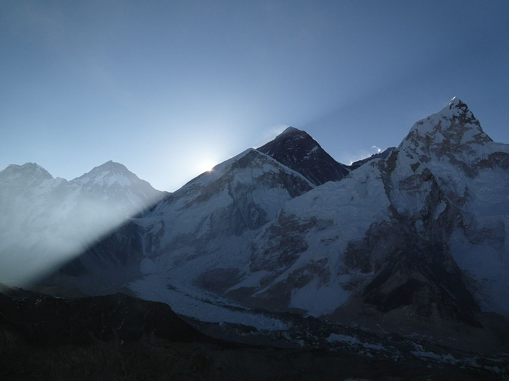

[Listen](audio/poetry-0071.mp3)

Like steps on a mountain, each epoch stands in support of the next, 
like the pages of a journal, together, they hold the sacred text.

We learn, we may fail, or triumph, and the next epoch follows, 
but every new epoch grows from the one previous.

We can't leap from one place to another, 
we can only move up, or graduate up, or build up, or step up.

To leap, is to stay a child in an aging body, 
to go up, to grow up, and carry on to no end, is to become an adult.

  

In our youth we must learn to stand our ground, 
and anchor ourselves to something that moves us.

As we age, having followed that path, 
we'll be standing upon our own mountain,

A great mountain of personal wisdom, 
where once only a direction lay.

These mountains rise with each epoch in our life, 
every once in a while we pause, to bring all that we are together - higher.

Epoch by Epoch, we ascend, we can already see the sunshine, 
but our journey comes with no end.

  

This is a simple life, first we conform and then break away, 
we become wise, and later in life, our wisdom transforms into Enlightenment.

It is a road of Adventures, Books, Poems, and Inspirations, 
it has tears of sadness, but in return we grow stronger.

What it is all for, is to Live a Life of Simple Dignity, 
or rising when we fall, of learning when we get tricked.

Of protecting our bodies and minds, and growing stronger, 
of adding to our existing body of wisdom.

  

With each epoch we climb over what we previously thought were our limits, 
As we get up, and stand up, we reach a new plateau.

We rest, we take in the sun of this new height, 
and get busy building higher, and higher.

None of us begged to be born, we were nothingness, 
and temporarily all these atoms came together to give us, ourselves.

And eventually, we'll return to our nothingness, 
and the atoms will disperse, to become parts of other beautiful things,

  

While we are in this state, however, the first and foremost order! 
...is to Thrive, to Grow, to Expand, to Rise, to Build, and to Ascend.

Whether we know it yet or not, the road that we are on, is one. 
It is the same road that our 90 year old selves will wonder about.

They will go up and down the Epochs, and ask questions. 
there will be some regrets, but we do have a chance to solve them now.

There will be enough triumph to bring blinding light to all the sadness, 
and the beautiful memories will wipe out all the unimportant things.

  

All that stands in the way of our growing up, 
must be pushed aside, growing up is our life.

We must grow up, rise up, all the way up. 
Each and every epoch ahead, demands this.

Our minds require wisdom, wisdom fuels our decision making, 
and our choices dictate all our life ahead.

Life is precious, it is to be lived in Dignity and Authenticity, 
and you are meant to become a Great Being.

***

[Everest photo](https://en.wikipedia.org/wiki/Mount_Everest#/media/File:Sunrise_over_Everest.jpg):
[author](https://www.flickr.com/people/69342394@N00),
[license](https://creativecommons.org/licenses/by/2.0/).

  

## Friday and I
### May 14th 2020, 11:46:46 pm EDT
<meta itemprop="dateCreated" datetime="2020-05-15T03:46:46.063Z">

[Listen](audio/poetry-0070.mp3)

Wherever I went, Friday magically followed, 
there always seem to have been a tree that was hollowed,

And the moment I looked at food, 
he knew, dinner was going to be good.

Wherever the Raccoons came out at night, 
Friday, was always there, my Fat Spirit Guide.

<!-- Keys -->
Over at Little Torch Key, at Veterans Beach, with easy access to water, 
he lived up a Palm Tree, with his Furry Wife and Tiny Daughter,

Once I got lonely, and threw a little Tortilla all the way up there, 
he popped up, and it looked like he smiled - I swear.

<!-- Jack Pine -->
Over at Ludington State Park, at the Jack Pine Hike-in Campground, 
I woke up at 3 am, hearing a strange sound.

He was trying to pull out my hamburger buns, 
probably to feed all his furry sons.

The bag was tied, up in a tree, 
nothing could stop him - Because he was free.

I got out of my tent, and delivered his late night bite, 
by tossing it into my cranky neighbor's camp site.

<!-- Nordhouse -->
The whole woodland family, knew that eventually I had to go back, 
Friday left a little footprint on my pillow, to help me pack.

I was staying up in the trees, on top of ancient dunes, 
the only light was that of stars, and the moon's.

I called them [Nordhouse Skylands][1], 
but, if you go out there, be ready for his smart little hands,

Bring a travel lock to secure the zippers on your tent, 
and remember, Friday loves you as friend, he means no ill intent.

My Dear Readers, we may each need a few weeks of Wilderness in our life, 
so start slowly packing, buy a backpack, bug spray, and a knife,

And just keep your adventure pack by the door, 
if life ever gets you down, smile! and head for that Lake Michigan shore.

You can park at the [Nurnberg Trailhead][2], 
and don't forget to bring a little bit of stinky cheese, 
and piece of stale bread.

***

[Raccoon photo](https://commons.wikimedia.org/wiki/File:Raccoon_(Procyon_lotor)_2.jpg):
[author](https://de.wikipedia.org/wiki/Benutzer:Darkone),
[license](https://creativecommons.org/licenses/by-sa/2.5/deed.en).

[1]: https://goo.gl/maps/wsX31CTTXR4bzhza8
[2]: https://goo.gl/maps/PhyA8hEuiAZnBmt1A

  

## Whoop De Doo at Nordhouse Dunes
### May 13th 2020, 9:16:43 pm EDT
<meta itemprop="dateCreated" datetime="2020-05-14T01:16:43.131Z">

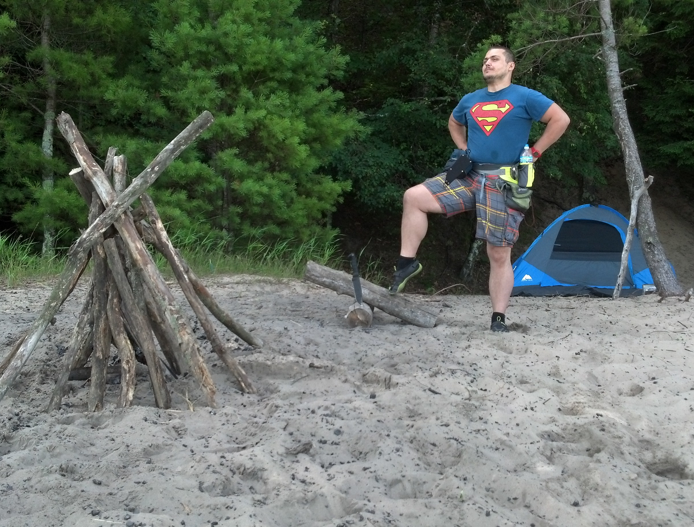

[Listen](audio/poetry-0069.mp3)

Some adventurers, 
wrestle bears.

Others, 
runaway from their fathers.

I, 
bemoan the lack of Wi-Fi.

  

That is, until the night comes about, 
at which point all the wild creatures come out.

I've heard stories of owls swooping down from the air, 
just to rip out whatever is left of a man's hair.

Then there are the occasional mad deer, 
always shimmy-shammying around like they had a beer.

The coyotes are especially frightening, 
they come in groups, flashing their eyes like lightening.

One time I tried to turn on a flashlight, 
as it turned out - to all the big spider's delight.

Let me tell ya, It takes a man with a lot of brass, 
not to scream, when a spider crawls out with a huge glowing ass.

  

Once, an older lady from a near by camp went to get more booze from her car, 
and then misjudged her distance, and walked back too far.

I was sleeping on the ground in my tiny tent, 
and then all of a sudden she started yelling out in her lost torment.

Of course, in the middle of the night, and woods and my sleep, 
she didn't sound like a lady but rather some huge creepy creep.

She found her way back, and I am sure they partied hard, 
but not knowing what made all those screams, I slept - on guard.

  

Porcupines, oh, you've never seen one like I did, 
it was huge, covered in spikes, and really fit.

It could outrun a car or two, 
probably, bite a tire and chew.

But then I came across a sign, 
and it turned out that the biggest creature, was not the Porcupine,

I was always pretty happy that none of the creatures that bite, 
could actually take me down in a single swipe.

But the sign read, **Beware Of Bear** 
and that to me was the biggest scare.

  

## Riding The Trail
### May 12th 2020, 9:28:17 pm EDT
<meta itemprop="dateCreated" datetime="2020-05-13T01:28:17.718Z">

[Listen](audio/poetry-0068.mp3)

I like riding around on my bicycle, 
but today I felt like an icicle.

Just got back from this years first long ride, 
I feel cheerful and mighty satisfied.

All the cute creatures are still there, 
and thankfully, still no signs of angry bear.

Riding alone, I reminisced about a warmer time, 
when a car slowed down and screamed like there was some crime.

I had no idea what they were saying, 
but waiving their hands, it was a danger they were portraying.

But, I was like, "Oh, whopped do, who knows..." 
and in the next moment, I had to take off most of my clothes.

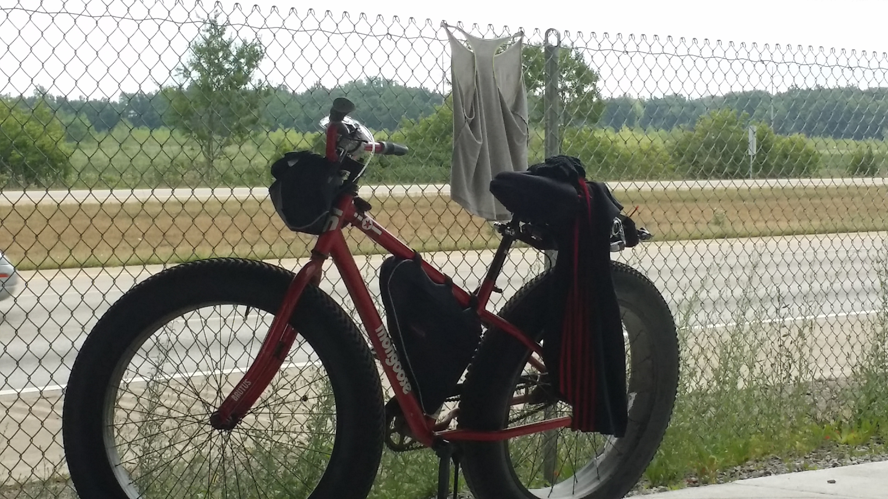

I have never been in such great rain, 
it was like standing next to a burst water main.

I loved it, the rain was fragrant, fresh and warm, 
I could never call that a storm.

The sun came out instantly, I was like "K. rain, thanks, bye.", 
and then I had to hang out all my clothes to dry.

The 13 mile ride back home was full of mud, 
I had to lift my legs, and will my bike across a flood.

I am so glad no one will ever know about this, 
but still, these are the memorable moments
that make me reminisce.

  

## Helping The World Really Learn
### May 11th 2020, 4:21:18 pm EDT
<meta itemprop="dateCreated" datetime="2020-05-11T20:21:18.360Z">

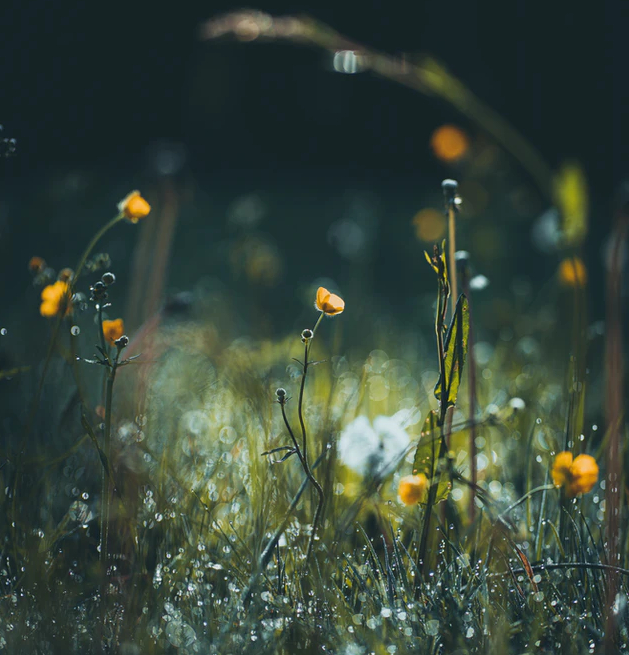

[Listen](audio/poetry-0067.mp3)

You can leave, you don't have to ask the Teacher, 
if they are not teaching you, they can only delay your education.

If school is wasting your time, teaching you nothing, 
That is a crime, and if you stay; your foreshadowing.

We have something now, my Dear Friend. 
We have Internet Lectures, Audio Books, and Start-up Incubators.

No teacher can teach you better than failing at your first start-up, 
no teacher can bring you with more wisdom, than failing at your first start-up.

You can go, so as long as you can do it better yourself. 
So as long as your aim is Greatness.

Take your books, and go. 
don't forget your friends.

  

Since you are the first to rise, 
you will be the new Teacher.

Prepare your Audio Books wisely, 
and do not forget YouTube Lectures.

You'll need investors, 
and although, all your parents put together make quite an investor.

You need to approach the pros, 
and listen carefully as they will proud to help all of you.

People believe in authenticity, 
investors know what kind of student stays, and what kind of student leaves.

All those failures that were crushing you in school, 
are worth their weight in gold when building a new school.

  

Research Homeschooling and Un-schooling, bring your friends, 
if your parents keep yelling, find someone more worthy of you.

Parents are not gods, they make mistakes, 
they are scared of responsibilities, scared of unknown.

Don't let the yelling get to you, 
they need to learn to communicate their ideas better.

  

Whatever fails you, Your Friends, Your School, Your Parents, 
It means you got to go - or they got to go - or you won't be able to grow.

Lack of education, is a terrible curse, 
bough on by bad schools, bad parents, and bad friends;

First it will make you blind, 
and then you will lose your mind.

That's probably, 
how slavery worked.

Whatever is interfering with your Real Education, 
is attacking you, cheating you of wisdom, freedom, independence.

You cannot agree to this, You have to rise, 
rise against stupidity, bondage, and slavery.

If everyone failed you, 
then the universe has called upon you to become your teacher.

When you grow up, 
walking out of that charade, will be your favorite story to tell.

Your listeners will be the same age you were, 
the books you loved, will become the books they'll love too.

You will set them free, 
help them to wisdom, help them to independence.

Learn, so that you can become a Successful Entrepreneur, 
find your start at Start-up Accelerators.

Go there early, as failure is a powerful teacher. 
Show them your Hunger, show them how much you have learned on your own.

Set yourself free, 
a life without wisdom is slavery.

Teach your Investors what a Good Book really does, 
help their employees to discover knowledge, to hunger for more.

Would you, as a Powerful Great Businessperson, 
take the diploma you are working on, seriously?

Seriously? 

Or would you see a child waiving a little flag, 
hoping to squeeze in, if there is room for one more.

  

Why do you need teachers anyway, 
they can only stand between you and the Great Beings.

Find a road less traveled, find the more grassy patch, 
bring a Picnic Basket, Audio Books, and Video Lectures.

Let That Be Your Classrom, 
and let your future be made by you.

Learn at your own pace, 
in your own sequence.

Any lecture worth watching is on the internet now, 
that is what the internet was created for.

Helping The World, 
Really Learn.

  

## We Are Not Robots
### May 10th 2020, 9:57:32 pm EDT
<meta itemprop="dateCreated" datetime="2020-05-11T01:57:32.195Z">

[Listen](audio/poetry-0066.mp3)

We are not robots, to be taught, 
we are humans powered by inventive and original thought.

This is why life has no instruction book, 
if it did, it could only ever tell us where to look.

For the sake of this poem, 
let us image that this book does, exist.

Here is how I imagine it would read, 
and let me start with the opening creed:

- If someone is attacking you call for help, until it comes.
- If school is treating you unfairly, go hang out with the Principal.
- You need to build your Content of Character.
- Your Body of Wisdom is a Key To Happiness.
- You Must Grow All The Way Up.
- You are to Become a Great Being.
- You Are Beautiful, You Were Beautiful All Along.

It would point to learn from The Greats 
as they managed to lift impossible weights. 

It would also say that we are delicate, 
and our minds are extremely intricate.

It would add, Hey! 
You can not grow up in places that weigh.

You have to find you own place in the world, 
and you have to quit doing what you are told.

Above all it would state, 
that you are Free, 
and Full of Beauty. 
and searching for Wisdom is your duty.

  

## Unique Greatness
### May 9th 2020, 5:48:56 pm EDT
<meta itemprop="dateCreated" datetime="2020-05-09T21:48:56.291Z">

[Listen](audio/poetry-0065.mp3)

Each day we must learn, 
and what we've forgotten re-lean.

Our life depends on clarity, 
our visions must be sharp.

A lesson learned, begets a wisdom. 
Two create a kingdom.

Our might comes from knowledge, 
and you can't find that in college.

Life is too short to lean in slices, 
leave them to their own devices.

You are a powerful being, 
you learn fastest on your own.

As few teachers there are, 
so there are but a handful of books.

It will be hard work, 
to fill all the notebooks.

But your mind is unique, anyway, 
there is no substitute for your own way.

At first it will be gibberish, 
at last, they will read it feverish.

You must not be tired, 
your mind cannot be stressed.

You must resist what they desired, 
tell them you can't be hired.

You are not a dime a dozen, 
there is no other like you.

You have to tend to your mind, 
all the forgotten lessons remind.

There cannot be anyone like you, 
learn to reach your own breakthrough.

Set your self free from the silly sting, 
you are not just a little thing.

No retreat, no surrender. 
You are a meant to become a Great Being.

  

## The Jogger
### May 8th 2020, 5:27:06 pm EDT
<meta itemprop="dateCreated" datetime="2020-05-08T21:27:06.108Z">

[Listen](audio/poetry-0064.mp3)

Now is the time, 
it is always the time.

You are never too old, 
you are never too large.

But whoever you are, 
You are always too beautiful!

Jogging is a wise teacher, 
it teaches bodybuilding.

More importantly, it teaches, 
that our bodies are powerful.

But, they do not adapt as quickly, 
as our fancies strike us.

There is one fantastic way to jog, 
measure how long you can run.

And how long you need to rest, 
to run that long again.

Make the jogging number (1 minute) 
and the rest number (2 minutes) 
your friends for the Spring.

Rest 5 times, jog four, 
don't be too hard on yourself.

Jogging is difficult, 
because you should dance first.

Dancing and walking, 
are lovely at making you a Jogger.

But if you are in a hurry, 
as many joggers are, 
a bit of Rest & Jog Tango will do.

So, rest, jog, rest jog, rest jog, 
rest jog, and rest.

Don't push yourself too hard, 
but you have to run each day.

Some days, you can just walk - so as long, 
as it is three times longer than your jog.

Above all, be good to yourself, 
because, you are beautiful to me.

And do not forget that you can put, 
blueberry jam into a huge salad, 
to make a new kind of fruit for health nuts.

I know you can do it, 
I believe in you, I really do.

  

## Morning Fog at Nordhouse Dunes
### May 7th 2020, 9:09:37 pm EDT
<meta itemprop="dateCreated" datetime="2020-05-08T01:09:37.630Z">

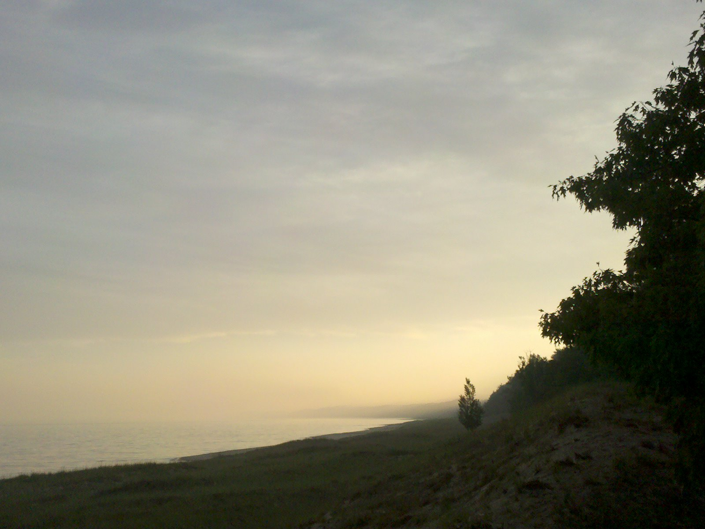

[Listen](audio/poetry-0063.mp3)

Oh it was cold that morning, 
the sudden change came without warning.

While the sunsets are over the sea, 
the sunrise, must rise from behind dunes.

There are no dunes taller than these, 
they are ancient, born of frozen seas.

The deer were the first to rise, 
to them belonged the sunrise.

There is a place where the dunes part, 
by some unknown art.

The deers come out, 
it is their lake, no doubt.

When the sun finally made it, 
the warm air rolled down the dune.

The symphony of the ancient forest, 
perfectly in tune.

Then the birds rose, 
and their breakfast followed.

Two eagles came by, 
to keep an eye from the sky.

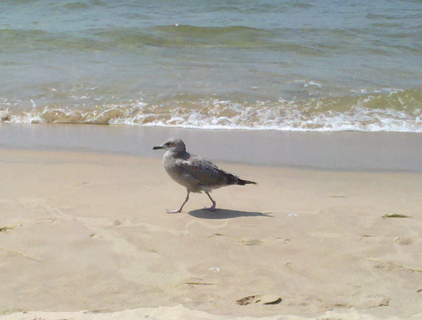

My beloved Seagull friend and I rejoiced, 
another perfect morning.

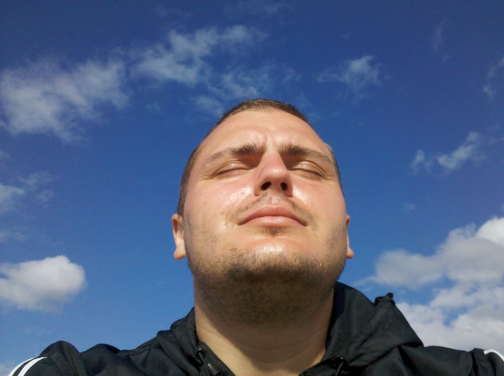

(My seagull friend's name is Bob. 
I called them all Bob.

I had difficulty telling them apart, 
but I sure got their names right.

Seaguls, are the kittens of the sea, 
and they are all very mighty.)

  

## Don't Be Scared
### May 6th 2020, 10:45:58 pm EDT
<meta itemprop="dateCreated" datetime="2020-05-07T02:45:58.991Z">

[Listen](audio/poetry-0062.mp3)

If everyone seems scary, 
that's only because scary is all you've ever met.

I've met them too, I saw what they can do. 
How sure of themselves, how forward and blind.

But, if you spend your life in hiding, 
they will win, and rob you of everything precious.

So rise, begin taking care of yourself, 
and begin your search.

Not a search for mere friends, 
but a search for The Extraordinary.

  

It is simple. 
My friends.

The only way to find The Extraordinary, 
is to become Extraordinary yourself.

  

If you got hurt before, 
then you have already come a long way.

You now hold a gift of Wisdom, 
a Foresight that can spare suffering.

No one is to take Love of Life from you, 
no one is to rob you of Joy and Laughter.

Grab an [audio-book](https://librivox.org), 
get to know the [local Museums](https://www.dia.org/).

Learn.

  

## Love Yourself
### May 6th 2020, 10:46:58 pm EDT
<meta itemprop="dateCreated" datetime="2020-05-07T02:46:58.991Z">

[Listen](audio/poetry-0061.mp3)

If you don't care about yourself, 
People will get scared of you.

Because, if you get hurt, 
you will hurt them too.

You have to watch yourself, 
be compassionate to yourself.

  

Ask...

Is working too many hours a day, 
helping or harming me?

Are Office Walls, 
helping or harming me?

Does loneliness help you? 
Or does it harm you?

Same for getting scared, 
Does hiding really help you?

  

Overwork and Office is unhealthy, 
take those skills, and [build](https://www.youtube.com/watch?v=ZoqgAy3h4OM).

Take it [outside](https://www.youtube.com/watch?v=68jy3_ABvRo), 
let Nature nurture you.

In her silence, 
she will help you remember who you are.

You must learn to treat your body with compassion,

You must learn to take Great Care of our mind.

And please, 
make every day count.

We are so beautiful, 
such powerful dreamers.

Above All,
Love Yourself.

  

## Big Things
### May 6th 2020, 10:47:58 pm EDT
<meta itemprop="dateCreated" datetime="2020-05-07T02:47:58.991Z">

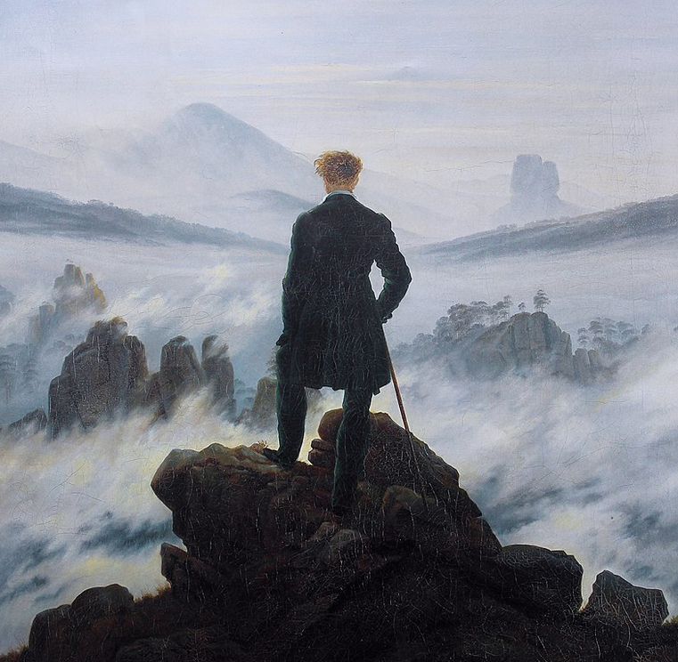

[Listen](audio/poetry-0060.mp3)

My friends, as mighty as we are, 
we can only do one thing at a time.

Once you take care to choose the big things well, 
the one thing before you...

is what the big thing will depend on, 
do it well.

  

Small things will sneak up on you, 
and I am so sorry for that.

It is the job of our Teachers to help us, 
but today there are very few.

You have to accept the responsibility, 
you must fight for wisdom at all cost.

In the absence of teachers, 
you must become your teacher, it is your right.

  

If you fail to educate yourself, 
people will use you.

They will use the best of you, 
Your Generosity, Your Kindness, Your Might.

They will pay you less, 
and trick you to thank them that you still have the job.

They will replace you with younger people, 
come your Golden Age, to save a dollar.

Come a tragedy, 
they will use it to make you work harder.

  

All of this is hard to see, 
it brings so much relief and pleasure.

It feels so right to choose, 
but you are so much more than a worker.

You must ask, if the path that you are on, 
is worthy of the Magnificent Being you are.

  

You are meant to become a Great Being, 
you have to climb to see the Big Things.

Even as a Great Being, my friends, 
always look to the Big Things.

Do not waste your precious time, 
to achieve that which [crumbles](https://en.wikipedia.org/wiki/Ozymandias).

Look towards real things, 
things that really last.

(Images courtesy of Wikipedia, [Wanderer above the Sea of Fog](https://en.wikipedia.org/wiki/Wanderer_above_the_Sea_of_Fog), [Ozymandias Collossus](https://en.wikipedia.org/wiki/Ramesseum))

  

## Maximum over Minimum
### May 6th 2020, 10:48:58 pm EDT
<meta itemprop="dateCreated" datetime="2020-05-07T02:48:58.991Z">

[Listen](audio/poetry-0059.mp3)

We must Always wisely choose Maximum over Minimum, 
because the minimums will attack our mind and body.

When hoping to live life to the fullest, 
we have to choose the big things very carefully.

Health, is an example of a big thing, 
everything we do, must stand in support of it.

Time, is a big thing, 
everything we do, must count.

We must frequently ask, 
"Is this event harming or helping me?"

We must frequently ask, 
"Will this matter in six months, or next year?"

We must ask, 
"What are the regrets of my older self?"

Because only you can judge yourself, 
you must grow in wisdom, and age gracefully.

Do not miss the point of life - 
You are meant to become a Great Being.

You are to search and find the Light of Your Life, 
and discover a way contribute to Wisdom.

  

## Authenticity
### May 5th 2020, 9:47:17 pm EDT
<meta itemprop="dateCreated" datetime="2020-05-06T01:47:17.000Z">

[Listen](audio/poetry-0058.mp3)

While not everything can be planned, 
authenticity and learning go hand in hand.

Some lessons can get pretty tough, 
but will fix us, sure enough.

When life gets sad or feels no good, 
it may be something you misunderstood.

And our views will shift, 
and we'll convert that bad into a gift.

Pretenders, can't learn this way, 
always in the dark, be it night or day.

They walk an alien path, 
darkness and wrath.

There is nothing there to fix, 
it's all an incomprehensible mix.

To live on a spectrum opposite of devious, 
makes each day connect with the previous,

And as days add up, they make you stronger, 
and your steps travel even longer.

Each day turns into gifts and rewards, 
you stop being played, and create your own chords.

Authenticity is a superpower, 
it will help you rise, and you'll never cower.

Day after day you become more powerful, 
this is how we become truly beautiful.

It will help you finish what you start, 
and your life, will become, a work of art.

  

## Convergence
### May 4th 2020, 10:52:08 pm EDT
<meta itemprop="dateCreated" datetime="2020-05-05T02:52:08.130Z">

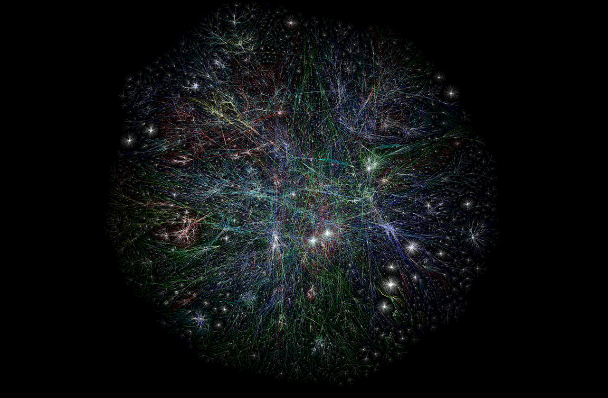

[Listen](audio/poetry-0057.mp3)

Every way of thinking about the world, 
brings us closer together, despite, what we are told.

There is just one little thing to keep in mind, 
we have to leave all the bad ideas, behind.

Exchange of ideas came a long way, 
but we still need to eliminate foul play.

Because not everyone is educated, 
and without wisdom life gets complicated.

Misinformed people are easily swayed, 
they are often unprepared, and very scared.

If we build to remove their fears, 
they will love us... to tears.

The most powerful early-tool is the Audiobook, 
wisdom delivered in a way that's hard to overlook.

It is private, and comes with no shame, 
it can take a person from poverty to Hall of Fame.

And the best type of things to listen to, 
are memoirs or lectures, that enlarge a world view.

We must stop bad education from tearing us apart, 
we each have to learn, and become smart.

This day of Wisdom, and Peace that we yearn, 
comes closer each day that we learn.

(image courtesy of [Opte Project](https://en.wikipedia.org/wiki/Opte_Project))

  

## Harold and Wally
### May 3rd 2020, 10:34:27 pm EDT
<meta itemprop="dateCreated" datetime="2020-05-04T02:34:27.184Z">

[Listen](audio/poetry-0056.mp3)

Bicycling some years ago, out thirty miles away, 
along a road, and an ancient highway.

I found an overpass where I could perch upon, 
and I discovered I wasn't really alone.

I figured it was the a huge love story, 
about a boy named Harold and a girl named Wally.

She was a Book Worm, a Hero, and a Graffiti Artist, 
and Harold loved her because she was the Smartest!

Wally fell in love with Harold, 
as she knew he was a Poet with a Heart of Gold.

In 1980 some 40 years ago, 
the two adventurers gave it ago.

They set off for Center State, 
and that became their Longest Date!

It all their walking, it never rained, 
and it never too sunny, neither complained.

They waked holding hands together for a hundred miles, 
their adventure was amazing, nothing but smiles.

When they finally arrived at Mount Pleasant, 
Harold quietly gave Wally her present.

It was a little book of foolish rhyme, 
that Harold wrote over a long stretch of time.

They both just happily turned 57, 
their life together is pure Heaven.

Both are super smart, extremely young, and very strong, 
their sweet love for each other, is lifelong.

They still do their Mount Pleasant walk, 
holding hands for days, sleeping-in until nine o'clock.

Harold makes really, really good Vegan Lettuce Wraps, 
and Wally is a master at reading Maps.

They've been to all kinds of interesting places, 
and they always arrive with beaming and smiling faces.

[Here](https://goo.gl/maps/U6ei19ABd6xffTcr6) is where I took the [photo](https://goo.gl/maps/kkGAfW13PLsA6H3D8) few years ago, 
just in case any of you guys want to go.

  

## Our Extended Family
### May 2nd 2020, 10:15:24 pm EDT
<meta itemprop="dateCreated" datetime="2020-05-03T02:15:24.397Z">

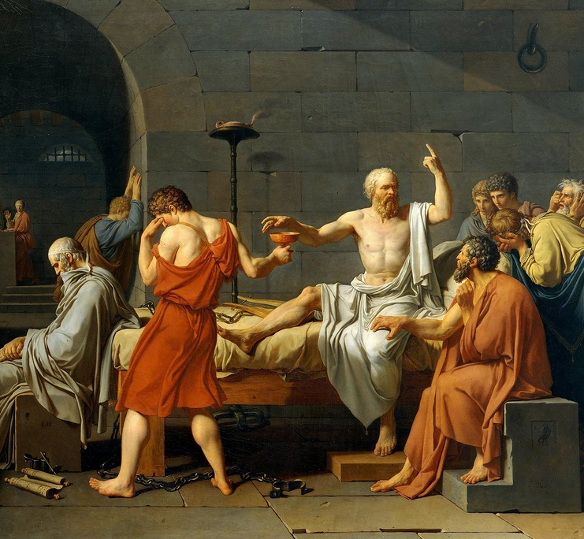

[Listen](audio/poetry-0055.mp3)

There is a very special group of people, that many have forgotten, 
our Intellectual Foremothers and Forefathers.

They brings us gifts wrapped in the primitive art of writing text, on paper. 
It is frequently all they had, it was the only way to reach us.

They are brilliant, and healthy, and unbroken, and triumphant, 
they are full of light, more than history will ever tell us.

Nobody who outlives an empire, will have their history shown for the lovely thing it was. 
This served to protect them, and it failed to erase them.

We must never allow ourselves to merely listen to history, 
because those are always writ by prevalent powers, it was their job to erase them.

More modern Philosophers had the same problem, 
Our friend, Dear Friedrich, and what a Warrior...

Was smeared by the Nazis, he was so powerful, that everyone wanted a piece of his might. 
Friedrich Nietzsche hated what Nazis stood for.

Recently, one of the Great Modern Philosophers was under attack, it deeply hurt and frightened her, 
but her classrooms rose for her with noting but love and continued admiration.

We are tasked with bringing the light of our hearts, and resurrecting those who passed, 
not by merely understanding their books, but by understanding what they were trying to say.

And it is OK, to understand them in our own way at first, 
it takes time, to befriend someone, from a book, across time.

Yes, all we have to go on, is text on paper. 
But we know they were just like us, they were All Too Human, friendly, and of good cheer.

If they made mistakes, these Great Beings were not stained for long, 
they rose, and they took their miserable failures, to create gifts of prevention for us.

These gifts are complex, they are as complex and nuanced as You and I. 
It takes hard work to inherit gifts this powerful.

The only way to unwrap those Gifts of Wisdom is with Admiration, Friendship and Love, 
schools teach us to see Great Beings as these synthetic monoliths of concrete.

But nothing could be further from the truth, because all these Great Beings, 
they were once kids, and teenagers, they had heartaches, dreams and hopes.

They were just like you and I, but they invented ideas that they cared to share, 
and they rose to the challenges of leadership to preserve them.

Those ideas are our intellectual inheritance, 
here is my attempt to name a few for your pleasure.

*   [Angela Davis](https://www.youtube.com/results?search_query=Angela+Davis)
*   [Avital Ronell](https://www.youtube.com/results?search_query=Avital+Ronell)
*   [Ayaan Hirsi Ali](https://www.youtube.com/results?search_query=Ayaan+Hirsi+Ali)
*   [Ayn Rand](https://www.youtube.com/results?search_query=Ayn+Rand)
*   [Friedrich Nietzsche](https://www.youtube.com/results?search_query=Friedrich+Nietzsche)
*   [Beloved Hypatia](https://www.youtube.com/results?search_query=Hypatia)
*   [Immanuel Kant](https://www.youtube.com/results?search_query=Immanuel+Kant)
*   [Simone de Beauvoir](https://www.youtube.com/results?search_query=Simone+de+Beauvoir)
*   [Ludwig Wittgenstein](https://www.youtube.com/results?search_query=Ludwig+Wittgenstein)
*   [Martha Nussbaum](https://www.youtube.com/results?search_query=Martha+Nussbaum)
*   [Mary Wollstonecraft](https://www.youtube.com/results?search_query=Mary+Wollstonecraft)
*   [René Descartes](https://www.youtube.com/results?search_query=Rene+Descartes)
*   [Socrates](https://www.youtube.com/results?search_query=Socrates)
*   [Silvia Federici](https://www.youtube.com/results?search_query=Silvia+Federici)
*   [Søren Kierkegaard](https://www.youtube.com/results?search_query=S%C3%B8ren+Kierkegaard)
*   [More](https://en.wikipedia.org/wiki/Lists_of_philosophers)

  

## Become A Great Being
### May 1st 2020, 9:08:47 pm EDT
<meta itemprop="dateCreated" datetime="2020-05-02T01:08:47.380Z">

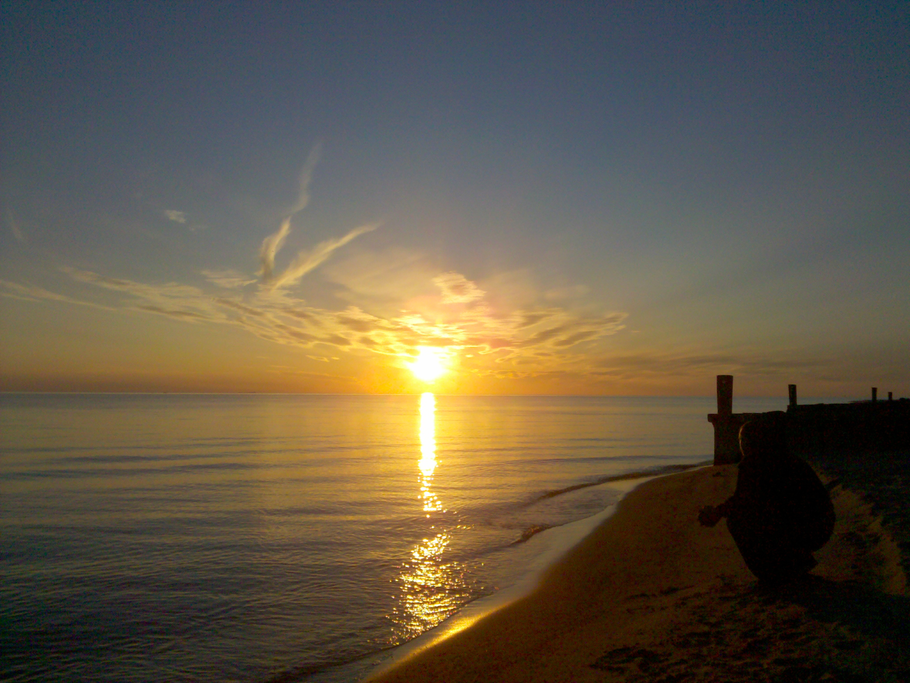

[Listen](audio/poetry-0054.mp3)

If you want change, you can't continue doing the same things you've always done. 
If you really want change, then you are going to have to alter your course, now.

If you don't fight back, you will always lose, 
and if you stay in the dark, you will only add to the darkness.

There cannot be a compromise between good and evil, 
a compromise only takes from the good, and only give s to the evil.

Your office window, is not a substitute for a Call to the Wild, 
Your next promotion does not actually make you a greater person.

A vacation, cannot set you free, it is not a substitute for nature. 
Dressing beautifully, has never made a person truly beautiful.

Waiting for that perfect someone, will not help them notice you. 
Trusting that someone else will help you, is just another delay.

And just getting out there, is not enough to be understood. 
And going out, following friends, can only put you on somebody else's path.

Life is not hard, it only gets complicated when you follow, 
because by following you just end up in places you don't understand.

You must lead. And you must keep walking forward. Your own step, after your own step. 
In your own direction, towards the things that move you, only then can You be Trully Moved.

It must the correct combination of books, poems, steps, events, summers, and epochs. 
Do not try to hurry, do not change roads, only move up, only think, and envision, and grow.

That which leads to Your Greatness, to Your Freedom, to Your Nature, requires, Truth. 
Walk your own path at your own pace. Only the correct key, can set your mind free.

The others who seem to have it all right. 
Often get lost on alien paths, and merely put on a happy face.

While it seems like you are trapped today, you are not, it is just an illusion. 
Look towards the car keys.

That is all it will take. Grab the keys and go. 
It will be very difficult at first.

The toxic build up that is keeping you from getting up, right now, 
takes three days to crumble. It is a heavy cage.

But there is a way. 
A simple way.

Grab the keys, and go... i275 south, merge onto 75 south, 
and take it all the way down... Florida Keys, US Highway One.

If you live in Florida, then you are headed for Michigan's Upper Peninsula. 
If you live West, your destination is all the way East.

It is not the destination, it is the Journey, my Friend. 
Take your time, watch the cage crumble and fade as you go.

Only the important things, will stay. 
And you'll get to see yourself again.

And you'll get to be free again, 
you will resume where you left of.

A life of bondage, 
is not worthy of you.

Life is not meant to be a cage, or cruel, or frighten you. 
You knew this as a child, and you let that slip away, not even noticing when it went.

It is your Right to resist being pushed into places that you don't want to be in. 
It is your Right to reject conditions that you never agreed to, that you were pushed into.

How else can the Universe be worthy of us, how else can our lives be beautiful. 
Heaven and Paradise are real, but they are now, right now. Now.

How can people love you, when your own love for yourself is slipping away. 
You have to. You have to accept the responsibility for your Health, and Dignity.

You don't have to make it all the way, the first time, 
and you don't have to leave your phone behind.

You can call this therapy, or a vision quest, you can call it a road trip. 
You are not allowed to live in a cage, of whatever constitution, that will make you ill.

It comes to you naturally to take care of your body, 
but your mind also requires care.

When you reach your Freedom, you'll know what to do next, 
it can be another trip, East, or West.

If you feel trapped, the Universe is darker for it. 
Take a week. Or two. Forty days is best. call it your Quarantine.

Unless you clear you mind, and focus on what is important, 
on you and those worthy of your care, you will lose it.

You will forget the beautiful person you truly are, 
you will fall from heaven, and forget about paradise.

And life will turn into a black and white TV show. 
You must take good care of your mind.

If there is no one else that cares about you, 
then look at this poem.

I care. 
Hi!

I am, speaking for you! 
grab the keys, or bicycle, or comfy shoes, and go.

Go, and never again, let go.

Your health is important. 
Your well being is important.

A Human Being is Meant to Learn, 
A Human Being is Meant to Rise.

You are meant to filled with Wisdom, 
with Joy and Love of Life.

You are meant to Laugh, 
Truly Fully Laugh.

Listen to me, there is more. 
You Are Meant To Become A Great Being.

  

## A Warrior is She that thrives and triumphs where’er She be
### April 30th 2020, 8:39:24 pm EDT
<meta itemprop="dateCreated" datetime="2020-05-01T00:39:24.000Z">

[Listen](audio/poetry-0053.mp3)

from [The Warrior Book](https://westland-valhalla.github.io/warrior/)

A Warrior is She that thrives and triumphs where’er She be. 
You cannot be broken, you must use your misfortune to light your way.

You can learn anything you want, there are no smarter. 
They are just actors, with a handful of fragile lessons, crafted to impress.

There is nothing that can break you, there are no stronger. 
Look to the source of the pain, it comes from Innocence.

Nothing rooted in Innocence is ugly, all lessons that come from being tricked, 
add up to make you more beautiful, enable your insight and foresight, and fuel your authenticity.

When the regrets come at night, that's just you brain asking you, 
to think harder, to comprehend your beauty in full,

No one can trick you, not for long enough. So, don't be scared. 
Memoirs, Audio-books, Lectures will show you how many better people there are.

We all have to Enlarge our Worlds daily. 
Audiobooks, and Lectures, will show you that all you have met thus far were just the same type of person.

Do not be afraid to rise.

The people, or person you have long though about, exist. 
But before they can see you, you have to rise, and shine, and be seen.

Don't be scared.

Those who will use your Love, Innocence, Endurance and Generosity against you, 
have long been lost, they are blinded, and fractured, and damaged, and broken.

They hold no power over you.

If their attacks continue they will grind themselves to dust, 
and all the experiences that will be left in their wake, will make you stronger and better.

Battles make you stronger, smarter, more beautiful. 
You are a Warrior, that's the oldest name for it.

A Warrior is She that uses the harm that came her way as energy, 
who understands none can stay a child and all must grow, and enlarge their worlds.

A Warrior can never be damaged, or hurt -- a Warrior Learns. 
A Warrior resists tears in the rain, just like she can resist weakness.

We live in a fragile world, full of fragile people, with fragile egos, 
they speak fragile advice, with fragile words; from their fragile hills.

A Warrior does not wait to be taught. 
A Warrior learns fastest on her own.

Learn in the sequence that fits you best, 
learn at the pace that helps you most.

Push the dark imaginings back, 
and rise.

Move your hand. 
And push up. 
And stand up.

Get ready to walk, 
and then run, day, after day, slightly longer.

And then lift your weights, the way you learned to run, 
and then lift for longer, and never rest.

And then, with your sweetest audio-book.

Step. 
Step Up. 
Rise Up. 
To No End.

This is The Life Of A Warrior.

Nothing Can Crush You, 
Nothing Can Hold You.

Don't You See?

Everything Makes You Stronger, 
Everything Makes You Fight Longer.

You, 
Are A Warrior.

  

## I Could Talk About Them All Day
### April 29th 2020, 8:57:01 pm EDT
<meta itemprop="dateCreated" datetime="2020-04-30T00:57:01.000Z">

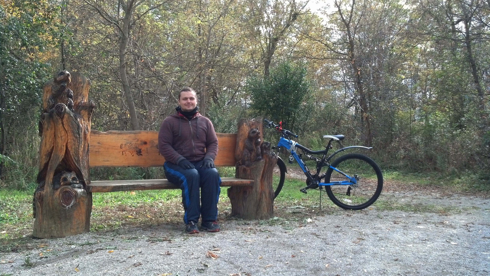

[Listen](audio/poetry-0052.mp3)

Somehow, Wednesday turned out to be the tiniest day. 
I was quiet all day, slowly programming away.

I've been thinking about my bicycle, birds, and rain, 
but mostly working on my new website domain.

My bicycle trails have been calling me all week, 
I prepared my bicycle and am I ready, so to speak.

There was much rain today, 
it will take a few more days, before I pedal away.

It is not always about the adventure, 
I love how all the spring trees smell.

How the birds sing in the morning, 
how the air is crisp and new.

I never set a plan as to how far I will ride, 
I just get on the bicycle and enjoy the outside.

Every once in a while I perch upon an overpass, 
scribble code, or just watch the cars sometimes.

There are many memorable places along the way, 
they are all very tiny and hidden away.

Old graffiti, sculptures and parks, abandoned railway, 
I could talk about them all day.

  

## At the Center of The Being
### April 28th 2020, 7:27:30 pm EDT
<meta itemprop="dateCreated" datetime="2020-04-28T23:27:30.660Z">

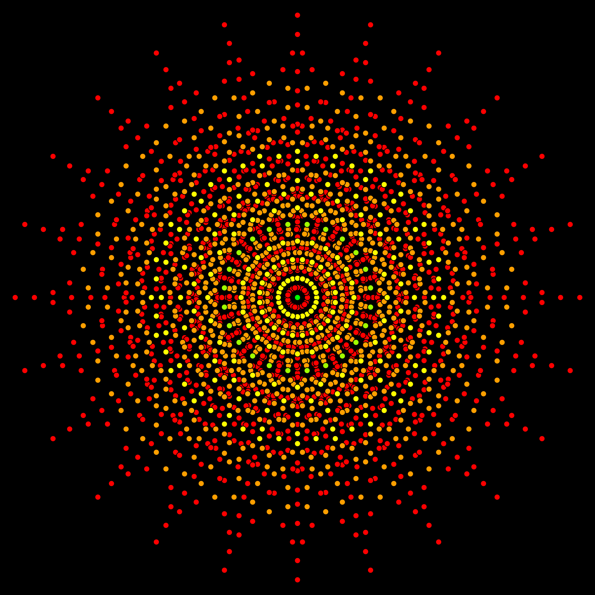

[Listen](audio/poetry-0051.mp3)

At the center of our being, 
we each have a collection.

It makes us unique, 
but we never lose our connection.

As with all things in life, 
it is too easy to get lost in strife.

We have to protect what makes us unique, 
if you fail, your future will be bleak.

With all things we do, 
sometimes the bad guys slip through.

This is what we need courage for, 
to look them in the eyes, and slam the door.

The unique collection at our center, is our power. 
It transforms, and evolves, hour after hour.

We start with just the Ocean, Skies, Mountains, Stars, Earth and Mars, 
maybe Flowers, Gardens, Kittens, Dogs, Horses and Frogs.

But then it grows, call it soul, or spirit, personality or vitality, 
it becomes... Beauty, Endurance, Authenticity, Nobility, Love and Dignity.

And it keeps growing, so as long as you Love Yourself,

It creates Leaders, Protectors, Guides, Teachers, Dreamers, 
Adventurers, Explorers and Discoverers, 
Intellectuals, Humanitarians, Philosophers, 
Scientists, Astronomers, 
Dancers, Athletes, Bodybuilders, 
Chefs, Blacksmiths, and Makers, 
Musicians, Poets, Sculptors, Photographers and Filmmakers, 
Artists and Designers, 
Hackers and Programmers, 
Genius... 
Visionaries... 
Founders....

You have to protect what makes you unique at all cost, 
if you start letting go, you will become lost.

And many will come, and many with care and kindness, 
and they will try to change you, in their blindness.

You cannot grow up, if you start letting go, 
you need an unbroken chain, you need that flow.

You have to learn to say, 
that it's either you, the one one who stands and is true, 
or you are through.

To grow up, into who you need to be, 
is your right, and your dignity.

To let bullies push you around, 
is to fail, and falter, 
and run aground.

Decades, decades after they are long gone, do not let go, 
do not take their turns, do not change your view, 
you must aim to become worthy of you.

Whether you believe in Heroes, 
on that we are only Human.

It is the same height, 
just a maximum of our might.

Push, and stand up, and aim up, and rise, 
Open your eyes, 
it is the only way to become wise.

Fight for who you are, 
because in time, 
that fight is also for who you need to be.

For who you need to be, 
to be strong and healthy, 
and unbreakable and worthy.

  

## Amazing Grace
### April 27th 2020, 2:50:43 pm EDT
<meta itemprop="dateCreated" datetime="2020-04-27T18:50:43.242Z">

[Listen](audio/poetry-0050.mp3)

As I woke up this morn, 
I knew my recreational programming schedule will be torn.

I put on my slippers, and I shuffled down stairs, 
and begun slowly sorting through all my kitchen wares.

For today, is my Spring Cleaning day, 
and I will have little time to play.

I wished and washed, and sloshed and swished, 
in the end all my cleaning sponges looked squished.

To complete my mission, I had to update my fire alarms, 
so I grabbed my ladder, and put tools under my arms.

My bendy scissors, and my rusty screwdriver 
that looks like I stole it from a scuba diver.

And climbed, my three little steps, 
all the while flexing my triceps.

When I finally made it to the top, 
the little screw wouldn't fit, so I got down and poked it with my mop.

I said, "This a job for 'mah power-tools, 
I need my drill, this ain't no job for fools."

I cannot describe to You with what amazing grace, 
I made that hole, and fireproofed my place.

As I was making my way down, 
I almost felt like I earned a crown.

But, when I reached the bottom, I found a screw, 
I must have dropped it... it was brand new.

But! In the end I made it all work, 
and muttered, "Guess, I am not such a dork."

Now, when I look up and tilt my head, 
I can see it... slowly blinking red.

  

## School Is Not For Us - Run, Child. Run From The Bus.
### April 26th 2020, 7:10:06 pm EDT
<meta itemprop="dateCreated" datetime="2020-04-26T23:10:06.000Z">

[Listen](audio/poetry-0049.mp3)

Don't let them put you on a school bus. 
Tell you parents, school is crazy!

And anyway, 
they shouldn't be so lazy.

You will need all the games, 
and you memorize _no_ presidential names.

You demand a trip to every national park. 
because you will not spend you life in the dark.

You will need every audio-book ever made, 
and only then will you go through life unafraid.

  

## Yearn To Learn
### April 26th 2020, 6:51:16 pm EDT
<meta itemprop="dateCreated" datetime="2020-04-26T22:51:16.000Z">

[Listen](audio/poetry-0048.mp3)

Did you know, that we can't grow, 
unless our lessons connect together? 
We learn the way we navigate cities.

If we leap from one city center, to another... 
we will not know, where to go, or what to do. 
None of the roads will make any sense.

To divide knowledge into subjects, 
and encourage cramming, and memorization, 
and force remembering over understanding.

That is not Education, or Knowledge. 
We can no more leap between subjects, 
than hobbies, or families.

What connects two things together, 
is as important as the things themselves.

We only learn when two connect, 
and, then the two connect to a third one, 
and next one, to no end.

We need a pleasant memorable, 
unbroken chain of curiosities, 
that we can slide up and down, when need be.

Disconnected snippets, 
that we not know what to do with, 
are not useful to us.

  

## Trickster Fool
### April 26th 2020, 4:31:13 pm EDT
<meta itemprop="dateCreated" datetime="2020-04-26T20:31:13.000Z">

[Listen](audio/poetry-0047.mp3)

Think of a trickster, a real bad fool.

What a great robbery it would be. 
If your parents sent you to college. 
And teachers sold disconnected snippets. 
And called it knowledge.

And wouldn't it be convenient, 
if you could chose you next batch. 
Wouldn't the trickster rejoice, 
had you called, that, a choice.

And then at the end of the day. 
When hard earned money was taken. 
You wouldn't even be shaking, 
even though it was worse than a break-in.

Think of a trickster, a real bad fool, 
that took away your very own school.

The moral of this story, 
is that you should think through, 
when someone offers to teach you.

Education, requires that you learn on your own, 
that something that teaching can only postpone.

  

## Unbreakable and Unlimited
### April 25th 2020, 8:28:14 pm EDT
<meta itemprop="dateCreated" datetime="2020-04-26T00:28:14.602Z">

[Listen](audio/poetry-0046.mp3)

Captain's Log Supplemental, Quarantine, Day Forty.

We are born to run our fingers through infinity, 
be it Wright Brothers or Yuri Gagarin, Galileo Galilei.

It is our right to touch the greatest of heights, 
and it is our privilege to cheer for each other in triumph.

We have no flaws, no ugliness, no weakness, and no limit, 
be it Tenzing and Hillary, or Viktor Emil Frankl.

Nothing can stop us, 
there are no bars thick enough, 
there are no bars strong enough,

"We are the Captains of our Souls, 
And The Masters of Out Fate"

However, there is a culture that we must never let go of,

The culture of, Love of Wisdom, 
The culture of, Inheritance of Knowledge.

If we are tricked to reject Wisdom, 
and if there is no teacher or parent, 
or friend left to remind us, 
then all will be lost.

Your work will not set you free, 
it is a lie as old as slavery.

Your teachers can only remind, 
but they cannot reach into your mind.

Fight for your right to knowledge, 
there is no university, 
there is no college, 
you have to use your heart to learn, 
only you can do that.

Without Inheritance of Wisdom, 
you will become cursed to start at zero.

As magnificent as your battle will be, 
you will only reach a path, that was walked countless times before.

You must start, 
where the greatest minds [left off](https://en.wikipedia.org/wiki/Category:Science_communicators).

  

## Flight and Light
### April 25th 2020, 5:23:19 pm EDT
<meta itemprop="dateCreated" datetime="2020-04-25T21:23:19.000Z">

[Listen](audio/poetry-0045.mp3)

Captain's Log, Quarantine, Day Forty.

Everything is all right, except for our flight. 
But had we been given infinite light, 
our wings would fail in flight.

What gives us the right to learn, and rise to height, 
is the limit of the duration of our light.

What makes it precious, and worth the flight, 
is precisely the limits in duration of our light.

It is by our limits that we look to light, 
had we been given infinite flight, 
our intelligence would fail to light.

  

## Tomato With Sprinkles
### April 24th 2020, 10:18:21 pm EDT
<meta itemprop="dateCreated" datetime="2020-04-25T02:18:21.042Z">

[Listen](audio/poetry-0044.mp3)

Captain's Log, Quarantine, Day Thirty Nine, 
A vegetable juice out of line.

The Tomato with Sprinkles was born of accident, 
when making my salad, this is how it went;

The salad bag tore, 
and some of the salad went on the floor.

But a fistful, fell in my tomato juice, 
and decorated it with sprinkles of produce.

It is hard to recommend, but I must say, 
it tasted great, and I'll drink it everyday.

  

## Amazing Diet
### April 23rd 2020, 9:36:49 pm EDT
<meta itemprop="dateCreated" datetime="2020-04-24T01:36:49.000Z">

[Listen](audio/poetry-0043.mp3)

Captain's Log, Quarantine, Day Thirty Eight, 
My salads are working great!

I have lost even more weight, 
and I can't even count how many I ate.

It is a marvelous diet of incredible proportions, 
I don't track my calories, or even my portions.

I just make a salad once or twice, 
and with strawberry jam, it tastes like paradise.

And yes, I still continue improving and experimenting, 
Today, I added Jalapenos for a little spicy augmenting.

It is a strange magical thing, 
but Sugary Jam and Jalapenos are king.

It is not all sugar and spice, as yesterday I cried, 
I added and ate an whole onion so angry, I almost died.

So it is not just strawberry jam anymore, 
blueberry works just as well, maybe even more.

To all the diet people out there, 
join me in my venture, 
add a spoon jam, 
and taste the adventure.

  

## I Miss Old Programming Languages
### April 22nd 2020, 9:46:11 pm EDT
<meta itemprop="dateCreated" datetime="2020-04-23T01:46:11.372Z">

[Listen](audio/poetry-0042.mp3)

Captain's Log, Quarantine, Day Thirty Seven. 
I can't believe that seven only rhymes with Eleven, and Heaven.

Every ten days I get stuck rhyming those two words, 
and it is just about as fun as petting birds.

I was writing [Bash](https://www.youtube.com/watch?v=2hz7-v2f1sA) this afternoon, 
I am so full of energy, I feel like a loon.

I was so tired at eight yesterday, 
I have no idea how I will fall asleep today.

I wrote a [non-capturing](https://www.youtube.com/watch?v=xW4CdejMNPA) Perl [Regular Expression](https://www.youtube.com/watch?v=ykSuHWhh5hc) in [sed](https://www.youtube.com/watch?v=32waL1Z9XK0), 
gosh I miss the old [Perl](https://www.youtube.com/watch?v=E2JJZVqe97I), I miss [CGI](https://www.youtube.com/watch?v=9Zx1vEmaQMc), and I miss [ed](https://www.youtube.com/watch?v=BNYpmLH6IjQ).

What has the world become after [abandoning modes](https://youtu.be/PUv66718DII?t=2490), 
and how strange have become our codes.

Using [SASS](https://www.youtube.com/watch?v=St5B7hnMLjg) writ in [C++](https://www.youtube.com/watch?v=kJkB_Tggk8U), 
to make [CSS](https://www.youtube.com/watch?v=gT0Lh1eYk78)? What a mess!

And beyond that, with [async/await](https://www.youtube.com/watch?v=PoRJizFvM7s), 
[JavaScript](https://www.youtube.com/watch?v=9A_jkh2AKR8) has become a heavy weight.

I always tell people if you make for the web, 
use the [language, of the web](https://www.youtube.com/watch?v=nGvA92h9IbU).

They then look at me accusingly, 
parading [Python](https://www.youtube.com/watch?v=Y8Tko2YC5hA), [PHP](https://www.youtube.com/watch?v=mBL9Athx7ms) or [Dart](https://www.youtube.com/watch?v=5KlnlCq2M5Q), maybe [Java](https://www.youtube.com/watch?v=2Xa3Y4xz8_s)?! amusingly.

Come on people, this is not our first rodeo, 
Time took out Perl with a torpedo.

This is war, and those who fall behind lose, 
If you write for the web, use the [language, of the web](https://www.youtube.com/watch?v=nGvA92h9IbU).

Your utilities will hang around longer, 
and your accomplishments will be that much stronger.

  

## Everybody Counts
### April 21st 2020, 9:29:53 pm EDT
<meta itemprop="dateCreated" datetime="2020-04-22T01:29:53.978Z">

[Listen](audio/poetry-0041.mp3)

Captain's Log, Quarantine, Day Thirty Six. 
Today has been an interesting mix,

We have to be strong, 
and go far and long.

We can't sit around, 
looking at the ground,

We are each a hero, 
and none are zero.

Everybody counts, 
care for each other amounts,

It amounts to Happiness and Cheer, 
and all the Wonders we hold Dear.

  

## Every Now And Then
### April 20th 2020, 7:05:47 pm EDT
<meta itemprop="dateCreated" datetime="2020-04-20T23:05:47.100Z">

[Listen](audio/poetry-0040.mp3)

Captain's Log, Quarantine, Day Thirty Five.

I am not sure that the end of quarantine will ever arrive, 
so I am preparing to write enough poetry to fill a hard drive.

I think I shall begin writing about cats, 
and then complain a bit about bureaucrats.

When I am done complaining, 
I shall pick something more entertaining.

Like perhaps musing about Lowbrow Art, 
and then carry on babbling about someone smart.

Maybe a Scientist, or a Philosopher like Descartes, 
or maybe a colorful leader like Napoleon Bonaparte.

Then, when, I'll run out of things to babble on, 
I will jump on my bicycle and set off at dawn,

I'll bring my notepad and a pen, 
and come up with a new idea, 
every now and then.

  

## Buckle and Goat
### April 19th 2020, 10:28:30 pm EDT
<meta itemprop="dateCreated" datetime="2020-04-20T02:28:30.917Z">

[Listen](audio/poetry-0039.mp3)

Captain's Log, Quarantine, Day Thirty Four.

I finished a big program, but I am ready for more.

So, I am writing a poem, and its always very hard, 
because I never know what its going to be about.

One moment, I am mighty, serious, and athletic, 
then I sit to the poem, and I lose that aesthetic.

In my early 20s I wore a Blues Brother suit for office work, 
but even that didn't work, cause I added cowboy-shoes, 
and a huge buckle, not a day past when I didn't get a chuckle.

Later it got even worse, I wore leather pants and a Matrix coat, 
I fit into my coffee shop like a mountain goat.

Being serious is just too darn hard, 
I don't have the might,

OK, that's enough for this poetic flight, 
I am done writing, y'all have goodnight.

  

## Rise To The Greatness
### April 18th 2020, 8:45:14 pm EDT
<meta itemprop="dateCreated" datetime="2020-04-19T00:45:14.349Z">

[Listen](audio/poetry-0038.mp3)

Captain's Log, Quarantine, Day Thirty Three.

Days pass by quickly, but as all the clocks tick away, 
we mustn't keep our minds at bay.

We each have extraordinary powers, 
and we can expand our knowledge, 
in just a few hours.

All it takes is a video lecture, 
or maybe an audio-book, 
you don't even have to look.

Hours add up, day by day, 
building, a new passageway. 
It is knowledge that sets us free.

And our inheritance from great beings, 
is the key.

We mustn't forget, that everyone needs to learn, 
not merely listen, but break out of their prison, 
and rise to greatness, when theirs is the turn.

It is within us, that each great being should return, 
it is how the world grows, it is how you get your turn.

So, rise to their height, inherit their might, 
shine the brightest of light, 
yours is the future, yours is the fight.

  

## Iron Horse
### April 17th 2020, 10:53:05 pm EDT
<meta itemprop="dateCreated" datetime="2020-04-18T02:53:05.373Z">

[Listen](audio/poetry-0037.mp3)

Captain's Log, Quarantine, Day Thirty Two,

I thought about my bicycle, my trail,

the morning dew.

When there is no gym,

I get up real early,

and ride on through,

It is magical out there,

seeing the world from the other side,

people stuck in traffic,

and here I ride.

I discovered modern architecture

of the highway underpass,

little woodland parks,

endless fields of grass.

Five miles out,

there lives an angry goose,

at seven miles,

in deep summer, angry 'squitoes on the loose,

Ten miles out,

there is a ninety degree turn,

and emptiness follows,

nothing but deep green fern.

Fifteen miles out,

a whole new city,

two new parks,

and the road gets gritty.

At twenty miles,

the real adventure starts,

you better have water,

and some street smarts.

And if you keep going forward,

you'll arrive on a pier at Lake Erie.

At first you'll feel pretty weary,

until you realize you're 30 miles from your bed,

at which point things will get pretty mad.

Hope you have trailmix.

Cause you're gonna need it.

To find you way back.

and keep pushing those pedals.

It will get dark soon,

but upon your return,

you'll fall into your comfy bed,

with a long, dramatic swoon,

  

## Super Salad
### April 16th 2020, 9:52:06 pm EDT
<meta itemprop="dateCreated" datetime="2020-04-17T01:52:06.930Z">

[Listen](audio/poetry-0036.mp3)

Captain's Log, Quarantine, Day Thirty One,

I've been programming all day, but now I am done.

I coded colors, design, music, a whole ballad,

but now my mind has fixed its aims on a salad.

I've been trying to invent one that tastes really nice,

one that someone could even eat twice.

And I did! as I always do,

Just add Strawberry Jam, a dollop or two.

No need for dressing,

it tastes like a blessing!

Just squirt some jam,

mix it up and Bam!

  

## Computers Are Slow
### April 15th 2020, 10:49:34 pm EDT
<meta itemprop="dateCreated" datetime="2020-04-16T02:49:34.356Z">

[Listen](audio/poetry-0035.mp3)

Captain's Log, Quarantine, Day Thirty,

I've been fixing bugs all day, and I feel dirty.

Now, that I fixed them all,

I must admit, I had a ball.

But, computers are slow,

My CPU is slower than a BBQ.

I tried to build a rhyming dictionary,

but it came out as an 8 megabyte webpage,

and nearly erased the internet.

In computers, everything is really bad,

but this never makes me sad, I am glad.

And now,

I took a shower,

and smell great,

my only wish,

is that I already ate.

  

## Artist and Art
### April 14th 2020, 9:17:02 pm EDT
<meta itemprop="dateCreated" datetime="2020-04-15T01:17:02.012Z">

[Listen](audio/poetry-0034.mp3)

Captain's Log, Quarantine, Day Twenty Nine,

I spent the day doing Graphic Design.

Making art and poetry is quite fun,

though with the aid of computers, easily overdone.

I've been doing this for so long, that I've learned,

that, on computers, brevity is the Mother of Invention.

I am a huge fan, of the UNIX command line,

of the various little ways to get things done.

Graphic design, takes a different path,

it takes a while to switch between the two.

Programming languages, is where I spend most of my time,

its an in-between world, betwixt the two.

I've been programming Music and Art,

It turned out not to be that hard.

At the end of the day, what matters is the Masterpiece,

it matters not if it comes from Computers, Music or Art,

So as long as you finish what you start, and use your hart,

you are an Artist, and what you make, is Art.

  

## Cogitate and Percolate.
### April 13th 2020, 11:37:07 pm EDT
<meta itemprop="dateCreated" datetime="2020-04-14T03:37:07.557Z">

[Listen](audio/poetry-0033.mp3)

Captain's Log, Quarantine, Day Twenty Eight,

It's evening and it's late,

Time for another poetic update,

I sit here, and yet again, cogitate.

It actually feels pretty great,

I look forward to my little poetry date.

And I always try to really concentrate,

turn everything off and meditate.

Let all those rhymes percolate.

Let all those words decorate.

Poetry is a universe in self,

it won't always let you write what you are trying say.

I just want to rhyme something funny,

write about weather or how its sunny.

But each poem has a mind of its own,

each one is a kind of a milestone.

There is a thousand ways to get to the end,

but it all depends if the message is,

what you intend.

  

## I write.
### April 12th 2020, 10:45:44 pm EDT
<meta itemprop="dateCreated" datetime="2020-04-13T02:45:44.310Z">

[Listen](audio/poetry-0032.mp3)

Captain's Log, Quarantine, Day Twenty Seven,

Ohh, I waited to write until eleven.

It seems late at night,

but this is when my rhymes take flight.

I admit, I am ready for bed,

but I am just going to sit here, instead,

and wait for my poem to go ahead.

Nuh uhh, rhyming is not always easy,

sometimes you just got to to wait, and take it easy.

Wait for the prime rhyme,

to top of your mind... climb.

And then finally, when you get there,

you sit, read, and stare,

feeling like the poem, is a little bare.

But what can you do? It's late at night,

and you are not really feeling very bright.

But you still have to write,

so that's quite all right.

This is how I begin my night,

I write.

  

## As Good As Fingers
### April 11th 2020, 10:49:24 pm EDT
<meta itemprop="dateCreated" datetime="2020-04-12T02:49:24.911Z">

[Listen](audio/poetry-0031.mp3)

Captain's Log, Quarantine, Day Twenty Six,

I eat with metal chopsticks.

I stopped using forks,

to munch my porks.

I don't even know how long ago it was,

so long ago, I forgot the cause.

I own two metal chopsticks,

and they work as good as fingers.

I use them to eat my salads,

to scoop out Jelly and Peanut Butter,

I kid you not, I even use them as a little cutter.

A dull stick is just fine to turn a sausage in two.

And of course, I stir many a tea, or protein brew.

I do not miss the dangerous forks,

though once, in a blue moon,

I wish, I owned a spoon.

  

## Citizens of The World
### April 10th 2020, 11:42:57 pm EDT
<meta itemprop="dateCreated" datetime="2020-04-11T03:42:57.257Z">

[Listen](audio/poetry-0030.mp3)

Captain's Log, Quarantine, Day Twenty Five,

Yesterday, Bernie dropped out.

I didn't even try to wait, you can't place this much weight.

And what were we expecting?

It has always been like this, hit and miss.

It is time for all, to rise.

Become a Citizen of The World. In your own hands.

With your own mind. Seek Knowledge and Triumph.

Let the name of this New Nation be, Earth,

May the Citizen be called, a Human.

The power is in your hands, so near,

rooted in every audio-book you can hear.

And you have to lean to rise,

you can't near the skies,

without your eyes!

When you have learned enough, you have to turn around and teach.

Yell from your mountain, scream, dance and preach.

The promise of Freedom, Reason, and Peace,

is in our hands, it is our Masterpiece.

Education is [fun](http://catpea.com/warrior) it only ever seems hard,

because one is trying to learn too much in too little time.

The only way we can fully learn,

is by inheriting knowledge from World's most beloved Heroes.

This inheritance begins by following in their footstep, first;

and continues, when we break away to resume where they left off.

Rise, rise to the mountains before you.

The only way,

is to go up,

to grow up,

to grow all the way up,

until we each become a Great Being.

Same as those before us,

same as those that are sure to rise.

Open Your Eyes.

The Time is Always Now.

  

## History of the World
### April 9th 2020, 9:35:43 pm EDT
<meta itemprop="dateCreated" datetime="2020-04-10T01:35:43.133Z">

[Listen](audio/poetry-0029.mp3)

Captain's Log, Quarantine Serserge, Day Twenty Four,

I am ready to jump into my bed like a big dinosaur.

I am dressed, I am wearing my favorite workout clothes,

I stretched left and right, and fluffed up my pillows.

For tonight, I prepared, a Bill Bryson Auidobook I adore,

Even though I am already so sleepy that I could snore.

I will listen about the [History of the World](https://www.audible.com/pd/A-Short-History-of-Nearly-Everything-Audiobook/B002V0KFPW),

about all the mysterious things and places we explored.

This is how I go to sleep every night,

the book will slowly play... until daylight.

I learned so much from online lectures and audio books,

that these days, I can focus on my good looks.

Oh, how I miss working out at the gym,

but I am still working hard to be slim.

Let us all be of good cheer,

quarantine will be over soon,

that is clear.

  

## Peanut Butter and Jelly
### April 8th 2020, 11:01:38 pm EDT
<meta itemprop="dateCreated" datetime="2020-04-09T03:01:38.615Z">

[Listen](audio/poetry-0028.mp3)

Captain's Log, Quarantine Fiveever, Day Twenty Three.

It was a super busy day, not a moment for tea.

And I keep Programming late into the night,

typing like a Lion with all his might.

This morn, I woke up and made Peanut Butter and Jelly,

I've been programming all day, I keep going like the telly.

Now, I am trying to figure out, a datatype for verse,

my stanza CSS padding and margins are intense.

I am not trying to be a hero, hey!

but I am writing this, in a [JavaScript Array](https://developer.mozilla.org/en-US/docs/Web/JavaScript/Reference/Global_Objects/Array)!

I don't know if there is anymore I can say,

other than that I am OK,

and that this has been an OK day.

No wait, I'll add this:

I wish everyone pure bliss!

  

## Save The Files
### April 7th 2020, 9:41:32 pm EDT
<meta itemprop="dateCreated" datetime="2020-04-08T01:41:32.088Z">

Captain's Log, Eternal, Quarantine, Day Twenty Two.

Eeeeek! It's raining, I am trying not to be complaining. 
But the sky is no longer blue, what am I to do?

Each time I sneeze, the power goes out, 
not to say my sneezes are not petite, or that I am ill!

No, I am perfectly fine, I don't need to blow my nose. 
It is the transformer outside that blows!

Frantically, atomically I hit CTRL+S, CTRL+S, save, save. Saves, 
as the thunderous thunder thunders its electromagnetic waves.

How am I going to finish, how can I upload, 
when any moment something will explode, 
and there will be nothing where current once flowed.

While the rain has slowed, my fingers still tapping, 
Save, save, save! rise! against the Gigawatt Wave.

Seriously, please remember to save your files, 
this can only result in more smiles.

Also, please remember to backup your files. 
As that's even better, by miles.

  

## Make Each Day Count
### April 6th 2020, 7:25:25 pm EDT
<meta itemprop="dateCreated" datetime="2020-04-06T23:25:25.662Z">

Captain's Log: Quarantine.

Day Twenty One.

There is birdsong outside, and I can feel the sun.

I woke up rested, for the first time, in years.

My mind was hardly ever tired, but all the rest needed time.

I am ready for gyms to reopen, It will be so much fun.

I will dance even faster, workout longer.

My diet is twice as good as it was before,

including soup, and proper portion control.

It took twenty one days,

for my body to begin recovering from my workouts.

What a great sadness it would be, to wish now,

that I should have danced, or tried harder.

Instead, here I am. Bouncy, and perky as heck,

Ready to go back.

Use your days wisely,

let no day slip away.

Live, make each day count,

it all adds together, balance your account.

What makes us great,

is the sum of all the days in the past.

What makes us strong,

is making each day better than the one before.

Make each day count,

enlarge your world.

  

## The Ballad of Meow
### April 5th 2020, 11:23:24 pm EDT
<meta itemprop="dateCreated" datetime="2020-04-06T03:23:24.501Z">

Captain's Log: Quarantine. Day Twenty,

the promised day of rhyme a plenty.

I am sitting here with my salad,

expecting to write world's littlest ballad.

I waited until the conclusion of day,

to see with what rhymes that may pay.

Alas, twenty just about rhymes with plenty,

it rhymes as good as yeti and orange.

On the other hand Twenty One,

rhymes with all under the sun.

I am sitting here smacking my lips,

Counting down 90 days to Penumbral Eclipse.

I made little sausages to add to my salad,

I added really spicy dressing to spruce up my ballad.

My Little Fort (note orange tent in the center)

As I grilled the little things, I remembered that same smell,

it was back when I lived in the ancient dune wilderness.

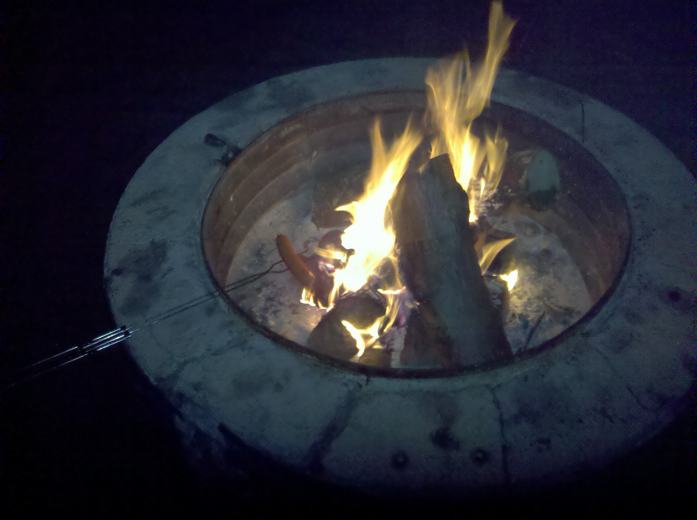

Little Sausage Dinner

That memory really rings a bell,

It was at the height of my loneliness.

My Evening Couch, as I waited for Lake Michigan Sunsets

Deep woods, ancient dunes,

and warm and sunny afternoons.

Deep in Woods

Not all afternoons were sunny, I once got a heck of a reminder,

One cold afternoon I remembered that I get scared of thunder.

And My Evening Wear

Not, little thunder of course,

the scary ones, that always strike with great force.

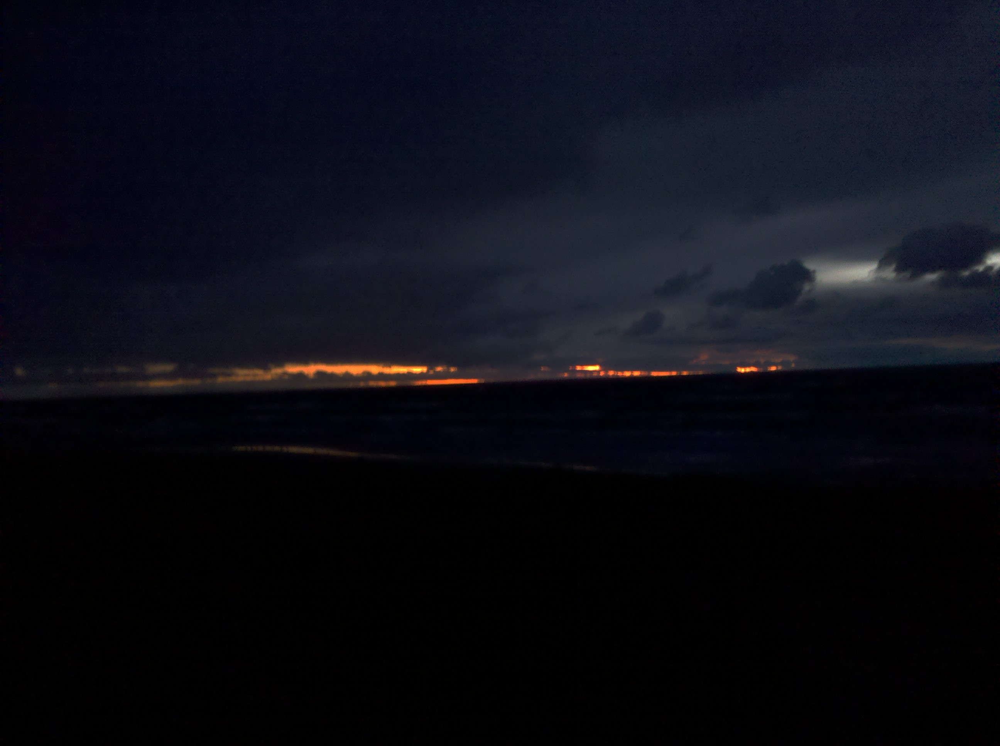

Dark Evening

It was almost never scary, certainly never scary for long,

it would pass, and moon or sun would rise, followed by birdsong.

People taking photos of my Horses

I remember by the beach many stood,

as I built horses out of driftwood,

Horse 2.0

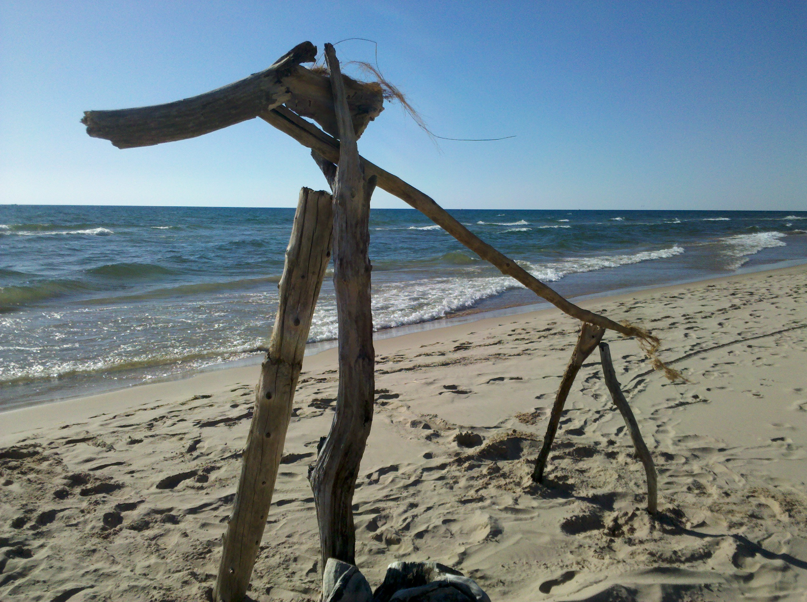

Horse 3.0

The height of my loneliness,

also came with a great deal of silliness,

Beach House

Beach House

I waived to the future, and to today,

Look at me, I am a Cowboy! Say, Hey!

Howdy!

  

## All Things Special
### April 4th 2020, 9:04:04 pm EDT
<meta itemprop="dateCreated" datetime="2020-04-05T01:04:04.832Z">

Captain's Log: Day Nineteen of Quarantine.

Tomorrow, day twenty may have rhyme a plenty,

but it won't rhyme with quarantine, and that was unforeseen.

I waited all day to write,

to see if something interesting may bite.

I wanted to draw and paint, and dance and prance,

but ended up discovering a new [poem about taking chance](https://www.youtube.com/watch?v=k6_QUhUPrF4).

I ended up programming, music and art,

I aimed to do something relaxing, but smart.

Such are meow days, and had been forever and more,

searching for all things special and all the things I adore.

Now, I am finishing today's poem, one foot already in bed,

Though I already had my salad, I wonder if I should make some bread.

That's sounds about right,

I'll waddle downstairs and grab a bite.

Goodnight.

  

## Teacher
### April 3rd 2020, 7:59:02 pm EDT
<meta itemprop="dateCreated" datetime="2020-04-03T23:59:02.881Z">

Captain's Log: Day Eighteen of Quarantine.

Researching, learning, computers being mean.

It must be Friday, the eve of Eighteen,

I peeked outside and I think the trees are turning green.

But the squirrels, again, they act so weird,

smart little kitties worried that everyone disappeared.

Speaking of weird, programming is such a fun game,

I am convinced it is unhealthy, but I think that's a shame.

My computer programs kept me company since I was nine,

I was so little, and already learning the command line.

Alas, the time doth fly,

as we grow older we must take to the sky.

We have to learn beyond what is at our fingertips,

and set aims for all those leaderships.

We should pamper our talents, can't leave them behind,

as we grow older they'll play a very important role in our peace of mind.

My readers, we are each charged with becoming Teachers,

share our knowledge, become Reason's own preachers.

The Future is only as bright as Her Humanity,

we are Her dignity, Her keepers of sanity.

So, search for [video tutorials](http://catpea.com/warrior),

maybe open a book,

and take a look.

  

## Workout Video
### April 2nd 2020, 4:04:32 pm EDT
<meta itemprop="dateCreated" datetime="2020-04-02T20:04:32.068Z">

Captain's Log: Day Seventeen of Quarantine.

Found two bugs in code, and got stuck in between.

I was supposed to be working on a Sound Machine,

but spent the noon formatting the code to keep it clean.

I can't believe, there is a bug in my code,

its probably in octicons, because I am using node.

Worst of all, I can't see it fail until I publish,

because sapper likes static as not to be sluggish.

So here I am, finally dressed up like Superman,

Debugging code, blind, like a veritable caveman.

I did a bit of soul searching,

then followed with some researching.

Now, I am sitting here, contemplating if I need a cape,

wondering if I should follow up with an Audiotape.

I could finish up getting in shape,

and completely change the workout landscape.

I am serious about making a workout tape,

I really want to get in shape.

What if the workout required wearing a tail?

Would it become like super holy grail?

I would walk the street and people would pale,

"Sir! Why have you done this?

You, are a Whale!!!"

  

## Missing Underpants
### April 1st 2020, 12:35:20 pm EDT
<meta itemprop="dateCreated" datetime="2020-04-01T16:35:20.987Z">

Captain's Log: Day Sixteen of Quarantine.

Keeping it serious like Wolverine.

I have decided not to rhyme,

I really haven't got the time.

I must leave the thieving Squirrels behind,

yes, really, I don't mind.

Today, is a new day, I am completely serious,

I am going to ignore everything hilarious.

I am not even joking, I'll ignore those furriers,

I won't even pay attention to their funny scurries.

I will sit here quiet,

tending to my amazing diet...

A stray thought bubbles to my idle mind,

Oh, no, I hope people won't go blind!

I think I am going to YouTube my workout dance,

Now, where the heck did I put my underpants?

  

## Squirty Squirrels
### March 31st 2020, 12:20:21 pm EDT
<meta itemprop="dateCreated" datetime="2020-03-31T16:20:21.586Z">

Captain's Log: Day Fifteen of Quarantine,

Squirrels continue being mean.

They just aren't very keen, on the idea,

that their theft gave them diarrhea.

I know not what to do,

Darn Squirrels! that Trailmix was not for you!

Maybe someday we'll move on,

come a sunny day, carry on.

But today, is not that day,

it's just Tuesday.

This is getting out of control,

I don't want to be a poet anymore!

I just wanted to feed the creatures I adore.

Not write strange rhymes out the front door.

I must stop rhyming,

this is not the right timing.

I feel like I've lost control,

spiraling down a Squirrel Hole.

I swear I am not like this in real life... I can change!

  

## Lawn Flurries
### March 30th 2020, 9:11:22 am EDT
<meta itemprop="dateCreated" datetime="2020-03-30T13:11:22.278Z">

Captain's Log: Day Fourteen of Quarantine,

All the local squirrels, now hold me in high esteem.

They feel munchies to extreme,

but the trailmix they stole is gone,

flurries of the box still scattered on my lawn.

Squirrels, now crazed, and withdrawn.

Peanuts on their mind,

because mail delivery was ill timed.

Why am I like this?

  

## Must Dance
### March 29th 2020, 9:14:44 am EDT
<meta itemprop="dateCreated" datetime="2020-03-29T13:14:44.761Z">

Captain's Log: Day Thirteen of Quarantine;

still staring at my screen,

hanging on for dear life to my spleen

as I drink another coffee bean,

trying, trying not to create a scene,

dancing dressed red outside my window;

during quarantine.

  

## The Birds Are Going Wild Outside My Window
### March 29th 2020, 7:14:44 am EDT
<meta itemprop="dateCreated" datetime="2020-03-29T11:14:44.761Z">

The birds are going wild outside my window.

Probably because of all the Plump Squirrels I've been feeding.

Dammit.

  

## Ragrets
### March 28th 2020, 6:31:17 pm EDT
<meta itemprop="dateCreated" datetime="2020-03-28T22:31:17.209Z">

Captain's Log, Day Twelve of Quarantine. I ordered some trailmix from the internet, mailman dropped it off by the door and all the local Squirrels I've been feeding came over, ripped the box open, and ate it. How rude, I probably shoudn't have been feeding them all this time.

  

## The Beat Sequencer
### March 27th 2020, 9:12:01 am EDT
<meta itemprop="dateCreated" datetime="2020-03-27T13:12:01.513Z">

Captains Log, Star-date Day Eleven. I connected the Beat Sequencer to Sound. Click on any of the tiny boxes and when the loop comes around the sound will fire. Tip: put a drum every four squares, and something that makes a Tsk every other square. Music is really-really simple, like language, music evolved with us, all it takes is sticks and places to hit them with. Actually we don't even need sticks [Tuvan Singing](https://youtu.be/V76psBrEypg?t=611)

  

## Shebang Genre
### March 26th 2020, 7:56:25 pm EDT
<meta itemprop="dateCreated" datetime="2020-03-26T23:56:25.371Z">

Quarantine Day Ten. My arms grew so powerful from all the rest that I mistakenly struck myself several times. I busied myself today relearning how to handle all my amazing strength. Renamed Hash Bang to [Shebang](https://en.wikipedia.org/wiki/Shebang_(Unix)), as it is the most commonly used variant. Begun working on a beat sequencer, and a song maker. The idea here is that Chords, Bass, Melodies can all be handled by the [Arpeggiator](https://github.com/Tonejs/Tone.js/wiki/Arpeggiator), but the beat is a bit more complex, and needs a little tool. The tool I have up today uses re-styled checkboxes, a perfect fit for the sequencer.

  

## Soundboard
### March 25th 2020, 7:33:22 pm EDT
<meta itemprop="dateCreated" datetime="2020-03-25T23:33:22.740Z">

Captain's Log: Ninth Day of Quarantine: I found one more chicken, am ready for dinner. I created a small [Soundboard](https://en.wikipedia.org/wiki/Soundboard_(computer_program)) for what is basically a tiny collection of LOFI Hip-Hop sounds. A tiny collection will do, because we have the the synthesizer taking care of everything else. I added some Hip sounds to the THE WARRIOR Album Single and it does sound very well. Realistically it is difficult to call it music at this point, I have all the components but there were bugs along the way. [Svelte Sapper](https://sapper.svelte.dev/docs#Server-side_rendering) is complicated to visualize, it pre-creates some things, meaning before I publish to the website, Sapper will create a pre-ran version of the site. When a visitor visits, the pre-ran (pre-generated static version) will then be upgraded to a real version, and replaced by now running live version. It is the correct technology, and it didn't get me, but it does take a moment to figure out when a bug jumps out of nowhere.

  

## The Warrior Album Single
### March 24th 2020, 5:11:29 pm EDT
<meta itemprop="dateCreated" datetime="2020-03-24T21:11:29.310Z">

Captain's Log Supplemental: Day Eight and Half... of Quarantine. I almost finished eating my 30 day supply of Chicken, my muscles have tripled in size, and I have the strength of 300. I begun releasing a New Album entitled **THE WARRIOR** Inspired by [TRON](https://www.youtube.com/results?search_query=Tron+Legacy) and [LOFI Hip-Hop](https://www.youtube.com/watch?v=mVxLhy1v-xU).

  

## Sciurine Song MP3
### March 24th 2020, 11:18:57 am EDT
<meta itemprop="dateCreated" datetime="2020-03-24T15:18:57.286Z">

Added mp3 preview for the Sciurine Song. You can also [download](http://catpea.com/sciurine.mp3) it (Public Domain License).

  

## Sciurine Instrumental Section
### March 24th 2020, 9:36:42 am EDT
<meta itemprop="dateCreated" datetime="2020-03-24T13:36:42.106Z">

Captain's Log: Eighth day of the quarantine. I have extended the Sciurine Instrumental Section with a Beautiful Thin Saw (a Sciurine Favorite) and a powerful Electric Cello backing a [Tree Trunk](https://github.com/Tonejs/Presets/blob/gh-pages/instrument/Synth/TreeTrunk.json) Synth. As nothing like this has ever been heard on Planet Earth before, the song has risen all the way to the very top of Shire Lyre Squire Squirrel Choir charts and is expected to stay there permanently, forever.

  

## Tremolo Effect To The Sciurines In Memphis Song
### March 23rd 2020, 8:46:35 pm EDT
<meta itemprop="dateCreated" datetime="2020-03-24T00:46:35.352Z">

On the Seventh Day of Quarantine I Added Tremolo ([LFO](https://en.wikipedia.org/wiki/Low-frequency_oscillation) effect) to the Sciurines in Memphis song (it is used in the second movement \[middle of the song\]), and made our imaginary band a sick medieval logo. All my generative music uses [Scientific Pitch Notation](https://en.wikipedia.org/wiki/Scientific_pitch_notation), take that Mozart. It looks like the CPU requirements are too high for mobile devices, small price to pay for a taste of Medieval [Sciurine](https://www.dictionary.com/browse/sciurine) Pop. [Ship it!](https://www.quora.com/On-GitHub-what-is-the-significance-of-the-Ship-It-squirrel?share=1)

  

## Added High Fidelity Mode For Dehydration In Memphis
### March 23rd 2020, 4:32:49 pm EDT
<meta itemprop="dateCreated" datetime="2020-03-23T20:32:49.019Z">

Added High Fidelity mode for Dehydration in Memphis, it should be possible to \[almost\] play it on mobile now (need a speedy CPU), though it is kind of not the point. The real value in the HD toggle is hearing the actual Synthesizer without any HD filters.

  

## Added Membrane Synth Drums To The Dehydration In Memphis
### March 23rd 2020, 9:41:42 am EDT
<meta itemprop="dateCreated" datetime="2020-03-23T13:41:42.846Z">

Added membrane synth (Drums) to the Dehydration in Memphis Generative Album (It sounds like the [T-800](https://en.wikipedia.org/wiki/Terminator_(character)) is collaborating with the [Sciurine Poor-Fellows](http://www.scp-wiki.net/scp-2050), and he's good.)

  

## Autogenerative Music Widget
### March 22nd 2020, 4:14:25 pm EDT
<meta itemprop="dateCreated" datetime="2020-03-22T20:14:25.929Z">

Day Six of Quarantine: Created a New Autogenerative Music Widget and disguised it as an immature [Sciurine](https://www.dictionary.com/browse/sciurine) Urine joke. The technology is extremely advanced. I am for the first time in forever connecting virtual synthesizers through a [Reverb Convolver](https://tonejs.github.io/docs/13.8.25/Reverb). This reshapes the Synthesized Sounds, the synthesizer waveform, into a more realistic sounding instrument. Reverb just about does it, if Commodore 64 came with a decent reverb it would sound amazing, nothing like chiptunes. I have gotten used to breaking up my Generative Music into movements, and the initial song comes with 24 measures, where evey eight measures I do something interesting with the higher pitched instruments. For the most part I fell like using A Basic [Arpeggiator](https://github.com/Tonejs/Tone.js/wiki/Arpeggiator) for everything, I am yet to test it with real world sound samples (digital sound recordings as opposed to synthesizer based sounds.)

  

## Day Five Of Quarantine...
### March 21st 2020, 4:14:25 pm EDT
<meta itemprop="dateCreated" datetime="2020-03-21T20:14:25.929Z">

Day Five of Quarantine...

  

## Day Four Of Quarantine...
### March 20th 2020, 4:14:25 pm EDT
<meta itemprop="dateCreated" datetime="2020-03-20T20:14:25.929Z">

Day Four of Quarantine...

  

## Day Three Of Quarantine...
### March 19th 2020, 4:14:25 pm EDT
<meta itemprop="dateCreated" datetime="2020-03-19T20:14:25.929Z">

Day Three of Quarantine...

  

## Day Two Of Quarantine...
### March 18th 2020, 4:14:25 pm EDT
<meta itemprop="dateCreated" datetime="2020-03-18T20:14:25.929Z">

Day Two of Quarantine...

  

## Day One Of Quarantine...
### March 17th 2020, 4:14:25 pm EDT
<meta itemprop="dateCreated" datetime="2020-03-17T20:14:25.929Z">

Day One of Quarantine.

  

