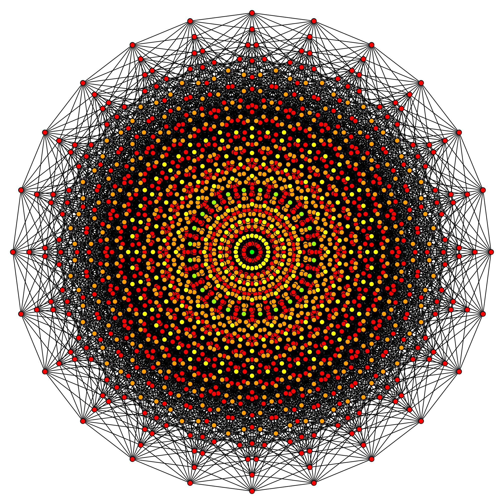

[Listen](audio/poetry-0051.mp3)

At the center of our being, 
we each have a collection.

It makes us unique, 
but we never lose our connection.

As with all things in life, 
it is too easy to get lost in strife.

We have to protect what makes us unique, 
if you fail, your future will be bleak.

With all things we do, 
sometimes the bad guys slip through.

This is what we need courage for, 
to look them in the eyes, and slam the door.

The unique collection at our center, is our power. 
It transforms, and evolves, hour after hour.

We start with just the Ocean, Skies, Mountains, Stars, Earth and Mars, 
maybe Flowers, Gardens, Kittens, Dogs, Horses and Frogs.

But then it grows, call it soul, or spirit, personality or vitality, 
it becomes... Beauty, Endurance, Authenticity, Nobility, Love and Dignity.

And it keeps growing, so as long as you Love Yourself,

It creates Leaders, Protectors, Guides, Teachers, Dreamers, 
Adventurers, Explorers and Discoverers, 
Intellectuals, Humanitarians, Philosophers, 
Scientists, Astronomers, 
Dancers, Athletes, Bodybuilders, 
Chefs, Blacksmiths, and Makers, 
Musicians, Poets, Sculptors, Photographers and Filmmakers, 
Artists and Designers, 
Hackers and Programmers, 
Genius... 
Visionaries... 
Founders....

You have to protect what makes you unique at all cost, 
if you start letting go, you will become lost.

And many will come, and many with care and kindness, 
and they will try to change you, in their blindness.

You cannot grow up, if you start letting go, 
you need an unbroken chain, you need that flow.

You have to learn to say, 
that it's either you, the one one who stands and is true, 
or you are through.

To grow up, into who you need to be, 
is your right, and your dignity.

To let bullies push you around, 
is to fail, and falter, 
and run aground.

Decades, decades after they are long gone, do not let go, 
do not take their turns, do not change your view, 
you must aim to become worthy of you.

Whether you believe in Heroes, 
on that we are only Human.

It is the same height, 
just a maximum of our might.

Push, and stand up, and aim up, and rise, 
Open your eyes, 
it is the only way to become wise.

Fight for who you are, 
because in time, 
that fight is also for who you need to be.

For who you need to be, 
to be strong and healthy, 
and unbreakable and worthy.
