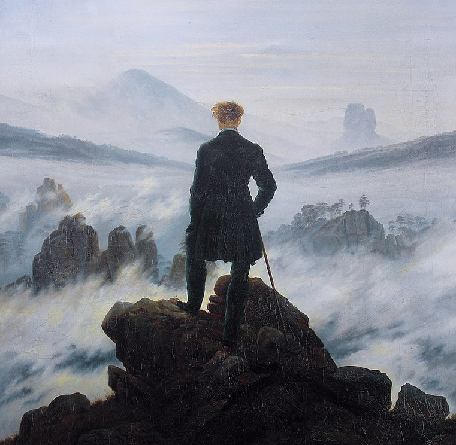
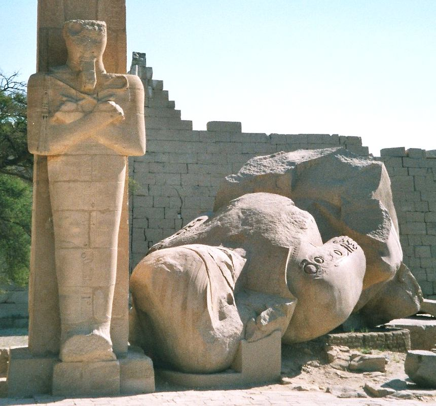

[Listen](audio/poetry-0060.mp3)

My friends, as mighty as we are, 
we can only do one thing at a time.

Once you take care to choose the big things well, 
the one thing before you...

is what the big thing will depend on, 
do it well.

  

Small things will sneak up on you, 
and I am so sorry for that.

It is the job of our Teachers to help us, 
but today there are very few.

You have to accept the responsibility, 
you must fight for wisdom at all cost.

In the absence of teachers, 
you must become your teacher, it is your right.

  

If you fail to educate yourself, 
people will use you.

They will use the best of you, 
Your Generosity, Your Kindness, Your Might.

They will pay you less, 
and trick you to thank them that you still have the job.

They will replace you with younger people, 
come your Golden Age, to save a dollar.

Come a tragedy, 
they will use it to make you work harder.

  

All of this is hard to see, 
it brings so much relief and pleasure.

It feels so right to choose, 
but you are so much more than a worker.

You must ask, if the path that you are on, 
is worthy of the Magnificent Being you are.

  

You are meant to become a Great Being, 
you have to climb to see the Big Things.

Even as a Great Being, my friends, 
always look to the Big Things.

Do not waste your precious time, 
to achieve that which [crumbles](https://en.wikipedia.org/wiki/Ozymandias).

Look towards real things, 
things that really last.

(Images courtesy of Wikipedia, [Wanderer above the Sea of Fog](https://en.wikipedia.org/wiki/Wanderer_above_the_Sea_of_Fog), [Ozymandias Collossus](https://en.wikipedia.org/wiki/Ramesseum))
