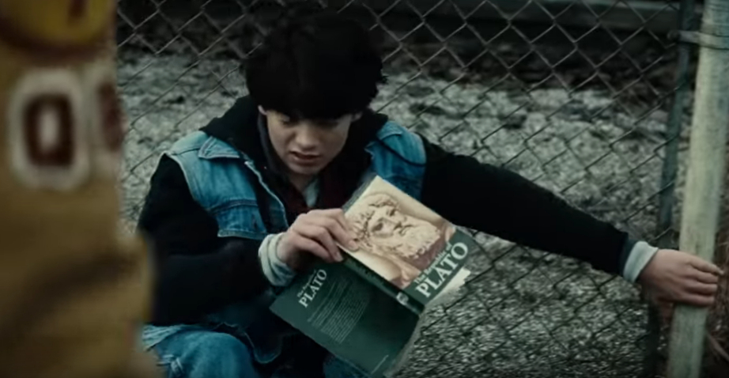

[Listen](audio/poetry-0075.mp3)

Well, from the first moment on,
we are asked if we should live in harmony.

We are still very young,
barely know of the world.

And already the question of harmony comes,
and in harmony we learn, and thrive.

Away from it, we'll be interrupted,
and feel lost in the void.

It is a simple choice,
but out minds are not ready to make it.

Often we forget.

We forget about our little gardens,
and all the little walks.

We forget how amazing it felt,
to stand on the wing of a plane.

We forget the taste of popcorn at the Zoo,
or even how enormous Zoo felt.

We forget pebbles at the river,
and mischievous squires at the park.

  

That little dog with a bark,
that scaredy kitten always hiding in the dark.

Our collection of unused keys,
and the box of bottle caps we collected with ease.

We forgot our Lego and the old bike,
with that seat that we used to really like.

We don't remember the Palaces and Castles,
that we used to love, and those swords, that fit us like a glove.

  

Everybody else came around,
acting like they know the ground.

But, this was our gift from the Universe,
an affinity for flowering gardens, and little passage ways, and all those flying planes.

It was a key to unlock our mind,
to understand the zoo, and our size in the universe, connect with pebbles at the beach.

It is a pathway that fits us best,
to love little creatures, and collect some shineys, and build with blocks, and ride far and wide.

It was to remind us,
to find our place among Great Beings, and study and pursue excellence, in all we do.

  

Then they sent us to First Grade,
and the weird kid peed into the Duplo, they didn't even have Lego.

Then the teacher graded you down for counting pebles in your pocket,
and did it so many times, you lost track.

  

There was a whisper about the pebbles,
it was Mr. Sagan - "You are made of Star Stuff."

And then the kids whispered...
to push you in the mud.

  

Push their laughter aside,
you'll need to Learn, and learn really hard.

Cause right now, you're in the mud,
and you need to hang on.

It will get worse,
but all you have to do is rise.

Each time,
you'll rise higher.

(Please call the Police, it is OK for little kids to call the Police, they'll love helping you, don't be scared.)

  

Third Grade,
Fifth Grade.

Low grade,
- Uh, but there can't be higher.

Because by this time, you're getting bad grades,
because the teacher thinks you're copying from somewhere.

The bullies know,
you did it on your own.

Saw you pacing for days,
with your first program.

Keep going forward,
don't let go - you're doing great, stay away from the hate.

  

By the time you're out of Eight Grade,
by rejecting crazy, and nonsense, and stupid, and lazy, you graduate above all others.

Because you didn't follow,
because you chose to study on your own, at your own pace.

Because worthless grades meant nothing,
you felt no stress.

Because, you didn't follow
nothing could hurt you.

And your world is yours,
truly-truly yours.

  

We unravel, when we forget who we are,
the moment we hide, or pretend, or follow.

And, gosh darn it,
it happens when we are still kids.

We are completely unprepared,
and none will help.

  

So you! have to keep it together,
you can't let anyone hurt your mind.

In High School, the pretenders make a sudden appearance,
never held a book in their hand.

The back of Hamlet,
all the quotes have more IQ.

Let the little Caesars,
keep the wind from the hall away.

You need to pace your reading at the library,
teach yourself focus.

Don't EVER! finish the books,
just get to the part that is valuable to you, and skip the rest.

  

Start working on your start-up early,
it is a study in failure.

You need to create a series of CONTROLLED FAILURES,
this is very important.

Learn [content management][1],
and figure out [billing][2]

That's your surface platform,
and think about nature of business.

Never try to build things directly,
facilitate the building of direct things for others.

Help them setup,
so that you are not burdened, and keep going.

Look at the structure of start-up accelerators, or even banks,
they take a percent, and never create what will weigh them down.

Eventually, you can build your own Tesla,
but at first, you start with services.

Look at the gym,
monthly subscription, is most stable.

The lessons, are all around you.

  

You don't need college,
but taking college classes is very relaxing.

Make sure you get a 4.0 at each class,
be ready to repeat it.

And enjoy,
the lectures.

College is just a toy,
it looks bad on your Portfolio, so hide it.

It is a very weak teaching experience,
and people know that there there is minimal learning involved.

Jumping from high school to start-ups is more impressive,
and shows that you chose knowledge over nonsense.

It shows that you chose to learn on your own,
to take care of your own mind,
rather than to pretend to learn for grades.

Authenticity is very important in life,
it is hard to connect with people that role play.

  

Bonding with people that are just acting,
is only functional for as long as they are acting.

But it is never good,
eventually they'll have a crisis, similar to a mid-life crisis.

Stay Authentic,
keep to to those who are Authentic.

Be safe.

  

When it feels like everyone else is having an amazing life,
and you are stuck.

Umm... that not true

But it is also not healthy to think this way about yourself,
you are not beneath the party goers, they don't have what you have in your mind.

  

But, that's far enough,
time to get some rest.

  

This is where it gets interesting,
you have primed your mind for Business.

That is a fine first step,
now you need to get ready for the real graduation.

You need to section hike the equivalent of the Appalachian Trail,
and measure your jogging a hundred miles at a time.

Section jogging, the Western States 100.

Mind and Body, for the rest of your life.

You must take good care of both.

  

At mile fifty, halfway through a run,
as you piece together your blurry thoughts of your next business.

Take some time to understand what it is that College Grads have,
those are very brittle relationships, and inflexible careers.

We all feel the promise, but we can't fake it,
it would be the opposite, and certainly not worthy of you, my Friends.

You can only find your meaning in Authenticity,
shortcuts will only take you back to the beginning.

To live among the Extraordinary,
you must become Extraordinary yourself.

  

The gateway to Meaning of Life,
is in that tiny moment when you think to your self:

"I am not going to jog tonight, I need rest."

Right there in that dot,
is the keyhole,
to the key that you are,
to the gateway that you need to open.

Life is not a simulation,
there are no days off,
life is quite a challenge,
and demands that each moment builds on the authenticity of the previous.

  

Open the dot, how can you yearn for Authenticity and Companionship,
and cancel, and fall short, and not enough, and rest some more.

The gateway between Ordinary and Extraordinary,
is in accepting that we haven't got a choice to make.

But shoes... to put on,
your Mind and Body must grow in harmony.

You must not let go of the Harmony,
of your Magnificent Existence.

Each small success, by subtle analogy,
pushes you forward, to your next step.

  

Eventually your tightly controlled business failures,
will fail, they will, fail to fail.

Your mind too,
it won't perceive the easy choice as an option.

All- will proceed,
in harmony.

  

Labored breathing,
by the Pine Trees at Western States,

Another great step in Automation of your business,
and more investors.

And you're no longer stopping at the first thing you find in books,
you understand all of it.

What is made by humans,
is also All Too Human.

  

And the Bullies are Gone,
and Eight Grade still sucks.

High school ... influences,
are trying to figure out where they went wrong - good luck!

College, is still a very romantic idea,
but it is best left to imagination.

Your dreams are so much more now,
only what you create can live up to them.

You are a Leader,
full of might an joy.

  

And now you know,
shortcuts only lead people to their beginnings.

And the one road, the only road,
was the one of Authenticity, and Achievement.

Where we learned for real, not for grades,
where what we learned added up to create wisdom, and not a stupid GPA.

You'll be OK, so as long as you Learn onward and become Wise,
and Live in Authentic Harmony with Yourself.

This is how you become an Adult,
that was the one thing that all others were missing.

It's what made them pretend and simulate,
but, growing up can't be faked.

Growing up has to be written by the choices you make,
on the surface, that is your lifetime.

The dreams you always dream, will come true,
but not in your childhood, childhood is for learning.

Live in Harmony with yourself,
and live in harmony with the Universe.

Growing up is really special,
it is really important for our health.

It is a deeply internal process,
and there are no shortcuts to growing up.

It is meant to be,
Beautiful.

[1]: https://www.youtube.com/results?search_query=content+management
[2]: https://www.youtube.com/results?search_query=stripe+wordpress
