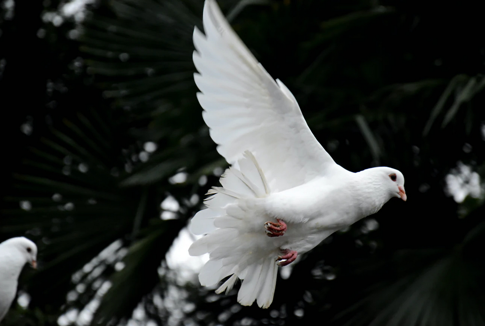

[Listen](audio/poetry-0077.mp3)

Nothing is what it looks like, 
because Human Beings, are not of the world of sequentially predictable machines.

Human Beings emerged, out of infinitely increasing complexity, 
by rules of infinite accidents along lines of fuzzy principles.

In a word, we are here because the Universe mixed it self for so long 
that the failure for life to occur became inconceivable.

And, we want to believe life emerged, on Earth, 
just like we wanted to believe that earth was the center of the Universe.

And we want to believe that Earth was the first to have life, 
my goodness, how much more special could we be, the first in the Universe.

Universe is a large place, that has been around for a long time, 
it is better not to think of anything cosmic, as that! special.

But there is one exception.

Once you come down to Earth, come up to Life, and look then Into The Conscious Self Aware Mind, 
that is no longer a common occurrence.

There is nothing normal about it, 
we are now at the limits of what the Universe could possibly conceive of.

No machine or hybrid can measure up to the raw power of unleashed consciousness.

Nothing partially conscious, can know the depth of Sadness, 
nothing less than conscious could know the Miracle of Happiness.

  

We are used to thinking of ourselves as work horses, 
great locomotives that can plow through Pandemics, or a Broken Heart.

But that is a temporary oversimplification just to keep visions clear, 
born of a finely tuned mind that can narrow all views down to the important bits.

Focus and selective attention is not a limitation of our mind, 
it is a feature that clears away unimportant things.

When we need recall, we can have it in full, 
just imagine your favorite place, and trace along the walls.

Every window, picture, appliance, and outlet, all the important knickknacks are all there, 
we don't have memory problems, we don't need better brains.

The convergence that we need is not about integrating with technology, 
but combining the good parts of our cultures, so that the world can learn towards Peace.

Without that shared wisdom, people are easily tricked to believe in conflict, 
into the belief that there are borders, and across borders they must fight.

By not helping each other to understand how special and unique we each are, 
there grows a vocal minority of machine like minds, that think in mechanical terms.

They add to get more, they take to be more, 
they divide to make enemy, and subtract enemy to spread more.

They think they are a cog, in a bigger machine, 
but there is no machine, just that blind mind.

  

It is OK to focus on just a few things so that we may grow, and grow in wisdom too, 
but it is not OK to live in some narrow channel for simplicity sake.

It actually isn't OK to do things to simplify, 
complexity only moves in one direction.

There is nothing healthy that can be done to un-mix a cup of tea, 
there is nothing useful to be found in moving backwards in time.

Complexity grows, and to make sense of growing complexity, 
we cannot hope to simplify it, but rather adapt our minds to grasp it more efficiently.

The World must Go Forward, Move Forward, 
what needs to change is out Tolerance for Bad Ideas.

But growing up to the challenges of ever increasing complexity requires wisdom, 
and wisdom cannot be manufactured, it must be grown.

Wisdom is a product of Love, 
not the Beating Heart, but the Human Capacity to Love the Universe, The World, and The Human Family.

  

My Dear Readers, 
Becoming a Great Being, becoming Wise and Enlightened, 
is the actual definition of being an Adult.

Pretending to be an Adult, by acting mature, 
is to make a fool of yourself, probably while throwing away what makes you Beautiful.

Throwing away your Sweetens, and Foolishness, and Innocence, and all the Smiles that happen for no reason. 
That's not growing up, that's the worst thing you can do to your self, and is probably very unhealthy.

To become an Adult, 
is to become a Philosopher.

Philosophy is about Loving Wisdom, 
is your Wisdom not the most precious thing within you?

Universe, the biggest thing there is, in all it's might and complexity, 
a thing so powerful, that it may in some part, travel around it self in time.

It can't do wisdom, best it can do is Evolution, 
but it can't do wisdom, it cannot know, it doesn't know such a thing could exist.

And each and every one of us has the capacity for it, 
a volitional faculty to bring up a folder of your Noblest Thoughts.

You are more powerful than the Universe, 
the only thing that can keep you down, 
is you never becoming aware of your Great Power.

I know Superman comes to mind when you think of Superpowers and Superheroes, 
But do think Superman is actually super because he can lift or fly?

If Superman was as super as he needs to be, he would become Human, 
and build Schools to prevent War a Hundred Years before it happened.

He'd then age, so that the Little Ones, 
would listen to him without dismissing him as a Genius that lives on cloud nine.

He'd then let the little ones build with a thousand minds, 
what his one mind, couldn't grasp.

The greatest of superheroes, would encourage us to build things, 
that help the world to converge, 
on Cultures of Wisdom that leave bad ideas behind.

I ask you, My Dear Readers, 
to begin moving towards becoming Great Wise Beings, 
towards growing up by means of searching for wisdom, 
growing all the way up so that you stand as Authentic Adults.

And rising to the challenge of inspiring a thousand minds, 
to accomplish what your one mind, can only barely conceive of today.
