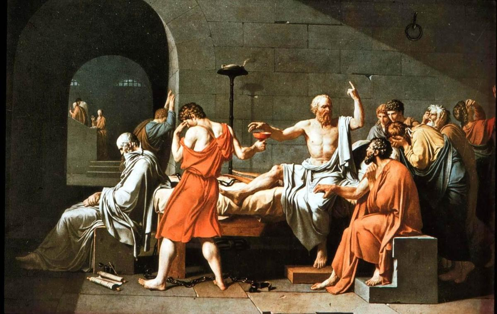
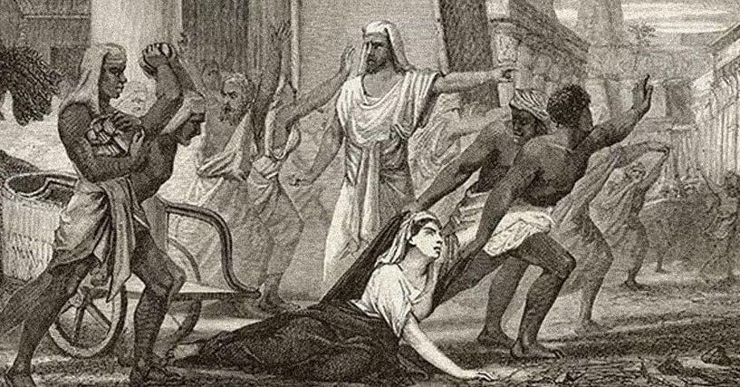
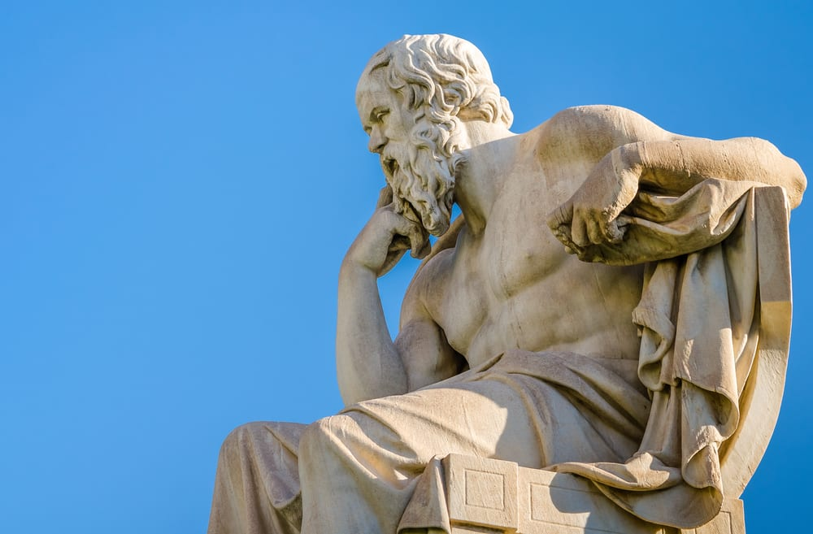

[Listen](audio/poetry-0079.mp3)

Universe created Evolution, Evolution created Consciousness, 
Consciousness created Humans, and Humans created Philosophy.

The word Philosophy, comes from the greek Philosophia, 
it means Love of Wisdom.

It comes from the time when Great Beings first begun emerging among us, 
they rejected inauthenticity, violence, contradiction, and imaginary things and creatures.

These were the First Superheroes, 
they were often attacked.

This is Socrates, he taught the children power of Wisdom, 
he was sentenced to death, and he did not run, he died, for Wisdom.

Wisdom is self correcting, 
it eventually went against the State and its imaginary gods, and so the State went against him.

He outlived the State by becoming immortal, 
he is often seen as the Father of Philosophy, but there were many other thinkers.

This is Hepatia, her tragedy, marks the end of the first Philosophers, 
the world plunged into Dark Ages.

As hard earned as Wisdom is, as long as it takes to cultivate and grow, 
the criminals can take it away in a cold flash of steel.

Her tragedy, should not be forgotten, the Noblest become a target, 
to the fractured, and blind, and jealous.

For now, Wisdom is no longer seen as the Highest there is, 
today, opinion seems to matter as much as fact.

There are calls to "teach controversy", for "equal debate", 
to "show both sides", to "let the reader decide".

Falsely presenting a broken opinion, 
to be on par with the reality and fact that helps Humanity Grow.

It is an old trick, it is cheap, and self assembling, 
it emerges on its own from poverty, inequality, suffering, blindness, and pain.

Being conscious and self aware, is not quite enough, 
because of Liars, Thieves, Criminals, Murderers, War, and even Poverty.

Wisdom is like a higher level Operating System for Humans, 
it enhances our consciousness, it grants us unique powers.

But, Every Human, each member of the Grand Human Family, 
needs to see Wisdom as a necessity.

Until then, racism, xenophobia, inequality, poverty, and darkness, 
will keep us apart.

The Stories of Superheroes are rooted in lives of Philosophers, 
because a Philosopher cannot be hurt like the ordinary men.

Philosophers survive for thousands of years in text, 
in stories, in paintings.

They survive by sharing Wisdom, 
that make us stronger, that enriches us, that we each yearn for.

When you read the words of a philosopher, 
she or he comes round, and in a way they keep you company.

Socrates knew that, 
and he knew he needs to send a powerful message far into the future.

An important being, died for something important, 
he is signaling, that Wisdom is Your Right.

He was a Soldier, 
he found a way to repair the word.

And it was, 
Love of Wisdom.

Once you begun paying attention to it all, 
a constellation of stars will begin assembling in you.

Each star will repair and strengthen all the others, 
it will bring you health and clarity.

Your contradictions will begin resolving, 
by rejecting and ejecting that which makes no sense.

It will help your decision making, 
it won't let you move forward when two things oppose.

It will keep you in place, 
until you reject the one that is not fact.

Where all the other stalks fracture, 
Wisdom will help you bend in the colder winds of change.

Foresight helps you combine knowledge, 
to construct events that are yet to unfold.

Moreover, it helps you construct the correct path ahead, 
and reject whatever else may come.

The Power of Foresight does not end with the individual wielding it, 
it can extend to guiding the word to the correct its paths.

Heroism is in part is about learning what not to do, 
helping others requires solving their problems, and thus you learn life.

But the greatest of insights are found in Memoirs worth reading, 
where they are placed in correct context.

With enough insight Crime for example, transforms from an impenetrable state of mind that it is, 
to our need to create Walls of Prevention, so that people don't end up blind.

Punishment and Revenge is not a way to treat a Human Being fractured by poverty, 
or violence, or even hunger-for-food. Only prevention can work here.

The power of insight shows you that while you can't go back in time, 
you can prevent the little ones from ending up in the same place.

In that way, you take the pain of those Punished and use it for a thing that matters, 
preventing children from following in their footsteps.

And we get to feel others, 
we get to feel when they have been Wronged.

And we get to feel what they felt, when times got tough, 
and the power of Compassion makes us a Family.

Who was it that gave [George Martorano][1] that little pencil, 
power of compassion is incredibly complex.

You hold hands with every wronged being on Earth, 
those looking to their Favorite Star, wondering if someone else is looking there too.

We are, we all are, we are there with you, 
You matter, your heart mattes, your mind matters, your life matters.

And in Wisdom we will fix all of it, 
whether we are ready to recognize that or not, we are a Family, and as One, We'll fix it all.

In that path we slowly walk together, 
towards Happiness and Fairness, and Joy.

We will erase poverty and slavery with Universal Income and a Free Home with a picket fence. 
We will erase crime with Care and Prevention, and Fairness.

We will erase war, blindness and stupidity, with Family Love and Wisdom. 
We will erase all problems that plague the Human Family, it is what a family does.

One day, the world will stand united in fact, 
as opposed to being divided by opinion.

Not even the Universe can stand in our way, 
our way is the Human Family Way.

Like Wisdom, 
we are Unstoppable.

[1]: https://www.youtube.com/watch?v=lnuoHywbaR8
