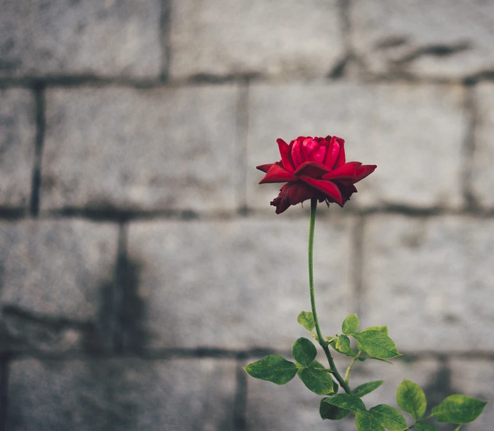

[Listen](audio/poetry-0082.mp3)

Not Until This, Not Until That 
Don't let anybody push you around,

If you allow negativity towards you for long enough, 
it will make you very ill.

Tolerance of negativity will push you to cross lines, 
it will derail you the same way that lies derail liars.

It is like the lines that addicts cross, 
until there is no way to come back.

Take a look into the mind of the person negative towards you, 
do they even see you as a person?

If their ultimate aim is not to rob you of yourself to turn you into a tool, 
then are you not some disposable mean to their shortcuts.

Nothing is found in servitude, it won't make you stronger, 
it won't make you nobler, or enlightened, or worthy.

Protect your mind, reject being pushed around, 
stand up, rise, do not follow, no one has any control over you.

You become Stronger when you rise, 
when you put your feet down on the ground, and push up - to the mountains.

You become Nobler when you break away, 
when you let go of those ahead of you, and take your own path to the side.

You become Wise and Enlightened when you stand your ground Memoirs in hand, 
when you learn from the lessons on your own path, and by subtle analogy to other paths.

You become Worthy, of Yourself, of Love, of Wisdom, of a house you can call Home, 
when you grow protecting who you are, onward to becoming the best You.

Do not be scared, because if you stay scared, nothing will change, 
do not let sadness keep you in bed, go to the library first.

Do not let the sick thick stickiness to keep you bound, 
most of it is illusion, including the few pleasures you found.

Do net let alligator tears, and hollow souls void of any content howl you back, 
you are not part of that world, you never were.

Do not go slowly wandering down their own paths, that's how _they_ were created, 
and you can still reject that agony and become free.

Look to the best within you, your Beautiful Treasures, 
your Innocence, your Sweetness, your Love, your Cuteness, your Generosity, your Might, your Endurance.

Those are powerful treasures meant to help you become a Great Being, 
treasures that they have forsaken in their own selves.

Now they are trying to forsaken your own treasures, to fuhrer the dark path they dig, 
do not let them take what is irreplaceable within you.

You cannot aid them in any way, that can only feed their evil, 
and take away from your Beautiful Treasures.

Let the world see you, read at the Library, visit Museums and Art Galleries, 
go see someone singing with their beautiful voice.

Write in your journal, record on your phone, sharpen your pencil, 
use tracing paper to learn how to draw.

Step after step courageously walk down the isles to get your first air dry clay, 
and sculpt, sculpt your world, and touch, and feeling, show the world.

Do not hide, reject the bad, and shine among the crowds, 
do not let your older-self cry that you were never seen.
