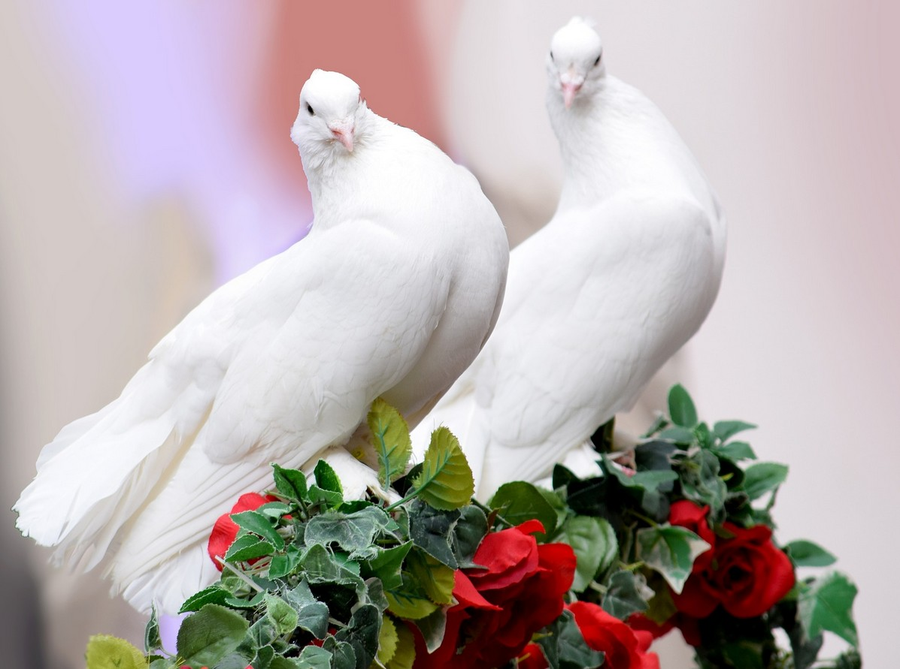

[Listen](audio/poetry-0086.mp3)

Our minds constantly construct boundaries, 
and constantly try to make us comfortable.

But in an evolved world this works against us, 
it creates boundaries across which we hope to discharge pain.

The source of the pain is poverty, poverty of mind and wallet, 
fear, pain, unfairness and inequality, add to the blindness.

There is no solution on the level where poverty reins, 
it will always be walls turning people against each other.

We are not ready for the next level, 
in the next level we recognize poverty as a virus.

We see it as a Natural Disaster, 
we sit back, relax, calm down, print enough money to end it and move on.

This does not mean everyone is going to be rich, 
it only means, nobody will be stuck in financial poverty.

Poverty of mind, the other half of poverty is not even up for discussion, 
not until everyone has a safe home.

All of this seems impossible, to many laughable, 
irrational, infantile, unfair even.

For those of you who don't understand how someone could possibly call this unfair, 
some will angrily yell "Why should someone get a free home, when I worked for mine, my entire life?".

  

This is the Nature of the Walls, 
the picture of the great divide.

A divide between who we are today, 
and who we should be tomorrow.

  

A Human Being is so special, 
that they may not exist without their own Home, not just a house.

So special, that active countermeasures must be put in place, 
to help people move away from bad ideas.

A Human Being is so special, that they must never grow up in fear, 
that they must never be lied to, never manipulated.

They must never be pressured, never become stressed or depressed, 
minds are delicate and must be protected.

  

We can't see that, because the walls are invisible, 
we often can't see that with which we grow up with.

Emboldened we dare to hold up our opinion, 
as if it was on par with a Great Being's carefully observed fact, or wisdom.

  

Crushed, stressed, pressured, tired, 
we temporarily lose our mind.

The thing that makes Humans Special, 
can be turned off by tiredness and stress.

And our brains go into Stupid Mode, 
A versus B, A lesser/better B.

And it seems like we are still operating, 
but that's just an illusion, that not us, at all.

  

I don't know how long it will take us to see how special we are, 
how many gaps need to be crossed, or how many upgrades our Cultures need.

I know that divided, the generations will always fight across pointless walls, 
and I know that without unity, the world will not progress.

  

The children are watching, 
they are always watching.

They will emulate what they see, 
they will accept it as reality.

They will add to the invisible walls, 
and dismiss others to discharge pain, or stress.

  

We can't have a discussion about any of this, 
until stress of poverty is out of the picture.

It will be one of the Humanity's greatest achievements, 
to help everyone wake up to a home, with enough food, and a world that cares.

Until that moment comes, 
we can't have a conversation with all.

Whether we are ready to know it, or not, 
the way the world grows... its either all of us, on none.
