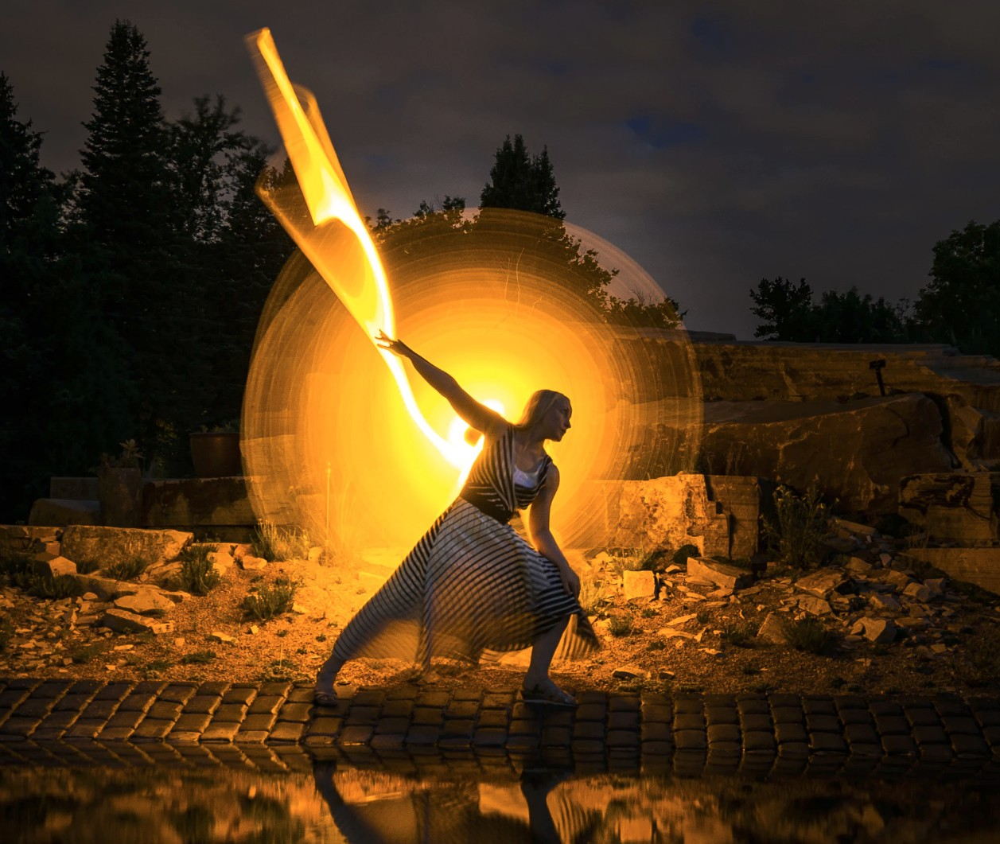

[Listen](audio/poetry-0089.mp3)

Your superpowers are not rooted in your wishes,
as only very few wishes come true.

Universe has already established its rule and order, 
we are latecomers to the symphony orchestra.

Instead, seek your superpowers in what you already own, 
in the things that have already sprung.

In the incredible adaptability of your body, 
in your raw, unleashed consciousness.

If you are good to your body, you body will flourish, 
it is a biological system, not that different from a flower.

If you are good to your mind, it will expand, 
it is a navigational system with landmarks.

Your mind is especially beautiful, 
it has a large memory capacity.

You can't recall letters on a particular page in a book, 
but you can recall the walls in your home, the streets in your city.

Your mind does not differentiate between navigating a road, 
or a vast galaxy of star constellations.

Your mind can encode interconnected knowledge, 
so as long as it is marked with pictures and relative locations on a well connected tree.

  

It is foolish to think to a particular page, 
and feel ordinary for not being able to recall all the words.

It is foolish to try to ride a boat, 
on a road.

  

Do not seek to invent your superpowers, 
instead, recognize the once you already have and expand them.
