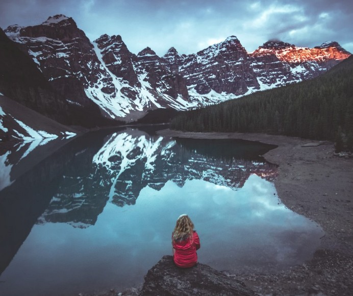

[Listen](audio/poetry-0096.mp3)

Don't just move forward, 
you have to move up!

Life is too short, 
You are too Noble, 
Truth is too Dear.

Many give away their Time, 
some even give away Trust.

Sometimes, because they are tired, 
because they had enough, 
or had waited long enough.

Giving something of yourself away, 
will not make that other person Nobler.

And you are not supposed to wait, 
in waiting all your life will pass you by.

  

You are supposed to learn, 
you are supposed to move, 
you are supposed to shine.

  

You will lose your mind if you do noting, 
and You will lose your self, unless you grow up.

You'll never lose the ability to turn around, 
and try again, it maybe harder if you wait too long...

... but in your waiting, 
you'll become tougher too.

No, there is no point of no return, 
but all those who rise, would agree:

"Do it sooner than later".

  

Begin, by taking back what you have given away, 
and permanently and meaningfully so, and rise up.

There is no art to this, 
you just pick yourself up, and go.

You're going to need running shoes, 
and your first battle will be with Fatigue.

Be good to yourself, 
strive to be better, 
let your body rest enough so it may grow stronger.

And return to point Zero, 
go all the way back.

Of all the noble things within You, 
not a single thing is to be shared unearned.

And listen carefully, to the words spoken to you, 
by inference re-construct that which drives others.

And find the Kindred, and the Kin, 
do not be alone for too long.

Isolation is as bad as Fatigue, 
it is a state of having fallen, and being lost.

You are To Thrive, 
You are To Grow.

  

Keep searching, keep training, 
stay away from hate, and those who fell behind on growing up.

Keep learning, 
keep moving, 
let yourself shine.

  

Nothing important in life is found at the foothills, 
you have to get to the mountains, and carry on climbing.

Do not stop, 
and keep moving up.

  

As to what it is all for, 
it is to better yourself.

To rise above yourself to new thoughts, 
and powers, and insights, and observations.

If you stay at the foothills, 
you will never really know who you truly are.

Never know the extent of your Might, 
your Unbrekability, your Blinding Light.

If you stay down, 
you will blend with all the new people coming and going.

You'll never be known, never be recognized, 
you may even become forgotten, your judgment clouded.

It will be hard to recognize, 
the Kindred from the Foe.

  

You must rise up, and find your self, 
so that you may be seen for the Brilliant Being that really are.

  

Help us learn from you, 
from what you have been through, 
from your Great Battles and Works,

If you hide, 
the Universe will become darker for it.

We need your light.
