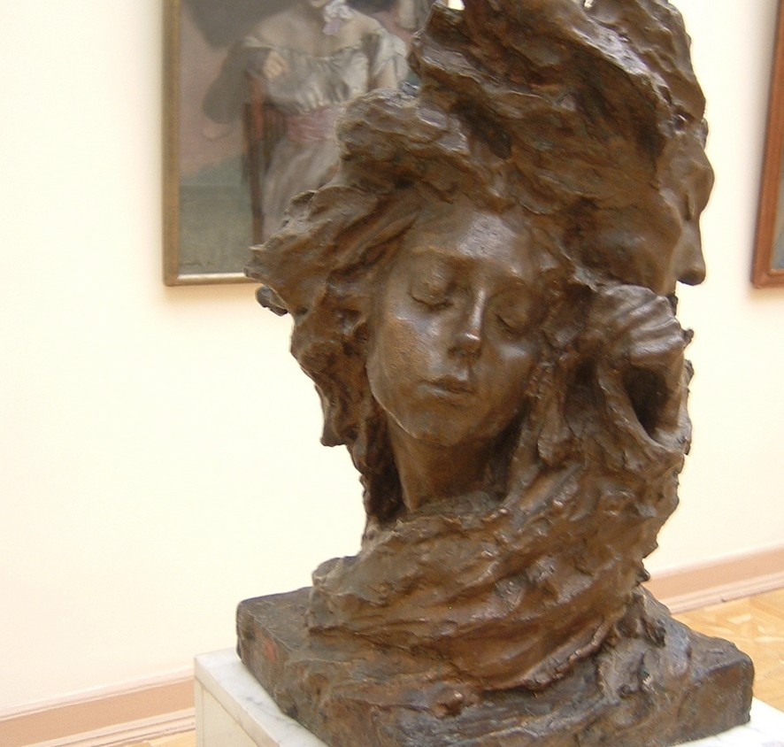

[Listen](audio/poetry-0097.mp3)

Where do we come from, and why are we here, 
are just silly questions.

While even silly questions lead to good things, 
they're not the primary questions we need to answer - like what makes us unique, and what do we love, and where are going to go, and what great mountains must we face.

We are here because there was no one to count the failed attempts, 
because the universe was running out of other paths.

There was no plan, 
there was just a progression forward.

Universally speaking, there is probably plenty of life out there, 
but what the Universe will never have, cannot build, is another You.

If someone tried to take your place,
it could never work, ever, at all.

In All This Complexity, 
You Are One And Only.

There will never be another you, 
ever.

It is because at a certain point, the Universe stops, and your ideas take over, 
you become the creator, you become a Youniverse within a Universe.

  

You are plenty special, but if you only move forward, 
you will not gain the capacity to fully share who you are.

The universe will know, that you are Majestic, and Adventurous, 
and sometimes, Mischievous. But we need more of you!

We need Your Sculptures! 
We need Your Poetry! 
We Need Your Works,

So that we may learn, 
and maybe continue your work.

We Have Questions,

And you are the only one with your answers, 
so grow up already, build up, create and share your wisdom.

The Wisdom you will gain from your Pursuits of Excellence, 
will be unlike anything else the Universe has ever seen before.

You will speak in your own pictures, with your personal touch, 
and the words you love, and above all the Paths You Took.

With Your Help and Works,

Humanity will become Wiser, 
and more beautiful.

Help Us See.

Public Domain image of [The Mist, (1899 Sculpture)](https://en.wikipedia.org/wiki/Anna_Golubkina#/media/File:Golubkina_Fog.JPG) by [Anna Golubkina (1864-1927)](https://en.wikipedia.org/wiki/Anna_Golubkina).
