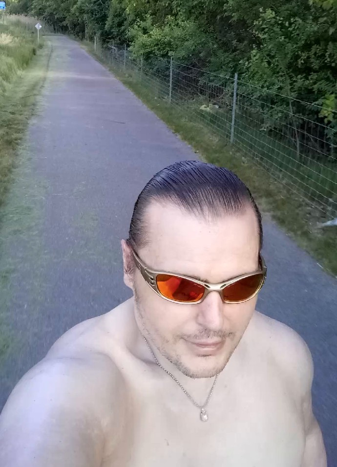

[Listen](audio/poetry-0108.mp3)

Every one in a while I bicycle to the [south end](https://goo.gl/maps/J7BhcUqsPx1wNJEBA), 
and check if they did any work, and how it went.

I always find it old, and full, of bumps thorns and grass, 
no matter how hard I bicycle, there is never a way to pass.

I work up this morning, and said "It is time for another check!", 
I got my gear together, and squirted sunblock all around on my neck.

And as soon as got too far to go back, 
my bicycle, creaked, and shuddered, and squeaked - and I was like "What the heck?"

The noise came from the bottom where the pedals are, 
and only the left pedal made noise thus far.

And the noise would not cease, 
I had the tools but no grease.

So I said to my self in a deep tone "It is time for Field Repair!, 
and although I have no grease, I will not despair.""

First, I checked the pockets of my new red pants, the short ones that I like, 
but there was nothing there that could fix my bike.

So I looked to my day pack, and the solution sat right next to my bicycle lock, 
I squeaked! "I do have grease, it is in my sun block!"

So I squired some on the pedals and the connecting rod, 
and though I admit the solution was a bit odd...

I was back on the road, riding smoothly and quietly like a pro, 
after all, I had places to go.

I made it to the southern edge, it was 15 miles away, 
they still didn't fix anything, bumps and shrubs were blocking the way.

I took a photo to share with you, 
just in case you were thinking about going or pushing through.

The [actual ancient end of the trail](https://goo.gl/maps/oRaowTwL1cdz5G549) is not that far away, 
about 2.6 miles south, but you are better off walking the rest of the way.

Even better than following the ancient end, is to [go to the park](https://goo.gl/maps/j93A21irtxaaRzd96), 
and head for lake Erie, but make sure to leave early, so that you don't bicycle back after dark.

The trick to make it to the lake is to [turn right before](https://goo.gl/maps/yDvAJg3dUWX2atPY9) the Nature Center, 
and head through Flat Rock, to [Maple Beach](https://goo.gl/maps/Uq1DXX5HRwXxYtcW7), you don't have to pay to enter.

I think of it as the real end to the trail, 
reaching it always make for a good tale.
