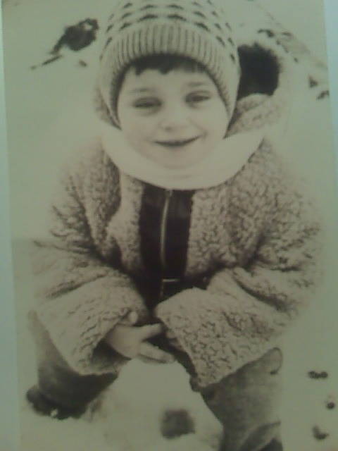

[Listen](audio/poetry-0109.mp3)

Your Earthly Lineage begun some four billions years ago, 
you ancestors weren't human, they couldn't even breathe Oxygen.

We gradually adapted to changing conditions, 
to chemical composition of our Little Lonesome Blue Earth.

In a mere Hundred Million years, we will be as different from who we are today, 
as a Shrew is different from a Great Ape.

  

But, one thing will never change, 
and that is how special life that begun on Earth is.

How colorful and unique our good ideas, 
how different we must be from what life there may be out in space.

And how incredibly close we all are, 
we are such a tightly knit family, we share so much.

  

And we can think without restrictions, 
we don't have short memory, we don't lack imagination.

Our ideas come from nowhere and everywhere, 
we dream about anything and everything, here and everywhere.

And we have poetry, and paintings, and doodles, 
we have sculptures that are made out of stone and metal.

  

And above all, we are all born a Royalty, and our proper posture, 
is to rise to the challenge of becoming Philosopher Queens, and Philosopher Kings.

Our consciousness, makes it so that we must rise to no end, 
step after step, book after book, work of art, after a work of art.

  

Do not be scared, 
Above All, Love Yourself.

Humanity is in a process of amassing Culture, 
whether we notice it or not, **it is** abandoning bad ideas.

And, You Are Born A Royalty, 
And Your aim, is to become Philosopher Queens, and Kings.

  

Say it with me: 
Forbearance, Hardihood, Largesse, Benevolence, and Honour.

Restraint, Dignity, Nobility, Unbreakability, Fortitude, Courage, 
Love; and Insight; and Foresight; and Understanding; and Authenticity; and Heroism;

And Celebrate 
Your Beautiful Life.
