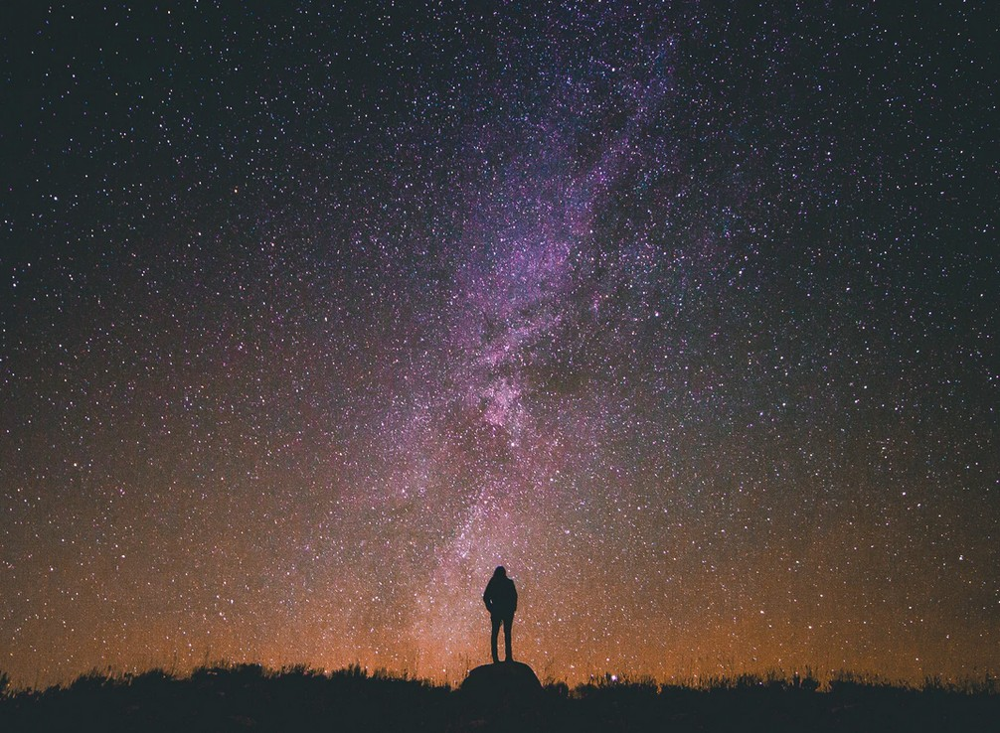

[Listen](audio/poetry-0116.mp3)

Try to imagine yourself born in different places or to different cultures, 
note how you are influenced by all the surrounding factors.

Note, how there are parts of you that never do change, 
that form some kind of a foundation.

Rather, than than letting your place of birth or culture influence you, 
imagine inventing yourself **independently** of everything.

  

Look towards Nonfiction Books or Audiobooks, Memoirs and Biographies, 
and see what wisdom you can inherit to help you on your own journey forward.

Allow those parts of you that never seem to change no matter what culture you are born into, 
to expand, and grow upwards.

  

See if becoming a Citizen of The World, 
and not any nation in particular, helps you see the World more clearly.

See if becoming a Lover of all Wisdom, and All Good Ideas, 
and not merely the culture you were born into, helps you understand more about the Human Condition.

Imagine that you are Made of Stars, 
that you are a Child of the Universe.
