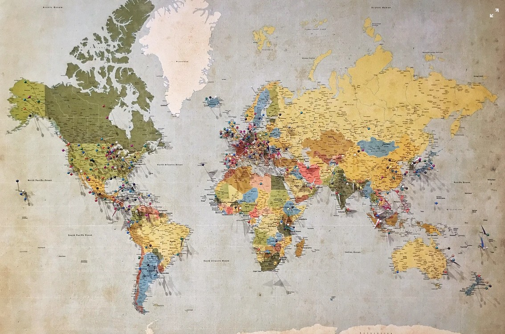

[Listen](audio/poetry-0126.mp3)

My Friends, it is very important not to think in terms of Others running the world, 
whoever holds the power now, will be too old in a handful or years.

The world is yours, but it is nowhere near ready, 
it needs great ideas, a lot of work, and it comes with many challenges.

The world you have been born into is not a static masterpiece, 
but rather, it is constantly hoping for you to help it grow.

You are the Hope and the Dream of past generations, 
it is your responsibility to grow all the way up and continue and improve the work of Great Beings.

  

We Grow, 
by reaching out for Knowledge and Wisdom.

This also means that when we are young, we are yet to gain the necessary Knowledge and Wisdom, 
The content of character required for the correct decision making that will do justice to our elder selves.

This means we need to take time to prepare ourselves for Life, 
we have to make careful observations, and carefully capture all the worthy wisdom.

We have to recognize that when lacking life experience, 
we are other than we should be.

There is a solution practiced by all the world's greatest minds, 
it is the unrelenting pursuit of knowledge and wisdom.

For thousands of years it has been proven method, 
to help us become who we need to be to do our elder selves justice.

We have no choice but to expand our minds with Knowledge, 
and enlarge our worlds with Love of Wisdom.

  

The World Grows, 
by means of informed decision-making.

Mislead or Uninformed decision-making is a Human Problem, 
and all Human Problems, have Human Solutions.

We have connected all the nations with internet, 
we have created the [Universal Declaration of Human Rights](https://en.wikipedia.org/wiki/Universal_Declaration_of_Human_Rights).

We have witnessed the creation of European Union, 
countries that speak different languages.

All the world accepted standardized schooling, 
as a standard that we all follow.

We have come a long way, 
towards Wisdom and Peace.

  

Time has come to make better use of these amazing advancements, 
and to hasten our pace of development as One Human Family.

We face common problems that require an Informed and United World, 
we have made many mistakes in the past 100 years, and we have learned much.

We can no longer see ourselves as invisible parts of our little neighborhoods, 
we must now rise to the challenges of becoming a Citizen of The World.

  

We must grow beyond the need for our own Knowledge and Wisdom, 
onward to making Meaningful and Lasting Contributions towards helping the world become more mature.

We can no longer serve, as we are not heartless and soulless cogs in a blind machine, 
we must now rise to question, judge, evaluate, challenge and fearlessly stand for wisdom.

  

In all of Human History we never lost sight of Family, Peace, Wisdom, and Love, 
not for a day, not for a moment.

Every day of human history pushed to become better than the previous, 
and any fractures that occurred have had the global community come together in hopes of repairs.

Let us hasten our pace with an aim that none suffer for any reason, 
be it hate, punishment, arrogance or ignorance.

Where we cannot fix something, let us use the power of time, 
and either prevent new fractures before they begin, 
of establish benefits for those born after a certain year in the future.

Let us never leave a chain-link unlined, 
there is not to be a courtroom without a meaningful force of prevention and rehabilitation on each side.

There is not to be a war, 
where it could have been prevented with education, knowledge and wisdom.

  

Let us make sure that all generations from now on, know with certainty and understanding, 
that their first step in life - and the true rite of passage - is the acquisition of wisdom, 
and capacity of decision-making worthy of their elder selves.

Above all, we must remind the children with Knowledge and Science, 
that they are a Child of The Universe first.

And with History, 
that to them belongs the future.

That they are to reject the status quo, 
because what was well enough for the previous generation, 
now needs improvement to do the current one justice.

(Pictured [Eleanor Roosevelt](https://en.wikipedia.org/wiki/Eleanor_Roosevelt) with the English language version of the [Universal Declaration of Human Rights](https://en.wikipedia.org/wiki/Universal_Declaration_of_Human_Rights).)
