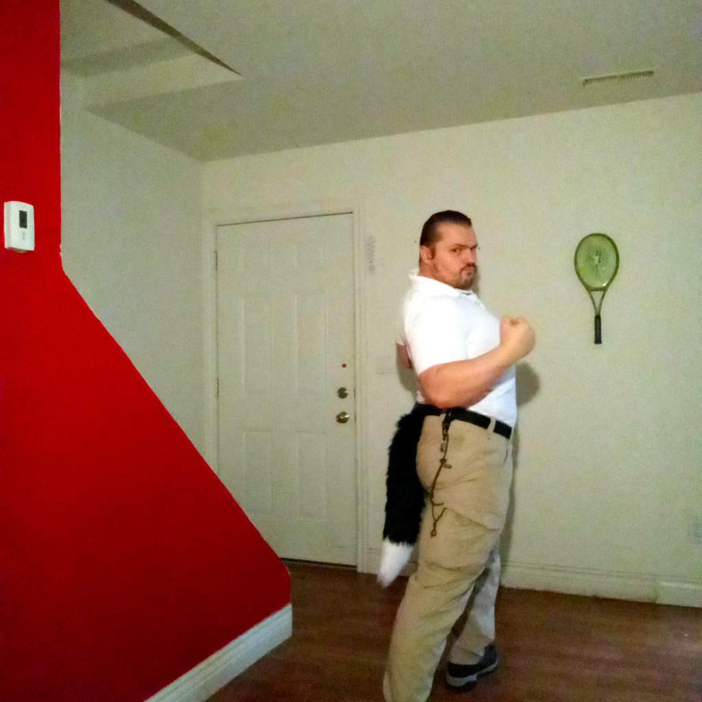

[Listen](audio/poetry-0133.mp3)

Hey! whew, 
it's only eight,

and here I was worried, 
that I am going to be late.

Today is Friday, 
and on every Friday I must look,

for new ideas, 
to add to my fancy [Warrior Book](https://westland-valhalla.github.io/warrior/)

It is a book, 
made out of videos,

and some ideas, 
don't have enough of those.

  

Last week, 
I searched for "Ladies Fast Draw",

but it only returned three videos, 
last time I saw.

I also tried Women Sharp Shooting, 
and Compound Bow,

but something didn't fit, 
the chapter just didn't flow.

I am searching for 
inspirational things,

ideas that bring friends together, 
and give them wings.

  

I wrote that book to show all; 
that we all start slow,

but we can all become mighty, 
so as long as we give it a go.

All too frequently we assume, 
that we have to have talent.

and all the steps we take, 
must be naturally gallant.

But the truth is, 
that we must fail to get there,

effortlessly succeeding at anything, 
is as boring as rare.

No need to hurry, 
we can learn really slow,

the most important thing, 
is that we grow.
