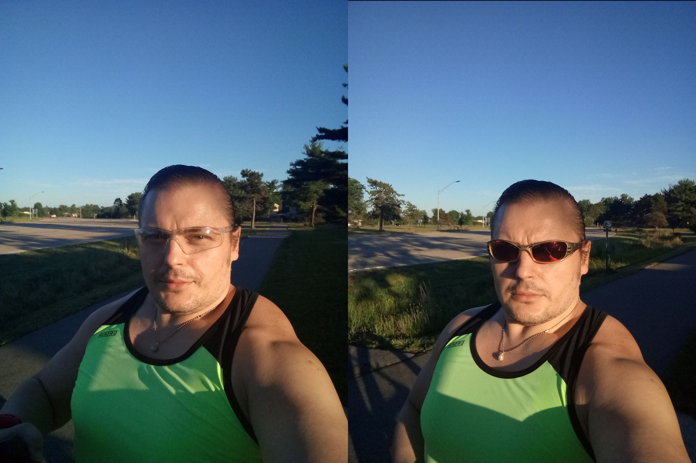

[Listen](audio/poetry-0153.mp3)

Sure, racing my bicycle is nice late in the day, 
but at the end I have to use a flashlight to find my way.

Riding in the morning, the sun becomes so blinding halfway through, 
that I have to switch to sunglasses to continue enjoying the view.

  

Mornings have a whole different feel, 
empty streets and backwards sun make them all seem unreal.

That fresh fragrance full of chilled morning dew, 
now sunlit, creating a strange and mystical view.

This morning I saw a gigantic deer waking up in a grassy patch, 
and a hawk probably waiting around for her babies to hatch.

  

Dear reader, how about you? 
what do you love more, evening sunsets or the sunlit dew?
