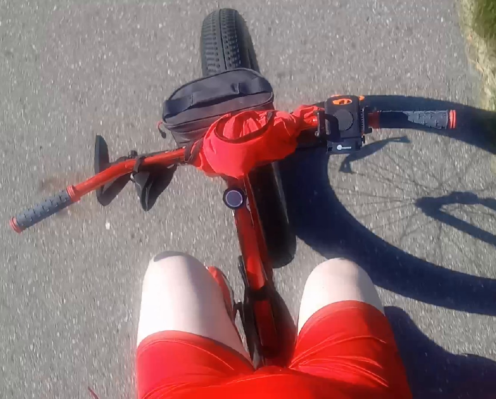

[Listen](audio/poetry-0154.mp3)

I woke up early, 
dressed barely.

Just enough so that I am not bare, 
and jumped on my iron mare.

We set course away from the sun, 
and just like that we ran.

Some quarter way through, 
we had to turn left towards the dew.

But then the road went straight, 
and all the way till the end the ride was great.

The road was long, 
and birds full of song.

The wind blew fresh air, 
as we flew without a care.

On the way back home the sun was on the rise, 
and it blinded my eyes.

But I rode all the way back, 
by just following my old track.

And so the mare and I parted, 
all before the day even started.

She's packed and ready to go, waiting for sun to rise, 
and so we'll ride again as soon as I open my eyes.
