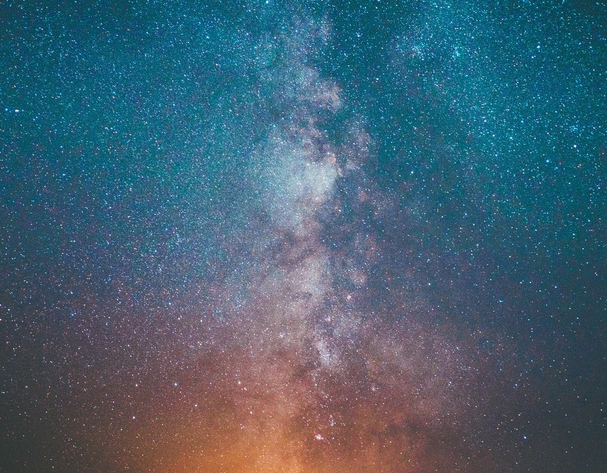

[Listen](audio/poetry-0158.mp3)

Before we learn what we should know, 
we must first learn how to grow.

  

To break out of all the rooms and halls, 
we must destroy all the invisible walls.

As we cannot reason-about what we can’t see, 
and so we must surpass our limits before we can think free.

  

It is not so much moving forward, 
as it is always growing upward.

We say forward when we seem to stop, 
but we mean up - up to the top.

And then rise above where our limits once stood, 
from could to would, to finally should.

  

What once we saw as highest complexity, 
we will know to navigate like a small city.

Then, we can help people finish their thoughts, 
help them to their stars, connect their dots.

  

We must learn, it is just how Human Beings are, 
we have to see the whole before we can find the star.
