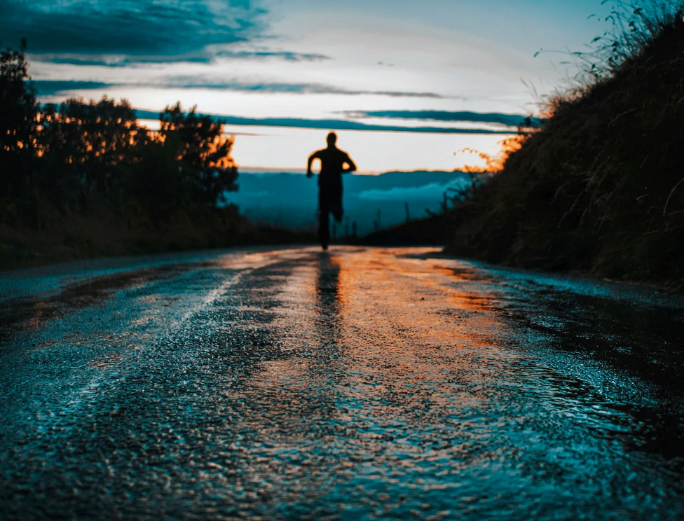

[Listen](audio/poetry-0159.mp3)

I went bicycling today, 
but I was lost in thoughts all day.

  

I thought about Typography and Art, 
and how evey Human Being is really smart.

How people get busy, 
and how life is rarely easy.

How we get tired, how creativity is made, 
otherwise it will just fade.

How there is only ever time for big things, 
it matters not if its vagabonds or kings.

We are all limited in time, 
we truly are meant to learn, become wise and climb.

  

Now, I am ready for bed, 
I really feel tired.

I am already packed for my morning run, 
the weather says, no rain, only sun.

Though, I've noticed it will snow, 
at the Rocky Mountains... but that's good to know.

Because you can't ever be too far away from that, 
I am pretty far away, and glad.
