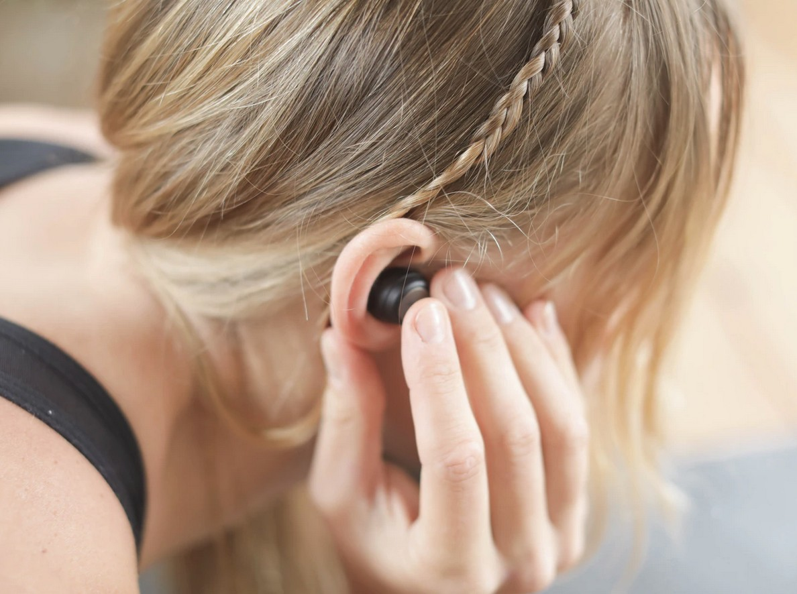

[Listen](audio/poetry-0161.mp3)

We are each born to a unique environment, 
family arrangement, economic level, and intellectual culture.

To be fair, unique environment is good so as long as it it positive, safe; 
it is just as beautiful to walk a Tree Root Bridge as it is Ride a Bull or Tuktuk.

So as long as it is a place that we can safely grow from, 
a place with a good library of inspirational books of Adventure and Philosophy.

Family, like the neighborhood has to be safe as well, 
they have to be a source of Wisdom, Encouragement, Knowledge, and Enlightenment.

Economic levels, are unfair, no child should be put to poverty, 
it is the children of the future generations that repair this.

Intellectual Culture, must begin with a Love of Wisdom, with Admiration of Independence, 
of Leadership, Inventiveness, Authenticity, Valor;

The children must be reminded not to throw their youth away on paychecks, 
that time is so valuable; that there are not enough atoms in the universe to strike a coin that buys a single second.

  

Quarks can be alike, but each quasar, molecular cloud, and Human; 
is infinitely unique in their configuration.

It is a great tragedy that classrooms often start with the same book, 
that office workers eventually synchronize for the sake of simplicity.

This is not to be allowed, 
this is not fair.

This is not the way.

Each mind is unique and requires a unique combination of books, 
it may not always take many, three to five per year, so as long as they are re-read many times.

Each book, 
helps us build the construction within - Our Universe, Our City; The Concept Map.

The sooner we get to the next plateau of enlightenment, 
the safer we are.

  

If you are a teacher, record audio books, read your books to the students; 
make sure they can take them home, and pause, and think, and replay.

Look to Science Popularized, Survey Courses in Philosophy, 
help them to get to know some combination the true leaders of this world, 

[Sir Ken Robinson](https://www.youtube.com/results?search_query=Sir+Ken+Robinson),
[Bill Bryson](https://www.youtube.com/results?search_query=Bill+Bryson),
[Richard Dawkins](https://www.youtube.com/results?search_query=Richard+Dawkins),
[Sam Harris](https://www.youtube.com/results?search_query=Sam+Harris),
[Lawrence Krauss](https://www.youtube.com/results?search_query=Lawrence+Krauss),
[PZ Myers](https://www.youtube.com/results?search_query=PZ+Myers),
[Lord Martin Rees](https://www.youtube.com/results?search_query=Lord+Martin+Rees),
[Jill Tarter](https://www.youtube.com/results?search_query=Jill+Tarter) and
[Seth Shostak](https://www.youtube.com/results?search_query=Seth+Shostak),
[Alex Filippenko](https://www.youtube.com/results?search_query=Alex+Filippenko),
[Sean Carroll](https://www.youtube.com/results?search_query=Sean+Carroll),
[Craig Venter](https://www.youtube.com/results?search_query=Craig+Venter),
[Howard Zinn](https://www.youtube.com/results?search_query=Howard+Zinn),
[Noam Chomsky](https://www.youtube.com/results?search_query=Noam+Chomsky),
[Jared Diamond](https://www.youtube.com/results?search_query=Jared+Diamond)...

The world belongs to the future generations, 
at first; they will need all the help they can get.

And then, 
they'll take it from there.
