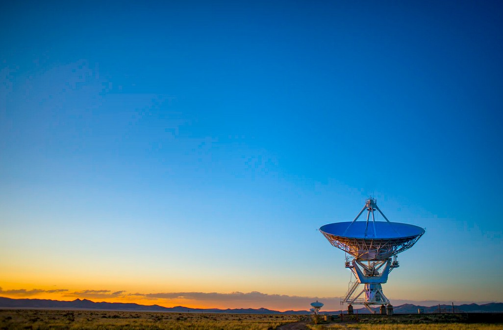

[Listen](audio/poetry-0163.mp3)

Audio Books, Video Lectures, Internet Lectures and Video Tutorials, 
are all extremely important for our heath, healing, and well being.

  

One interesting way to start, 
is Travel and Adventure books.

All the top rated books by [Bill Bryson](https://en.wikipedia.org/wiki/Bill_Bryson) are fun and frequently funny, 
his [A Short History of Nearly Everything](https://en.wikipedia.org/wiki/A_Short_History_of_Nearly_Everything) is a great start to really learning about science.

I recommend his little [Notes from a Big Country](https://en.wikipedia.org/wiki/Notes_from_a_Big_Country), 
it is all extremely positive, funny and interesting.

[Charles Kuralt's America](https://www.audible.com/pd/Charles-Kuralts-America-Audiobook/B002UZL5BG) is another little adventure book that comes to mind.

  

As with any fun book there is no specific knowledge to transfer, 
just the parts that we never got to ourselves.

Beautiful moments and experiences that somehow make us better, 
observations that help our imagination and dreams.

A Short History of Nearly Everything along with ten or so other top Science Popularizer Books, 
will absolutely expand our view of the universe and contribute to positive changes in our life.

There are also books about Jogging like "Born to Run", 
or "Ultramarathon Man" which teach about endurance and every day athletes.

  

Audio Books and Video Lectures, 
are a fantastic source of Wisdom and Adventure.
