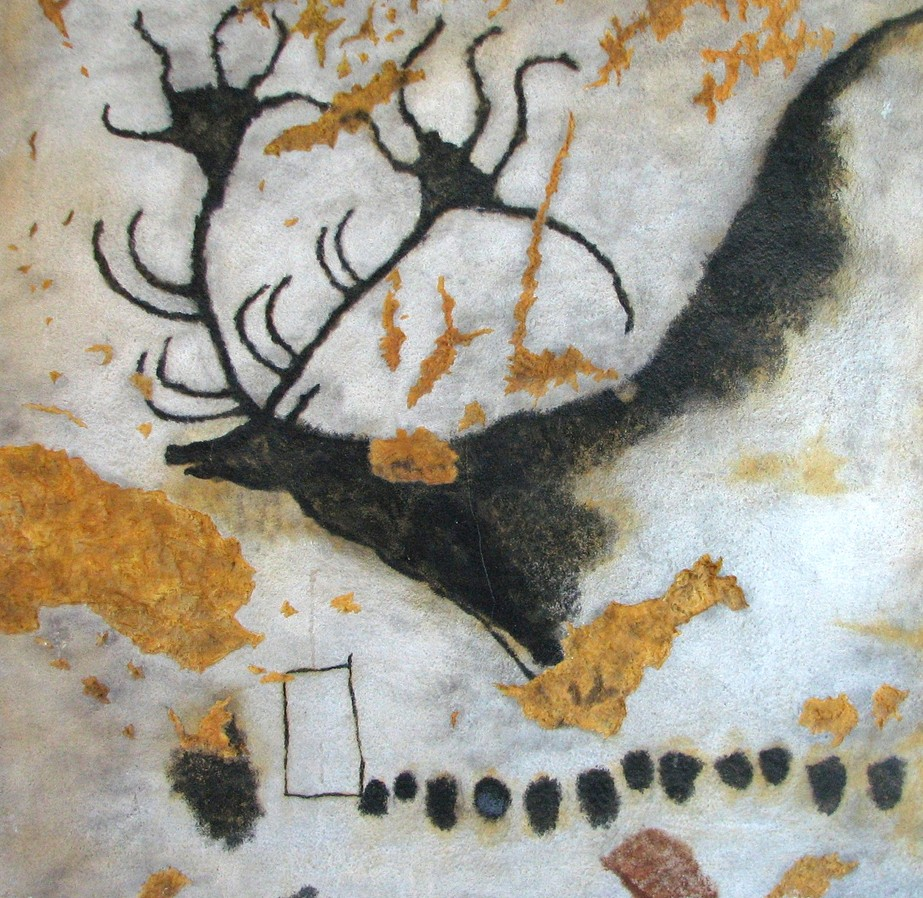

[Listen](audio/poetry-0164.mp3)

A legendary creature, 
from a winter 17,000 years ago.

Still speaks of Might, 
at the Cave of Lascaux.

It was not a hunt, 
but a Magical Sight,

It was a Noble Megaloceros, 
on a wintery starlit night.

A Family, and a Traveler, 
Had to go out and see,

Some, said the titan was as big as a tree, 
others imagined him as big as the Baltic Sea.

And the story never gets old, 
after 17,000 years, it is still, being told.

(Pictured [Megaloceros](https://en.wikipedia.org/wiki/Megaloceros) from [Lascaux](https://en.wikipedia.org/wiki/Lascaux))
