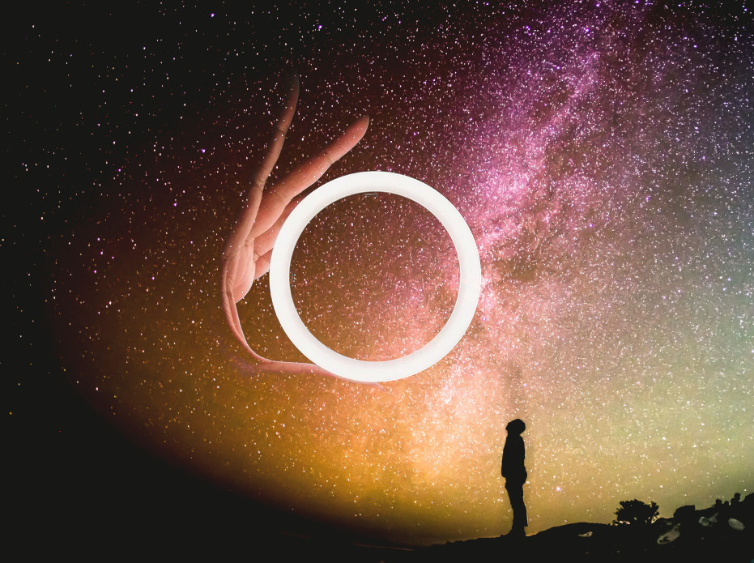

[Listen](audio/poetry-0165.mp3)

Nothing was coincidental, 
it was strong and clear.

The amateurs were the first, 
social networks came to a crawl.

The signal originated nowhere other, 
than the uninhabitable Proxima Centauri b.

There was an orbiting computer, 
they are spaced out 100 light years apart.

  

[Frank Drake](https://en.wikipedia.org/wiki/Frank_Drake) was looking at the bitmaps, 
with the candles on his birthday cake still lit.

He saw a machine, like in the movie, 
"prank" he said with a broken heart.

  

[Ms. Tarter](https://en.wikipedia.org/wiki/Jill_Tarter) said, 
"This is not a prank".

She pointed to the pictorial with familiar animals, 
and then the undeniable images of poverty came.

[Seth](https://en.wikipedia.org/wiki/Seth_Shostak) had it all figured out for years, he growled "These are diagrams for a Planet Wide Governing Body" 
"for a Peaceful, Wise, Planet Wide Government", he said with tears with his eyes.

  

One People

No Poverty
Currency must not be used against the people, or to hold people hostage.

No War

No Unsustainable Beliefs That Drive Us Apart,
the well being of all people must always come first, this requires education, clarity, peace and wisdom.

Interactive and Captivating Education Perfectly Tailored to Each Student.
Schools must demonstrate they help people grow, beyond what individuals can achieve on their own.

No Borders

No Weapons Manufacturing or Stockpiles

No Prisons, No Punishment (Only special need Hospitals and Schools with Therapy)

No Breeding Animals For Food

A Planet United Under A Single Government

No Representatives, No Presidents, No Political Personalities

Humanity Comes Together To Vote On Good Ideas, One Idea At A Time.
The plans revealed how the ideas are protected, only questionnaires are answered.

The ultimate goal of the Planetary Government is to Converge on Wisdom.
It is to protect the planet from self destruction, and encourage growth of Wisdom and Technology.

  

The leading theory is that is is an early radio satellite, 
that it maybe automated, like a network of chat-bot drones.

Withing 50 years an upgrade arrived, 
it had just one more pictorial.

It showed that Milky Way was teeming with life, 
there are billions of mutually incompatible ecosystems with intelligent life, 
and billions more without.

There is no safe way to travel, 
there is no safe way to enter the ecosystems.

Their technology is the same as ours, 
soldering irons and radio signals.

That's all there is, 
that's all there ever will be.

It showed that life was seeded by the first planet, 
it was a crudely and hastily engineered extremely adaptive extremophile.

The dying planet sent out microscopic capsules moving at relativistic speeds, 
the estimates are 75,000,000,000,000,000,000 tons of capsules were sent.

The time dilation made the universe age faster, 
or relatively speaking slowed the decay of the extremophiles.

Life is everywhere, 
it is as old as the universe, everywhere, and eveywhen.

The old probe was sent out way and intercepted in the earth orbit, 
it contained some of the original capsules for study and as proof.

We made many copies of the broadcasting station and sent them into orbits of all the nearby exoplanets, 
the plans and pictorials for the planetary government remained unchanged.

We reproduced the capsules as well it was primitive engineering, 
scientists are against it, but in theory it is a safe mechanism to aim at Andromeda and the Magellanic Clouds.

  

A Circular Symbol was translated to be the shape that represents our union, 
we were able to translate the surrounding glyphs.

In Wisdom, 
We Are One, 
All Around.
