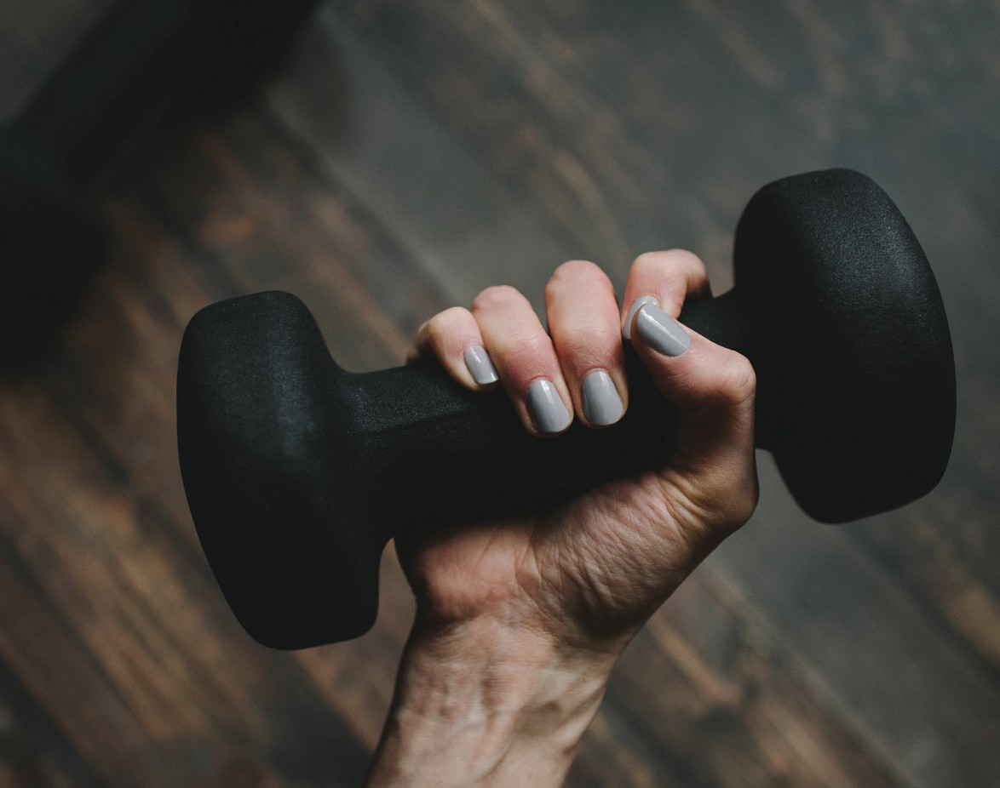

[Listen](audio/poetry-0166.mp3)

Endurance, like speaking, or memorizing poems, and languages languages, 
or recalling details on the walls of our childhood home, streets of our city, 
is a talent we are all born with.

Like memorizing a poem, or learning a language it is a slow process, 
we adapt gradually, and gradually we must increase the difficulty of our workout.

Dancing, or Jogging with dumbbells is a nice example, 
we can extent duration of our workout or the distance of our run, 
increase the beat of the music or our pace, 
and of course slowly increase the weight of the dumbbell.

  

This requires a long time, a daily routine, 
but the gentler it is, the more frequently it can be done.

Running a 10K every morning is probably too tiring, 
the body will grow weaker rather than adapt to handle more,
certainly at first.

Running a Dumbbell-10K every other day, 
seems to work out well, and the door to increasing distance is open.

This is a good example of increasing frequency, being a bad idea, 
but being able to run longer with heavier dumbbells, being well within reach.

  

Without gradually sneaking in more difficulty, 
the workout won't progress as well as it could, but it will still progress.

Open-world workouts like dancing or jogging with dumbbells, 
help with burning fat, and build up useful muscles that protect us from injury.

Waking up to crispy and fresh air, putting on your gear, 
and getting out there with dumbbells in hand is a wonderful way to enjoy a morning sunrise.

If you have to stay home, then know that there is a wonderful alternative to jogging, 
and that is dancing grab your dumbbells and begin by mastering the [Melbourne Shuffle](https://en.wikipedia.org/wiki/Melbourne_shuffle)
