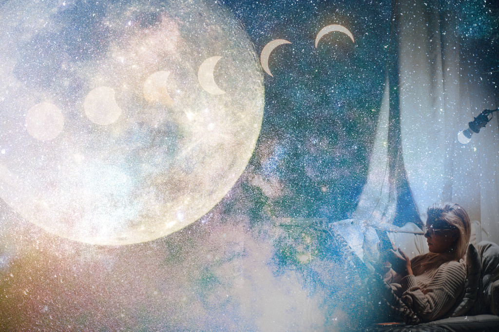

[Listen](audio/poetry-0167.mp3)

When you were a baby you could see the world well enough, 
but what made a difference was watching it for a while.

By observing the world we made sense of it, 
we noticed how things connect; and learned to participate.

  

But we are also very good at becoming better, 
and we won't notice a mis-observation.

Overwork, is one such thing, 
it makes everyone proud and happy, and it makes sense to try to make them even happier.

But, that is a mistake, 
because your Life, your Living, and your search for meaning is far more important.

  

We have to continue observing the world, 
we can't just keep going forward based on observations we made as children.

We have to notice that Poverty is a stupid problem, 
it should not be a part of modern society.

No one should be homeless, no one should ever be hungry, 
and no one should suffer from a sustained thereat of poverty.

It will only eve get fixed if you stop overworking, 
and start growing all the way up until you become a Great Being.

  

And we have to look at life from the point of view of Universe, 
it is the Greatest Thing, there cannot be greater.

The Cosmos gave birth, 
we have emerged out of chaotic atoms and their configurations.

It is not just a disgrace to surrender our minds, 
but also some kind of a Cosmic Crime.

  

A mind must grow, 
to no end, and nothing is allowed to stop it. or hurt it.

Only from continued observation, and unimpeded growth, 
will we absorb enough of our surroundings, 
and inherit enough from the books that touch us, 
to find our "meaning" for the lack of a better word.

MEANING, is the thing we notice when we look back from within the winter of our life, 
it is our Greatest Thing from the Greatest Time of our Life.

Overwork, fatigue, confusion, being too tired to learn or read, 
being too scared, or too worried, 
or focusing on things that are just unimportant in the end. 
Will interfere with our growing up, and our search.

  

Please be careful my friends, be especially mindful of uttering these words, 
"Oh, I can't do that anymore, I have a job now.".

Becoming a professional is useful though not required, 
Nurse, Mechanic, Programmer, Business Founder, it is all very interesting, captivating, 
but it is not that big of a deal - your Elder Self may see that as "very little".

My Dear Friends, having a career and some savings, is the least we can do in life, 
we are all capable of doing, a million times more.

And it does not mean that our greatest achievements will take a long time, 
no, sometimes it only takes five or ten years, maybe even less, maybe two.

But it will be that defining creation, 
that will make all our previous works seem a million times smaller.

  

Socrates, Newton, Nietzsche, Rand, Dawkins, Sam Harris, Craig Venter (to name a few), 
are not super human, are not geniuses.

They just didn't let overwork interfere with their mind, 
they didn't become the best employee, or the best student.

They observed The World, The Universe, The Earth, The Life, The Human, 
and made their GPA or Promotion, a million times less important. 
In favor of the chain of things that really moved them in their deepest integrity.

What is your Elder Self trying to say to you, 
what are her regrets?

Is she saying "Work more?", "Get more savings.", "Put yourself in harms way for that promotion!",

or is she saying "Pay attention to the Minds around You", 
"Read more, so that you may inherit the wisdom from the lives of other people.",

My Friends, 
make time, fight for time, make serenity, clear your mind, 
so that you may get to that book, and the next one after that.

Do not merely busy yourselves with what everybody else is doing, 
you are not a rive, you are not to flow into the sea.

You are a Universe.

A Universe of Journeys and Adventures, Wisdoms, Curiosities and Passions, 
a unique constellation of ever birthing stars, 
and no one will ever be like you.

Do not go quietly into the night, 
do not make our Universe darker.

Live as Bright as The Sun.

Live as Wise, as the Greatest of Minds, 
when seen from a thousand years in the future.

May You Change The World.
