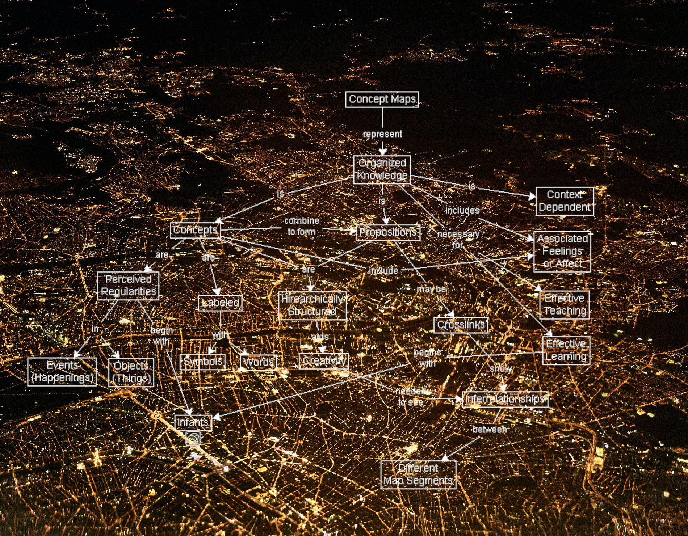

[Listen](audio/poetry-0168.mp3)

I took a little nap,
As I had to finish a website and an app.

I woke up feeling sweet and mighty and very strong.
even though I really didn't sleep for very long.

Now I have to get ready to go back to real sleep,
and I hope I don't end up having to count sheep.

  

I've been learning programming and design all on my own,
my software is really good now, I have progressed and grown.

  

There are no shortcuts to becoming really good,
there is no school that can teach us as they should.

Talking matters in your own hands is the best way,
the difference is like night and day.

For decades I've telling people,
our mind are really, really, really delicate and extremely intricate.

  

Wherever possible we have to take to the books,
go on tiny adventures and explore all the crannies and nooks.

To start learning well, find something pretty,
real education is like exploring a new city.

You don't start by memorizing a map,
you just go from one place to another, until you need a nap.

  

The teacher has no idea who you are or what you know,
if you'll listen to them you'll never grow.

Organized education is like a trap,
learn on your own, and don't forget to take a nap.
