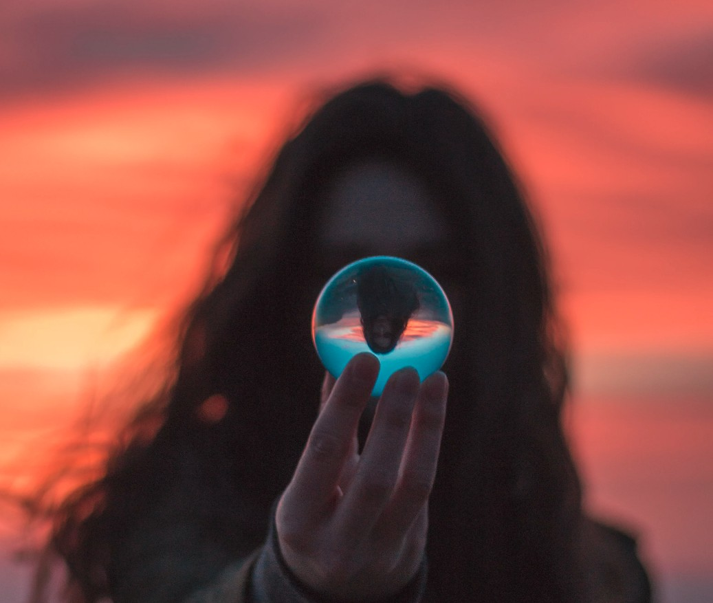

[Listen](audio/poetry-0169.mp3)

A World torn apart by borders, 
is a broken world full of dark secrets.

The world can't progress forward, 
if we are not learning.

Observations are very important, 
but they are not on a large enough scale.

We need a steady stream from multiple reinforcing sources, 
Audio Books and Lectures are exactly that kind of stream.

  

They are integrated works of art, 
tightly compressed, well arranged.

If you are lucky it will be read by the author, 
the chapters will flow together with feeling, pride and joy.

If you find a Memoir, or Travel/Adventure book, that makes you rest, that you enjoy, that makes you smirk. 
You are bound to permanently inherit massive amount of knowledge, it really does not matter what the book is about.

Any story story you love can only add to you, it will reinforce you, make you better and stronger. 

Our first great achievement is reaching out for Knowledge and Wisdom, 
and the reward is a Greater Mind.

  

Every person is capable of becoming, Profound and Wise, 
it takes effort, it is a deliberate, volitional act.

If a person does not know: how big the world is, 
they will never leave their city, or their small mind, behind.

We have to learn to slow down, 
and live at such a speed that does not interfere with our inheritance of wisdom.

We can't deny ourselves knowledge, 
and then run quickly forward.

Without constantly expanding your knowledge, 
we may not be able to tell, which way forward, is.

Inheriting from lives and wisdom of other people, is a great super power.

And accepting responsibility for self education, is easily of of the greatest things we'll ever do.

  

Finally, the answer to that stupid question that people ask us when we are little, 
"What do you want to be when you grow up?",

Must not conjure up a picture of some career path. 
There is only one correct answer, and it should be the same for us all:

"I want to Become a Wise Being"

Only in our wisdom can the World grow, 
and especially in the wisdom of the youngest generation.

The children of today, 
will run the entire Planet of Tomorrow.
