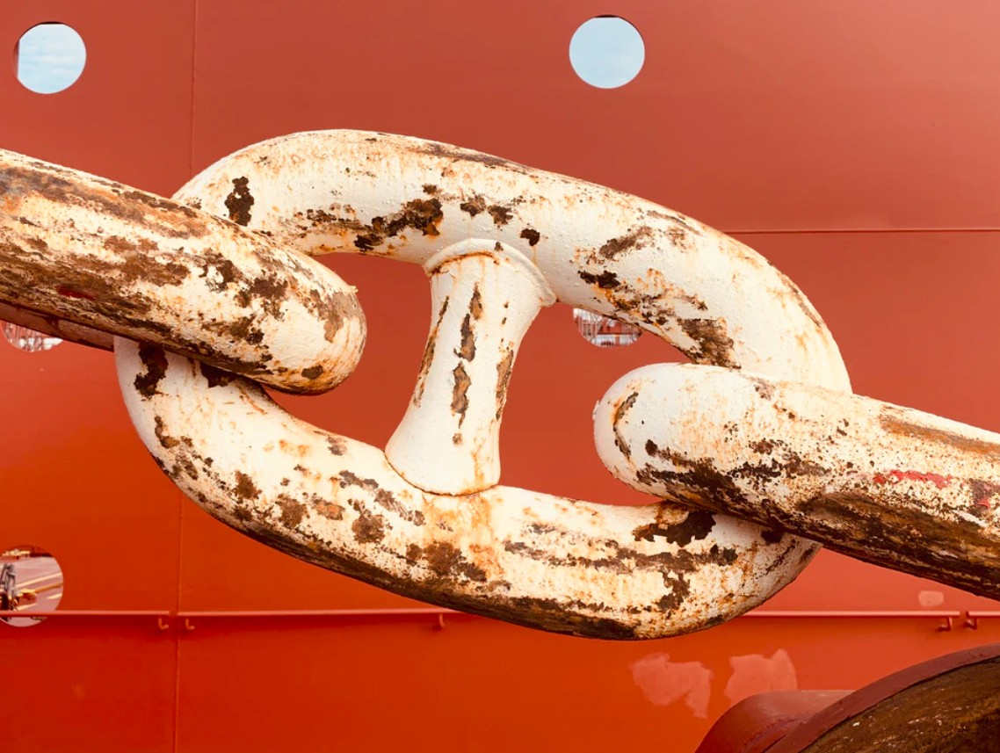

[Listen](audio/poetry-0170.mp3)

The present belongs to the current generation,
therefore the current generations can be said to be the most important.

Much is to be said on the subject of the great mistakes of the most recent century,
and just as importantly much is to be said about the mistakes we are repeating.

History books are waiting to be read,
they will help us understand current events across all nations.

To correct things, however,
is much more difficult.

This is because we were born into the world long after things were put in motion,
and the people in charge have not been granted the needed wisdom to understand their role.

To put it simply,
it is too late to teach the blind or corrupt.

Individuals who take part in harming the world, or preventing it from growing,
are too far invested, too long gone to be helped.

And it is a matter of help.

Those who advertise products, that they know cause cancer or other illnesses, are sick, their minds are broken.
they all once had an opportunity to become heroes, but they didn't know it.

I think we can assume, that in most situations,
a human being will choose Goodness over Evil,
unless they lack the Wisdom to tell the difference between the two.

  

The solution to all out problems is to first understand that we were born too late into all this,
the momentum of Climate Change and Business as Usual, Mass Incarceration and Poverty was too high to be stopped by a singe generation.

But it is hardly a challenge for a Wiser World,
a world that helps children to wisdom so that they can become Great Beings come their middle age.

  

We can't say the word "poverty" and sound like it is a cruel world,
we have to make it clear that it is a broken world looking for New Heroes, New Intellectuals, and New Leaders.

We can't say the word "prison" and make it sound like that's where bad people go,
we have to show our pain, and speak about how no Human belongs in a cage, how they needed a fair start,
and how prisons can only make a bad person worse.

We can't talk about climate change as something that has no real solution in sight,
but rather we have to say that adults today are not educated well enough, their minds are not great enough to comprehend the scale of the problem.

  

The world in its complexity, made it so that all of these heartbreaking problems,
double as a challenge, an opportunity to not just grow in wisdom to fix these problems, but to grow in Greatness as well.

The mistakes of today,
when presented as such become an opportunity to help a generation grow far beyond what we perceived as our own limits.

Whenever there is a problem that is too great for a generation,
know for certain that multiple consecutive generations will fix it, in their hard earned wisdom.

My Friends,
this is yet another reason to take to Books and Audio Books,
to study best we can, so that we may teach.

We maybe just a chain link in a world with many problems,
but even a single chain-link keeps it all connected.

Slow down, I know you are working hard,
slow down to a speed that lets you read books,
read, learn, and rise to the challenge of inspiring generations to their greatness, and their destiny as teachers.

  

The momentum of the mistakes of today,
will lose force in proportion to our ability to inspire the younger generation to greatness;
our ability to show them just how important they are, to the past, the present, the future, how it is all inseparable together.
