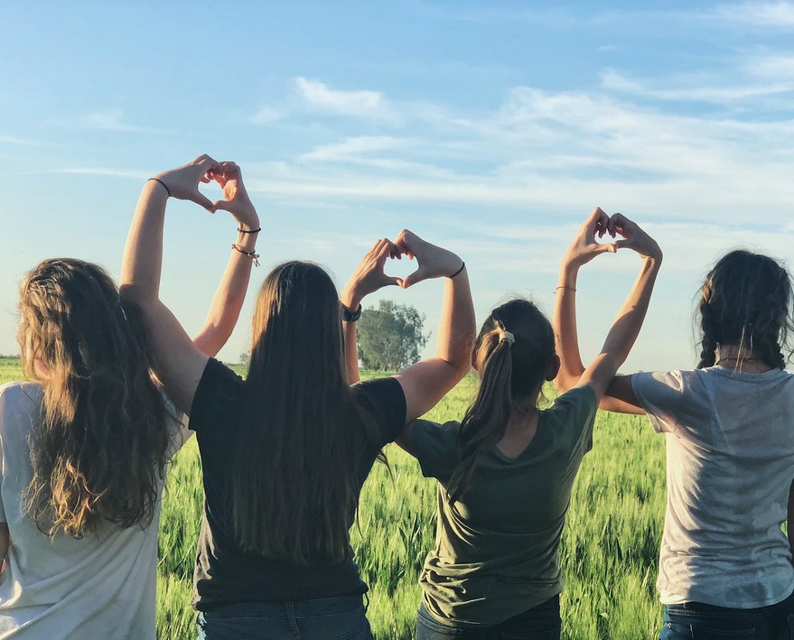

[Listen](audio/poetry-0171.mp3)

We can't stand up to corruption, 
if we are not knowledgeable enough to see where it is.

Working towards good grades rather than Empowering Wisdom, 
actually works to shield what is broken about the world today.

Only real and meaningful, functional and powerful-education can grant us the tools needed, 
if we don't have the necessary tools for thinking then we can't see enough.

  

One of Humanity's greatest challenges is in overcoming, 
this ridiculous notion of minimum lowest-common-denominator education.

We are each to stand in relentless pursuit of excellence, 
education is life long, volitional, deliberate and life saving.

The future of Earth depends on it, 
many of us have felt the threat of Cold War and Mutually Assured Destruction, 
we watched the Ozone Hole emerge out of greed and lack of wisdom. 
we are witnessing species disappearing every day, 
lack of understanding of climate change, 
and basics of disease prevention.

This is happening *not* because people are evil, 
but because they never received a meaningful education, never read enough books to break out and become inspired.

Many people do notice this, 
and do take to videos, audio books and lectures, 
and they do become moved.

They learn, and grasp a deeper nature of the thinking mistakes they made, 
from simple topics like [Raw Milk](https://en.wikipedia.org/wiki/United_States_raw_milk_debate) consumption, and the pseudo-scientific [Homeopathy](https://en.wikipedia.org/wiki/Homeopathy) and [Chiropractic Treatments](https://en.wikipedia.org/wiki/Chiropractic), 
to dangers of [Vaccine Hesitancy](https://en.wikipedia.org/wiki/Vaccine_hesitancy) and other [Pseudoscienific Garbage](https://en.wikipedia.org/wiki/List_of_topics_characterized_as_pseudoscience) they are able to become more realistic about other things.

But this is difficult, it is not as common as it should be, 
and what an awful injustice it is to deny these basic facts of living.

This is the challenge we must overcome, 
we tried organized education and with grades and incompetent teachers we witnessed generations of children being pushed into Poverty of Mind.

Grades, what a tragic idea, 
and how easily will children convince themselves that they are not enough; not good enough.

How many teachers tried to tell their students that they are bad at learning, 
and how many children became convinced of that, that they are not smart?

Where truth is, that we are all equally capable, 
all capable of genius so as long as it is real kind and not the "I am better than you kind" like photographic memory 
(which is fake, no one ever had it; people just said they did to look smart).

World's politicians are facing these flaws as well, 
they can't tell if Homeopathy is real or not, not without a real education.

Today, there is nothing that can be done about people in authority lacking in education, 
the only thing that can stop them is time.

And it is our job now, 
that the new generation of Policy Makes does not suffer from inability to tell real from fantasy.

In the absence of teachers, 
we become the teachers.

I challenge you my Dear Readers, 
to books, to becoming a teacher, and a Great Being,
helping the world grow in health.

  

We have to help children understand that a life of fantasy, 
is not a complete life, that it is our right to live in realty.

Our generation, must be the generation of the Well Read, of The Wise, of The Teachers, 
with a clear vision of the future; we are not to fight, we are to learn and teach.

The children will grow up into a world where corruption of today, 
has passed of old age, of its own toxic sickness.

The children must learn to be teachers as well, 
bu they face even a greater task, the task of becoming Incorruptible Leaders.

The leaders the world hopes to see today, 
those are the children that look up to us for guidance.

  

We must rise today. 
Rise against lies and liars, manipulators and cheaters, leeches and big fat white lice, 
we must rise against poverty, against fake education and the grades that connive children they are not enough.

We must rise, against every ongoing mistake, 
every invisible wall, 
and stand our ground.

Knowing that our world is the world of reality, 
and that is the only world worthy of us.

With all our might, we are not to fight, 
we are to live our lives and finally reach happiness, 
but on our way there we are to learn, become wise, become teachers, and aim to become great beings.

Not only for our own dignity and to honor those we love, 
but also for all the future yet to come.

May all the future generation read our works, 
and determine that this year, was the first year of the new era they they hold so dearly.

That this year, was the year that future thinkers marked, 
as The Day Humanity Entered Into The Age Of Wisdom.
