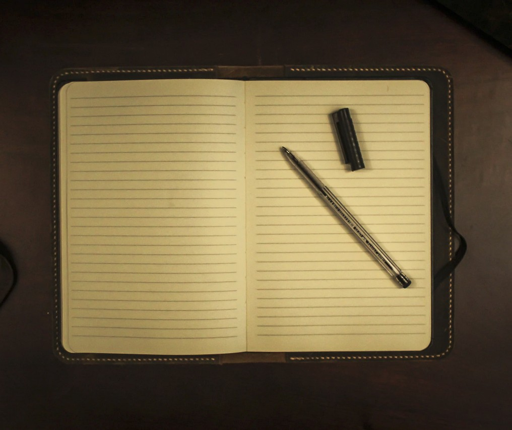

[Listen](audio/poetry-0172.mp3)

You are not alone, 
and all you do matters.

As you rise, 
you create a way for others to follow.

Struggle, like suffering, 
is a gas that fills all the available space.

It is never easy for anybody, 
the difference is in the choices we make and the aims we set.

The first Great Choice is to set off towards wisdom, 
to continuously transcend our limits thorough out our entire existence.

One of the finest choices we can make, 
is to Live Above Common Levels of Life.

There are no guarantees, 
your choice to proceed forward is all the guarantee there is.

Our biological life is not finely crafted, 
it is a result of fundamental principles of Physics and Chemistry.

But our mind, is up to us to shape, 
hence Audio Books and Lectures and our inheritance from of Other Lives, Times, and Works.

You need not hurry, 
but you do need to slow down so that you may read and write.

  

We each have a story to tell, 
and many will follow a similar path to ours across the vastness of future.

They could use some advice, 
a few fine words about rising, about what it is like to see the sun for the first time.

Do not let your readers suffer the same loneliness you did, 
let them learn from you.

  

And the way you write, 
is one thought at a time.

So as long as your write about your unlimited travels, 
you never run out of the story to tell.

And every once in a while, 
a poem will leap ahead of you.

The thought will arrive, 
from the future before you get there.

You are connected to your future self, 
no one can hold a stronger bond.

You are a being, with a mind and body, you are in the present, 
but you exist across time.

Your Life Line, your Life Time, 
The past you and the future you, are connected.

And just the same those who came before you, 
and those who are yet to follow, are connected to you.

But you have to write your thoughts, 
...when you are rising in your childhood, 
the children can understand it best.

In your early age, as you make your way, 
as you learn to rise, and find your rhythm, 
your readers will be in their twenties.

And then, forties, and then sixties, and eighties, and hundreds, 
at no point in your life should you be ashamed to write, 
or be shamed for writing.

  

Because if you can manage to hold your pen, 
it is more than most others can.

One thought at a time, 
help others understand how to climb.

Make all your struggles count for more, 
show them how you fought for wisdom in your war.

Tell the world what you know, 
so that others may safely follow.

Know that the first struggles sometimes mean more, 
sometimes the hardest challenge is to get off the floor.

The first steps after all, 
matter the most to those whose worlds may be seem small.

All steps matter and in many ways, 
all lead to enlightenment, and the Sun's rays.
