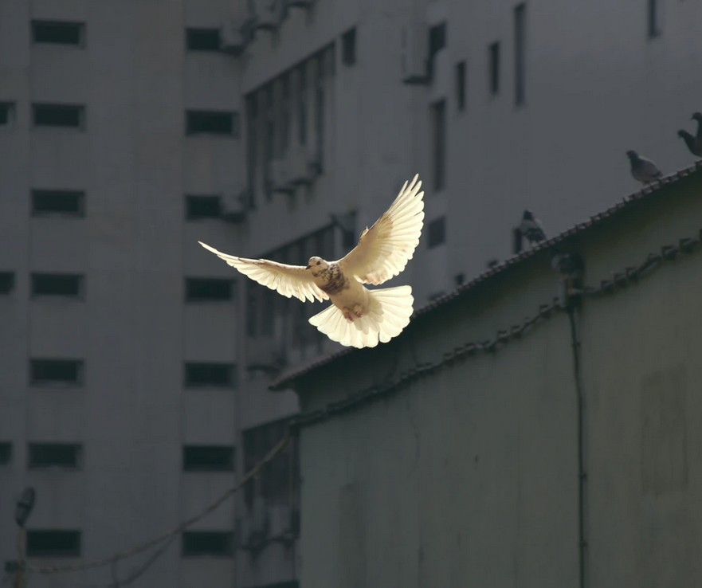

[Listen](audio/poetry-0173.mp3)

All nations try very hard to divide, 
outline their treasure and their national pride.

But reality is such, 
that this does not matter much.

One can complain about this nation or that nation, 
but that does not change the situation...

  

We are one, 
one family under the sun.

Eventually Education, Foresight, Wisdom, and World Peace, 
will bring us all together and the complaints will cease.

Until then, we must each remember that borders are useless, 
they only divide and create a huge mess.

  

A border does not mark its people to be of any particular kind, 
it only keeps different kinds of colorful groups apart.

It is not correct to be unhappy about a nation, 
let us be unhappy about lack of safety, books and education.

Let us come together and stand against lack of Good Schools and Wisdom, 
let us but complain about divisions and lack of peace and calm.

  

If there were no borders, there would be more friendship and love, 
all nations United in Peace under the symbol of the white dove.

We are not different from one another, 
a sister or brother from a different mother.

In the World of the Future we won't be divided at all, 
people will forget why we needed a wall.
